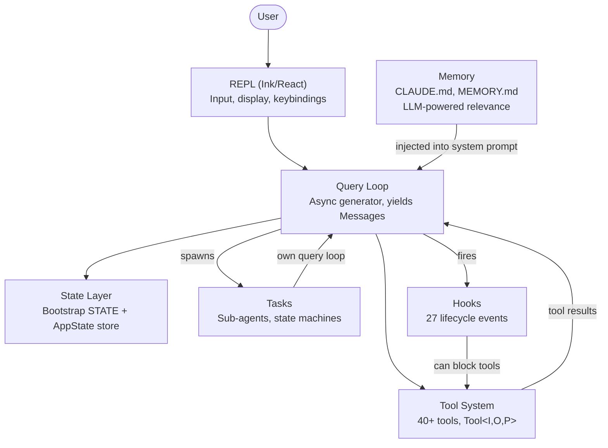
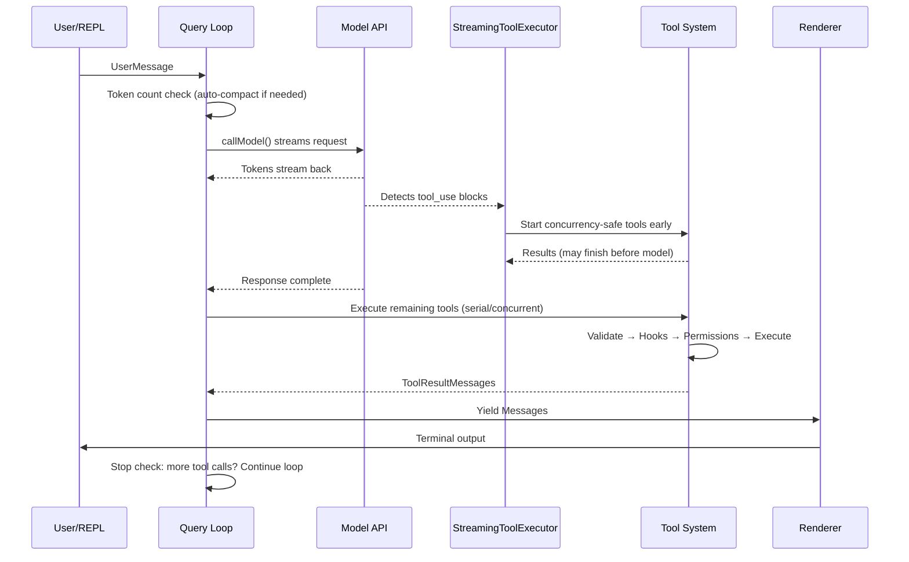
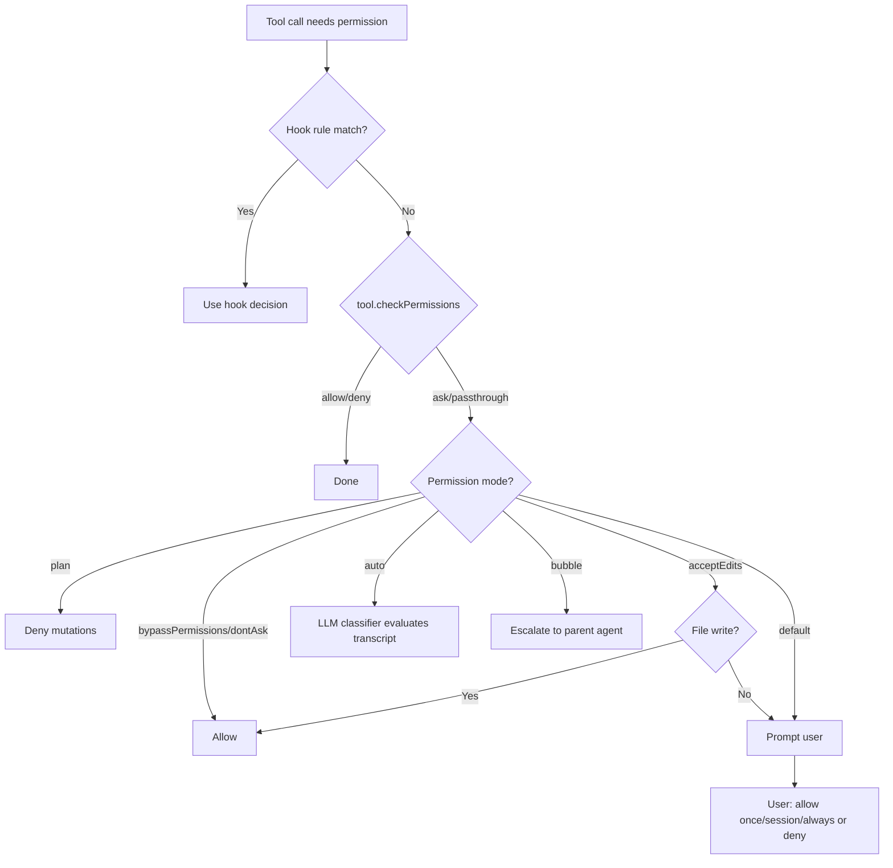
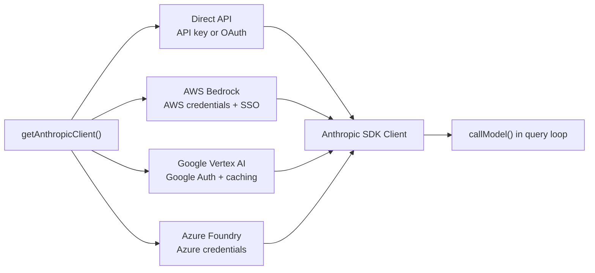
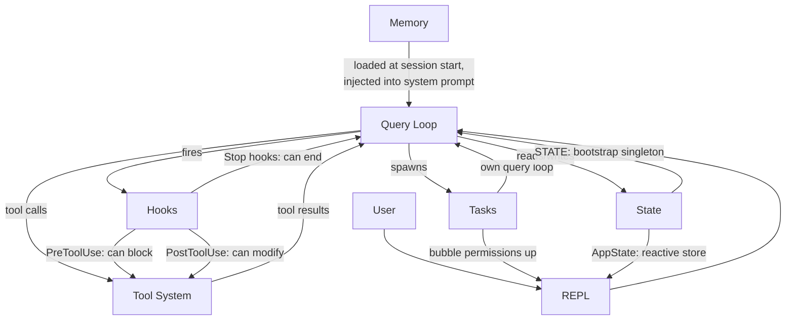

# Глава 1: Архитектура AI Agent

## Что вы смотрите

Традиционный CLI — это функция. Он принимает аргументы, работает и завершает работу. `grep` не решает также запустить `sed`. `curl` не открывает файл и не исправляет его на основе того, что он скачал. Контракт прост: одна команда, одно действие, детерминированный результат.

agentic CLI нарушает все части этого контракта. Он принимает prompt на естественном языке, решает, какие tools использовать, выполняет их в том порядке, в котором того требует ситуация, оценивает результаты и выполняет цикл до тех пор, пока task не будет выполнена или пользователь не остановит ее. «Программа» не является фиксированной последовательностью инструкций — это цикл вокруг языковой модели, который генерирует свою собственную последовательность инструкций во время выполнения. Вызовы tools являются побочными эффектами. Reasoning модели — это control flow.

Claude Code — это производственная реализация этой идеи в Anthropic: монолит TypeScript из почти двух тысяч файлов, который превращает терминал в полноценную среду разработки на базе Claude. Он был отправлен сотням тысяч разработчиков, а это означает, что каждое архитектурное решение влечет за собой реальные последствия. В этой главе представлена ​​ментальная модель. Шесть абстракций определяют всю систему. Их соединяет единый поток данных. Как только вы усвоите золотой путь от нажатия клавиши до конечного результата, каждая последующая глава станет увеличением одного сегмента этого пути.

Далее следует ретроспективная декомпозиция: эти шесть абстракций не были разработаны заранее на доске. Они возникли из-за необходимости доставки производственного agent большой базе пользователей. Понимание их такими, какие они есть, а не такими, какими они были запланированы, формирует правильные ожидания от остальной части книги.

---

## Шесть ключевых абстракций

Claude Code построен на шести основных абстракциях. Все остальное — более 400 служебных файлов, разветвленный модуль рендеринга терминала, эмуляция vim, средство отслеживания затрат — существует для поддержки этих шести.



Вот чем занимается каждый из них и почему он существует.

**1. Query Loop** (`query.ts`, ~1700 строк). Асинхронный генератор, который является сердцем всей системы. Он передает поток ответа модели, собирает tool calls, выполняет их, добавляет результаты в историю сообщений и выполняет цикл. Каждое взаимодействие — REPL, SDK, sub-agent, headless `--print` — проходит через эту единственную функцию. Он дает объекты `Message`, которые использует UI. Его тип возвращаемого значения — это распознаваемое объединение под названием `Terminal`, которое точно кодирует причину остановки цикла: нормальное завершение, прерывание пользователя, исчерпание бюджета токена, вмешательство stop hook, максимальное количество оборотов или неисправимую ошибку. Шаблон генератора, а не callbacks или event emitters, обеспечивает естественное backpressure, чистую отмену и типизированные State терминала. Глава 5 полностью описывает внутреннюю структуру цикла.

**2. Tool System** (`Tool.ts`, `tools.ts`, `services/tools/`). Tool — это все, что agent может делать в мире: читать файл, запускать команды оболочки, редактировать код, выполнять поиск в Интернете. За этой простотой цели скрываются важные механизмы. Каждый tool реализует богатый интерфейс, охватывающий идентификацию, схему, выполнение, разрешения и рендеринг. Tools — это не просто функции: они несут собственную логику разрешений, объявления параллелизма, отчеты о ходе выполнения и рендеринг UI. Tool системного разделения вызывает параллельные и последовательные batches, а исполнитель streaming запускает tools, безопасные для параллелизма, еще до того, как модель завершит свой ответ. Глава 6 описывает полный Tool interface и конвейер выполнения.

**3. Task** (`Task.ts`, `tasks/`). Task — это фоновые рабочие единицы, в основном sub-agents. Они следуют за конечным автоматом: `pending -> running -> completed | failed | killed`. `AgentTool` порождает новый генератор `query()` с собственной историей сообщений, набором tools и режимом разрешений. Task наделяют Claude Code рекурсивной способностью: agent может делегировать полномочия sub-agents, которые могут делегировать дальше.

**4. State** (два слоя). Система поддерживает State на двух уровнях. Изменяемый синглтон (`STATE`) содержит около 80 полей инфраструктуры уровня сеанса: рабочий каталог, конфигурация модели, отслеживание затрат, счетчики телеметрии, идентификатор сеанса. Он устанавливается один раз при запуске и мутируется напрямую — никакой реакции. Минимальный Reactive Store (34 строки в форме Zustand) управляет UI: сообщениями, режимом ввода, одобрениями tools, индикаторами прогресса. Разделение является намеренным: State инфраструктуры меняется редко и не требует повторного рендеринга; State UI постоянно меняется и должно. В главе 3 подробно рассматривается двухуровневая архитектура.

**5. Memory** (`memdir/`). Постоянный контекст agent между сеансами. Три уровня: уровень проекта (файлы `CLAUDE.md` в репозитории), уровень пользователя (`~/.claude/MEMORY.md`) и уровень команды (общий через символические ссылки). В начале сеанса система сканирует все файлы memory, анализирует frontmatter, а LLM выбирает, какие воспоминания имеют отношение к текущему разговору. Memory — это то, как Claude Code «запоминает» ваши соглашения о кодовой базе, архитектурные решения и историю отладки.

**6. Hooks** (`hooks/`, `utils/hooks/`). Определяемые пользователем hooks жизненного цикла, которые вызывают 27 различных событий в 4 типах выполнения: команды оболочки, одноразовые запросы LLM, многоходовые диалоги agents и веб-hooks HTTP. Hooks могут блокировать tool execution, изменять входные данные, вводить дополнительный контекст или сокращать весь Query Loop. Сама Permission System частично реализована с помощью hooks — hooks `PreToolUse` могут запрещать tool calls до того, как сработает интерактивный запрос разрешения.

---

## Золотой путь: от нажатия клавиши до вывода

Отслеживайте одиночный запрос через систему. Пользователь вводит «добавить обработку ошибок в функцию входа» и нажимает Enter.



Три вещи, на которые следует обратить внимание в этом потоке.

Во-первых, Query Loop — это генератор, а не цепочка callbacks. REPL извлекает сообщения из него через `for await`, что означает, что backpressure является естественным — если UI не успевает за ним, генератор приостанавливается. Это осознанный выбор между генераторами событий или наблюдаемыми потоками.

Во-вторых, tool execution частично совпадает с потоковой передачей модели. `StreamingToolExecutor` не ждет завершения модели перед запуском tools, безопасных для параллелизма. Вызов `Read` может завершиться и вернуть результаты, пока модель еще генерирует остальную часть своего ответа. Это спекулятивное выполнение: если конечный результат модели делает tool call недействительным (редко, но возможно), результат отбрасывается.

В-третьих, весь цикл является повторным. Когда модель выполняет tool calls, результаты добавляются в историю сообщений, и цикл снова вызывает модель с обновленным контекстом. Отдельной фазы «обработки результатов tool» не существует — все это один цикл. Модель решает, когда это будет сделано, просто не вызывая больше tool calls.

---

## Permission System

Claude Code запускает произвольные команды оболочки на вашем компьютере. Он редактирует ваши файлы. Он может создавать подпроцессы, выполнять сетевые запросы и изменять вашу историю git. Без Permission System это катастрофа безопасности.

Система определяет семь режимов разрешений, упорядоченных от наиболее к наименее разрешающим:

| Режим | Поведение |
|------|----------|
| `bypassPermissions` | Все разрешено. Никаких проверок. Только внутреннее/тестирование. |
| `dontAsk` | Все разрешено, но все равно зарегистрировано. Никаких запросов пользователя. |
| `auto` | Классификатор транскриптов (LLM) решает разрешить/запретить. |
| `acceptEdits` | Изменения файлов одобряются автоматически; все остальные мутации подсказывают. |
| `default` | Стандартный интерактивный режим. Пользователь одобряет каждое действие. |
| `plan` | Только для чтения. Все мутации заблокированы. |
| `bubble` | Эскалация решения parent agent (режим sub-agent). |

Когда tool call требуется разрешение, разрешение следует строгой цепочке:



Отдельного внимания заслуживает режим `auto`. Он запускает отдельный упрощенный вызов LLM, который классифицирует tool call по расшифровке разговора. Классификатор видит компактное представление входных данных tool и решает, соответствует ли действие тому, что запросил пользователь. Это режим, который позволяет Claude Code работать полуавтономно — одобряя рутинные операции и отмечая все, что выглядит так, как будто оно отклоняется от намерений пользователя.

По умолчанию sub-agents переходят в режим `bubble`, что означает, что они не могут одобрять свои собственные опасные действия. Запросы разрешений распространяются до parent agent или, в конечном итоге, до пользователя. Это не позволяет sub-agent незаметно выполнять деструктивные команды, которые пользователь никогда не видел.

---

## Многопровайдерная архитектура

Claude Code общается с Клодом по четырем различным инфраструктурным путям, прозрачным для остальной части системы.



Основная идея заключается в том, что Anthropic SDK предоставляет классы-оболочки для каждого provider облачных услуг, которые предоставляют тот же интерфейс, что и прямой клиент API. Фабрика `getAnthropicClient()` считывает переменные среды и конфигурацию, чтобы определить, какой provider использовать, создает соответствующего клиента и возвращает его. С этого момента `callModel()` и все остальные потребители рассматривают его как обычный клиент Anthropic.

Выбор provider определяется при запуске и сохраняется в `STATE`. Query Loop никогда не проверяет, какой provider активен. Это означает, что переход с Direct API на Bedrock — это изменение конфигурации, а не кода: agent loop, Tool System и permission model полностью не зависят от provider.

---

## Система сборки

Claude Code поставляется как внутренний tool Anthropic, так и общедоступный npm package. Одна и та же база кода обслуживает оба варианта, а флаги функций времени компиляции контролируют, что включается.

```typescript
// Conditional imports guarded by feature flags
const reactiveCompact = feature('REACTIVE_COMPACT')
  ? require('./services/compact/reactiveCompact.js')
  : null
```

Функция `feature()` взята из `bun:bundle`, встроенного bundler Bun API. Во время сборки каждый флаг функции преобразуется в логический литерал. Устранение мертвого кода bundler затем полностью удаляет вызов `require()`, когда флаг имеет значение false — модуль никогда не загружается, никогда не включается в bundle и никогда не отправляется.

Схема последовательна: защита `feature()` верхнего уровня завершает вызов `require()`. `require()` используется вместо `import` именно потому, что динамический `require()` может быть полностью устранен bundler, когда защита ложна, а динамический `import()` не может (он возвращает Promise, которое bundler должен сохранить).

Стоит отметить иронию. Карты исходного кода, опубликованные в ранних выпусках npm, содержали `sourcesContent` — полный оригинальный source code TypeScript, включая пути кода только для внутреннего использования. Флаги функций успешно удалили код времени выполнения, но оставили источник на картах. Так source code Claude Code стал общедоступным.

---

## Как части соединяются

Шесть абстракций образуют граф зависимостей:



Memory передается в Query Loop как часть System Prompt. Query Loop управляет tool execution. Tool results возвращаются в Query Loop в виде сообщений. Tasks представляют собой рекурсивные циклы запросов с изолированной историей сообщений. Hooks hook Query Loop в определенных точках. State читается и записывается всем, при этом реактивное хранилище подключается к UI.

Круговая зависимость между циклом запроса и Tool System является определяющей характеристикой системы. Модель генерирует tool calls. Tools работают и дают результаты. Результаты добавляются в историю сообщений. Модель видит результаты и решает, что делать дальше. Этот цикл продолжается до тех пор, пока модель не перестанет генерировать tool calls или пока внешнее ограничение (бюджет токена, максимальное количество оборотов, пользовательское прерывание) не прекратит его.

Вот как они связаны с последующими главами: золотой путь от ввода к выводу — это нить, проходящая через всю книгу. В главе 2 показано, как система загружается до момента, когда этот путь может быть выполнен. В главе 3 объясняется двухуровневая архитектура State, в которой путь читает и записывает. В главе 4 рассматривается уровень API, который вызывает Query Loop. Каждая последующая глава приближается к одному сегменту пути, который вы только что видели, от начала до конца.

---

## Примените это

Если вы создаете agentic system — любую систему, в которой LLM решает, какие действия предпринять во время выполнения, — вот шаблоны из архитектуры Claude Code, которые можно перенести.

**Шаблон цикла генератора.** В качестве agent loop используйте асинхронный генератор, а не callbacks или event emitters. Генератор обеспечивает естественное backpressure (потребители тянут в своем темпе), чистую отмену (`.return()` на генераторе) и типизированное возвращаемое значение для State терминала. Проблема, которую он решает: в agent loops, основанных на обратных вызовах, трудно определить, когда цикл «завершен» и почему. Генераторы делают завершение первоклассной частью системы типов.

**Tool interface с самоописанием.** Каждый tool должен заявить о своей безопасности параллелизма, требованиях к разрешениям и поведении рендеринга. Не помещайте эту логику в центральный оркестратор, который «знает» о каждом tool. Проблема, которую он решает: центральный оркестратор становится божественным объектом, который необходимо обновлять каждый раз при добавлении tool. Tools с самоописанием масштабируются линейно: добавление tool N+1 не требует внесения изменений в существующий код.

**Отдельное State инфраструктуры от реактивного State.** Не все State должны запускать обновления UI. Конфигурация сеанса, отслеживание затрат и телеметрия принадлежат простому изменяемому объекту. История сообщений, индикаторы выполнения и очереди утверждения принадлежат реактивному хранилищу. Проблема, которую он решает: если сделать все реактивным, это приведет к дополнительным затратам на подписку и усложнит констатацию, которая меняется один раз при запуске и считывается тысячу раз. Два уровня соответствуют двум шаблонам доступа.

**Режимы разрешений, а не проверки разрешений.** Определите небольшой набор именованных режимов (план, по умолчанию, автоматический, обходной) и принимайте каждое решение о разрешении через этот режим. Не разбрасывайте проверки `if (isAllowed)` по реализациям tool. Проблема, которую он решает: непоследовательное соблюдение разрешений. Когда каждый tool проходит одну и ту же цепочку разрешения на основе режимов, вы можете оценить State безопасности системы, зная, какой режим активен.

**Рекурсивная архитектура agent через Task.** Sub-agents должны быть новыми экземплярами одного и того же agent loop со своей собственной историей сообщений, а не путями кода особого случая. Повышение разрешений осуществляется вверх через режим `bubble`. Проблема, которую он решает: логика sub-agent, которая отличается от основного agent loop, что приводит к тонким различиям в поведении и обработке ошибок. Если sub-agent представляет собой тот же цикл, он наследует все те же гарантии.
