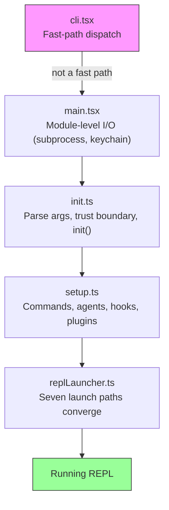
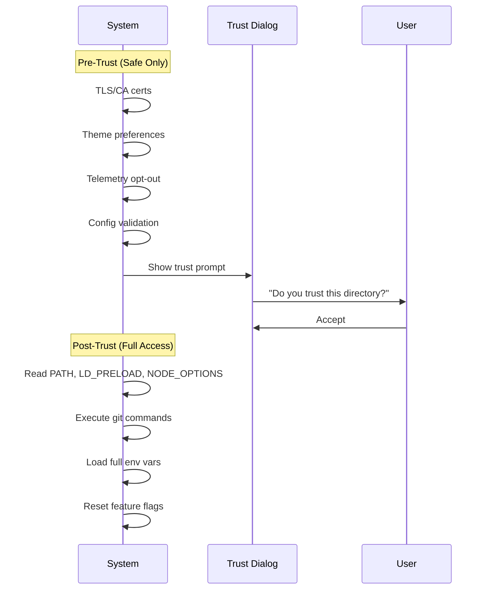

# Глава 2: Начинаем быстро — конвейер начальной загрузки

Если в главе 1 вам была представлена ​​карта архитектуры Claude Code, то в этой главе описан путь достижения рабочего State. Каждый компонент из шести абстракций — Query Loop, Tool System, уровни State, hooks, memory — должен быть инициализирован до того, как пользователь увидит курсор. Бюджет на все это: 300 миллисекунд.

Триста миллисекунд — это порог, при котором люди воспринимают tool как мгновенный. Пересеките его, и CLI станет вялым. Многие его пропускают, и разработчики перестают его использовать. Все в этой главе создано для того, чтобы оставаться в рамках этой линии.

Bootstrap должен выполнить четыре Task: проверить среду, установить границы безопасности, настроить уровень связи и отобразить UI. Он должен сделать все четыре менее чем за 300 мс. Идея архитектуры заключается в том, что эти четыре работы можно частично перекрывать, тщательно упорядочивать и агрессивно сокращать, чтобы уложиться в бюджет, который кажется невозможным для такой сложной системы.

Примечание по методологии: временные метки в этой главе являются приблизительными и получены на основе собственных контрольных точек профилирования кодовой базы. Они представляют собой типичные значения времени горячего старта на современном оборудовании. Холодный запуск происходит медленнее. Абсолютные числа имеют меньшее значение, чем относительная структура: какие операции перекрываются, какой блок, а какие отложены.

---

## Форма трубопровода

Конвейер запуска состоит из пяти файлов, которые выполняются последовательно. Каждый файл сужает круг того, что системе необходимо делать дальше:



Каждый файл выполняет минимальную необходимую работу, прежде чем передать управление следующему. `cli.tsx` пытается выйти, прежде чем импортировать что-либо тяжелое. `main.tsx` запускает медленные операции как побочный эффект во время оценки импорта. `init.ts` разрешает конфигурацию и устанавливает границу доверия. `setup.ts` регистрирует возможности. `replLauncher.ts` выбирает правильную точку входа и запускает UI.

Три стратегии параллелизма позволяют сделать это быстро:

1. **Отправка подпроцесса на уровне модуля.** Связка ключей Fire и MDM читаются как побочные эффекты *во время оценки импорта*. Подпроцессы выполняются, пока загружаются оставшиеся ~135 мс статического импорта.
2. **Обещайте параллелизм при установке.** Привязка сокетов, создание моментальных снимков hooks, загрузка команд и загрузка определений agent выполняются одновременно.
3. **Отложенная предварительная выборка после рендеринга.** Все, что пользователю не нужно перед вводом первого сообщения — статус git, возможности модели, учетные данные AWS — запускается после того, как отображается prompt.

Четвертая стратегия менее заметна, но не менее важна: **динамический импорт для отсрочки оценки модуля**. Кодовая база использует `await import('./module.js')` как минимум в десятке мест, чтобы избежать загрузки кода до тех пор, пока он не понадобится. OpenTelemetry (400 КБ + 700 КБ gRPC) загружается только при инициализации телеметрии. Компоненты React загружаются только при рендеринге. Каждый динамический импорт меняет задержку холодного пути (первое использование запускает оценку модуля) на скорость горячего пути (запуск не платит за модули, которые он может никогда не использовать).

---

## Фаза 0: Ускоренная отправка (cli.tsx)

Первый файл, который вводит процесс, `cli.tsx`, выполняет одну Task: определить, нужен ли вообще полный конвейер начальной загрузки. Многие вызовы — `claude --version`, `claude --help`, `claude mcp list` — требуют конкретного ответа и ничего больше. Загрузка React, инициализация телеметрии, чтение цепочки для ключей и настройка Tool System были бы пустой тратой времени.

Схема такая: проверьте `argv`, динамически импортируйте только тот обработчик, который вам нужен, и выйдите до загрузки остальной части системы.

```typescript
// Pseudocode for the fast-path pattern
if (args.length === 1 && args[0] === '--version') {
  const { printVersion } = await import('./commands/version.js')
  await printVersion()
  process.exit(0)
}
```

Существует около дюжины быстрых способов, охватывающих версию, справку, настройку, управление сервером MCP и проверку обновлений. Детали не имеют значения, важен шаблон. Каждый путь динамически импортирует ровно один модуль, вызывает одну функцию и завершает работу. Остальная часть кодовой базы никогда не загружается.

Это первый пример принципа, который повторяется на протяжении всей начальной загрузки: **делайте меньше, зная больше о намерениях**. Массив argv раскрывает намерения пользователя. Если намерение узкое, путь выполнения тоже должен быть узким.

Если ни один быстрый путь не соответствует, `cli.tsx` переходит к полному импорту `main.tsx`, и начинается настоящий запуск.

---

## Этап 1: ввод-вывод на уровне модуля (main.tsx)

При импорте `main.tsx` его побочные эффекты на уровне модуля срабатывают во время оценки — до вызова какой-либо функции в файле. Это наиболее критичный к производительности метод во всей начальной загрузке:

```typescript
// These run at import time, not at call time
const mdmPromise = startMDMSubprocess()
const keychainPromise = readKeychainCredentials()
```

Пока движок JavaScript оценивает остальную часть `main.tsx` и его транзитивный импорт (~138 мс оценки модуля), эти два обещания уже выполняются. Подпроцесс MDM (управление мобильными устройствами) проверяет политики безопасности организации. Чтение связки ключей извлекает сохраненные учетные данные. Обе операции связаны с вводом-выводом, которые в противном случае сериализовались бы на критическом пути.

Вывод: оценка модуля — это не простое время, пришло время перекрывать операции ввода-вывода. К моменту первого вызова экспортированных функций `main.tsx` эти обещания часто уже решены.

Этот метод требует подавления правил ESLint верхнего уровня await и побочных эффектов в области модуля в соответствующих файлах. В базе кода имеется специальное правило ESLint специально для шаблонов доступа `process.env`, которое позволяет контролировать побочные эффекты в области модуля и предотвращает неконтролируемые в других местах.

---

## Этап 2: Анализ и доверие (init.ts)

Функция `init()` запоминается: вызов ее несколько раз безопасен и возвращает один и тот же результат. Это важно, поскольку каждая из нескольких точек входа (REPL, режим печати, режим SDK) может вызвать `init()`, и функция запоминания гарантирует, что она запустится ровно один раз.

Функция разрешает аргументы командной строки через Commander, загружает конфигурацию из нескольких источников (глобальные настройки, настройки проекта, переменные среды), а затем достигает самой важной границы в конвейере.

### Граница доверия

До границы доверия система работает в ограниченном режиме. После него доступны полные возможности. Граница существует, потому что Claude Code считывает переменные среды, а переменные среды могут быть отравлены.



Граница доверия не связана с тем, что пользователь доверяет Claude Code. Речь идет о Claude Code доверии *окружению*. Вредоносный `.bashrc` может настроить `LD_PRELOAD` на внедрение кода в каждый подпроцесс. Диалог доверия гарантирует, что пользователь явно соглашается работать в каталоге, который мог быть настроен кем-то другим.

Система имеет десять различных операций, чувствительных к доверию. Прежде чем пользователь примет диалоговое окно доверия, выполняются только безопасные операции: настройка сертификата TLS, настройки темы, отказ от телеметрии. После установления доверия система считывает потенциально опасные переменные среды (PATH, LD_PRELOAD, NODE_OPTIONS), выполняет команды git и применяет полную конфигурацию среды.

### Hook preAction

Крюк Commander `preAction` является стержнем архитектуры. Commander анализирует структуру команды (флаги, подкоманды, позиционные аргументы) *не* ничего не выполняя. Hook `preAction` срабатывает после анализа, но до запуска соответствующего обработчика команды:

```typescript
program.hook('preAction', async (thisCommand) => {
  await init(thisCommand)
})
```

Такое разделение означает, что команды быстрого пути (обрабатываемые в `cli.tsx` до загрузки Commander) никогда не оплачивают стоимость `init()`. Инициализацию запускают только команды, которым требуется полная среда.

---

## Этап 3: Настройка (setup.ts)

После завершения работы `init()` `setup()` регистрирует все возможности, необходимые системе:

```mermaid
gantt
    title Phase 3: Parallel Setup
    dateFormat X
    axisFormat %Lms

    section Sequential
    Commands registration   :0, 5
    section Parallel
    Agent definitions      :5, 15
    Hook registration      :5, 12
    Plugin initialization  :5, 20
    MCP server connections :5, 25
```



Команды, agents, hooks и плагины регистрируются параллельно, где это возможно. На этапе настройки система переходит от «Я знаю свою конфигурацию» к «У меня есть все мои возможности». После настройки каждый tool зарегистрирован, каждый hook подключен, и система готова обрабатывать ввод данных пользователем.

Программа установки также обрабатывает снимок hook безопасности. Конфигурация hook считывается с диска один раз, замораживается в неизменяемый снимок и используется до конца сеанса. Более поздние изменения файла конфигурации hooks на диске игнорируются. Это не позволяет злоумышленнику изменить правила hook после начала сеанса: замороженный снимок является единственным источником достоверной информации для принятия решений о разрешении.

---

## Этап 4: Запуск (replLauncher.ts)

На `replLauncher.ts` сходятся семь различных путей кода: интерактивный REPL, режим печати (`--print`), режим SDK, возобновление (`--resume`), продолжение (`--continue`), конвейерный режим и безголовый режим. Средство запуска проверяет конфигурацию, созданную `init()`, и отправляет ее в нужную точку входа.

Два примера иллюстрируют диапазон:

**Интерактивный REPL** – стандартный корпус. Средство запуска монтирует дерево компонентов React/Ink, запускает средство рендеринга терминала и входит в цикл обработки событий. Пользователь видит prompt и может начать печатать.

**Режим печати** (`--print`) – один запрос от argv. Средство запуска создает цикл запросов без заголовка без дерева React, выполняет его до завершения, передает выходные данные в stdout и завершает работу. Тот же agent loop, другое представление.

Важная деталь: все семь путей в конечном итоге вызывают `query()` — тот же agent loop из главы 1. Путь запуска определяет, *как* представлен цикл (интерактивный терминал, одноразовый, протокол SDK), а не *что* он делает. Именно эта конвергенция делает архитектуру тестируемой и предсказуемой: независимо от того, как пользователь вызывает Claude Code, основное поведение остается идентичным.

---

## График запуска

Вот как выглядит весь конвейер во времени:

```mermaid
gantt
    title Bootstrap Timeline (~240ms)
    dateFormat X
    axisFormat %Lms

    section Phase 0
    Fast-path check          :0, 5

    section Phase 1
    Module evaluation        :5, 143
    MDM subprocess (parallel) :8, 60
    Keychain read (parallel)  :8, 50

    section Phase 2
    Commander parse          :143, 146
    init()                   :146, 160
    Trust boundary           :160, 175

    section Phase 3
    setup() + parallel registration :175, 210

    section Phase 4
    Launch path selection    :210, 215
    First render             :215, 240
```



Критический путь проходит через оценку модуля (самая длинная фаза ~ 138 мс), затем анализ Commander, инициализацию и настройку. Параллельные операции ввода-вывода (MDM, связка ключей) перекрываются с оценкой модуля и обычно выполняются до того, как они потребуются.

### Бюджет производительности

| Фаза | Время | Что происходит |
|-------|------|-------------|
| Ускоренная проверка | ~5 мс | Проверьте argv, по возможности выйдите раньше |
| Оценка модуля | ~138 мс | Дерево импорта, параллельный ввод-вывод |
| Командирский разбор | ~3 мс | Разбор флагов и подкоманд |
| init() | ~14 мс | Разрешение конфигурации, граница доверия |
| setup() | ~35 мс | Команды, agents, hooks, плагины |
| Запуск + первый рендер | ~25 мс | Выбор пути, крепление React, первая покраска |
| **Всего** | **~240 мс** | Бюджет менее 300 мс |

Общее время составляет примерно 240 мс на современной машине — 60 мс запаса при бюджете в 300 мс. Холодный запуск (первый запуск после перезагрузки, кэш ОС пуст) может увеличить время оценки модуля до 200 мс и более, приближая общее значение к пределу.

---

## Миграционная система

Краткое примечание об одной подсистеме, которая запускается во время инициализации: миграции схемы. Claude Code хранит данные конфигурации и сеанса в локальных файлах и каталогах. Когда формат меняется между версиями, миграция запускается автоматически при запуске.

Каждая миграция представляет собой функцию с номером версии. Система сравнивает текущую версию схемы с последней версией миграции, выполняет ожидающие миграции по порядку и обновляет версию. Миграции идемпотентны и быстры (работают с небольшими локальными файлами, а не с базами данных). Весь этап миграции обычно занимает менее 5 мс. Если миграция не удалась, она регистрирует ошибку и продолжается — доступность превосходит строгую согласованность для локальной конфигурации.

---

## Чему стартап учит о проектировании системы

Конвейер начальной загрузки — это исследование сужения области применения. Каждый этап уменьшает пространство возможностей:

- Фаза 0 сужается от «любой вызов CLI» до «требуется полная начальная загрузка».
- Фаза 1 сужается от «все должно загружаться» до «загрузка параллельно с вводом/выводом».
- Фаза 2 сужается от «неизвестной среды» до «доверенной, настроенной среды».
- Фаза 3 сужается от «нет возможностей» до «полностью зарегистрировано».
- Фаза 4 сужается от «семи возможных режимов» до «одного конкретного пути запуска».

К моменту рендеринга REPL все решения уже приняты. Query Loop получает полностью настроенную среду без каких-либо сомнений относительно того, в каком режиме она находится, какие tools доступны или какие разрешения применяются. Бюджет в 300 мс — это не просто целевой показатель производительности — это принудительная функция, которая не позволяет начальной загрузке превратиться в систему ленивой инициализации, в которой решения откладываются и разбрасываются по всей кодовой базе.

---

## Примените это

**Перекрытие ввода-вывода с инициализацией.** Запускайте медленные операции (запуск подпроцессов, чтение учетных данных, проверки сети) во время оценки модуля, прежде чем они потребуются. Механизм JavaScript в любом случае выполняет синхронную работу — используйте это время для параллельного ввода-вывода. Шаблон: `const promise = startSlowThing()` вверху файла, `await promise` в месте использования.

**Ограничивайте область как можно раньше.** Пять файлов конвейера начальной загрузки образуют воронку: на каждом этапе исключается работа, которую не нужно выполнять на последующих этапах. Ускоренная диспетчеризация — наиболее яркий пример, но этот принцип применим везде. Если во время анализа вы можете определить, что путь кода не нужен, пропустите его.

**Явно установите границы доверия.** Если ваше приложение читает из среды, которую оно не контролирует (переменные среды, файлы конфигурации, настройки оболочки), проведите четкую границу между «безопасно читать до согласия пользователя» и «читать только после согласия». Граница доверия предотвращает класс атак, при которых вредоносная среда отравляет приложение до того, как пользователь сможет его оценить.

**Запомните функцию инициализации.** Сделайте инициализацию идемпотентной: ее вызов дважды приведет к одному и тому же результату. Это устраняет ошибки упорядочения, когда каждая из нескольких точек входа может вызвать инициализацию. Шаблон мемоизации тривиален, но устраняет целый класс ошибок двойной инициализации.

**Захватывайте ранний ввод перед передачей.** В системе, управляемой событиями, пользовательский ввод, поступающий во время инициализации, может быть потерян. Claude Code захватывает начальное prompt от argv до начала какой-либо асинхронной работы, гарантируя, что `claude "fix the bug"` не отбросит prompt, если инициализация займет больше времени, чем ожидалось.
