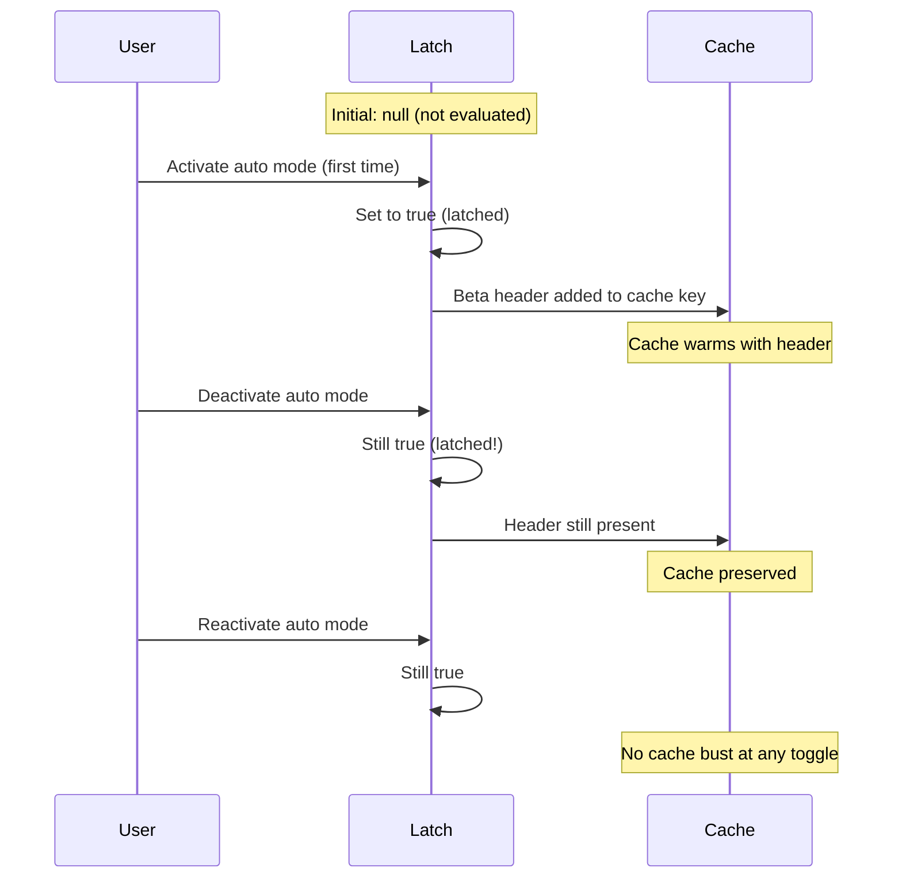
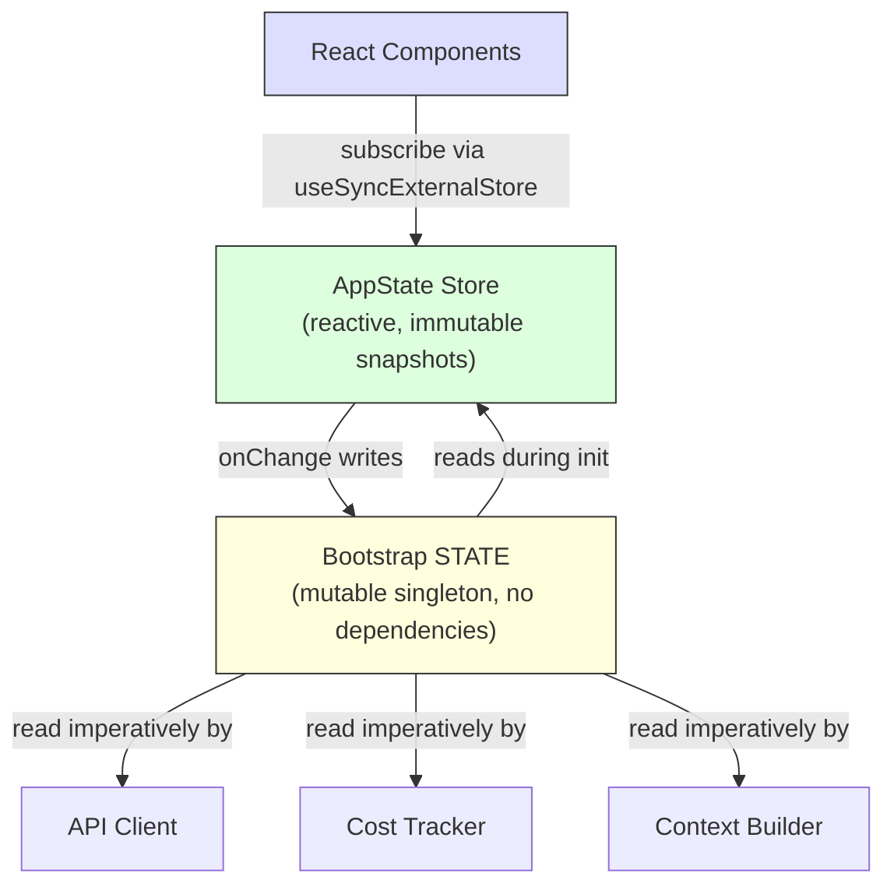

# Глава 3: State. Двухуровневая архитектура

В главе 2 прослеживался конвейер начальной загрузки от запуска процесса до первого рендеринга. К концу система имела полностью настроенную среду. Но настроено с *чем*? Где хранится идентификатор сеанса? Текущая модель? История сообщений? Трекер затрат? Режим разрешения? Где живет state и почему оно там живет?

Каждое долго работающее приложение рано или поздно сталкивается с этим вопросом. Для простого tool CLI ответ тривиален — несколько переменных в `main()`. Но Claude Code — это не простой tool CLI. Это приложение React, созданное с помощью Ink, с жизненным циклом процесса, охватывающим несколько часов, системой плагинов, загружающейся в произвольное время, слоем API, который должен создавать prompt из кэшированного контекста, средством отслеживания затрат, которое выдерживает перезапуск процесса, и десятками модулей инфраструктуры, которым необходимо читать и записывать общие данные без импорта друг друга.

Наивный подход — единое глобальное хранилище — сразу дает сбой. Если средство отслеживания затрат обновило то же хранилище, которое выполняет повторную визуализацию React, каждый вызов API будет вызывать полную сверку дерева компонентов. Модули инфраструктуры (начальная загрузка, построение контекста, отслеживание затрат, телеметрия) не могут импортировать React. Они работают до установки React. Они запускаются после размонтирования React. Они работают в контекстах, где вообще не существует дерева компонентов. Помещение всего в хранилище, поддерживающее React, создаст циклические зависимости по всему графу импорта.

Claude Code решает эту проблему с помощью двухуровневой архитектуры: одноэлементного изменяемого процесса для State инфраструктуры и минимального реактивного хранилища для State UI. В этой главе описываются оба уровня, система побочных эффектов, соединяющая их, и вспомогательные подсистемы, зависящие от этой основы. Каждая последующая глава предполагает, что вы понимаете, где живет state и почему оно там живет.

---

## 3.1 State начальной загрузки — синглтон процесса

### Почему изменчивый синглтон

Модуль State начальной загрузки (`bootstrap/state.ts`) представляет собой один изменяемый объект, создаваемый один раз при запуске процесса:

```typescript
const STATE: State = getInitialState()
```

Комментарий над этой строкой гласит: `AND ESPECIALLY HERE`. Две строки над определением типа: `DO NOT ADD MORE STATE HERE - BE JUDICIOUS WITH GLOBAL STATE`. Эти комментарии имеют тон инженеров, которые на собственном горьком опыте узнали стоимость неуправляемого глобального объекта.

Изменяемый синглтон — правильный выбор здесь по трем причинам. Во-первых, State начальной загрузки должно быть доступно до инициализации любой платформы — до монтирования React, до создания хранилища, до загрузки плагинов. Инициализация области модуля — единственный механизм, гарантирующий доступность во время импорта. Во-вторых, данные по своей сути привязаны к процессу: идентификаторы сеансов, счетчики телеметрии, аккумуляторы затрат, кэшированные пути. Нет значимого «предыдущего State», с которым можно было бы сравнивать, нет подписчиков, которых нужно уведомлять, нет истории отмены. В-третьих, модуль должен быть листом в графе зависимостей импорта. Если бы он импортировал React, или хранилище, или любой сервисный модуль, это создало бы циклы, которые нарушают последовательность начальной загрузки, описанную в главе 2. Поскольку он не зависит ни от чего, кроме типов утилит и `node:crypto`, его можно импортировать откуда угодно.

### ~80 полей

Тип `State` содержит около 80 полей. Выборка показывает широту:

**Идентификация и пути** – `originalCwd`, `projectRoot`, `cwd`, `sessionId`, `parentSessionId`. `originalCwd` разрешается через `realpathSync` и нормализуется NFC при запуске процесса. Оно никогда не меняется.

**Стоимость и показатели** – `totalCostUSD`, `totalAPIDuration`, `totalLinesAdded`, `totalLinesRemoved`. Они монотонно накапливаются в течение сеанса и сохраняются на диске при выходе.

**Телеметрия** — `meter`, `sessionCounter`, `costCounter`, `tokenCounter`. Дескрипторы OpenTelemetry, все значения которых допускают значение NULL (ноль до тех пор, пока не будет инициализирована телеметрия).

**Конфигурация модели** -- `mainLoopModelOverride`, `initialMainLoopModel`. Переопределение устанавливается, когда пользователь меняет модели в середине сеанса.

**Флаги сеанса** – `isInteractive`, `kairosActive`, `sessionTrustAccepted`, `hasExitedPlanMode`. Логические значения, которые контролируют поведение на протяжении сеанса.

**Оптимизация кэша** — `promptCache1hAllowlist`, `promptCache1hEligible`, `systemPromptSectionCache`, `cachedClaudeMdContent`. Они существуют для предотвращения избыточных вычислений и быстрого сброса кэша.

### Шаблон получения/установки

Объект `STATE` никогда не экспортируется. Весь доступ осуществляется примерно через 100 отдельных функций получения и установки:

```typescript
// Pseudocode — illustrates the pattern
export function getProjectRoot(): string {
  return STATE.projectRoot
}

export function setProjectRoot(dir: string): void {
  STATE.projectRoot = dir.normalize('NFC')  // NFC normalization on every path setter
}
```

Этот шаблон обеспечивает инкапсуляцию, нормализацию NFC для каждого установщика пути (предотвращая несоответствие Юникода в macOS), сужение типов и изоляцию начальной загрузки. Компромисс — многословие — сто функций для восьмидесяти полей. Но в кодовой базе, где случайная мутация может вывести из строя Prompt Cache на 50 000 токенов, явность побеждает.

### Модель сигнала

Bootstrap не может импортировать прослушиватели (это лист DAG), поэтому он использует минимальный примитив pub/sub под названием `createSignal`. Сигнал `sessionSwitched` имеет ровно одного потребителя: `concurrentSessions.ts`, который обеспечивает синхронизацию файлов PID. Сигнал представлен как `onSessionSwitch = sessionSwitched.subscribe`, что позволяет вызывающим абонентам зарегистрироваться без предварительной загрузки, зная, кто они.

### Пять липких защелок

Наиболее тонкими полями в State начальной загрузки являются пять логических защелок, которые следуют одному и тому же шаблону: как только функция впервые активируется во время сеанса, соответствующий флаг остается `true` до конца сеанса. Все они существуют по одной причине: быстрое сохранение кэша.



API Клода поддерживает кэширование prompts на стороне сервера. Когда последовательные запросы используют один и тот же префикс System Prompt, сервер повторно использует кэшированные вычисления. Но ключ кэша включает в себя заголовки HTTP и поля тела запроса. Если бета-frontmatter появляется в запросе N, но не в запросе N+1, кэш разрушается, даже если содержимое запроса идентично. Для System Prompt, превышающего 50 000 токенов, промах в кэше обходится дорого.

Пять защелок:

| защелка | Что это предотвращает |
|-------|-----------------|
| `afkModeHeaderLatched` | Переключение автоматического режима Shift+Tab включает/отключает бета-frontmatter AFK |
| `fastModeHeaderLatched` | Время восстановления быстрого режима: вход/выход переворачивает frontmatter быстрого режима |
| `cacheEditingHeaderLatched` | Удаленные изменения флагов функций разрушают кэш каждого активного пользователя |
| `thinkingClearLatched` | Срабатывает при подтвержденном промахе кэша (>1 час простоя). Предотвращает повторное включение блоков мышления из-за разрушения только что разогретого кэша |
| `pendingPostCompaction` | Флаг Consume-once для телеметрии: отличает промахи кэша, вызванные уплотнением, от промахов по истечении TTL |

Все пять используют тип с тремя состояниями: `boolean | null`. Начальное значение `null` означает «еще не оценено». `true` означает «зафиксирован». Они никогда не возвращаются к `null` или `false`, если установлено значение `true`. Это определяющее свойство защелки.

Схема реализации:

```typescript
function shouldSendBetaHeader(featureCurrentlyActive: boolean): boolean {
  const latched = getAfkModeHeaderLatched()
  if (latched === true) return true       // Already latched -- always send
  if (featureCurrentlyActive) {
    setAfkModeHeaderLatched(true)          // First activation -- latch it
    return true
  }
  return false                             // Never activated -- don't send
}
```

Почему бы просто не всегда отправлять все заголовки бета-версии? Потому что заголовки являются частью ключа кэша. Отправка нераспознанного заголовка создает другое пространство имен кэша. Защелка гарантирует, что вы войдете в пространство имен кэша только тогда, когда оно вам действительно нужно, и остаетесь там.

---

## 3.2 AppState — Реактивный store

### Реализация в 34 строки

Хранилище State UI находится в `state/store.ts`:

Реализация хранилища занимает примерно 30 строк: замыкание переменной `state`, проверка на равенство `Object.is` для предотвращения ложных обновлений, синхронное уведомление прослушивателя и обратный вызов `onChange` для побочных эффектов. Скелет выглядит так:

```typescript
// Pseudocode — illustrates the pattern
function makeStore(initial, onTransition) {
  let current = initial
  const subs = new Set()
  return {
    read:      () => current,
    update:    (fn) => { /* Object.is guard, then notify */ },
    subscribe: (cb) => { subs.add(cb); return () => subs.delete(cb) },
  }
}
```

Тридцать четыре строки. Никакого промежуточного программного обеспечения, никаких tools разработчика, никакой отладки во времени, никаких типов действий. Просто замыкание изменяемой переменной, набора прослушивателей и проверки на равенство `Object.is`. Это Зустанд без библиотеки.

Дизайнерские решения, заслуживающие внимания:

**Шаблон функции обновления.** `setState(newValue)` нет — есть только `setState((prev) => next)`. Каждая мутация получает текущее State и должна создать следующее State, устраняя ошибки устаревшего State из одновременных мутаций.

**`Object.is` проверка на равенство.** Если средство обновления возвращает ту же ссылку, мутация невозможна. Никто из слушателей не стреляет. Никаких побочных эффектов не наблюдается. Критично для производительности — компоненты, которые распространяются и устанавливаются без изменения значений, не производят повторной визуализации.

**`onChange` срабатывает раньше прослушивателей.** Необязательный обратный вызов `onChange` получает как старое, так и новое State и срабатывает синхронно, прежде чем какой-либо подписчик будет уведомлен. Это используется для побочных эффектов (раздел 3.4), которые должны завершиться перед повторной отрисовкой UI.

**Нет промежуточного программного обеспечения, нет tools разработки.** Это не упущение. Когда вашему storeу требуется ровно три операции (получить, установить, подписаться), проверка на равенство `Object.is` и синхронный hook `onChange`, 34 собственных строки кода лучше, чем зависимость. Вы контролируете точную семантику. Вы можете прочитать всю реализацию за тридцать секунд.

### Тип AppState

Тип `AppState` (~452 строки) — это форма всего, что нужно отрисовать UI. Для большинства полей он заключен в `DeepImmutable<>`, с явными исключениями для полей, содержащих типы функций:

```typescript
export type AppState = DeepImmutable<{
  settings: SettingsJson
  verbose: boolean
  // ... ~150 more fields
}> & {
  tasks: { [taskId: string]: TaskState }  // Contains abort controllers
  agentNameRegistry: Map<string, AgentId>
}
```

Тип пересечения позволяет большинству полей быть глубоко неизменяемыми, исключая при этом поля, которые содержат функции, карты и изменяемые ссылки. По умолчанию используется полная неизменяемость с хирургическими аварийными люками, в которых система типов будет бороться с семантикой времени выполнения.

### React Интеграция

Магазин интегрируется с React через `useSyncExternalStore`:

```typescript
// Standard React pattern — useSyncExternalStore with a selector
export function useAppState<T>(selector: (state: AppState) => T): T {
  const store = useContext(AppStoreContext)
  return useSyncExternalStore(
    store.subscribe,
    () => selector(store.getState()),
  )
}
```

Селектор должен возвращать существующую ссылку на подобъект (а не только что созданный объект) для сравнения `Object.is`, чтобы предотвратить ненужные повторные рендеринги. Если вы напишете `useAppState(s => ({ a: s.a, b: s.b }))`, при каждом рендеринге создается новая ссылка на объект, и компонент повторно визуализируется при каждом изменении State. Это то же ограничение, с которым сталкиваются пользователи Zustand — более дешевые сравнения, но автор селектора должен понимать ссылочную идентичность.

---

## 3.3 Как связаны два уровня

Два уровня взаимодействуют через явные, узкие интерфейсы.



State начальной загрузки переходит в AppState во время инициализации: `getDefaultAppState()` считывает настройки с диска (которые помогла найти загрузочная загрузка), проверяет флаги функций (которые оцениваются загрузочной загрузкой) и устанавливает исходную модель (которая загрузочная загрузка разрешает из аргументов и настроек CLI).

AppState возвращается в State начальной загрузки из-за побочных эффектов: когда пользователь меняет модель, `onChangeAppState` вызывает `setMainLoopModelOverride()` в начальной загрузке. При изменении настроек кэш учетных данных в начальной загрузке очищается.

Но эти два уровня никогда не имеют общей ссылки. Модулю, который импортирует State начальной загрузки, не обязательно знать о React. Компоненту, который читает AppState, не обязательно знать об одноэлементном процессе.

Конкретный пример поясняет поток данных. Когда пользователь вводит `/model claude-sonnet-4`:

1. Обработчик команды вызывает `store.setState(prev => ({ ...prev, mainLoopModel: 'claude-sonnet-4' }))`.
2. Проверка storeа `Object.is` обнаруживает изменение
3. `onChangeAppState` срабатывает, обнаруживает изменение модели, вызывает `setMainLoopModelOverride()` (обновляет загрузочную загрузку) и `updateSettingsForSource()` (сохраняется на диске)
4. Все подписчики storeа отключаются — компоненты React повторно визуализируются, чтобы показать название новой модели.
5. Следующий вызов API считывает модель из `getMainLoopModelOverride()` в State начальной загрузки.

Шаги 1–4 синхронны. Клиент API на шаге 5 может запуститься через несколько секунд. Но он читает из State начальной загрузки (обновленного на шаге 3), а не из AppState. Это двухуровневая передача: хранилище UI является источником истины о том, что выбрал пользователь, а State начальной загрузки является источником истины о том, что использует клиент API.

Свойство DAG — загрузка не зависит ни от чего, AppState зависит от начальной загрузки для инициализации, React зависит от AppState — обеспечивается правилом ESLint, которое запрещает `bootstrap/state.ts` импортировать модули за пределами разрешенного набора.

---

## 3.4 Побочные эффекты: onChangeAppState

Обратный вызов `onChange` позволяет синхронизировать два уровня. Каждый вызов `setState` запускает `onChangeAppState`, который получает как предыдущее, так и новое State и решает, какие внешние эффекты активировать.

**Синхронизация permission mode** — основной вариант использования. До появления этого централизованного обработчика permission mode синхронизировался с удаленным сеансом (CCR) только по 2 из 8+ путей мутации. Остальные шесть — циклическое нажатие Shift+Tab, параметры диалога, команды слэша, перемотка назад, callbacks моста — все мутировали AppState без уведомления CCR. Внешние метаданные рассинхронизировались.

Исправление: перестать разбрасывать уведомления по сайтам мутаций и вместо этого собирать различия в одном месте. Комментарий в исходном коде перечисляет все пути мутаций, которые были нарушены, и отмечает, что «разрозненные сайты вызовов, приведенные выше, не требуют никаких изменений». В этом архитектурное преимущество централизованных побочных эффектов: покрытие является структурным, а не ручным.

**Изменения модели** позволяют синхронизировать State начальной загрузки с тем, что отображает UI. **Изменения настроек** очищают кэш учетных данных и повторно применяют переменные среды. **Подробный переключатель** и **расширенный вид** сохраняются в глобальной конфигурации.

Шаблон — централизованные побочные эффекты при различимом переходе между состояниями — по сути является шаблоном Observer, применяемым для детализации различий между состояниями, а не для отдельных событий. Он масштабируется лучше, чем выбросы рассеянных событий, поскольку количество побочных эффектов растет гораздо медленнее, чем количество мест мутаций.

---

## 3.5 Построение контекста

Три запомненные асинхронные функции в `context.ts` создают контекст System Prompt, добавляемый к каждому разговору. Каждый из них вычисляется один раз за сеанс, а не за ход.

`getGitStatus` параллельно запускает пять команд git (`Promise.all`), создавая блок с текущей веткой, веткой по умолчанию, недавними коммитами и State рабочего дерева. Флаг `--no-optional-locks` не позволяет git блокировать запись, которая может помешать параллельным операциям git в другом терминале.

`getUserContext` загружает содержимое CLAUDE.md и кэширует его в State начальной загрузки через `setCachedClaudeMdContent`. Этот кеш нарушает циклическую зависимость: классификатору автоматического режима требуется содержимое CLAUDE.md, но загрузка CLAUDE.md происходит через файловую систему, которая проходит через разрешения, вызывающие классификатор. При кэшировании в State начальной загрузки (лист DAG) цикл прерывается.

Все три контекстные функции используют `memoize` Lodash (вычисление один раз, кэширование навсегда), а не кэширование на основе TTL. Причина: если статус git будет пересчитываться каждые 5 минут, это изменение приведет к сбою Prompt Cache на стороне сервера. Системная prompt даже сообщает модели: «Это статус git в начале разговора. Обратите внимание, что этот статус представляет собой снимок во времени».

---

## 3.6 Отслеживание затрат

Каждый ответ API проходит через `addToTotalSessionCost`, который накапливает данные об использовании каждой модели, обновляет State начальной загрузки, отправляет отчеты в OpenTelemetry и рекурсивно обрабатывает использование tool-консультанта (вызовы вложенных моделей в ответе).

State стоимости сохраняется при перезапуске процесса благодаря сохранению и восстановлению в файле конфигурации проекта. Идентификатор сеанса используется в качестве защиты — затраты восстанавливаются только в том случае, если сохраненный идентификатор сеанса соответствует возобновляемому сеансу.

Гистограммы используют выборку резервуаров (алгоритм R) для сохранения ограниченной memory и точного представления распределений. Резервуар на 1024 записи дает процентили p50, p95 и p99. Почему бы не использовать простое скользящее среднее? Потому что средние значения скрывают форму распределения. Сеанс, в котором 95% вызовов API занимают 200 мс, а 5% — 10 секунд, имеет такое же среднее значение, как и сеанс, в котором все вызовы занимают 690 мс, но пользовательский опыт радикально отличается.

---

## 3.7 Что мы узнали

Кодовая база выросла с простого CLI до системы с ~450 строками определений типов State, ~80 полями State процесса, системой побочных эффектов, несколькими границами персистентности и защелками оптимизации кэша. Ничего из этого не было запланировано заранее. Липкие защелки были добавлены, когда разрушение кэша стало измеримой проблемой затрат. Обработчик `onChange` был централизован, когда было обнаружено, что 6 из 8 путей синхронизации разрешений нарушены. Кэш CLAUDE.md был добавлен, когда возникла циклическая зависимость.

Это естественная модель роста State в сложном приложении. Двухуровневая архитектура обеспечивает достаточную структуру для сдерживания роста: новые поля начальной загрузки не влияют на рендеринг React, новые поля AppState не создают циклы импорта, оставаясь при этом достаточно гибкой для размещения шаблонов, которые не были предусмотрены в исходном проекте.

---

## 3.8 Резюме государственной архитектуры

| Недвижимость | State начальной загрузки | AppState |
|---|---|---|
| **Местоположение** | Синглтон в области видимости модуля | React контекст |
| **Изменчивость** | Изменяемый через сеттеры | Неизменяемые снимки через программу обновления |
| **Подписчики** | Сигнал (pub/sub) для конкретных событий | `useSyncExternalStore` для React |
| **Наличие** | Время импорта (до React) | После монтирования провайдера |
| **Настойчивость** | Обработчики выхода процесса | Через onChange на диск |
| **Равенство** | Н/Д (обязательное чтение) | `Object.is` проверка ссылок |
| **Зависимости** | Лист DAG (ничего не импортирует) | Импортирует типы из всей кодовой базы |
| **Тестовый сброс** | `resetStateForTests()` | Создать новый экземпляр storeа |
| **Основные потребители** | API клиент, отслеживание затрат, построитель контекста | React компоненты, побочные эффекты |

---

## Примените это

**Отдельное State по шаблону доступа, а не по домену.** Идентификатор сеанса принадлежит одноэлементному не потому, что он является «инфраструктурой» абстрактно, а потому, что он должен быть доступен для чтения до монтирования React и доступен для записи без уведомления подписчиков. Режим разрешений принадлежит реактивному хранилищу, поскольку его изменение должно вызвать повторный рендеринг и побочные эффекты. Позвольте шаблону доступа определять уровень, и архитектура будет следовать естественным путем.

**Шаблон липкой защелки.** Любая система, которая взаимодействует с кешем (кэш запросов, CDN, кеш запросов), сталкивается с одной и той же проблемой: переключатели функций, которые меняют ключ кеша в середине сеанса, приводят к аннулированию. После активации функции вклад ее ключа кэша остается активным в течение сеанса. Тип с тремя состояниями (`boolean | null`, что означает «не оценивается/включено/никогда не выключается») делает намерение самодокументируемым. Особенно ценно, когда кэш не под вашим контролем.

**Централизуйте побочные эффекты при изменении State.** Если одно и то же State может измениться несколькими путями кода, не разбрасывайте уведомления по сайтам мутаций. Подключите обратный вызов storeа `onChange` и определите, какие поля изменились. Охват становится структурным (любая мутация вызывает эффект), а не ручным (каждый сайт мутации должен не забыть уведомить).

**Предпочитайте 34 строки, которыми вы владеете, а не библиотеку, которой у вас нет.** Когда ваши требования — это получение, установка, подписка и обратный вызов изменения, минимальная реализация дает вам полный контроль над семантикой. В системе, где ошибки управления State могут стоить реальных денег, такая прозрачность имеет ценность. Ключевым моментом является понимание того, когда вам *не* нужна библиотека.

**Сознательно используйте выход процесса в качестве границы постоянства.** Несколько подсистем сохраняют State при выходе из процесса. Компромисс очевиден: некорректное завершение (SIGKILL, OOM) приводит к потере накопленных данных. Это приемлемо, поскольку данные являются диагностическими, а не транзакционными, и запись на диск при каждом изменении State была бы слишком дорогостоящей для счетчиков, которые увеличиваются сотни раз за сеанс.

---

Двухуровневая архитектура, созданная в этой главе — одноэлементная загрузка для инфраструктуры, реактивное хранилище для UI и побочные эффекты, соединяющие их, — является основой, на которой строится каждая последующая глава. Цикл диалога (глава 4) считывает контекст из запомненных конструкторов. Tool System (глава 5) проверяет разрешения от AppState. Система agents (глава 8) создает записи Task в AppState, отслеживая затраты в State начальной загрузки. Понимание того, где и почему живет state, является предпосылкой понимания того, как работает любая из этих систем.

Некоторые месторождения находятся по обе стороны границы. Модель основного цикла существует на обоих уровнях: `mainLoopModel` в AppState (для рендеринга UI) и `mainLoopModelOverride` в State начальной загрузки (для использования клиентом API). Обработчик `onChangeAppState` обеспечивает их синхронизацию. Это дублирование является издержками двухуровневого разделения. Но альтернатива — если клиент API импортирует хранилище React или считывает компоненты React из синглтона процесса — нарушит направление зависимости, которое сохраняет работоспособность архитектуры. Небольшое количество контролируемого дублирования, соединенного централизованной точкой синхронизации, предпочтительнее запутанного графа зависимостей.
