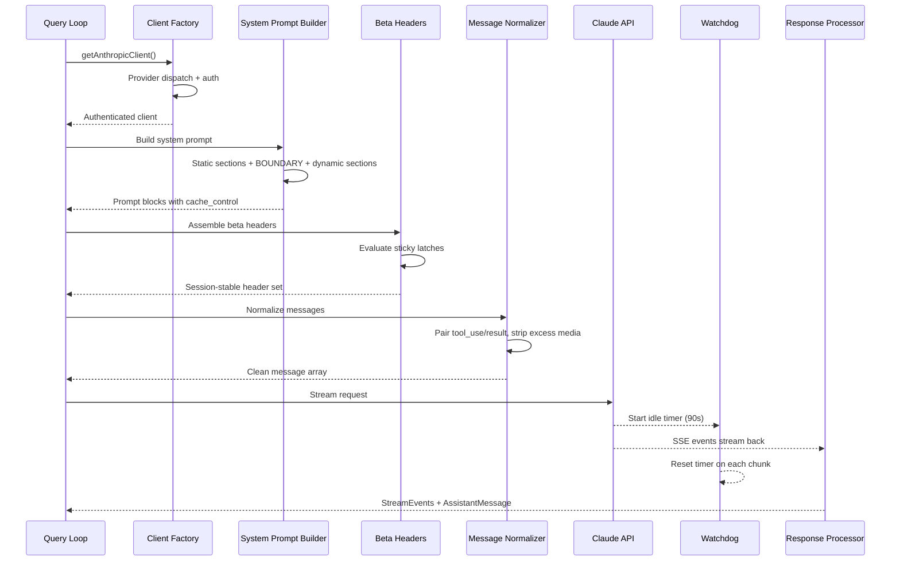
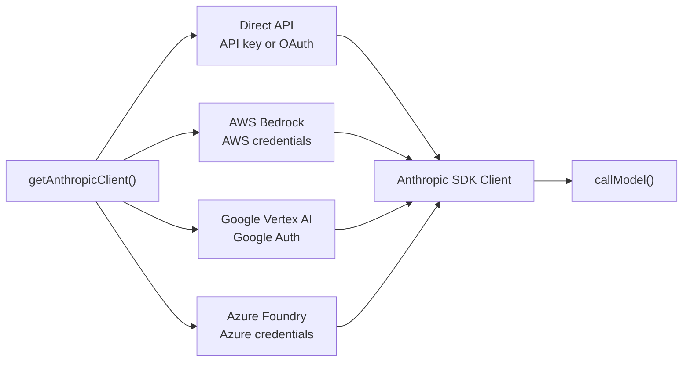
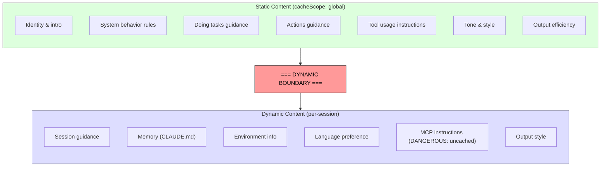

# Глава 4: Разговор с Клодом — слой API

В главе 3 установлено, где живет state и как взаимодействуют два уровня. Теперь мы проследим, что происходит, когда это State используется: системе необходимо взаимодействовать с языковой моделью. Все в Claude Code — последовательность начальной загрузки, система State, структура разрешений — существует для того, чтобы служить этому моменту.

Этот уровень обрабатывает больше режимов сбоя, чем любая другая часть системы. Он должен проходить через четырех облачных провайдеров через единый прозрачный интерфейс. Он должен создавать системные prompt с пониманием на уровне байтов того, как работает Prompt Cache сервера, поскольку один неуместный раздел может привести к разрушению кэша, содержащего более 50 000 токенов. Он должен передавать ответы с активным обнаружением сбоев, поскольку соединения TCP прекращаются молча. И он должен поддерживать стабильные для сеанса инварианты, чтобы изменения флагов функций в середине диалога не вызывали невидимых скачков производительности.

Давайте проследим один вызов API от начала до конца.

---

## Фабрика клиентов с несколькими provider

Функция `getAnthropicClient()` — это единая фабрика для связи всей модели. Он возвращает клиент Anthropic SDK, настроенный для любого provider, на который нацелено развертывание:

Отправка полностью управляется переменными среды и оценивается в фиксированном порядке приоритетов. Все четыре класса SDK, специфичные для provider, преобразуются в `Anthropic` через `as unknown as Anthropic`. Комментарий в источнике предельно честен: «мы всегда лгали о типе возвращаемого значения». Такое намеренное стирание типов означает, что каждый потребитель видит единый интерфейс. Остальная часть кодовой базы никогда не разветвляется на провайдера.

Каждый provider SDK импортируется динамически. `AnthropicBedrock`, `AnthropicFoundry`, `AnthropicVertex` — это тяжелые модули со своими собственными деревьями зависимостей. Динамический импорт гарантирует, что неиспользуемые providers никогда не загружаются.

Выбор provider определяется при запуске и сохраняется в загрузочном файле `STATE`. Query Loop никогда не проверяет, какой provider активен. Переход с Direct API на Bedrock — это изменение конфигурации, а не кода.

### Оболочка buildFetch

Каждая исходящая выборка оборачивается для внедрения заголовка `x-client-request-id` — UUID, создаваемого для каждого запроса. Когда время запроса истекает, сервер никогда не присваивает идентификатор запроса ответу. Без идентификатора на стороне клиента команда API не может сопоставить время ожидания с журналами на стороне сервера. Этот frontmatter устраняет этот пробел. Он отправляется только на собственные конечные точки Anthropic — сторонние providers могут отклонять неизвестные заголовки.

---

## prompt создания системы

Системное prompt является наиболее чувствительным к кэшу артефактом во всей системе. API Клода обеспечивает кэширование prompts на стороне сервера: можно кэшировать одинаковые префиксы prompts для всех запросов, что позволяет сэкономить как задержку, так и затраты. Разговор с 200 000 токенов может содержать 50-70 000 токенов, идентичных предыдущему ходу. Освобождение этого кеша заставляет сервер заново его обработать.

### Динамический маркер границы

prompt построено как массив строковых разделов с критической разделительной линией:

Все, что находится до границы, идентично для всех сеансов, пользователей и организаций — оно получает самый высокий уровень кэширования на стороне сервера. Все, что происходит после, содержит пользовательский контент и переходит в кэширование для каждого сеанса.

Соглашение об именах разделов намеренно громкое. Для добавления нового раздела необходимо выбрать между `systemPromptSection` (безопасный, cached) и `DANGEROUS_uncachedSystemPromptSection` (взлом кэша, требуется строка причины). Параметр `_reason` не используется во время выполнения, но служит обязательной документацией — каждый раздел взлома кэша имеет свое обоснование в исходном коде.

### Проблема 2^N

Комментарий в `prompts.ts` объясняет, почему условные разделы должны идти после границы:

> Каждое условие здесь представляет собой бит времени выполнения, который в противном случае умножил бы варианты хэша префикса Blake2b (2^N).

Каждое логическое условие перед границей удваивает количество уникальных записей глобального кэша. Три условных предложения создают 8 вариантов; пять создают 32. Статические разделы намеренно безусловны. Флаги функций времени компиляции (разрешенные bundler) приемлемы до границы. После этого должны пройти проверки во время выполнения (это Haiku? Есть ли у пользователя автоматический режим?).

Это тот тип ограничения, который невидим, пока вы его не нарушите. Инженер из лучших побуждений, добавляющий перед границей раздел, закрытый пользователем, может незаметно фрагментировать глобальный кэш и удвоить затраты на быструю обработку данных.

---

## Стриминг

### Необработанный SSE поверх абстракций SDK

Реализация streaming использует необработанный `Stream<BetaRawMessageStreamEvent>`, а не `BetaMessageStream` более высокого уровня SDK. Причина: `BetaMessageStream` вызывает `partialParse()` при каждом событии `input_json_delta`. Для tool calls с большими входными данными JSON (редактирование файлов с сотнями строк) это повторно анализирует растущую строку JSON с нуля на каждом фрагменте - поведение O(n^2). Claude Code сам обрабатывает накопление входных данных tool, поэтому частичный анализ является чистой тратой.

### Праздный сторожевой пес

Соединения TCP могут прерываться без уведомления. Сервер может выйти из строя, балансировщик нагрузки может автоматически разорвать соединение или время ожидания корпоративного прокси-сервера может истечь. Тайм-аут запроса SDK охватывает только первоначальную выборку — как только приходит HTTP 200, тайм-аут удовлетворяется. Если струящееся тело остановится, его ничто не уловит.

Сторожевой таймер: `setTimeout`, который сбрасывается при каждом полученном фрагменте. Если в течение 90 секунд не поступает ни одного фрагмента, поток прерывается, и система возвращается к повторной попытке без streaming. Предупреждение срабатывает на отметке 45 секунд. Когда сторожевой таймер срабатывает, он регистрирует событие с идентификатором запроса клиента для корреляции.

### Резервный вариант без streaming

Если streaming завершается сбоем в середине ответа (ошибка сети, зависание, усечение), система возвращается к синхронному вызову `messages.create()`. Это обрабатывает сбои прокси-сервера, когда прокси-сервер возвращает HTTP 200 с телом, отличным от SSE, или обрезает поток SSE на полпути.

Резервный вариант можно отключить, когда активно tool execution streaming, поскольку при возврате будет повторно выполняться весь запрос и потенциально запускаться tools дважды.

---

## Система кэширования prompts

### Три уровня

Оперативное кэширование работает на трех уровнях:

**Эфемерный кеш** (по умолчанию): кэширование для каждого сеанса с определяемым сервером сроком жизни (~5 минут). Все пользователи это понимают.

**1 час TTL**: пользователи, соответствующие критериям, получают расширенное кэширование. Право на участие определяется статусом подписки и фиксируется в State начальной загрузки — липкая защелка `promptCache1hEligible` из главы 3 гарантирует, что переворот в середине сеанса не приведет к изменению TTL.

**Глобальная область**. Записи системного Prompt Cache доступны для общего доступа между сеансами и между организациями. Статические части prompt одинаковы для всех пользователей Claude Code, поэтому всем служит одна кэшированная копия. Глобальная область отключена, когда присутствуют tools MCP, поскольку определения tools MCP зависят от пользователя и фрагментируют кэш на миллионы уникальных префиксов.

### Липкие защелки в действии

Здесь во время построения запроса оцениваются пять липких защелок из главы 3. Каждая блокировка начинается с `null` и, если она установлена ​​на `true`, остается `true` для сеанса. Комментарий над блоком защелки точен: «Прикрепленные защелки для динамических бета-заголовков. Каждый frontmatter, однажды отправленный впервые, продолжает отправляться до конца сеанса, поэтому переключатели в середине сеанса не изменяют ключ кэша на стороне сервера и не уничтожают ~ 50-70 тысяч токенов».

См. главу 3, раздел 3.1 для полного объяснения шаблона блокировки, пяти конкретных блокировок и того, почему всегда отправлять все заголовки не является правильным решением.

---

## Генератор модели запроса

Функция `queryModel()` — это асинхронный генератор (около 700 строк), который управляет всем жизненным циклом вызова API. Он дает объекты `StreamEvent`, `AssistantMessage` и `SystemAPIErrorMessage`.

Сборка запроса следует тщательно упорядоченной последовательности:

1. **Проверка аварийного выключателя** – предохранительный клапан для самых дорогих моделей.
2. **Бета-разъем** в зависимости от модели, с прикрепленными липкими защелками.
3. **Построение схемы tools** — параллельно через `Promise.all()`, отложенные tools исключаются до тех пор, пока не будут обнаружены.
4. **Нормализация сообщений** — исправление потерянных несоответствийtool_use/tool_result, удаление лишнего носителя, удаление устаревших блоков.
5. **Создание блока системных prompts** – разделение по динамической границе, назначение областей кэша.
6. **Потоковая передача с повторной попыткой** — обрабатывает 529 (перегрузку), возврат модели, понижение версии, обновление OAuth.

### Ограничение выходного токена

Ограничение вывода по умолчанию составляет 8000 токенов, а не типичные 32 КБ или 64 КБ. Производственные данные показали, что выход p99 составляет 4911 токенов — стандартные ограничения превышения резерва в 8-16 раз. Когда ответ достигает ограничения (<1% запросов), он получает одну чистую повторную попытку с размером 64 КБ. Это позволяет существенно сэкономить на масштабах автопарка.

### Обработка ошибок и повторная попытка

Функция `withRetry()` сама по себе является асинхронным генератором, который генерирует события `SystemAPIErrorMessage`, чтобы UI мог отображать статус повтора. Стратегии повторной попытки:

- **529 (перегружено)**: подождите и повторите попытку, при необходимости понизив быстрый режим.
- **Резервная модель**: основная модель не работает, попробуйте резервную (e.g., Opus to Sonnet).
- **Понижение уровня мышления**: переполнение контекстного окна приводит к сокращению бюджета на мышление.
- **OAuth 401**: обновите токен и повторите попытку.

Шаблон генератора означает, что ход повторной попытки («Сервер перегружен, повторная попытка через 5 секунд...») отображается как естественная часть потока событий, а не как уведомление по побочному каналу.

---

## Примените это

**Считайте оперативное кэширование архитектурным ограничением, а не переключением функций.** Большинство приложений LLM «включают» кэширование. Claude Code рассматривает это как ограничение дизайна, которое определяет порядок prompts, запоминание разделов, фиксацию заголовка и управление конфигурацией. Разница между хорошо структурированным prompt (попадание в кэш на 50 000 токенов) и плохо структурированным (полная повторная обработка каждый ход) — это самый крупный рычаг затрат в системе.

**Используйте ОПАСНОЕ соглашение об именовании для дорогостоящих аварийных люков.** Если в кодовой базе есть инвариант, который легко случайно нарушить, присвоение аварийному люку громкого префикса дает три преимущества: делает нарушения видимыми при проверке кода, требует документирования (обязательный параметр причины) и создает психологические препятствия на пути к безопасному умолчанию. Это распространяется не только на кэширование, но и на любую операцию с невидимыми затратами.

**Создавайте потоковую передачу с помощью сторожевого таймера, а не просто тайм-аута.** Тайм-аут запроса SDK удовлетворяет требованиям HTTP 200, но тело ответа может прекратить поступление в любой момент. `setTimeout`, который сбрасывается на каждом фрагменте, улавливает это. Резервный вариант без streaming обрабатывает режимы сбоя прокси-сервера (HTTP 200 с телом, отличным от SSE, усечение в середине потока), которые встречаются чаще, чем вы ожидаете в корпоративных средах.

**Сделайте стратегии повтора основанными на доходности, а не на исключениях.** Превратив оболочку повтора в асинхронный генератор, который генерирует события State, вызывающая сторона отображает ход повторной попытки как естественную часть потока событий. Шаблон отката модели (Opus не работает, попробуйте Sonnet) особенно полезен для обеспечения устойчивости производства.

**Отделите быстрый путь от полного конвейера.** Не для каждого вызова API требуется поиск tools, интеграция советников, планирование бюджетов и инфраструктура streaming. Функция `queryHaiku()` Claude Code обеспечивает упрощенный путь для внутренних операций (сжатие, классификация), который позволяет избежать всех agentic проблем. Отдельная функция с упрощенным интерфейсом предотвращает случайную утечку сложности.

---

## Заглядывая в будущее

Слой API лежит в основе всего последующего. В главе 5 будет показано, как Query Loop использует потоковый ответ для запуска выполнения tools, включая то, как tools начинают выполняться до того, как модель завершает свой ответ. В главе 6 объясняется, как система сжатия сохраняет эффективность кэша, когда диалоги приближаются к пределу контекста. В главе 7 будет показано, как каждый поток agent получает свой собственный массив сообщений и цепочку запросов.

Все эти системы наследуют ограничения, установленные здесь: стабильность кэша как архитектурный инвариант, прозрачность провайдера через клиентскую фабрику и стабильную сеансовую конфигурацию через систему защелок. Уровень API не просто отправляет запросы — он определяет правила, по которым работает любая другая система.
