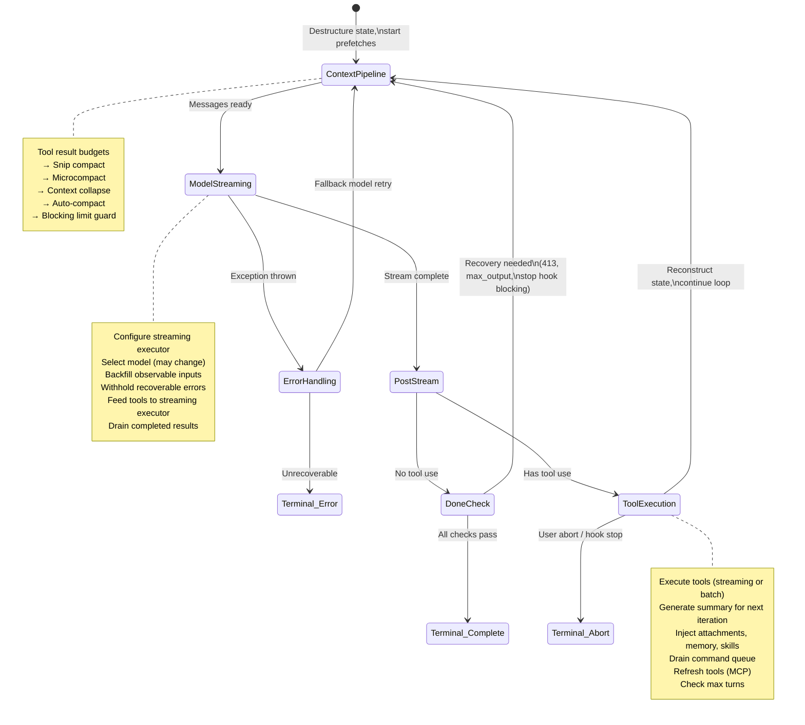
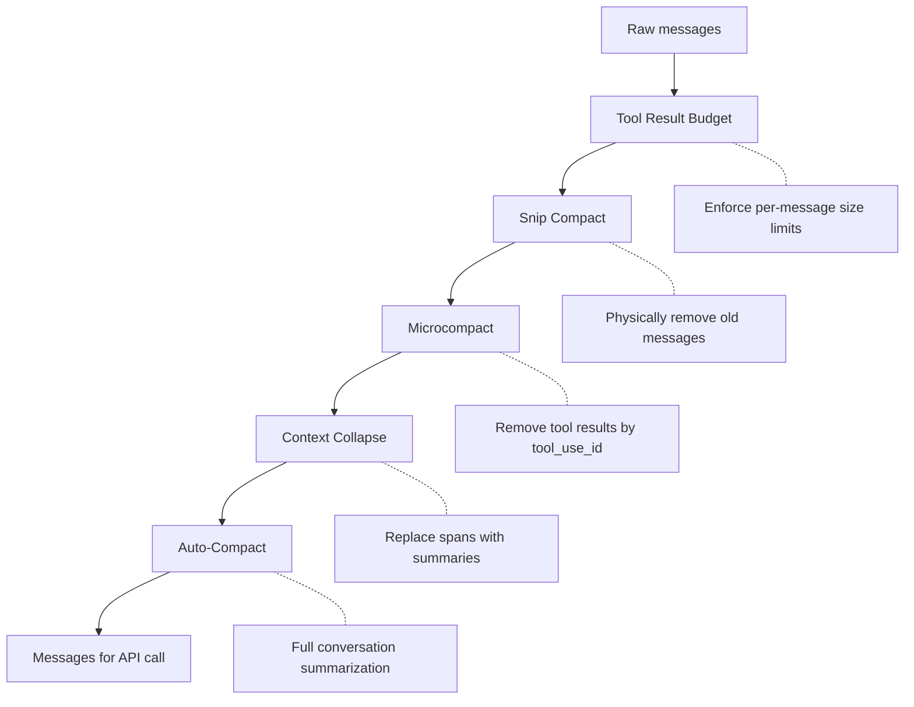
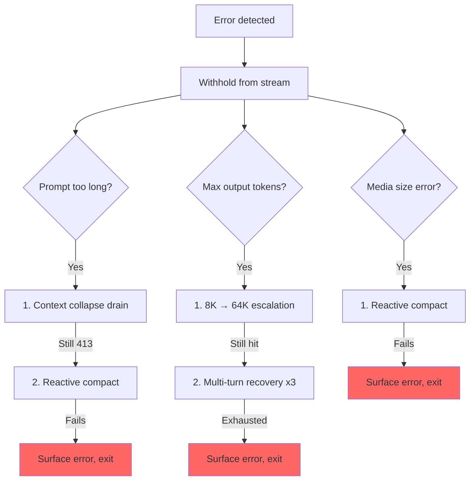

# Глава 5: Цикл agent

## Бьющееся сердце

В главе 4 показано, как уровень API преобразует конфигурацию в потоковые запросы HTTP — как создается клиент, как собираются системные prompt, как ответы поступают в виде событий, отправленных сервером. Этот слой отвечает за *механику* общения с моделью. Но одиночный вызов API не является agent. Agent представляет собой цикл: вызывает модель, запускает tools, возвращает результаты, снова вызывает модель, пока работа не будет завершена.

У каждой системы есть центр тяжести. В базе данных это механизм хранения. В компиляторе это промежуточное представление. В Claude Code это `query.ts` — один файл из 1730 строк, содержащий асинхронный генератор, который запускает каждое взаимодействие, от первого нажатия клавиши в REPL до последнего tool call безголового вызова `--print`.

Это не преувеличение. Существует ровно один путь кода, который взаимодействует с моделью, запускает tools, управляет контекстом, восстанавливается после ошибок и решает, когда остановиться. Этот путь кода — функция `query()`. REPL называет это. SDK называет это. Это называют sub-agents. Безголовый бегун называет это. Если вы используете Claude Code, вы находитесь внутри `query()`.

Файл плотный, но не такой сложный, как сложные иерархии наследования. Она сложна так же, как сложна подводная лодка: единый корпус со множеством резервных систем, каждая из которых добавлена ​​потому, что океан нашел проход. У каждой ветки `if` есть история. Каждое скрытое сообщение об ошибке представляет собой реальную ошибку, из-за которой потребитель SDK отключился на этапе восстановления. Каждый порог автоматического выключателя был настроен с учетом реальных сеансов, которые сжигали тысячи вызовов API в бесконечных циклах.

В этой главе прослеживается весь цикл, от начала до конца. К концу вы поймете не просто что происходит, но и почему каждый механизм существует и что без него ломается.

---

## Зачем нужен асинхронный генератор

Первый архитектурный вопрос: почему agent loop является генератором, а не генератором событий на основе обратного вызова?

```typescript
// Simplified — shows the concept, not the exact types
async function* agentLoop(params: LoopParams): AsyncGenerator<Message | Event, TerminalReason>
```

Фактическая подпись дает несколько типов сообщений и событий и возвращает распознаваемую кодировку объединения, почему цикл остановился.

Три причины в порядке важности.

**Обратное давление.** Генератор событий срабатывает независимо от того, готов потребитель или нет. Генератор срабатывает только тогда, когда потребитель вызывает `.next()`. Когда рендерер React REPL занят рисованием предыдущего кадра, генератор естественным образом приостанавливается. Когда потребитель SDK обрабатывает результат tool, генератор ожидает. Ни переполнения буфера, ни потерянных сообщений, ни проблем «быстрый производитель/медленный потребитель».

**Семантика возвращаемого значения.** Тип возвращаемого значения генератора — `Terminal` – дискриминируемое объединение, кодирующее именно причину остановки цикла. Это было нормальное завершение? Пользовательское прерывание? Символическое истощение бюджета? Вмешательство stop hook? Ограничение максимального количества оборотов? Неустранимая ошибка модели? Существует 10 различных терминальных State. Вызывающим объектам не нужно подписываться на событие «конец» и надеяться, что полезные данные содержат причину. Они получают его как типизированное возвращаемое значение от `for await...of` или `yield*`.

**Компонуемость посредством `yield*`.** Внешняя функция `query()` делегирует `queryLoop()` с `yield*`, который прозрачно пересылает каждое полученное значение и окончательный возврат. Подгенераторы, такие как `handleStopHooks()`, используют тот же шаблон. Это создает чистую цепочку ответственности без callbacks, без обёртывания обещаний, без шаблонного шаблона пересылки событий.

За выбор приходится платить — асинхронные генераторы в JavaScript нельзя «перемотать» или разветвить. Но agent loop тоже не нужен. Это строго движущаяся вперед государственная машина.

Еще одна тонкость: синтаксис `function*` делает функцию *ленивой*. Тело не выполняется до первого вызова `.next()`. Это означает, что `query()` возвращается мгновенно — вся тяжелая инициализация (снимок конфигурации, предварительная выборка memory, отслеживание бюджета) происходит только тогда, когда потребитель начинает извлекать значения. В REPL это означает, что конвейер рендеринга React уже настроен до запуска первой строки цикла.

---

## Что предоставляют вызывающие абоненты

Прежде чем отслеживать цикл, полезно знать, что происходит:

```typescript
// Simplified — illustrates the key fields
type LoopParams = {
  messages: Message[]
  prompt: SystemPrompt
  permissionCheck: CanUseToolFn
  context: ToolUseContext
  source: QuerySource         // 'repl', 'sdk', 'agent:xyz', 'compact', etc.
  maxTurns?: number
  budget?: { total: number }  // API-level task budget
  deps?: LoopDeps             // Injected for testing
}
```

Известные поля:

- **`querySource`**: строковый дискриминант, например `'repl_main_thread'`, `'sdk'`, `'agent:xyz'`, `'compact'` или `'session_memory'`. Многие условные выражения разветвляются на этом. Компактный agent использует `querySource: 'compact'`, поэтому защита ограничения блокировки не блокируется (компактный agent должен запуститься, чтобы *уменьшить* количество токенов).

- **`taskBudget`**: бюджет task уровня API (`output_config.task_budget`). В отличие от функции автоматического продолжения бюджета токена `+500k`. `total` — бюджет всего agent turn; `remaining` вычисляется за итерацию на основе совокупного использования API и корректируется по границам уплотнения.

- **`deps`**: необязательное внедрение зависимостей. По умолчанию `productionDeps()`. Это место, где тесты заменяются фальшивыми вызовами моделей, фальшивым сжатием и детерминированными UUID.

- **`canUseTool`**: функция, которая возвращает, разрешен ли данный tool. Это уровень разрешений — он проверяет настройки доверия, решения о hook и текущий permission mode.

---

## Двухуровневая точка входа

Публичный API — это тонкая оболочка реального цикла:

Внешняя функция оборачивает внутренний цикл, отслеживая, какие команды из очереди были использованы во время хода. После завершения внутреннего цикла использованные команды помечаются как `'completed'`. Если цикл выдает ошибку или генератор закрывается через `.return()`, уведомления о завершении никогда не срабатывают — неудачный ход не должен отмечать команды как успешно обработанные. Команды, поставленные в очередь во время хода (через косую черту `/` или уведомления о Task), помечаются `'started'` внутри цикла и `'completed'` в оболочке. Если цикл выдает ошибку или генератор закрывается через `.return()`, уведомления о завершении никогда не срабатывают. Это сделано намеренно — неудачный ход не должен отмечать команды как успешно обработанные.

---

## Объект State

Цикл переносит свое State в один типизированный объект:

```typescript
// Simplified — illustrates the key fields
type LoopState = {
  messages: Message[]
  context: ToolUseContext
  turnCount: number
  transition: Continue | undefined
  // ... plus recovery counters, compaction tracking, pending summaries, etc.
}
```

Десять полей. Каждый занимает свое место:

| Поле | Почему это существует |
|-------|---------------|
| `messages` | История разговоров, увеличивающаяся с каждой итерацией |
| `toolUseContext` | Изменяемый контекст: tools, контроллер прерывания, State agent, параметры |
| `autoCompactTracking` | Отслеживает State уплотнения: счетчик ходов, идентификатор хода, последовательные неудачи, флаг уплотнения |
| `maxOutputTokensRecoveryCount` | Сколько попыток многооборотного восстановления для ограничения выходных токенов (максимум 3) |
| `hasAttemptedReactiveCompact` | Одноразовая защита от бесконечных циклов реактивного уплотнения |
| `maxOutputTokensOverride` | Устанавливается на 64 КБ во время эскалации, очищается после |
| `pendingToolUseSummary` | Promise из сводки Haiku предыдущей итерации, решенное во время текущей трансляции |
| `stopHookActive` | Предотвращает повторный запуск hooks остановки после повторной попытки блокировки |
| `turnCount` | Монотонный счетчик, проверенный по `maxTurns` |
| `transition` | Почему продолжалась предыдущая итерация — `undefined` на первой итерации |

### Неизменяемые переходы в изменяемом цикле

Вот шаблон, который появляется в каждом операторе `continue` в цикле:

```typescript
const next: State = {
  messages: [...messagesForQuery, ...assistantMessages, ...toolResults],
  toolUseContext: toolUseContextWithQueryTracking,
  autoCompactTracking: tracking,
  turnCount: nextTurnCount,
  maxOutputTokensRecoveryCount: 0,
  hasAttemptedReactiveCompact: false,
  pendingToolUseSummary: nextPendingToolUseSummary,
  maxOutputTokensOverride: undefined,
  stopHookActive,
  transition: { reason: 'next_turn' },
}
state = next
```

Каждый сайт продолжения создает совершенно новый объект `State`. Не `state.messages = newMessages`. Не `state.turnCount++`. Полная реконструкция. Преимущество состоит в том, что каждый переход самодокументируется. Вы можете прочитать любой сайт `continue` и посмотреть, какие именно поля изменяются, а какие сохраняются. Поле `transition` в новом State записывает *почему* цикл продолжается — тесты подтверждают это, чтобы убедиться, что запущен правильный путь восстановления.

---

## Тело цикла

Вот полный поток выполнения одной итерации, сжатый до ее скелета:



Вот и весь цикл. Каждая функция в Claude Code — от memory до sub-agents и устранения ошибок — входит в эту единую структуру итерации или потребляет ее.

---

## Управление контекстом: четыре уровня сжатия

Перед каждым вызовом API история сообщений проходит до четырех этапов управления контекстом. Они выполняются в определенном порядке, и этот порядок имеет значение.



### Уровень 0: Бюджет результатов tool

Перед любым сжатием `applyToolResultBudget()` устанавливает ограничения на размер каждого сообщения в результатах tool. Tools без конечного номера `maxResultSizeChars` освобождаются от налога.

### Слой 1: Сжатие фрагментов

Самая легкая операция. Snip физически удаляет старые сообщения из массива, создавая граничное сообщение, сигнализирующее об удалении UI. Он сообщает, сколько токенов было освобождено, и это число учитывается при проверке порога auto-compact.

### Слой 2: Микрокомпакт

Microcompact удаляет tool results, которые больше не нужны и обозначены `tool_use_id`. Для кэшированного микрокомпакта (который редактирует кэш API) граничное сообщение откладывается до тех пор, пока не будет получен ответ API. Причина: оценки токенов на стороне клиента ненадежны. Фактический `cache_deleted_input_tokens` из ответа API говорит вам, что на самом деле было освобождено.

### Уровень 3: Схлопывание контекста

Схлопывание контекста заменяет промежутки разговора резюме. Он запускается перед автосжатием, и порядок упорядочивается намеренно: если свертывание уменьшает контекст ниже порога автосжатия, автосжатие становится неактивным. Это сохраняет детализированный контекст вместо замены всего одним монолитным резюме.

### Слой 4: Автосжатие

Самая тяжелая операция: она разветвляет весь разговор Клода, чтобы подвести итог истории. Реализация имеет автоматический выключатель — после 3-х последовательных неудач попытки прекращаются. Это предотвращает кошмарный сценарий, наблюдаемый в производственной среде: сеансы зависают при превышении лимита контекста, записывая 250 тысяч вызовов API в день в бесконечном цикле компактных неудачных попыток.

### Пороги автоматического сжатия

Пороги извлекаются из контекстного окна модели:

```
effectiveContextWindow = contextWindow - min(modelMaxOutput, 20000)

Thresholds (relative to effectiveContextWindow):
  Auto-compact fires:      effectiveWindow - 13,000
  Blocking limit (hard):   effectiveWindow - 3,000
```

| Константа | Значение | Цель |
|----------|-------|---------|
| `AUTOCOMPACT_BUFFER_TOKENS` | 13 000 | Запас ниже эффективного окна для автоматического компактного триггера |
| `MANUAL_COMPACT_BUFFER_TOKENS` | 3000 | Резервирует место, чтобы `/compact` продолжал работать |
| `MAX_CONSECUTIVE_AUTOCOMPACT_FAILURES` | 3 | Порог автоматического выключателя |

Буфер в 13 000 токенов означает, что автоматическое сжатие срабатывает задолго до достижения жесткого предела. Разрыв между порогом автоматического сжатия и пределом блокировки — это то, где действует реактивное сжатие: если упреждающее автоматическое сжатие дает сбой или отключено, реактивное сжатие улавливает ошибку 413 и сжимает по требованию.

### Подсчет токенов

Каноническая функция `tokenCountWithEstimation` объединяет достоверное количество токенов, сообщаемое API (из самого последнего ответа), с приблизительной оценкой количества сообщений, добавленных после этого ответа. Приближение консервативно — оно дает ошибку в сторону более высоких значений, что означает, что автокомпакт срабатывает немного раньше, а не немного позже.

---

## Потоковая передача модели

### Цикл callModel()

Вызов API происходит внутри цикла `while(attemptWithFallback)`, который позволяет откатить модель:

```typescript
let attemptWithFallback = true
while (attemptWithFallback) {
  attemptWithFallback = false
  try {
    for await (const message of deps.callModel({ messages, systemPrompt, tools, signal })) {
      // Process each streamed message
    }
  } catch (innerError) {
    if (innerError instanceof FallbackTriggeredError && fallbackModel) {
      currentModel = fallbackModel
      attemptWithFallback = true
      continue
    }
    throw innerError
  }
}
```

Если этот параметр включен, `StreamingToolExecutor` начинает выполнение tools, как только их блоки `tool_use` поступают во время streaming, а не после завершения полного ответа. То, как tools объединяются в параллельные batches, является предметом главы 7.

### Модель удержания

Это один из самых важных шаблонов в файле. Устранимые ошибки подавляются из потока доходности:

```typescript
let withheld = false
if (contextCollapse?.isWithheldPromptTooLong(message)) withheld = true
if (reactiveCompact?.isWithheldPromptTooLong(message)) withheld = true
if (isWithheldMaxOutputTokens(message)) withheld = true
if (!withheld) yield yieldMessage
```

Зачем сдерживать? Потому что потребители SDK — настольное приложение Cowork — завершают сеанс для любого сообщения с полем `error`. Если вы выдаете ошибку «слишком длинная prompt», а затем успешно восстанавливаетесь с помощью реактивного сжатия, потребитель уже отключился. Цикл восстановления продолжает работать, но никто не слушает. Таким образом, ошибка скрыта и помещена в `assistantMessages`, чтобы последующие проверки восстановления могли ее обнаружить. Если все пути восстановления терпят неудачу, скрытое сообщение наконец появляется.

### Резервная модель

При обнаружении `FallbackTriggeredError` (высокий спрос на основную модель) цикл переключает модели и повторяет попытку. Но сигнатуры мышления привязаны к модели: воспроизведение блока защищенного мышления из одной модели в другую резервную модель приводит к ошибке 400. Код удаляет блоки подписи перед повторной попыткой. Все потерянные сообщения помощника после неудачной попытки удаляются, поэтому UI удаляет их.

---

## Исправление ошибок: лестница эскалации

Восстановление ошибок в query.ts — это не единая стратегия. Это лестница все более агрессивных вмешательств, каждое из которых срабатывает, когда предыдущее терпит неудачу.



### Страж Спирали Смерти

Самый опасный режим отказа — бесконечный цикл. Код имеет несколько охранников:

1. **`hasAttemptedReactiveCompact`**: флаг одноразового действия. Реактивный компакт срабатывает один раз для каждого типа ошибки.
2. **`MAX_OUTPUT_TOKENS_RECOVERY_LIMIT = 3`**: жесткое ограничение на многоходовые попытки восстановления.
3. **Автоматический выключатель на автокомпакте**: после 3 последовательных сбоев автокомпакт полностью прекращает попытки.
4. **Нет hooks остановки при ответах об ошибках**: код явно возвращается до достижения hooks остановки, если последнее сообщение представляет собой ошибку API. В комментарии поясняется: «ошибка -> блокировка hook -> повтор -> ошибка -> ... (hook вводит больше токенов каждый цикл)».
5. **Сохраняется `hasAttemptedReactiveCompact` при повторных попытках остановки ловушки**: когда стоп-ловушка возвращает ошибки блокировки и вызывает повторную попытку, реактивная компактная защита сохраняется. Комментарий документирует ошибку: «Сброс на false здесь вызвал бесконечный цикл, сжигающий тысячи вызовов API».

Каждый из этих охранников был добавлен, потому что кто-то попал в режим сбоя в производстве.

---

## Рабочий пример: «Исправить ошибку в auth.ts»

Чтобы конкретизировать цикл, давайте проследим реальное взаимодействие через три итерации.

**Тип пользователя:** `Fix the null pointer bug in src/auth/validate.ts`

**Итерация 1: Модель читает файл.**

Петля входит. Запускается управление контекстом (сжатие не требуется — разговор короткий). Модель передает ответ: «Дайте мне посмотреть файл». Он генерирует один блок `tool_use`: `Read({ file_path: "src/auth/validate.ts" })`. Исполнитель streaming видит tool, безопасный для параллелизма, и немедленно запускает его. К тому времени, когда модель заканчивает текст ответа, содержимое файла уже находится в memory.

Постпотоковая обработка: модель использовала tool, поэтому мы вводим путь использования tool. Результат чтения (содержимое файла с номерами строк) сохраняется в `toolResults`. В фоновом режиме запускается краткое Promise Haiku. State восстанавливается с помощью новых сообщений `transition: { reason: 'next_turn' }`, и цикл продолжается.

**Итерация 2: Модель редактирует файл.**

Управление контекстом запускается снова (все еще ниже порогового значения). Модель передает: «Я вижу ошибку в строке 42 — `userId` может быть нулевым». Он излучает `Edit({ file_path: "src/auth/validate.ts", old_string: "const user = getUser(userId)", new_string: "if (!userId) return { error: 'unauthorized' }\nconst user = getUser(userId)" })`.

Редактирование не является безопасным для параллелизма, поэтому исполнитель streaming ставит его в очередь до тех пор, пока не завершится ответ. Затем запускается 14-шаговый конвейер выполнения: проходит проверка Zod, заполнение входных данных расширяет путь, hook PreToolUse проверяет разрешения (пользователь одобряет) и редактирование применяется. Ожидаемая сводка Haiku из итерации 1 разрешается во время streaming — ее результат выдается в виде `ToolUseSummaryMessage`. State реконструировано, цикл продолжается.

**Итерация 3: Модель объявляет о завершении.**

В модели говорится: «Я исправил ошибку с нулевым указателем, добавив защитное предложение». Никаких блоков `tool_use`. Входим в путь «Готово». Быстрое и слишком долгое восстановление? Не нужно. Максимальное количество выходных токенов? Нет. Остановить запуск hooks — никаких ошибок блокировки. Проверка бюджета токена пройдена. Цикл возвращает `{ reason: 'completed' }`.

Итого: три вызова API, два выполнения tool, один запрос на разрешение пользователя. Цикл обрабатывал tool execution streaming, суммирование Haiku, перекрывающееся с вызовом API, и полный конвейер разрешений — и все это через одну и ту же структуру `while(true)`.

---

## Бюджеты токенов

Пользователи могут запросить бюджет токена за ход (e.g., `+500k`). Бюджетная система решает, продолжать или остановиться после того, как модель завершит ответ.

`checkTokenBudget` принимает двоичное решение о продолжении/остановке по трем правилам:

1. **Sub-agents всегда останавливаются.** Бюджет — это концепция только верхнего уровня.
2. **Порог завершения — 90%.** Если `turnTokens < budget * 0.9`, продолжайте.
3. **Обнаружение убывающей доходности.** После 3+ продолжений, если текущая и предыдущая дельта ниже 500 токенов, остановитесь раньше. Модель производит все меньше и меньше продукции за продолжение.

Когда принимается решение «продолжить», вводится подталкивающее сообщение, сообщающее модели, какой бюджет остался.

---

## Остановить hooks: заставить модель продолжать работать

Остановочные hooks запускаются, когда модель завершает работу без запроса использования какого-либо tool — она думает, что все готово. Hooks оценивают, действительно ли это *выполнено*.

Конвейер запускает классификацию заданий шаблона, запускает фоновые Task (предложение, извлечение memory), а затем выполняет собственно hooks остановки. Когда hook остановки возвращает блокирующие ошибки — «вы сказали, что закончили, но линтер обнаружил 3 ошибки» — ошибки добавляются в историю сообщений, и цикл продолжается с `stopHookActive: true`. Этот флаг предотвращает повторный запуск тех же hooks при повторной попытке.

Когда крюк остановки сигнализирует `preventContinuation`, цикл немедленно завершается с помощью `{ reason: 'stop_hook_prevented' }`.

---

## Переходы между состояниями: полный каталог

Каждый выход из цикла может быть одного из двух типов: `Terminal` (цикл возвращается) или `Continue` (цикл повторяется).

### Терминальные State (10 причин)

| Причина | Триггер |
|--------|---------|
| `blocking_limit` | Количество токенов при жестком пределе, автоматическое сжатие ВЫКЛ |
| `image_error` | ImageSizeError, ImageResizeError или неисправимая ошибка носителя |
| `model_error` | Неустранимое исключение API/модель |
| `aborted_streaming` | Пользовательское прерывание во время streaming модели |
| `prompt_too_long` | Удержан 413 после того, как все средства восстановления исчерпаны |
| `completed` | Нормальное завершение (tool не используется, бюджет исчерпан или ошибка API) |
| `stop_hook_prevented` | Стоп-hook явно заблокирован, продолжение |
| `aborted_tools` | Пользовательское прерывание во время выполнения tool |
| `hook_stopped` | Hook PreToolUse остановлен, продолжение |
| `max_turns` | Достигните лимита `maxTurns` |

### Продолжить State (7 причин)

| Причина | Триггер |
|--------|---------|
| `collapse_drain_retry` | Контекстный коллапс слили инсценировали коллапс на 413 |
| `reactive_compact_retry` | Реактивное компактирование удалось после 413 или ошибки носителя |
| `max_output_tokens_escalate` | Достигнуто ограничение на 8K, увеличивающееся до 64K |
| `max_output_tokens_recovery` | 64К все-таки попал, многооборотное восстановление (до 3-х попыток) |
| `stop_hook_blocking` | Остановить hook вернул ошибки блокировки, необходимо повторить попытку |
| `token_budget_continuation` | Бюджет токена не исчерпан, введено подталкивающее сообщение |
| `next_turn` | Продолжение обычного использования tool |

---

## Результаты потерянных tools: сеть безопасности протокола

Протокол API требует, чтобы за каждым блоком `tool_use` следовал `tool_result`. Функция `yieldMissingToolResultBlocks` создает сообщения об ошибках `tool_result` для каждого блока `tool_use`, который создала модель, но который так и не получил соответствующего результата. Без этой системы безопасности сбой во время streaming оставил бы потерянные блоки `tool_use`, что привело бы к ошибке протокола при следующем вызове API.

Он срабатывает в трех местах: обработчик внешней ошибки (сбой модели), обработчик резервного варианта (переключение модели в середине потока) и обработчик прерывания (прерывание пользователя). Каждый путь имеет разное сообщение об ошибке, но механизм идентичен.

---

## Обработка прерывания: два пути

Прерывание может произойти в двух моментах: во время streaming и во время выполнения tool. У каждого свое поведение.

**Прерывание во время streaming**: исполнитель streaming (если активен) удаляет оставшиеся результаты, генерируя синтетический `tool_results` для tools, находящихся в очереди. Без исполнителя `yieldMissingToolResultBlocks` заполняет пробел. Проверка `signal.reason` различает жесткое прерывание (Ctrl+C) и прерывание отправки (пользователь ввел новое сообщение) — прерывания отправки пропускают сообщение о прерывании, поскольку сообщение пользователя в очереди уже предоставляет контекст.

**Прерывание во время выполнения tool**: аналогичная логика, с параметром `toolUse: true` в сообщении о прерывании, сигнализирующим UI о том, что tools находятся в работе.

---

## Правила мышления

Блоки мышления/редактированного_мышления Клода имеют три нерушимых правила:

1. Сообщение, содержащее мыслительный блок, должно быть частью запроса, `max_thinking_length > 0` которого
2. Блок мышления не может быть последним блоком в сообщении.
3. Мыслительные блоки должны сохраняться на время прохождения ассистентской траектории.

Нарушение любого из этих условий приводит к непрозрачным ошибкам API. Код обрабатывает их в нескольких местах: резервный обработчик удаляет блоки сигнатур (которые привязаны к модели), конвейер уплотнения сохраняет защищенный хвост, а слой микрокомпактности никогда не касается блоков мышления.

---

## Внедрение зависимостей

Тип `QueryDeps` намеренно узок — четыре зависимости, а не сорок:

Четыре внедренные зависимости: вызывающая модель, компактор, микрокомпактор и генератор UUID. Тесты передают `deps` в параметры цикла для прямого внедрения подделок. Использование `typeof fn` для определений типов обеспечивает автоматическую синхронизацию подписей. Наряду с изменяемым `State` и внедряемым `QueryDeps`, неизменяемый `QueryConfig` создается один раз при записи `query()` — флаги функций, State сеанса и переменные среды сохраняются один раз и никогда не перечитываются. Трехстороннее разделение (изменяемое State, неизменяемая конфигурация, вводимые deps) делает цикл тестируемым и упрощает конечный рефакторинг до чистого редьюсера `step(state, event, config)`.

---

## Примените это: создайте собственный agent loop

**Используйте генератор, а не callbacks.** Противодавление бесплатное. Семантика возвращаемого значения бесплатна. Возможность компоновки через `yield*` бесплатна. Циклы agents движутся строго вперед — вам никогда не придется перематывать или разветвлять циклы.

**Сделайте переходы между состояниями явными.** Восстановите полный объект State на каждом сайте `continue`. Особенностью является многословие: оно предотвращает ошибки частичного обновления и делает каждый переход самодокументируемым.

**Не допускайте исправимых ошибок.** Если ваши потребители отключаются из-за ошибок, не выдавайте ошибки, пока не узнаете, что восстановление не удалось. Поместите их во внутренний буфер, попытайтесь восстановиться и всплывите на поверхность только после истощения.

**Управляйте контекстом на уровне уровней.** Сначала легкие операции (удаление), затем тяжелые операции (суммирование). Это сохраняет детализированный контекст, когда это возможно, и возвращается к монолитным сводкам только при необходимости.

**Добавляйте автоматические выключатели для каждой повторной попытки.** Каждый механизм восстановления в `query.ts` имеет явное ограничение: 3 сбоя автоматического сжатия, 3 попытки восстановления с максимальной выходной мощностью, 1 попытка реактивного сжатия. Без этих ограничений первый производственный сеанс, который запускает цикл повторных попыток в случае сбоя, в одночасье сожжет ваш бюджет API.

Минимальный скелет agent loop, если вы начинаете с нуля:

```
async function* agentLoop(params) {
  let state = initState(params)
  while (true) {
    const context = compressIfNeeded(state.messages)
    const response = await callModel(context)
    if (response.error) {
      if (canRecover(response.error, state)) { state = recoverState(state); continue }
      return { reason: 'error' }
    }
    if (!response.toolCalls.length) return { reason: 'completed' }
    const results = await executeTools(response.toolCalls)
    state = { ...state, messages: [...context, response.message, ...results] }
  }
}
```

Каждая функция в цикле Claude Code является разработкой одного из этих шагов. Четыре уровня сжатия реализуют этап 3 (сжатие). Модель удержания уточняет вызов модели. Лестница эскалации обеспечивает устранение ошибок. Стоп-hooks уточняют выход «без использования tools». Начните с этого скелета. Добавляйте каждую разработку только тогда, когда вы столкнетесь с проблемой, которую она решает.

---

## Краткое содержание

Цикл agent — это 1730 строк одного `while(true)`, который делает все. Он передает ответы модели, одновременно выполняет tools, сжимает контекст на четырех уровнях, восстанавливает пять категорий ошибок, отслеживает бюджеты токенов с обнаружением убывающей отдачи, запускает hooks остановки, которые могут заставить модель вернуться к работе, управляет конвейерами предварительной выборки для memory и skills и создает типизированное дискриминируемое объединение, объясняющее, почему именно она остановилась.

Это самый важный файл в системе, поскольку это единственный файл, который касается всех остальных подсистем. Контекстный конвейер подключается к нему. Tool System питается от него. Восстановление ошибок связано с этим. Hooks hook его. Уровень State сохраняется через него. Пользовательский интерфейс визуализируется из него.

Если вы понимаете `query()`, вы понимаете Claude Code. Все остальное — периферия.
