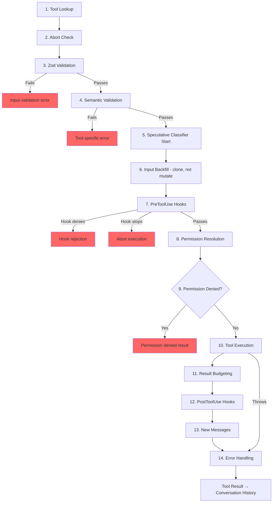

# Глава 6: Tools – от определения до исполнения

## Нервная система

В главе 5 был показан agent loop — `while(true)`, который передает потоковые ответы модели, собирает tool calls и возвращает результаты. Петля — это сердцебиение. Но этот пульс не имеет смысла без нервной системы, которая преобразует фразу «модель хочет запустить `git status`» в реальную команду оболочки с проверкой разрешений, бюджетированием результатов и обработкой ошибок.

Tool System — это нервная система. Он включает в себя более 40 реализаций tools, централизованный реестр со шлюзованием по флагам функций, 14-шаговый конвейер выполнения, преобразователь разрешений с семью режимами и потоковый исполнитель, который запускает tools до того, как модель завершит свой ответ.

Каждый tool call в Claude Code — каждое чтение файла, каждая команда оболочки, каждая команда grep, каждая отправка sub-agent — проходит через один и тот же конвейер. Суть в единообразии: независимо от того, является ли tool встроенным исполнителем Bash или сторонним сервером MCP, он получает одинаковую проверку, одинаковые проверки разрешений, одинаковое бюджетирование результатов, одну и ту же классификацию ошибок.

Интерфейс `Tool` содержит около 45 участников. Это звучит ошеломляюще, но для понимания того, как работает система, важны только пять:

1. **`call()`** — запустить tool
2. **`inputSchema`** — проверка и анализ введенных данных.
3. **`isConcurrencySafe()`** — может ли это работать параллельно?
4. **`checkPermissions()`** -- это разрешено?
5. **`validateInput()`** – имеет ли этот ввод семантический смысл?

Все остальное — 12 методов рендеринга, средства аналитики, prompt поиска — существует для поддержки уровней UI и телеметрии. Начните с пятерки, а остальное встанет на свои места.

---

## Tool interface

### Три параметра типа

Каждый tool параметризуется тремя типами:

```typescript
Tool<Input extends AnyObject, Output, P extends ToolProgressData>
```

`Input` — это объектная схема Zod, выполняющая двойную функцию: она генерирует JSON Schema, отправляемый в API (чтобы модель знала, какие параметры предоставить), и проверяет ответ модели во время выполнения через `safeParse`. `Output` — это тип TypeScript результата tool. `P` — это тип события прогресса, который tool генерирует во время работы: BashTool выдает фрагменты stdout, GrepTool выдает количество совпадений, AgentTool выдает расшифровки sub-agent.

### buildTool() и значения по умолчанию для аварийного закрытия

Никакое определение tool не создает объект `Tool` напрямую. Каждый tool проходит через `buildTool()`, фабрику, которая распространяет объект по умолчанию в соответствии с определением, специфичным для tool:

```typescript
// Pseudocode — illustrates the fail-closed defaults pattern
const SAFE_DEFAULTS = {
  isEnabled:         () => true,
  isParallelSafe:    () => false,   // Fail-closed: new tools run serially
  isReadOnly:        () => false,   // Fail-closed: treated as writes
  isDestructive:     () => false,
  checkPermissions:  (input) => ({ behavior: 'allow', updatedInput: input }),
}

function buildTool(definition) {
  return { ...SAFE_DEFAULTS, ...definition }  // Definition overrides defaults
}
```

По умолчанию они намеренно закрываются при отказе там, где это важно для безопасности. Новый tool, который забывает реализовать `isConcurrencySafe`, по умолчанию использует `false` — он работает последовательно, а не параллельно. Tool, который забывает `isReadOnly`, по умолчанию использует `false` — система рассматривает это как операцию записи. Tool, который забывает `toAutoClassifierInput`, возвращает пустую строку — классификатор безопасности автоматического режима пропускает ее, что означает, что ее обрабатывает система общих разрешений вместо автоматического обхода.

Единственным значением по умолчанию, которое *не* закрыто при отказе, является `checkPermissions`, который возвращает `allow`. Это кажется обратным, пока вы не поймете многоуровневую permission model: `checkPermissions` — это логика, специфичная для tool, которая запускается *после того, как* общая Permission System уже оценила правила, hooks и политики на основе режима. Tool, возвращающий `allow` из `checkPermissions`, говорит: «У меня нет возражений по поводу конкретного tool» — он не предоставляет полный доступ. Группировка в подобъекты (`options`, именованные поля типа `readFileState`) обеспечивает структуру, которую могут обеспечить специализированные интерфейсы, без церемоний объявления, реализации и streaming пяти отдельных типов интерфейсов через более чем 40 сайтов вызовов.

### Параллелизм зависит от ввода

Подпись `isConcurrencySafe(input: z.infer<Input>): boolean` принимает анализируемые входные данные, поскольку один и тот же tool может быть безопасным для одних входных данных и небезопасным для других. BashTool — канонический пример: `ls -la` доступен только для чтения и безопасен для одновременного выполнения, а `rm -rf /tmp/build` — нет. Tool анализирует команду, классифицирует каждую подкоманду по известным безопасным наборам и возвращает `true` только в том случае, если каждая ненейтральная часть является операцией поиска или чтения.

### Тип возвращаемого значения ToolResult

Каждый `call()` возвращает `ToolResult<T>`:

```typescript
type ToolResult<T> = {
  data: T
  newMessages?: (UserMessage | AssistantMessage | AttachmentMessage | SystemMessage)[]
  contextModifier?: (context: ToolUseContext) => ToolUseContext
}
```

`data` — это типизированный вывод, который сериализуется в блок содержимого `tool_result` API. `newMessages` позволяет tool вставлять в разговор дополнительные сообщения — AgentTool использует это для добавления расшифровок sub-agent. `contextModifier` — это функция, которая изменяет `ToolUseContext` для последующих tools — именно так `EnterPlanMode` переключает permission mode. Модификаторы контекста учитываются только для tools, не защищенных от параллелизма; если ваш tool работает параллельно, его модификатор ставится в очередь до тех пор, пока batch не завершится.

---

## ToolUseContext: Объект Бога

`ToolUseContext` — это массивный контекстный batch, проходящий через каждый tool call. Он имеет около 40 полей. По любому разумному определению это объект бога. Оно существует, потому что альтернатива хуже.

Для такого tool, как BashTool, необходим контроллер прерывания, кэш State файла, AppState, история сообщений, набор tools, соединения MCP и полдюжины callbacks UI. Обработка их как отдельных параметров приведет к созданию сигнатур функций с более чем 15 аргументами. Прагматическое решение — это единый контекстный объект, сгруппированный по интересам:

**Конфигурация** (подобъект `options`): набор tools, название модели, соединения MCP, флаги отладки. Устанавливается один раз в начале запроса, в основном неизменяемый.

**State выполнения**: `abortController` для отмены, `readFileState` для кэша файлов LRU, `messages` для полной истории разговоров. Они меняются во время выполнения.

**Обратные вызовы UI**: `setToolJSX`, `addNotification`, `requestPrompt`. Подключается только в интерактивном (REPL) контексте. SDK и безголовые режимы оставляют их неопределенными.

**Контекст agent**: `agentId`, `renderedSystemPrompt` (замороженное родительское prompt для ответвленных sub-agents – повторный рендеринг может отклониться из-за прогрева флага функции и привести к повреждению кеша).

Особенно показателен вариант sub-agent `ToolUseContext`. Когда `createSubagentContext()` создает контекст для дочернего agent, он сознательно выбирает, какие поля использовать совместно, а какие изолировать: `setAppState` становится неактивным для асинхронных agents, `localDenialTracking` получает новый объект, `contentReplacementState` клонируется из parent agent. Каждый выбор отражает урок, извлеченный из производственной ошибки.

---

## Реестр

### getAllBaseTools(): Единственный источник истины

Функция `getAllBaseTools()` возвращает исчерпывающий список всех tools, которые могут существовать в текущем процессе. Сначала идут всегда присутствующие tools, затем условно включенные tools, ограниченные флагами функций:

```typescript
const SleepTool = feature('PROACTIVE') || feature('KAIROS')
  ? require('./tools/SleepTool/SleepTool.js').SleepTool
  : null
```

Импорт `feature()` из `bun:bundle` разрешается во время сборки. Когда `feature('AGENT_TRIGGERS')` является статически ложным, bundler удаляет весь вызов `require()` — устранение мертвого кода, что позволяет сохранить небольшой размер двоичного файла.

### assembleToolPool(): объединение встроенных и MCP tools

Последний набор tools, дошедший до модели, получен от `assembleToolPool()`:

1. Получите встроенные tools (с фильтрацией запретных правил, скрытием режима REPL и проверками `isEnabled()`).
2. Фильтрация tools MCP по правилам запрета.
3. Отсортируйте каждый раздел в алфавитном порядке по имени.
4. Объединить встроенные модули (префикс) + tools MCP (суффикс)

Подход «сортировка-затем-объединение» не является эстетическим предпочтением. Сервер API размещает точку останова Prompt Cache после последнего встроенного tool. Плоская сортировка по всем tools приведет к чередованию tools MCP во встроенном списке, а добавление или удаление tool MCP приведет к смещению позиций встроенных tools, что приведет к аннулированию кэша.

---

## 14-шаговый конвейер выполнения

Функция `checkPermissionsAndCallTool()` — это то, где намерение становится действием. Каждый tool call проходит через эти 14 шагов.



### Шаги 1–4: Проверка

**Поиск tool** возвращается к `getAllBaseTools()` для совпадений псевдонимов, обрабатывая расшифровки старых сеансов, в которых tool был переименован. **Проверка прерывания** предотвращает ненужные вычисления при вызовах tools, поставленных в очередь до распространения Ctrl+C. **Проверка Zod** выявляет несоответствия типов; для отложенных tools к ошибке добавляется prompt о необходимости сначала вызвать ToolSearch. **Семантическая проверка** выходит за рамки соответствия схемы: FileEditTool отклоняет неактивные изменения, BashTool блокирует автономный `sleep`, когда доступен MonitorTool.

### Шаги 5–6: Подготовка

**Спекулятивный запуск классификатора** параллельно запускает классификатор безопасности в автоматическом режиме для команд Bash, сокращая сотни миллисекунд общего пути. **Заполнение входных данных** клонирует проанализированные входные данные и добавляет производные поля (расширяя `~/foo.txt` до абсолютных путей) для hooks и разрешений, сохраняя оригинал для стабильности расшифровки.

### Шаги 7–9: Разрешение

**PreToolUse Hooks** — это механизм расширения. Они могут принимать решения о разрешении, изменять входные данные, внедрять контекст или полностью останавливать выполнение. **Разрешение разрешений** объединяет hooks и общую систему разрешений: если hook уже принял решение, это окончательное решение; в противном случае `canUseTool()` запускает сопоставление правил, проверки конкретного tool, настройки по умолчанию на основе режима и интерактивные prompt. **Обработка отказа в разрешении** создает сообщение об ошибке и выполняет hooks `PermissionDenied`.

### Шаги 10–14: Выполнение и очистка

**Выполнение tool** запускает фактический `call()` с исходным вводом. **Бюджетирование результатов** сохраняет увеличенный размер вывода в `~/.claude/tool-results/{hash}.txt` и заменяет его предварительным просмотром. **Hooks PostToolUse** могут изменять вывод MCP или блокировать продолжение. **Прикрепляются новые сообщения** (расшифровки sub-agents, системные напоминания). **Обработка ошибок** классифицирует ошибки телеметрии, извлекает безопасные строки из потенциально искаженных имен и генерирует события OTel.

---

## Permission System

### Семь режимов

| Режим | Поведение |
|------|----------|
| `default` | Проверки конкретного tool; запрашивать у пользователя нераспознанные операции |
| `acceptEdits` | Автоматическое разрешение редактирования файлов; prompt для других операций |
| `plan` | Только чтение — запретить все операции записи |
| `dontAsk` | Автоматически отклонять все, что обычно вызывает запрос (фоновые agents) |
| `bypassPermissions` | Разрешить все без запроса |
| `auto` | Используйте классификатор стенограмм для принятия решения (отмечено функцией) |
| `bubble` | Внутренний режим для sub-agents, которые переходят к родительскому |

### Цепочка разрешения

Когда tool call достигает разрешения разрешения:

1. **Решение о hook**: если hook PreToolUse уже вернул `allow` или `deny`, это окончательное решение.
2. **Сопоставление правил**: три набора правил — `alwaysAllowRules`, `alwaysDenyRules`, `alwaysAskRules` — совпадают по названию tool и дополнительным шаблонам контента. `Bash(git *)` соответствует любой команде Bash, начинающейся с `git`.
3. **Проверка конкретного tool**: метод tool `checkPermissions()`. Большая часть возврата `passthrough`.
4. **По умолчанию в зависимости от режима**: `bypassPermissions` разрешает все. `plan` запрещает запись. `dontAsk` отклоняет запросы.
5. **Интерактивная prompt**. В режимах `default` и `acceptEdits` нерешенные решения отображаются prompts.
6. **Классификатор в автоматическом режиме**: двухэтапный классификатор (быстрая модель, затем расширенное мышление для неоднозначных случаев).

Вариант `safetyCheck` имеет логическое значение `classifierApprovable`: изменения `.claude/` и `.git/` — это `classifierApprovable: true` (необычно, но иногда законно), а попытки обхода пути Windows — `classifierApprovable: false` (почти всегда состязательные).

### Правила разрешений и сопоставление

Правила разрешений хранятся как объекты `PermissionRule`, состоящие из трех частей: объект `source`, отслеживающий происхождение (userSettings, projectSettings, localSettings, cliArg, policySettings, сеанс и т. д.), `ruleBehavior` (разрешить, запретить, спросить) и `ruleValue` с именем tool и необязательным шаблоном содержимого.

Поле `ruleContent` обеспечивает детальное сопоставление. `Bash(git *)` позволяет использовать любую команду Bash, начинающуюся с `git`. `Edit(/src/**)` позволяет редактировать только внутри `/src`. `Fetch(domain:example.com)` позволяет получать данные из определенного домена. Правила без `ruleContent` соответствуют всем вызовам этого tool.

Сопоставитель разрешений BashTool анализирует команду с помощью `parseForSecurity()` (парсер bash AST) и разбивает составные команды на подкоманды. Если синтаксический анализ AST завершается неудачно (сложный синтаксис с heredocs или вложенными подоболочками), средство сопоставления возвращает `() => true` — отказоустойчивый вариант, то есть hook выполняется всегда. Предполагается, что если команда слишком сложна для анализа, она слишком сложна, чтобы ее можно было уверенно исключить из проверок безопасности.

### Bubble Mode для sub-agents

Sub-agents в шаблонах координатор-работник не могут отображать запросы разрешений — у них нет терминала. Режим `bubble` приводит к тому, что запросы разрешений распространяются до родительского контекста. Agent-координатор, работающий в основном потоке с терминальным доступом, обрабатывает prompt и отправляет решение обратно.

---

## Отложенная загрузка tool

Tools с `shouldDefer: true` отправляются на API с `defer_loading: true` — имена и описания, но не полные схемы параметров. Это уменьшает первоначальный размер prompt. Чтобы использовать отложенный tool, модель должна сначала вызвать `ToolSearchTool`, чтобы загрузить свою схему. Режим сбоя поучителен: вызов отложенного tool без его загрузки приводит к сбою проверки Zod (все типизированные параметры поступают в виде строк), и система добавляет целевую prompt по восстановлению.

Отложенная загрузка также повышает частоту попаданий в кеш: tools, отправленные с `defer_loading: true`, добавляют в prompt только свое имя, поэтому добавление или удаление отложенного tool MCP изменяет prompt на несколько токенов, а не на сотни.

---

## Бюджетирование результатов

### Ограничения на размер каждого tool

Каждый tool декларирует `maxResultSizeChars`:

| Tool | maxResultSizeChars | Обоснование |
|------|-------------------|-----------|
| BashTool | 30 000 | Достаточно для наиболее полезного вывода |
| FileEditTool | 100 000 | Различия могут быть большими, но они нужны модели |
| GrepTool | 100 000 | Результаты поиска с контекстными строками быстро суммируются |
| FileReadTool | Бесконечность | Самостоятельно ограничивается собственными лимитами токенов; сохранение создаст циклические циклы чтения |

Когда результат превышает пороговое значение, все содержимое сохраняется на диск и заменяется оболочкой `<persisted-output>`, содержащей предварительный просмотр и путь к файлу. Затем модель может использовать `Read` для доступа к полному выводу, если это необходимо.

### Совокупный бюджет на разговор

Помимо ограничений для каждого tool, `ContentReplacementState` отслеживает совокупный бюджет на протяжении всего разговора, предотвращая смерть тысячами сокращений - многие tools, каждый из которых возвращает 90% своего индивидуального лимита, все равно могут перегрузить контекстное окно.

---

## Особенности отдельных tools

### BashTool: Самый сложный tool

BashTool — безусловно, самый сложный tool системы. Он анализирует составные команды, классифицирует подкоманды как доступные только для чтения или записи, управляет фоновыми Task, обнаруживает вывод изображения по магическим байтам и реализует симуляцию sed для безопасного предварительного просмотра редактирования.

Анализ составных команд особенно интересен. `splitCommandWithOperators()` разбивает команду типа `cd /tmp && mkdir build && ls build` на отдельные подкоманды. Каждый из них классифицируется по наборам известных безопасных команд (`BASH_SEARCH_COMMANDS`, `BASH_READ_COMMANDS`, `BASH_LIST_COMMANDS`). Составная команда доступна только для чтения, только если ВСЕ ненейтральные части безопасны. Нейтральный набор (echo, printf) игнорируется — они не делают команду доступной только для чтения, но и не делают ее доступной только для записи.

Особого внимания заслуживает симуляция sed (`_simulatedSedEdit`). Когда пользователь утверждает команду sed в диалоговом окне разрешений, система предварительно вычисляет результат, запуская команду sed в песочнице и записывая выходные данные. Предварительно вычисленный результат вводится на вход как `_simulatedSedEdit`. При выполнении `call()` редактирование применяется напрямую, минуя выполнение оболочки. Это гарантирует, что то, что просматривал пользователь, будет именно тем, что и будет записано, а не повторным выполнением, которое может привести к другим результатам, если файл изменился между предварительным просмотром и выполнением.

### FileEditTool: Обнаружение устаревания

FileEditTool интегрируется с `readFileState`, кэшем LRU содержимого файлов и временных меток, сохраняемых на протяжении всего разговора. Прежде чем применить редактирование, он проверяет, был ли файл изменен с момента его последнего чтения моделью. Если файл устарел (изменен фоновым процессом, другим tool или пользователем), редактирование отклоняется с сообщением, предлагающим модели сначала перечитать файл.

Нечеткое сопоставление в `findActualString()` обрабатывает распространенный случай, когда в модели немного неправильно отображаются пробелы. Он нормализует стили пробелов и кавычек перед сопоставлением, поэтому редактирование, нацеленное на `old_string` с конечными пробелами, по-прежнему соответствует фактическому содержимому файла. Флаг `replace_all` разрешает массовую замену; без него неуникальные совпадения отклоняются, что требует от модели предоставления достаточного контекста для идентификации одного местоположения.

### FileReadTool: универсальное устройство чтения

FileReadTool — единственный встроенный tool с `maxResultSizeChars: Infinity`. Если бы выходные данные чтения были сохранены на диске, модели пришлось бы прочитать сохраненный файл, что само по себе могло бы превысить предел, создавая бесконечный цикл. Вместо этого tool самостоятельно ограничивается посредством оценки токена и усекается в источнике.

Tool удивительно универсален: он читает текстовые файлы с номерами строк, изображения (возвращает блоки мультимодального контента в формате Base64), PDF-файлы (через `extractPDFPages()`), блокноты Jupyter (через `readNotebook()`) и каталоги (возврат к `ls`). Он блокирует опасные пути к устройствам (`/dev/zero`, `/dev/random`, `/dev/stdin`) и обрабатывает особенности имен файлов скриншотов macOS (U+202F узкий неразрывный пробел вместо обычного пробела в именах файлов «Снимок экрана»).

### GrepTool: Пагинация через head_limit

GrepTool оборачивает `ripGrep()` и добавляет механизм нумерации страниц через `head_limit`. По умолчанию — 250 записей — достаточно для получения полезных результатов, но достаточно мало, чтобы избежать раздувания контекста. Когда происходит усечение, ответ включает `appliedLimit: 250`, сигнализируя модели о необходимости использовать `offset` при следующем вызове разбивки на страницы. Явный `head_limit: 0` полностью отключает ограничение.

GrepTool автоматически исключает шесть каталогов VCS (`.git`, `.svn`, `.hg`, `.bzr`, `.jj`, `.sl`). Поиск внутри `.git/objects` почти никогда не является тем, чего хочет модель, и случайное включение файлов двоичного batchа может привести к потере бюджета токенов.

### AgentTool и модификаторы контекста

AgentTool порождает sub-agents, которые запускают свои собственные циклы запросов. Его `call()` возвращает `newMessages`, содержащий транскрипт sub-agent, и, необязательно, `contextModifier`, который передает изменения State обратно parent agent. Поскольку AgentTool по умолчанию не является безопасным для параллелизма, несколько tool calls agent в одном ответе выполняются последовательно — модификатор контекста каждого sub-agent применяется перед запуском следующего sub-agent. В Coordinator Mode схема меняется: координатор отправляет sub-agents для независимых Task, а проверка `isAgentSwarmsEnabled()` разблокирует параллельное выполнение agent.

---

## Как tools взаимодействуют с историей сообщений

Tool results не просто возвращают данные в модель. Они участвуют в разговоре как структурированные сообщения.

API ожидает tool results в виде объектов `ToolResultBlockParam`, которые ссылаются на исходный блок `tool_use` по идентификатору. Большинство tools сериализуются в текст. FileReadTool может сериализоваться в блоки содержимого изображения (в кодировке Base64) для мультимодальных ответов. BashTool обнаруживает вывод изображения, проверяя магические байты в stdout, и соответствующим образом переключается на блоки изображения.

`ToolResult.newMessages` — это то, как tools расширяют общение, выходя за рамки простого шаблона звонков и ответов. **Стенограммы agent**: AgentTool вставляет историю сообщений sub-agent в виде вложенных сообщений. **Системные напоминания**. Tools memory вводят системные сообщения, которые появляются после результатов работы tool. Они видны модели на следующем повороте, но удаляются на границе `normalizeMessagesForAPI`. **Сообщения о вложениях**. Результаты hook, дополнительный контекст и сведения об ошибках содержат структурированные метаданные, на которые модель может ссылаться в последующих поворотах.

Функция `contextModifier` — это механизм для tools, изменяющих среду выполнения. При выполнении `EnterPlanMode` он возвращает модификатор, который устанавливает permission mode `'plan'`. Когда `ExitWorktree` выполняется, он изменяет рабочий каталог. Эти модификаторы — единственный способ воздействия tool на последующие tools — прямая мутация `ToolUseContext` невозможна, поскольку контекст копируется в расширенном виде перед каждым вызовом tool. Ограничение только на последовательный порт применяется на уровне оркестровки: если два одновременно работающих tool изменяют рабочий каталог, какой из них выигрывает?

---

## Примените это: проектирование Tool System

**Значения по умолчанию, закрывающиеся при сбое.** Новые tools должны быть консервативными, пока явно не указано иное. Разработчик, который забывает установить флаг, получает безопасное, а не опасное поведение.

**Безопасность, зависящая от входных данных.** `isConcurrencySafe(input)` и `isReadOnly(input)` принимают анализируемые входные данные, поскольку один и тот же tool на разных входах имеет разные профили безопасности. Реестр tools, в котором BashTool помечается как «всегда серийный», является правильным, но расточительным.

**Уровень разрешений.** Проверки для конкретных tools, сопоставление на основе правил, настройки по умолчанию на основе режима, интерактивные prompt и автоматические классификаторы обрабатывают разные случаи. Ни один механизм не является достаточным.

**Результаты бюджета, а не только входные данные.** Ограничения на вводимые токены являются стандартными. Но результаты работы tool могут быть сколь угодно большими и накапливаться при каждом повороте. Ограничения для каждого tool предотвращают отдельные взрывы. Совокупные ограничения на количество разговоров предотвращают накопительное переполнение.

**Сделайте классификацию ошибок безопасной для телеметрии.** В мини-сборках `error.constructor.name` искажен. Функция `classifyToolError()` извлекает наиболее информативную безопасную строку из доступных — телеметрические сообщения, коды ошибок, стабильные имена ошибок — без необходимости регистрации необработанного сообщения об ошибке в аналитике.

---

## Что будет дальше

В этой главе показано, как один tool call проходит путь от определения до проверки, разрешения, выполнения и составления бюджета результатов. Но модель редко запрашивает только один tool одновременно. То, как tools объединяются в параллельные batches, является предметом главы 7.
