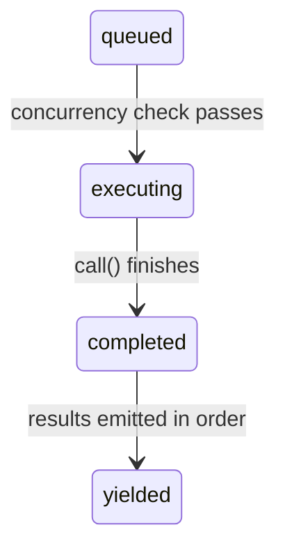

# Глава 7: Параллельное выполнение tools

## Цена ожидания

В главе 6 прослеживается жизненный цикл одного tool call — от необработанного блока `tool_use` в ответе API до проверки входных данных, проверок разрешений, выполнения и форматирования результатов. Этот конвейер обрабатывает один tool. Но модель редко просит только одну.

Типичное взаимодействие Claude Code включает от трех до пяти вызовов tool за ход. «Прочитайте эти два файла, найдите этот шаблон, затем отредактируйте эту функцию». Модель выдает все это в одном ответе. Если каждый tool занимает 200 миллисекунд, их последовательный запуск будет стоить целую секунду. Если вызовы Read и Grep независимы (а они независимы), их параллельный запуск сокращает это время до 200 миллисекунд. Улучшение пять к одному, бесплатно.

Но не все tools независимы. Редактирование, изменяющее `config.ts`, не может выполняться одновременно с другим редактированием, изменяющим `config.ts`. Команда Bash, создающая каталог, должна завершиться до того, как команда Bash записывает файл в этот каталог. Параллелизм не является глобальным свойством tool. Это свойство конкретного tool call с конкретными входными данными.

Именно эта идея лежит в основе всей системы параллелизма: **безопасность зависит от каждого вызова, а не от каждого типа tool**. `Bash("ls -la")` безопасно распараллеливать. `Bash("rm -rf build/")` нет. Один и тот же tool, разные входные данные, разная классификация параллелизма. Прежде чем принять решение, система должна проверить входные данные.

Claude Code реализует два уровня оптимизации параллелизма. Первый — это **batchная оркестровка**: после того, как ответ модели полностью получен, разделите вызовы tool на параллельные и последовательные группы, а затем соответствующим образом выполните каждую группу. Второй — **спекулятивное выполнение**: запустите tools *пока модель все еще передает свой ответ*, собирая результаты еще до того, как ответ будет завершен. Вместе эти два механизма устраняют большую часть времени настенных часов, которое в противном случае было бы потрачено на ожидание.

---

## Алгоритм разделения

Точка входа — `partitionToolCalls()` в `toolOrchestration.ts`. Он принимает упорядоченный массив сообщений `ToolUseBlock` и создает массив bundleов, где каждый batch либо «все параллельные», либо «один последовательный tool».

```typescript
// Pseudocode — illustrates the partition algorithm
type Group = { parallel: boolean; calls: ToolCall[] }

function groupBySafety(calls: ToolCall[], registry: ToolRegistry): Group[] {
  return calls.reduce((groups, call) => {
    const def = registry.lookup(call.name)
    const input = def?.schema.safeParse(call.input)
    // Fail-closed: parse failure or exception → serial
    const safe = input?.success
      ? tryCatch(() => def.isParallelSafe(input.data), false)
      : false
    // Merge consecutive safe calls into one group
    if (safe && groups.at(-1)?.parallel) {
      groups.at(-1)!.calls.push(call)
    } else {
      groups.push({ parallel: safe, calls: [call] })
    }
    return groups
  }, [] as Group[])
}
```

Алгоритм просматривает массив слева направо. Для каждого tool call:

1. **Найдите определение tool** по названию.
2. **Проанализируйте входные данные** с помощью схемы Zod tool через `safeParse()`. Если синтаксический анализ завершается неудачей, tool консервативно классифицируется как небезопасный для параллелизма.
3. **Вызовите `isConcurrencySafe(parsedInput)`** для определения tool. Здесь происходит классификация по входу. Tool Bash анализирует командную строку, проверяет, доступна ли каждая подкоманда только для чтения (`ls`, `grep`, `cat`, `git status`), и возвращает `true`, только если вся составная команда является чистым чтением. Tool «Чтение» всегда возвращает `true`. Tool редактирования всегда возвращает `false`. Вызов заключен в try-catch - если `isConcurrencySafe` выдает ошибку (скажем, командная строка Bash не может быть проанализирована библиотекой кавычек оболочки), tool по умолчанию использует последовательный порт.
4. **Объедините или создайте batch.** Если текущий tool безопасен для параллелизма И самый последний batch также безопасен для параллелизма, добавьте его к этому batchу. В противном случае запустите новую партию.

Результатом является последовательность партий, в которой чередуются одновременные группы и отдельные серийные записи. Рассмотрим конкретный пример:

```
Model requests: [Read, Read, Grep, Edit, Read]

Step 1: Read  → concurrent-safe → new batch {safe, [Read]}
Step 2: Read  → concurrent-safe → append   {safe, [Read, Read]}
Step 3: Grep  → concurrent-safe → append   {safe, [Read, Read, Grep]}
Step 4: Edit  → NOT safe        → new batch {serial, [Edit]}
Step 5: Read  → concurrent-safe → new batch {safe, [Read]}

Result: 3 batches
  Batch 1: [Read, Read, Grep]  — run concurrently
  Batch 2: [Edit]              — run alone
  Batch 3: [Read]              — run concurrently (just one tool)
```

Разделение является жадным и сохраняет порядок. Последовательные безопасные tools накапливаются в одну партию. Любой небезопасный tool прерывает цикл и запускает новую партию. Это означает, что порядок, в котором модель генерирует tool calls, имеет значение — если она чередует запись между двумя операциями чтения, вы получаете три batchа вместо двух. На практике модели имеют тенденцию группировать свои чтения вместе, что является распространенным случаем, для которого оптимизирован алгоритм.

---

## Пакетное выполнение

Генератор `runTools()` перебирает разделенные batches и отправляет каждый из них соответствующему исполнителю.

### Параллельные batches

Для параллельного batchа `runToolsConcurrently()` запускает все tools параллельно с помощью утилиты `all()`, которая ограничивает активные генераторы пределом параллелизма:

```typescript
// Pseudocode — illustrates the concurrent dispatch pattern
async function* dispatchParallel(calls, context) {
  yield* boundedAll(
    calls.map(async function* (call) {
      context.markInProgress(call.id)
      yield* executeSingle(call, context)
      context.markComplete(call.id)
    }),
    MAX_CONCURRENCY,  // Default: 10
  )
}
```

По умолчанию предел параллелизма равен 10, его можно настроить с помощью `CLAUDE_CODE_MAX_TOOL_USE_CONCURRENCY`. Десять — это щедро: вы редко встретите более пяти или шести tool calls в одном ответе модели. Предел существует как предохранительный клапан для патологических случаев, а не как типичное ограничение.

Утилита `all()` — это вариант `Promise.all` с поддержкой генератора и ограниченным параллелизмом. Он запускает до N генераторов одновременно, выдает результаты в зависимости от того, какой из них завершится первым, и запускает следующий генератор в очереди по завершении каждого из них. Механика аналогична пулу Task, защищенному семафорами, но адаптирована для асинхронных генераторов, дающих промежуточные результаты.

**Очередь модификаторов контекста** — это тонкая часть. Некоторые tools создают *модификаторы контекста* — функции, которые преобразуют `ToolUseContext` для последующих tools. Когда tools работают одновременно, вы не можете применить эти модификаторы немедленно, поскольку другие tools в том же batchе читают тот же контекст. Вместо этого модификаторы собираются на карте с указанием идентификатора использования tool:

```typescript
const queuedContextModifiers: Record<
  string,
  ((context: ToolUseContext) => ToolUseContext)[]
> = {}
```

После завершения всей параллельной партии модификаторы применяются в порядке tools (а не в порядке завершения), сохраняя детерминированную эволюцию контекста:

```typescript
for (const block of blocks) {
  const modifiers = queuedContextModifiers[block.id]
  if (!modifiers) continue
  for (const modifier of modifiers) {
    currentContext = modifier(currentContext)
  }
}
```

На практике ни один из нынешних tools, обеспечивающих безопасность параллелизма, не создает модификаторы контекста — комментарий в кодовой базе явно подтверждает это. Но инфраструктура существует, потому что tools могут быть добавлены серверами MCP, а специальный tool MCP, доступный только для чтения, может законно захотеть изменить контекст (например, обновить набор «просмотренных файлов»).

### Серийные партии

Серийное исполнение простое. Каждый tool запускается, его модификаторы контекста применяются немедленно, и следующий tool видит обновленный контекст:

```typescript
for (const toolUse of toolUseMessages) {
  for await (const update of runToolUse(toolUse, /* ... */)) {
    if (update.contextModifier) {
      currentContext = update.contextModifier.modifyContext(currentContext)
    }
    yield { message: update.message, newContext: currentContext }
  }
}
```

Это критическая разница. Последовательные tools могут изменить мир для последующих tools. Edit изменяет файл; следующее чтение увидит измененную версию. Команда Bash создает каталог; в него записывается следующая команда Bash. Модификаторы контекста являются формализацией этой зависимости: они позволяют tool сказать: «Среда выполнения изменилась, вот как».

---

## Исполнитель tool streaming

Пакетная оркестровка исключает ненужную сериализацию *после* получения ответа модели. Но есть и большая возможность: для трансляции реакции модели требуется время. Типичный ответ multi-tool может занять 2–3 секунды. Первый tool call можно анализировать через 500 миллисекунд. Зачем ждать оставшиеся 2 секунды?

Класс `StreamingToolExecutor` реализует спекулятивное выполнение. Когда модель передает свой ответ, каждый блок `tool_use` передается исполнителю в момент его полного анализа. Исполнитель начинает его выполнять немедленно, пока модель еще генерирует следующий tool call. К моменту завершения streaming ответа несколько tools могут уже завершить свою работу.

```mermaid
gantt
    title Sequential vs Streaming Tool Execution
    dateFormat X
    axisFormat %Ls

    section Sequential
    Model streams response     :a1, 0, 2500
    Tool 1 (0.2s)              :a2, after a1, 200
    Tool 2 (0.3s)              :a3, after a2, 300
    Tool 3 (0.1s)              :a4, after a3, 100

    section Streaming Executor
    Model streams response     :b1, 0, 2500
    Tool 1 starts at 0.5s      :b2, 500, 700
    Tool 2 starts at 1.2s      :b3, 1200, 1500
    Tool 3 drain after stream  :b4, 2500, 2600
```



Последовательный итог: 3,1 с. Общее время streaming: 2,6 с — tools 1 и 2 выполняются во время streaming, что позволяет сэкономить 16 % времени настенных часов.

Сберегательный комплекс. Когда модель запрашивает пять tools, доступных только для чтения, а для streaming ответа требуется 3 секунды, все пять tools могут запуститься и завершиться в течение этих 3 секунд. На этапе слива после потока делать нечего. Пользователь видит результаты практически сразу после появления последнего символа ответа модели.

### Жизненный цикл tool

Каждый tool, отслеживаемый исполнителем, проходит через четыре State:



- **в очереди**: блок `tool_use` проанализирован и зарегистрирован. Ожидание условий параллелизма, позволяющих выполнение.
- **выполнение**: функция tool `call()` запущена. Результаты накапливаются в буфере.
- **completed**: выполнение завершено. Результаты готовы к обсуждению.
- **yielded**: результаты отправлены. Терминальное State.

### addTool(): Очередь во время трансляции

```typescript
addTool(block: ToolUseBlock, assistantMessage: AssistantMessage): void
```

Вызывается анализатором потокового ответа каждый раз, когда поступает полный блок `tool_use`. Метод:

1. Ищет определение tool. Если он не найден, немедленно создается запись `completed` с сообщением об ошибке — нет смысла ставить в очередь несуществующий tool.
2. Анализирует входные данные и определяет `isConcurrencySafe`, используя ту же логику, что и `partitionToolCalls()`.
3. Отправляет `TrackedTool` со статусом `'queued'`.
4. Вызывает `processQueue()`, который может немедленно запустить tool.

Вызов `processQueue()` выполняется по принципу «выстрелил и забыл» (`void this.processQueue()`). Исполнитель этого не ждет. Это сделано намеренно: `addTool()` вызывается из обработчика событий потокового анализатора, и его блокировка приведет к остановке анализа ответа. Tool начинает работать в фоновом режиме, в то время как анализатор продолжает использовать поток.

### processQueue(): Проверка поступления

Проверка допуска представляет собой один предикат:

```typescript
// Pseudocode — illustrates the mutual exclusion rule
canRun = noToolsRunning || (newToolIsSafe && allRunningAreSafe)
```

Tool может начать работу тогда и только тогда, когда:
- **Ни один tool в данный момент не выполняется** (очередь пуста), ИЛИ
- **Как новый tool, так и все выполняемые в данный момент tools безопасны для одновременного выполнения.**

Это договор о взаимном исключении. Непараллельный tool требует монопольного доступа — больше ничего работать не может. Параллельные tools могут использовать совместно с другими параллельными tools, но один непараллельный tool в исполняющем наборе блокирует всех.

Метод `processQueue()` перебирает все tools по порядку. Для каждого tool в очереди проверяется `canExecuteTool()`. Если tool может работать, он запускается. Если непараллельный tool еще не может быть запущен, цикл *обрывается* — он полностью прекращает проверку последующих tools, поскольку непараллельные tools должны поддерживать порядок. Если параллельный tool не может запуститься (блокируется выполняющимся непараллельным tool), цикл *продолжается* - но на практике это редко помогает, потому что параллельные tools после непараллельного блокировщика обычно в любом случае зависят от его результатов.

### executeTool(): Основной цикл выполнения

Именно в этом методе и заключается настоящая сложность. Он управляет контроллерами прерываний, каскадами ошибок, отчетами о ходе выполнения и модификаторами контекста.

**Дочерние контроллеры прерывания.** Каждый tool получает свой собственный `AbortController`, который является дочерним по отношению к общему контроллеру родственного уровня.

Иерархия состоит из трех уровней: контроллер уровня запроса (принадлежит REPL, срабатывает при нажатии пользователем Ctrl+C) является родительским контроллером-родителем (принадлежит исполнителю streaming, активируется при ошибках Bash), который является родительским для отдельного контроллера каждого tool. Прерывание родственного контроллера уничтожает все работающие tools. Прерывание отдельного контроллера tool приводит к уничтожению только этого tool, но оно также передается контроллеру запросов, если причиной прерывания не является одноуровневая ошибка. Это всплеск не позволяет системе молча отбросить исполнителя, когда, например, отказ в разрешении должен завершить весь ход.

Этот пузырь необходим для отказа в разрешении. Когда пользователь отклоняет tool в диалоговом окне разрешений, срабатывает контроллер отмены tool. Этот сигнал должен достичь Query Loop, чтобы завершить ход. Без него Query Loop будет продолжаться, как будто ничего не произошло, отправляя модели устаревшее сообщение об отклонении.

**Каскад одноуровневых ошибок.** Когда tool выдает результат ошибки, исполнитель проверяет, следует ли отменить одноуровневые tools. Правило: **каскадируются только ошибки Bash.** При ошибке команды оболочки исполнитель записывает сбой, записывает описание tool, в котором возникла ошибка, и прерывает работу родственного контроллера, что отменяет все остальные запущенные tools в bundleе.

Обоснование прагматично. Команды Bash часто образуют неявные цепочки зависимостей: `mkdir build && cp src/* build/ && tar -czf dist.tar.gz build/`. В случае сбоя `mkdir` запуск `cp` и `tar` бессмысленен. Отмена братьев и сестер немедленно экономит время и позволяет избежать запутанных сообщений об ошибках.

Ошибки чтения и Grep, напротив, независимы. Если чтение одного файла завершается неудачей из-за того, что файл был удален, это не имеет никакого отношения к параллельному поиску grep в другом каталоге. Отмена grep приведет к потере работы без причины.

Каскад ошибок выдает синтетические сообщения об ошибках для родственных tools:

```
Cancelled: parallel tool call Bash(mkdir build) errored
```

Описание включает первые 40 символов команды или пути к файлу ошибочного tool, что дает модели достаточный контекст, чтобы понять, что пошло не так.

**Сообщения о ходе выполнения** обрабатываются отдельно от результатов. Хотя результаты буферизуются и выдаются по порядку, сообщения о ходе выполнения (обновления статуса, такие как «Чтение файла...» или «Поиск...») передаются в массив `pendingProgress` и немедленно передаются через `getCompletedResults()`. Обратный вызов разрешения пробуждает цикл `getRemainingResults()` при поступлении нового прогресса, предотвращая зависание UI во время длительной работы tools.

**Повторная обработка очереди.** После завершения работы каждого tool `processQueue()` вызывается снова:

```typescript
void promise.finally(() => {
  void this.processQueue()
})
```

Именно так запускаются серийные tools, которые были заблокированы параллельным batchом. Когда последний параллельный tool завершает работу, проверка `canExecuteTool()` последующего непараллельного tool проходит, и он начинает выполнение.

### Сбор результатов

Исполнитель streaming предоставляет два метода сбора данных, предназначенных для двух разных этапов жизненного цикла ответа.

**`getCompletedResults()` — сбор данных в середине потока.** Это синхронный генератор, вызываемый между частями потокового ответа API. Он обходит массив tools по порядку и выдает результаты для всех завершенных tools:

`getCompletedResults()` — синхронный генератор, который обрабатывает массив tools в порядке отправки. Для каждого tool сначала удаляются все ожидающие сообщения о ходе выполнения. Если tool завершен, он выдает результаты и помечает их как завершенные. Критическое правило: если непараллельный tool все еще выполняется, обход **прерывается** — ничего после него не может быть выдано, даже если последующие tools уже завершились. Результаты после использования последовательного tool могут зависеть от изменений его контекста, поэтому им придется подождать. Для параллельных tools это ограничение не применяется; цикл пропускает выполнение параллельных tools и продолжает проверку последующих записей.

Этот разрыв является механизмом сохранения порядка. Если непараллельный tool все еще выполняется, после него ничего не может быть получено, даже если последующие tools уже завершились. Результаты после использования последовательного tool могут зависеть от изменений его контекста, поэтому им придется подождать. Для параллельных tools это ограничение не применяется; цикл пропускает выполнение параллельных tools и продолжает проверку последующих записей.

**`getRemainingResults()` — слив после потока.** Вызывается после полного получения ответа модели. Этот асинхронный генератор работает до тех пор, пока не будет получен каждый tool:

`getRemainingResults()` — слив после потока. Он повторяется до тех пор, пока не будет получен каждый tool. На каждой итерации он обрабатывает очередь (запуская все недавно разблокированные tools), выдает все завершенные результаты через `getCompletedResults()`, а затем — если tools все еще выполняются, но ничего нового не было завершено — использует `Promise.race` для ожидания простоя в зависимости от того, что завершится раньше: Promise любого исполняемого tool или сигнал о доступности прогресса. Это позволяет избежать опроса занятости и при этом просыпаться в тот момент, когда что-то происходит. Когда ни один tool не завершил работу и ничего нового запустить невозможно, исполнитель ожидает завершения работы любого исполняемого tool (или достижения прогресса). Это позволяет избежать опроса занятости и при этом просыпаться в тот момент, когда что-то происходит.

### Сохранение заказа

Результаты отображаются в том порядке, в котором tools были *получены*, а не в том порядке, в котором они *завершены*. Это осознанный дизайнерский выбор.

Рассмотрим ответ модели, который запрашивает `[Read("a.ts"), Read("b.ts"), Read("c.ts")]`. Все три стартуют одновременно. Первым финиширует `c.ts` (он меньшего размера), затем `a.ts`, затем `b.ts`. Если бы результаты были получены в порядке завершения, диалог показал бы:

```
Tool result: c.ts contents
Tool result: a.ts contents
Tool result: b.ts contents
```

Но модель выдавала их в порядке a-b-c. История разговоров должна соответствовать ожиданиям модели, иначе следующий ход будет запутаться в том, какой результат соответствует какому запросу. Если уступить в порядке прибытия, разговор останется связным:

```
Tool result: a.ts contents  (completed second, yielded first)
Tool result: b.ts contents  (completed third, yielded second)
Tool result: c.ts contents  (completed first, yielded third)
```

Затраты невелики: если tool 1 медленный, а tools 2–5 быстрые, быстрые результаты сохраняются в буферах до тех пор, пока tool 1 не завершит работу. Но альтернатива – бессвязность разговора – гораздо хуже.

### discard(): Резервный аварийный люк streaming

Если поток ответов API терпит неудачу на полпути (ошибка сети, отключение сервера), система повторяет попытку с новым вызовом API. Но исполнитель streaming, возможно, уже запустил tools после неудачной попытки. Эти результаты теперь остались без внимания — они соответствуют ответу, который так и не был получен полностью.

```typescript
discard(): void {
  this.discarded = true
}
```

Установка `discarded = true` приводит к:
- `getCompletedResults()` немедленно возвращается без результатов.
- `getRemainingResults()` немедленно возвращается без результатов.
— Любой tool, который начинает выполнять проверки `getAbortReason()`, видит `streaming_fallback` и вместо фактического запуска получает синтетическую ошибку.

Отброшенный исполнитель заброшен. Для повторной попытки создается новый исполнитель.

---

## Свойства параллелизма tool

Каждый встроенный tool объявляет свои характеристики параллелизма с помощью метода `isConcurrencySafe()`. Классификация не является произвольной — она отражает фактическое влияние tool на общее State.

| Tool | Безопасный параллельный доступ | State | Обоснование |
|------|-----------------|-----------|-----------|
| **Читать** | Всегда | -- | Чистое чтение. Никаких побочных эффектов. |
| **Грэп** | Всегда | -- | Чистое чтение. Обертывает рипгреп. |
| **Глоб** | Всегда | -- | Чистое чтение. Листинг файлов. |
| **Выбрать** | Всегда | -- | HTTP ПОЛУЧИТЬ. Никаких местных побочных эффектов. |
| **Веб-поиск** | Всегда | -- | API Звонок поисковому провайдеру. |
| **Баш** | Иногда | Только команды только для чтения | `isReadOnly()` анализирует команду и классифицирует подкоманды. `ls`, `git status`, `cat`, `grep` безопасны. `rm`, `mkdir`, `mv` нет. |
| **Изменить** | Никогда | -- | Изменяет файлы. Два одновременных редактирования одного и того же файла повреждают его. |
| **Написать** | Никогда | -- | Создает или перезаписывает файлы. Тот же коррупционный риск. |
| **БлокнотРедактировать** | Никогда | -- | Изменяет файлы `.ipynb`. |

Классификация tools Bash заслуживает уточнения. Он использует `splitCommandWithOperators()` для разложения составных команд (`&&`, `||`, `;`, `|`), а затем классифицирует каждую подкоманду по известным безопасным наборам:

- **Команды поиска**: `grep`, `rg`, `find`, `fd`, `ag`, `ack`.
- **Команды чтения**: `cat`, `head`, `tail`, `wc`, `jq`, `less`, `file`, `stat`.
- **Список команд**: `ls`, `tree`, `du`, `df`.
- **Нейтральные команды**: `echo`, `printf` (без побочных эффектов, но не "чтение")

Составная команда доступна только для чтения, только если каждая ненейтральная подкоманда присутствует в наборе поиска, чтения или списка. `ls -la && cat README.md` безопасен. `ls -la && rm -rf build/` нет — `rm` загрязняет всю команду.

---

## Контракт поведения прерываний

Пока tools выполняются, пользователь может ввести новое сообщение. Что должно произойти? Ответ зависит от tool.

Каждый tool объявляет метод `interruptBehavior()`, который возвращает либо `'cancel'`, либо `'block'`:

- **`'cancel'`**: немедленно остановите tool, отмените частичные результаты и обработайте новое сообщение пользователя. Используется tools, где частичное выполнение безвредно (чтение, поиск).
- **`'block'`**: оставьте tool работать до завершения. Новое сообщение пользователя ожидает. Используется tools, прерывание которых может оставить систему в несогласованном State (записывает промежуточные, долго выполняющиеся команды bash). Это значение по умолчанию.

Исполнитель streaming отслеживает прерываемое State текущего набора tools:

State прерывания обновляется путем проверки всех выполняющихся в данный момент tools: набор прерывается только тогда, когда каждый исполняемый tool поддерживает отмену. Если поведение прерывания хотя бы одного tool равно `'block'`, весь набор считается непрерываемым.

Пользовательский интерфейс отображает индикатор «прерываемости» только в том случае, если ВСЕ исполняющие tools поддерживают отмену. Если хотя бы один tool имеет номер `'block'`, весь набор считается бесперебойным. Это консервативно, но правильно: вы не можете осмысленно прерывать batch, в котором один tool все равно будет продолжать работать.

Когда пользователь прерывает работу и все tools можно отменить, контроллер прерывания срабатывает с причиной `'interrupt'`. Метод исполнителя `getAbortReason()` проверяет поведение прерываний каждого tool индивидуально: tool `'cancel'` получает синтетическую ошибку `user_interrupted`, а tool `'block'` (который не будет присутствовать в полностью прерываемом наборе, но код обрабатывает крайний случай) продолжает работу.

---

## Модификаторы контекста: контракт только для последовательного порта

Модификаторы контекста — это функции типа `(context: ToolUseContext) => ToolUseContext`. Они позволяют tool сказать: «Я изменил что-то в среде выполнения, о чем должны знать последующие tools».

Контракт прост: **модификаторы контекста применяются только для последовательных (не параллельных) tools.** Это явно указано в источнике:

```typescript
// NOTE: we currently don't support context modifiers for concurrent
//       tools. None are actively being used, but if we want to use
//       them in concurrent tools, we need to support that here.
if (!tool.isConcurrencySafe && contextModifiers.length > 0) {
  for (const modifier of contextModifiers) {
    this.toolUseContext = modifier(this.toolUseContext)
  }
}
```

В пути оркестрации batchа (`toolOrchestration.ts`) модификаторы одновременного batchа собираются и применяются после завершения batchа в порядке отправки tool. Это означает, что параллельные tools в bundleе не могут видеть изменения контекста друг друга, но batch после них может.

Асимметрия намеренная. Если tool A изменяет контекст, а tool B читает этот контекст, у них возникает зависимость от данных. Зависимости данных означают, что они не могут работать одновременно. По определению, если два tool безопасны для одновременного выполнения, ни один из них не должен зависеть от изменений контекста другого. Система обеспечивает это, откладывая применение.

---

## Примените это

Шаблоны параллелизма в Claude Code распространяются на любую систему, которая управляет несколькими независимыми операциями. Стоит выделить три принципа.

**Разделение по безопасности, а не по типу.** Метод `isConcurrencySafe(input)` получает анализируемые входные данные, а не только имя tool. Эта классификация для каждого вызова является более точной, чем статическое объявление «этот тип tool всегда безопасен». В ваших собственных системах проверьте аргументы операции, прежде чем принимать решение о распараллеливании. Чтение базы данных безопасно распараллеливать; запись в базу данных в одну и ту же строку — нет. Сам по себе тип операции мало что вам скажет.

**Спекулятивное выполнение во время ожидания ввода-вывода.** Исполнитель streaming запускает tools, пока еще поступает ответ API. Тот же шаблон применим везде, где есть медленный производитель и быстрые потребители: начните обрабатывать ранние элементы, пока более поздние элементы все еще генерируются. HTTP/2 передача на сервер, параллелизм конвейера компилятора и спекулятивное выполнение ЦП — все они разделяют эту структуру. Ключевое требование состоит в том, что вы можете определить независимую работу до того, как станет доступен полный набор инструкций.

**Сохранять порядок отправки в результатах.** Выдавать результаты в порядке завершения очень заманчиво: это сводит к минимуму задержку до первого результата. Но если потребитель (в данном случае языковая модель) ожидает результатов в определенном порядке, изменение их порядка создает путаницу, на устранение которой уходит больше времени, чем экономия задержек. Поместите завершенные результаты в буфер и выпустите их в том порядке, в котором они были запрошены. Стоимость реализации — простой обход массива; преимущество правильности является абсолютным.

Шаблон потокового исполнителя особенно эффективен для agentic systems. Каждый раз, когда ваш agent loop включает в себя цикл «думай, затем действуй», где фаза мышления производит несколько независимых действий, вы можете перекрывать хвост мышления началом действия. Экономия пропорциональна соотношению времени на обдумывание и времени на действие. Для agents языковой модели, где доминирует время обдумывания (генерация ответа API), экономия существенна.

---

## Краткое содержание

Система параллелизма Claude Code работает на двух уровнях. Алгоритм разделения (`partitionToolCalls`) группирует последовательные безопасные tools в bundlees, которые выполняются параллельно, а небезопасные tools изолируются в последовательные batches, где каждый tool видит эффекты предыдущего. Исполнитель tool streaming (`StreamingToolExecutor`) идет дальше, запуская tools спекулятивно по мере их поступления во время streaming ответов модели, перекрывая tool execution с генерацией ответа.

Модель безопасности консервативна по своей конструкции. Безопасность параллелизма определяется для каждого вызова путем проверки анализируемых входных данных. Неизвестные tools по умолчанию имеют серийный номер. Ошибки синтаксического анализа по умолчанию являются последовательными. Исключения в проверках безопасности по умолчанию являются последовательными. Система никогда не догадывается, что что-то можно безопасно распараллелить — tool должен утвердительно объявить об этом.

Обработка ошибок соответствует структуре зависимостей tools. Ошибки Bash каскадно передаются соседним элементам, поскольку команды оболочки часто образуют неявные конвейеры. Ошибки чтения и поиска изолированы, поскольку они являются независимыми операциями. Иерархия контроллеров прерывания — контроллер запросов, одноуровневый контроллер, контроллер каждого tool — дает каждому уровню возможность отменить свою область действия, не нарушая уровень выше.

Результатом является система, которая извлекает максимальный параллелизм из запросов tools модели, сохраняя при этом инвариант, согласно которому история разговоров отражает последовательную, упорядоченную последовательность действий. Модель видит результаты в том порядке, в котором она их запросила. Пользователь видит, что tools выполняются настолько быстро, насколько позволяют базовые операции. Разрыв между этими двумя параметрами — скоростью выполнения и порядком представления — устраняется буферизацией, а этот буфер является самой простой частью всей системы.
