# Глава 8: Создание sub-agents

## Умножение интеллекта

Один agent обладает силой. Он может читать файлы, редактировать код, запускать тесты, выполнять поиск в Интернете и анализировать результаты. Но существует жесткий потолок того, что может сделать один agent за один диалог: контекстное окно заполняется, Task разветвляются в направлениях, требующих разных возможностей, а последовательный характер выполнения tools становится узким местом. Решение — это не более крупная модель. Это больше agents.

Система sub-agents Claude Code позволяет модели запрашивать помощь. Когда parent agent сталкивается с Task, для которой было бы полезно делегирование — поиск по кодовой базе, который не должен загрязнять основной диалог, этап проверки, требующий состязательного мышления, набор независимых изменений, которые могут выполняться параллельно — он вызывает tool `Agent`. Этот вызов порождает дочерний элемент: полностью независимый agent со своим собственным циклом диалога, собственным набором tools, собственной границей разрешений и собственным контроллером прерывания. Ребенок делает свою работу и возвращает результат. Родитель никогда не видит внутренних рассуждений ребенка, а только конечный результат.

Это не функция удобства. Это архитектурная основа для всего: от параллельного исследования файлов до иерархий координатор-работник и multi-agent групповых команд. И все это проходит через два файла: `AgentTool.tsx`, который определяет интерфейс, ориентированный на модель, и `runAgent.ts`, который реализует жизненный цикл.

Task проектирования является значительной. Sub-agent требуется достаточный контекст для выполнения своей работы, но не настолько, чтобы он тратил токены на ненужную информацию. Ему нужны границы разрешений, достаточно строгие для безопасности, но достаточно гибкие для полезности. Ему необходимо управление жизненным циклом, которое очищает каждый ресурс, к которому он прикасается, не требуя от вызывающей стороны запоминания того, что нужно очистить. И все это должно работать для широкого спектра типов agents — от дешевого, быстрого поисковика Haiku только для чтения до дорогого, тщательного agent проверки на базе Opus, выполняющего состязательные тесты в фоновом режиме.

В этой главе прослеживается путь от модели «Мне нужна помощь» до полностью работоспособного дочернего agent. Мы рассмотрим определение tool, которое видит модель, пятнадцатиэтапный жизненный цикл, который создает среду выполнения, шесть встроенных типов agents и то, для чего каждый из них оптимизируется, систему фронт-матер, которая позволяет пользователям определять собственные agents, а также принципы проектирования, которые вытекают из всего этого.

Примечание по терминологии: в этой главе «родительский» относится к agent, который вызывает tool `Agent`, а «дочерний» относится к порожденному agent. Родителем обычно (но не всегда) является agent REPL верхнего уровня. В Coordinator Mode координатор порождает рабочих, которые являются детьми. Во вложенных сценариях дочерний элемент сам может порождать внуков — тот же жизненный цикл применяется рекурсивно.

Уровень оркестрации охватывает примерно 40 файлов `tools/AgentTool/`, `tasks/`, `coordinator/`, `tools/SendMessageTool/` и `utils/swarm/`. В этой главе основное внимание уделяется механике создания — определению AgentTool и жизненному циклу runAgent. В следующей главе рассматривается среда выполнения: отслеживание прогресса, получение результатов и шаблоны multi-agent координации.

---

## Определение AgentTool

`AgentTool` зарегистрирован под именем `"Agent"` с устаревшим псевдонимом `"Task"` для обратной совместимости со старыми транскриптами, правилами разрешений и конфигурациями hooks. Он построен с использованием стандартной фабрики `buildTool()`, но его схема более динамична, чем у любого другого tool в системе.

### Входная схема

Входная схема создается лениво с помощью `lazySchema()` — шаблона, который мы видели в главе 6, который откладывает компиляцию zod до первого использования. Существует два уровня: базовая схема и полная схема, которая добавляет параметры multi-agent и изоляции.

Базовые поля присутствуют всегда:

| Поле | Тип | Требуется | Цель |
|-------|------|----------|---------|
| `description` | `string` | Да | Краткое изложение задания из 3-5 слов |
| `prompt` | `string` | Да | Полное описание Task для agent |
| `subagent_type` | `string` | Нет | Какой специализированный agent использовать |
| `model` | `enum('sonnet','opus','haiku')` | Нет | Переопределение модели для этого agent |
| `run_in_background` | `boolean` | Нет | Запускать асинхронно |

Полная схема добавляет параметры мультиagent (когда функции роя активны) и элементы управления изоляцией:

| Поле | Тип | Цель |
|-------|------|---------|
| `name` | `string` | Делает agent доступным через `SendMessage({to: name})` |
| `team_name` | `string` | Командный контекст для спауна |
| `mode` | `PermissionMode` | Режим разрешения для созданного товарища по команде |
| `isolation` | `enum('worktree','remote')` | Стратегия изоляции файловой системы |
| `cwd` | `string` | Переопределение абсолютного пути для рабочего каталога |

Поля с несколькими agentsи позволяют использовать шаблон роя, описанный в главе 9: именованные agents, которые могут отправлять сообщения друг другу через `SendMessage({to: name})` при одновременной работе. Поля изоляции обеспечивают безопасность файловой системы: изоляция рабочего дерева создает временное рабочее дерево git, чтобы agent работал с копией репозитория, предотвращая конфликтующие изменения, когда несколько agents одновременно работают над одной базой кода.

Что делает эту схему необычной, так это то, что она **динамически формируется с помощью флагов функций**:

```typescript
// Pseudocode — illustrates the feature-gated schema pattern
inputSchema = lazySchema(() => {
  let schema = baseSchema()
  if (!featureEnabled('ASSISTANT_MODE')) schema = schema.omit({ cwd: true })
  if (backgroundDisabled || forkMode)    schema = schema.omit({ run_in_background: true })
  return schema
})
```

Когда эксперимент с разветвлением активен, `run_in_background` полностью исчезает из схемы, поскольку все порождения принудительно асинхронны по этому пути. При отключении фоновых Task (через `CLAUDE_CODE_DISABLE_BACKGROUND_TASKS`) поле также удаляется. Если флаг функции KAIROS выключен, `cwd` опускается. Модель никогда не видит полей, которые она не может использовать.

Это тонкий, но важный дизайнерский выбор. Схема — это не просто проверка — это инструкция по эксплуатации модели. Каждое поле схемы описано в определении tool, которое считывает модель. Удаление полей, которые модель не должна использовать, более эффективно, чем добавление в prompt «не использовать это поле». Модель не может злоупотреблять тем, чего она не видит.

### Схема вывода

Результатом является дискриминируемый союз с двумя общедоступными вариантами:

- `{ status: 'completed', prompt, ...AgentToolResult }` -- синхронное завершение с окончательным выводом agent
- `{ status: 'async_launched', agentId, description, prompt, outputFile }` -- подтверждение фонового запуска

Существуют два дополнительных внутренних варианта (`TeammateSpawnedOutput` и `RemoteLaunchedOutput`), но они исключены из экспортированной схемы, чтобы обеспечить устранение неработающего кода во внешних сборках. Bundler удаляет эти варианты и связанные с ними пути кода, когда соответствующие флаги функций отключены, сохраняя размер распространяемого двоичного файла.

Вариант `async_launched` примечателен тем, что он включает в себя: путь `outputFile`, куда будут записываться результаты работы agent после его завершения. Это позволяет родителю (или любому другому потребителю) опрашивать или просматривать файл на предмет результатов, обеспечивая канал связи на основе файловой системы, который выдерживает перезапуск процесса.

### Динамическая prompt

prompt `AgentTool` создается `getPrompt()` и является контекстно-зависимым. Он адаптируется на основе доступных agents (перечисленных в строке или в виде вложения, чтобы избежать перегрузки Prompt Cache), активности разветвления (добавляется указание «Когда разветвлять»), находится ли сеанс в Coordinator Mode (тонкое prompt, поскольку System Prompt координатора уже охватывает использование) и уровня подписки. Непрофессиональные пользователи получают уведомление об одновременном запуске нескольких agents.

Список agents на основе вложений заслуживает внимания. В комментариях к базе кода упоминается, что «приблизительно 10,2% токенов кэша_создания флота» вызваны динамическими описаниями tools. Перемещение списка agents из описания tool в сообщение-вложение сохраняет описание tool статическим, поэтому подключение сервера MCP или загрузка плагина не приводит к перегрузке Prompt Cache для каждого последующего вызова API.

Этот шаблон стоит усвоить для любой системы, использующей определения tools с динамическим содержимым. Anthropic API кэширует префикс prompt (System Prompt, определения tools и историю разговоров) и повторно использует кэшированные вычисления для последующих запросов, которые используют тот же префикс. Если определение tool изменяется между вызовами API (поскольку был добавлен agent или подключен сервер MCP), весь кэш становится недействительным. Перемещение изменчивого содержимого из определения tool (которое является частью кэшированного префикса) в сообщение вложения (которое добавляется после кэшированной части) сохраняет кеш, но при этом доставляет информацию в модель.

Поняв определение tool, мы теперь можем проследить, что происходит, когда модель фактически вызывает его.

### Функция стробирования

Система sub-agents имеет наиболее сложную функцию шлюзования в кодовой базе. Как минимум двенадцать флагов функций и эксперименты GrowthBook контролируют, какие agents доступны, какие параметры отображаются в схеме и какие пути кода используются:

| Особенность Ворота | Элементы управления |
|-------------|----------|
| `FORK_SUBAGENT` | Форкнуть путь agent |
| `BUILTIN_EXPLORE_PLAN_AGENTS` | Исследуйте и планируйте agents |
| `VERIFICATION_AGENT` | Agent проверки |
| `KAIROS` | `cwd` переопределение, помощник принудительной асинхронности |
| `TRANSCRIPT_CLASSIFIER` | Классификация передачи обслуживания, переопределение режима `auto` |
| `PROACTIVE` | Проактивная интеграция модулей |

Каждый шлюз использует `feature()` из системы устранения мертвого кода Бана (во время компиляции) или `getFeatureValue_CACHED_MAY_BE_STALE()` из GrowthBook (A/B-тестирование во время выполнения). Во время сборки вентили времени компиляции заменяются строками - если `FORK_SUBAGENT` равен `'ant'`, включается весь путь кода ветвления; если это `'external'`, его можно полностью исключить. Ворота GrowthBook позволяют экспериментировать в реальном времени: эксперимент `tengu_amber_stoat` может A/B-тестировать, меняет ли удаление agents Explore и Plan поведение пользователя, без отправки нового двоичного файла.

### Дерево решений call()

Прежде чем `runAgent()` будет вызван, метод `call()` в `AgentTool.tsx` направляет запрос через дерево решений, которое определяет *какой тип* agent создавать и *как* его создавать:

```
1. Is this a teammate spawn? (team_name + name both set)
   YES -> spawnTeammate() -> return teammate_spawned
   NO  -> continue

2. Resolve effective agent type
   - subagent_type provided -> use it
   - subagent_type omitted, fork enabled -> undefined (fork path)
   - subagent_type omitted, fork disabled -> "general-purpose" (default)

3. Is this the fork path? (effectiveType === undefined)
   YES -> Recursive fork guard check -> Use FORK_AGENT definition

4. Resolve agent definition from activeAgents list
   - Filter by permission deny rules
   - Filter by allowedAgentTypes
   - Throw if not found or denied

5. Check required MCP servers (wait up to 30s for pending)

6. Resolve isolation mode (param overrides agent def)
   - "remote" -> teleportToRemote() -> return remote_launched
   - "worktree" -> createAgentWorktree()
   - null -> normal execution

7. Determine sync vs async
   shouldRunAsync = run_in_background || selectedAgent.background ||
                    isCoordinator || forceAsync || isProactiveActive

8. Assemble worker tool pool

9. Build system prompt and prompt messages

10. Execute (async -> registerAsyncAgent + void lifecycle; sync -> iterate runAgent)
```

Шаги с 1 по 6 представляют собой чистую маршрутизацию — agent еще не создан. Фактический жизненный цикл начинается с `runAgent()`, который повторяется непосредственно в пути синхронизации, а асинхронный путь оборачивается в `runAsyncAgentLifecycle()`.

Маршрутизация выполняется в `call()`, а не в `runAgent()` по одной причине: `runAgent()` — это чистая функция жизненного цикла, которая не знает о товарищах по команде, удаленных agents или эксперименте с форком. Он получает разрешенное определение agent и выполняет его. Решение о том, *какое* определение разрешать, *как* изолировать agent и *работать* синхронно или асинхронно, принадлежит уровню выше. Такое разделение обеспечивает возможность тестирования и повторного использования `runAgent()` — он вызывается как из обычного пути AgentTool, так и из асинхронной оболочки жизненного цикла при возобновлении работы фонового agent.

Внимания заслуживает защита вилки на этапе 3. Дочерние элементы ветвления сохраняют tool `Agent` в своем пуле (для определений tools, идентичных кешу родительского tool), но рекурсивное разветвление было бы патологией. Этому препятствуют два охранника: `querySource === 'agent:builtin:fork'` (устанавливается в параметрах контекста дочернего элемента, сохраняется при автосжатии) и `isInForkChild(messages)` (сканирует историю разговоров на предмет тега `<fork-boilerplate>` в качестве запасного варианта). Ремень и подтяжки — основная защита быстрая и надежная; резервный вариант улавливает крайние случаи, когда querySource не был связан с потоком.

---

## Жизненный цикл runAgent

`runAgent()` в `runAgent.ts` — это асинхронный генератор, управляющий всем жизненным циклом sub-agent. Во время работы agent он создает объекты `Message`. Каждый sub-agent — ответвленный, встроенный, пользовательский, координатор — выполняет эту единственную функцию. Функция состоит примерно из 400 строк, и каждая строка существует не просто так.

Сигнатура функции раскрывает сложность проблемы:

```typescript
export async function* runAgent({
  agentDefinition,       // What kind of agent
  promptMessages,        // What to tell it
  toolUseContext,        // Parent's execution context
  canUseTool,           // Permission callback
  isAsync,              // Background or blocking?
  canShowPermissionPrompts,
  forkContextMessages,  // Parent's history (fork only)
  querySource,          // Origin tracking
  override,             // System prompt, abort controller, agent ID overrides
  model,                // Model override from caller
  maxTurns,             // Turn limit
  availableTools,       // Pre-assembled tool pool
  allowedTools,         // Permission scoping
  onCacheSafeParams,    // Callback for background summarization
  useExactTools,        // Fork path: use parent's exact tools
  worktreePath,         // Isolation directory
  description,          // Human-readable task description
  // ...
}: { ... }): AsyncGenerator<Message, void>
```

Семнадцать параметров. Каждый из них представляет собой измерение вариаций, с которым должен справиться жизненный цикл. Это не чрезмерная инженерия — это естественное следствие того, что одна функция обслуживает agents разветвления, встроенные agents, пользовательские agents, agents синхронизации, асинхронные agents, agents, изолированные от рабочего дерева, и рабочие-координаторы. Альтернативой было бы семь различных функций жизненного цикла с дублированной логикой, что еще хуже.

Объект `override` особенно важен — это запасной выход для agents ветвления и возобновленных agents, которым необходимо внедрить предварительно вычисленные значения (System Prompt, контроллер прерывания, идентификатор agent) в жизненный цикл без их повторного получения.

Вот пятнадцать шагов.

### Шаг 1: Разрешение модели

```typescript
const resolvedAgentModel = getAgentModel(
  agentDefinition.model,                    // Agent's declared preference
  toolUseContext.options.mainLoopModel,      // Parent's model
  model,                                    // Caller's override (from input)
  permissionMode,                           // Current permission mode
)
```

Цепочка разрешения: **переопределение вызывающего абонента > определение agent > родительская модель > по умолчанию**. Функция `getAgentModel()` обрабатывает специальные значения, такие как `'inherit'` (используйте все, что использует родительский элемент), а также переопределения, контролируемые GrowthBook, для определенных типов agents. Например, agent Explore для внешних пользователей по умолчанию использует Haiku — самую дешевую и быструю модель, подходящую для специалиста по поиску только для чтения, который запускается 34 миллиона раз в неделю.

Почему этот порядок важен: вызывающая сторона (родительская модель) может переопределить предпочтения определения agent, передав параметр `model` при вызове tool. Это позволяет родительскому элементу повысить обычно дешевый agent до более эффективной модели для особенно сложного поиска или понизить в должности дорогой agent, когда Task проста. Но по умолчанию используется модель определения agent, а не родительская — agent Haiku Explore не должен случайно наследовать родительскую модель Opus только потому, что никто не указал иное.

Понимание цепочки разрешения модели важно, поскольку оно устанавливает принцип проектирования, который повторяется на протяжении всего жизненного цикла: **явное переопределение объявлений битов, объявление важнее наследования, наследование важнее значений по умолчанию.** Этот же принцип управляет режимами разрешений, контроллерами прерываний и системными prompts. Последовательность делает систему предсказуемой: как только вы поймете одну цепочку решений, вы поймете их все.

### Шаг 2. Создание идентификатора agent

```typescript
const agentId = override?.agentId ? override.agentId : createAgentId()
```

Идентификаторы agents соответствуют шаблону `agent-<hex>`, где шестнадцатеричная часть получена из `crypto.randomUUID()`. Фирменный тип `AgentId` предотвращает случайную путаницу строк на уровне типа. Путь переопределения существует для возобновленных agents, которым необходимо сохранить исходный идентификатор для обеспечения непрерывности расшифровки.

### Шаг 3: Подготовка контекста

Здесь расходятся вилочные и свежие средства:

```typescript
const contextMessages: Message[] = forkContextMessages
  ? filterIncompleteToolCalls(forkContextMessages)
  : []
const initialMessages: Message[] = [...contextMessages, ...promptMessages]

const agentReadFileState = forkContextMessages !== undefined
  ? cloneFileStateCache(toolUseContext.readFileState)
  : createFileStateCacheWithSizeLimit(READ_FILE_STATE_CACHE_SIZE)
```

Для fork agents вся история разговоров родителя клонируется в `contextMessages`. Но есть критический фильтр: `filterIncompleteToolCalls()` удаляет все блоки `tool_use`, в которых отсутствуют соответствующие блоки `tool_result`. Без этого фильтра API отклонил бы искаженный диалог. Это происходит, когда родительский tool находится в середине выполнения tool в момент разветвления — Tool_use был отправлен, но результат еще не получен.

Кэш State файла следует той же схеме «разветвление или обновление». Дочерние элементы форка получают клон родительского кеша (они уже «знают», какие файлы были прочитаны). Свежие agents начинаются пустыми. Клон представляет собой неполную копию: строки содержимого файла передаются по ссылке, а не дублируются. Это важно для memory: дочерний элемент с кешем из 50 файлов не дублирует содержимое 50 файлов, он дублирует 50 указателей. Поведение вытеснения LRU независимо — каждый кеш вытесняет на основе своего собственного шаблона доступа.

### Шаг 4: CLAUDE.md Зачистка

Agents только для чтения, такие как Explore и Plan, имеют в своих определениях `omitClaudeMd: true`:

```typescript
const shouldOmitClaudeMd =
  agentDefinition.omitClaudeMd &&
  !override?.userContext &&
  getFeatureValue_CACHED_MAY_BE_STALE('tengu_slim_subagent_claudemd', true)
const { claudeMd: _omittedClaudeMd, ...userContextNoClaudeMd } = baseUserContext
const resolvedUserContext = shouldOmitClaudeMd
  ? userContextNoClaudeMd
  : baseUserContext
```

Файлы CLAUDE.md содержат инструкции для конкретного проекта о сообщениях о фиксации, соглашениях по связям с общественностью, правилах проверки и стандартах кодирования. Поисковому agent, доступному только для чтения, ничего из этого не требуется — он не может фиксировать, не может создавать PR, не может редактировать файлы. Родительский agent имеет полный контекст и интерпретирует результаты поиска. Удаление CLAUDE.md здесь экономит миллиарды токенов в неделю по всему парку — совокупное снижение затрат, которое оправдывает дополнительную сложность внедрения условного контекста.

Аналогично, agents Explore и Plan имеют `gitStatus`, удаленный из системного контекста. Снимок State git, сделанный в начале сеанса, может иметь размер до 40 КБ и явно помечается как устаревший. Если этим agents нужна информация git, они могут запустить `git status` самостоятельно и получить свежие данные.

Это не преждевременная оптимизация. При 34 миллионах спавнов Explore в неделю каждый ненужный жетон приносит измеримую стоимость. По умолчанию переключатель уничтожения (`tengu_slim_subagent_claudemd`) имеет значение true, но его можно переключить через GrowthBook, если удаление вызывает регрессию.

### Шаг 5. Изоляция разрешений

Это самый сложный шаг. Каждый agent получает специальную оболочку `getAppState()`, которая накладывает конфигурацию разрешений на State parent agent:

```typescript
const agentGetAppState = () => {
  const state = toolUseContext.getAppState()
  let toolPermissionContext = state.toolPermissionContext

  // Override mode unless parent is in bypassPermissions, acceptEdits, or auto
  if (agentPermissionMode && canOverride) {
    toolPermissionContext = {
      ...toolPermissionContext,
      mode: agentPermissionMode,
    }
  }

  // Auto-deny prompts for agents that can't show UI
  const shouldAvoidPrompts =
    canShowPermissionPrompts !== undefined
      ? !canShowPermissionPrompts
      : agentPermissionMode === 'bubble'
        ? false
        : isAsync
  if (shouldAvoidPrompts) {
    toolPermissionContext = {
      ...toolPermissionContext,
      shouldAvoidPermissionPrompts: true,
    }
  }

  // Scope tool allow rules
  if (allowedTools !== undefined) {
    toolPermissionContext = {
      ...toolPermissionContext,
      alwaysAllowRules: {
        cliArg: state.toolPermissionContext.alwaysAllowRules.cliArg,
        session: [...allowedTools],
      },
    }
  }

  return { ...state, toolPermissionContext, effortValue }
}
```

Существуют четыре отдельные проблемы, сгруппированные вместе:

**Каскадный permission mode.** Если родительский объект находится в режиме `bypassPermissions`, `acceptEdits` или `auto`, родительский режим всегда побеждает — определение agent не может его ослабить. В противном случае применяется `permissionMode` определения agent. Это не позволяет пользовательскому agent снизить уровень безопасности, если пользователь явно установил разрешительный режим для сеанса.

**Отказ от запроса.** Фоновые agents не могут отображать диалоговые окна разрешений — терминал не подключен. Таким образом, для `shouldAvoidPermissionPrompts` установлено значение `true`, что приводит к тому, что Permission System автоматически запрещает, а не блокирует. Исключением является режим `bubble`: эти agents отображают запросы на родительский терминал, поэтому они всегда могут отображать запросы независимо от статуса синхронизации/асинхронности.

**Автоматический заказ чеков.** Фоновые agents, которые *могут* отображать prompt (пузырьковый режим), устанавливают `awaitAutomatedChecksBeforeDialog`. Это означает, что сначала запускаются классификатор и hooks разрешений; работа пользователя прерывается только в том случае, если автоматическое разрешение не удается. Для фоновой работы можно подождать еще одну секунду для классификатора — пользователя не следует прерывать без необходимости.

**Область разрешений tool.** Если указан `allowedTools`, он полностью заменяет разрешающие правила на уровне сеанса. Это предотвращает утечку одобрений родителей agents с ограниченной областью действия. Но разрешения уровня SDK (из флага `--allowedTools` CLI) сохраняются — они представляют собой явную политику безопасности внедряемого приложения и должны применяться везде.

### Шаг 6: Разрешение tool

```typescript
const resolvedTools = useExactTools
  ? availableTools
  : resolveAgentTools(agentDefinition, availableTools, isAsync).resolvedTools
```

Agents форка используют `useExactTools: true`, который передает родительский массив tools без изменений. Это не просто удобство — это оптимизация кэша. Различные определения tools сериализуются по-разному (разные режимы разрешений создают разные метаданные tool), и любое расхождение в блоке tools разрушает Prompt Cache. Дочерним элементам вилок нужны префиксы, идентичные по байтам.

Для обычных agents `resolveAgentTools()` применяет многоуровневый фильтр:
- `tools: ['*']` означает все tools; `tools: ['Read', 'Bash']` означает только те
- `disallowedTools: ['Agent', 'FileEdit']` удаляет их из пула.
- Встроенные и пользовательские agents имеют разные базовые запрещенные наборы tools.
- Асинхронные agents фильтруются через `ASYNC_AGENT_ALLOWED_TOOLS`.

В результате каждый тип agent видит именно те tools, которые ему необходимы. Explore agent не может вызвать FileEdit. Agent проверки не может вызвать agent (нет рекурсивного создания от проверяющего). Пользовательские agents имеют более строгий список запретов по умолчанию, чем встроенные.

### Шаг 7: Системная prompt

```typescript
const agentSystemPrompt = override?.systemPrompt
  ? override.systemPrompt
  : asSystemPrompt(
      await getAgentSystemPrompt(
        agentDefinition, toolUseContext,
        resolvedAgentModel, additionalWorkingDirectories, resolvedTools
      )
    )
```

Agents форка получают предварительно обработанное System Prompt родительского объекта через `override.systemPrompt`. Это поток из `toolUseContext.renderedSystemPrompt` — точные байты, которые родитель использовал в своем последнем вызове API. Перерасчет System Prompt через `getSystemPrompt()` может отличаться. Функции GrowthBook могли перейти от холодного к теплому между вызовами родителя и ребенка. Разница в один байт в системном prompt разрушает весь префикс кэша приглашений.

Для обычных agents `getAgentSystemPrompt()` вызывает функцию определения agent `getSystemPrompt()`, а затем дополняется деталями среды — абсолютными путями, указаниями по смайликам (Клод склонен чрезмерно использовать смайлы в определенных контекстах) и инструкциями для конкретной модели.

### Шаг 8. Прерывание изоляции контроллера

```typescript
const agentAbortController = override?.abortController
  ? override.abortController
  : isAsync
    ? new AbortController()
    : toolUseContext.abortController
```

Три линии, три поведения:

- **Переопределить**: используется при возобновлении работы фонового agent или для специального управления жизненным циклом. Имеет приоритет.
- **Асинхронные agents получают новый, несвязанный контроллер.** Когда пользователь нажимает Escape, срабатывает родительский контроллер прерывания. Асинхронные agents должны пережить это — они представляют собой фоновую работу, которую пользователь решил делегировать. Их независимый контроллер означает, что они продолжают работать.
- **Agents синхронизации используют родительский контроллер.** Escape убивает обоих. Ребенок блокирует родителя; если пользователь хочет остановиться, он хочет остановить все.

Это одно из тех решений, которое в ретроспективе кажется очевидным, но если оно окажется неверным, оно будет иметь катастрофические последствия. Асинхронный agent, который прерывает работу при прерывании родительского процесса, будет терять всю свою работу каждый раз, когда пользователь нажимает Escape, чтобы задать дополнительный вопрос. Agent синхронизации, который игнорировал прерывание родительского процесса, заставлял бы пользователя смотреть на зависший терминал.

### Шаг 9: Регистрация hook

```typescript
if (agentDefinition.hooks && hooksAllowedForThisAgent) {
  registerFrontmatterHooks(
    rootSetAppState, agentId, agentDefinition.hooks,
    `agent '${agentDefinition.agentType}'`, true
  )
}
```

Определения agents могут объявлять свои собственные hooks (PreToolUse, PostToolUse и т. д.) во фронтовой теме. Эти hooks привязаны к жизненному циклу agent через `agentId` — они срабатывают только при вызовах tools этого agent и автоматически очищаются в блоке `finally` при завершении работы agent.

Флаг `isAgent: true` (последний параметр `true`) преобразует hooks `Stop` в hooks `SubagentStop`. Sub-agents запускают `SubagentStop`, а не `Stop`, поэтому преобразование гарантирует срабатывание hooks в нужном событии.

Здесь важна безопасность. Когда `strictPluginOnlyCustomization` активен для hooks, регистрируются только подключаемые, встроенные и agentic hooks настроек политики. Agents, управляемые пользователем (из `.claude/agents/`), автоматически пропускают свои hooks. Это предотвращает внедрение вредоносным или неправильно настроенным определением agent hooks, обходящих средства контроля безопасности.

### Шаг 10: Предварительная загрузка skills

```typescript
const skillsToPreload = agentDefinition.skills ?? []
if (skillsToPreload.length > 0) {
  const allSkills = await getSkillToolCommands(getProjectRoot())
  // resolve names, load content, prepend to initialMessages
}
```

Определения agents могут указывать `skills: ["my-skill"]` в своем заголовке. При разрешении используются три стратегии: точное совпадение, префикс с именем плагина agent (e.g., `"my-skill"` становится `"plugin:my-skill"`) и совпадение суффикса с `":skillName"` для skills, находящихся в пространстве имен плагина. Разрешение с тремя стратегиями гарантирует, что ссылки на skills работают независимо от того, использовал ли автор agent полное имя, короткое имя или имя, относящееся к плагину.

Загруженные skills становятся пользовательскими сообщениями, добавляемыми к разговору agent. Это означает, что agent «читает» свои инструкции по skills до того, как увидит prompt о задании — тот же механизм, который используется для команд с косой чертой в основном REPL, перепрофилированный для автоматического внедрения skills. Содержимое skills загружается одновременно через `Promise.all()`, чтобы минимизировать задержку при запуске, когда указано несколько skills.

### Шаг 11: MCP Инициализация

```typescript
const { clients: mergedMcpClients, tools: agentMcpTools, cleanup: mcpCleanup } =
  await initializeAgentMcpServers(agentDefinition, toolUseContext.options.mcpClients)
```

Agents могут определять свои собственные серверы MCP в качестве дополнения к родительским клиентам. Поддерживаются две формы:

- **Ссылка по имени**: `"slack"` ищет существующую конфигурацию MCP и получает общий сохраненный клиент.
- **Встроенное определение**: `{ "my-server": { command: "...", args: [...] } }` создает нового клиента, который очищается после завершения работы agent.

Очищаются только вновь созданные (встроенные) клиенты. Общие клиенты запоминаются на родительском уровне и сохраняются после срока службы agent. Это различие не позволяет agent случайно разорвать соединение MCP, которое все еще используют другие agents или родительский объект.

Инициализация MCP происходит *после* регистрации hook и предварительной загрузки skills, но *до* создания контекста. Этот порядок имеет значение: tools MCP должны быть объединены в пул tools, прежде чем `createSubagentContext()` сделает снимки tools в опциях agent. Изменение порядка этих шагов будет означать, что у agent либо нет tools MCP, либо они есть, но их нет в его пуле tools.

### Шаг 12: Создание контекста

```typescript
const agentToolUseContext = createSubagentContext(toolUseContext, {
  options: agentOptions,
  agentId,
  agentType: agentDefinition.agentType,
  messages: initialMessages,
  readFileState: agentReadFileState,
  abortController: agentAbortController,
  getAppState: agentGetAppState,
  shareSetAppState: !isAsync,
  shareSetResponseLength: true,
  criticalSystemReminder_EXPERIMENTAL:
    agentDefinition.criticalSystemReminder_EXPERIMENTAL,
  contentReplacementState,
})
```

`createSubagentContext()` в `utils/forkedAgent.ts` собирает новый `ToolUseContext`. Ключевые решения по изоляции:

- **Agents синхронизации используют общий `setAppState`** с родительским объектом. Изменения State (например, одобрение разрешений) сразу видны обоим. Пользователь видит одно связное State.
- **Асинхронные agents изолируются `setAppState`**. Родительская копия невозможна для записи дочернего элемента. Но `setAppStateForTasks` достигает корневого хранилища — дочерний элемент по-прежнему может обновлять State Task (ход выполнения, завершение), которое наблюдает UI.
- **Оба имеют общий номер `setResponseLength`** для отслеживания показателей ответа.
- **Agents форка наследуют `thinkingConfig`** для запросов API, идентичных кешу. Обычные agents получают `{ type: 'disabled' }` — мышление (жетоны расширенного рассуждения) отключено для контроля выходных затрат. Родитель платит за размышления; дети исполняют.

Функцию `createSubagentContext()` стоит изучить на предмет того, что она *изолирует* и что она *разделяет*. Граница изоляции не является принципом «все или ничего» — это тщательно выбранный набор общих и изолированных каналов:

| Концерн | Agent синхронизации | Асинхронный agent |
|---------|-----------|-------------|
| `setAppState` | Общий (родитель видит изменения) | Изолировано (родительская копия неактивна) |
| `setAppStateForTasks` | Общий | Общий (State Task должно достигать корня) |
| `setResponseLength` | Общий | Общий (показатели требуют глобального просмотра) |
| `readFileState` | Собственный кэш | Собственный кэш |
| `abortController` | Родительский | Независимый |
| `thinkingConfig` | Форк: унаследован/Обычный: отключен | Форк: унаследован/Обычный: отключен |
| `messages` | Собственный массив | Собственный массив |

Асимметрия между `setAppState` (изолированным для асинхронности) и `setAppStateForTasks` (всегда общим) является ключевым проектным решением. Асинхронный agent не может отправлять изменения State в реактивное хранилище родительского объекта — это может привести к неожиданному переходу UI родительского объекта. Но agent все равно должен иметь возможность обновлять глобальный реестр Task, потому что именно так родитель узнает, что фоновый agent завершил работу. Разделенный канал решает оба требования.

### Шаг 13: Обратный вызов параметров, безопасных для кэша

```typescript
if (onCacheSafeParams) {
  onCacheSafeParams({
    systemPrompt: agentSystemPrompt,
    userContext: resolvedUserContext,
    systemContext: resolvedSystemContext,
    toolUseContext: agentToolUseContext,
    forkContextMessages: initialMessages,
  })
}
```

Этот обратный вызов используется для фонового суммирования. Когда асинхронный agent работает, служба суммирования может разветвлять диалог agent, используя именно эти параметры для создания префикса, идентичного кэшу, и генерировать периодические сводки о ходе работы, не нарушая основной диалог. Параметры являются «безопасными для кэша», поскольку они создают тот же префикс запроса API, который использует agent, что максимально увеличивает количество попаданий в кэш.

### Шаг 14: Query Loop

```typescript
try {
  for await (const message of query({
    messages: initialMessages,
    systemPrompt: agentSystemPrompt,
    userContext: resolvedUserContext,
    systemContext: resolvedSystemContext,
    canUseTool,
    toolUseContext: agentToolUseContext,
    querySource,
    maxTurns: maxTurns ?? agentDefinition.maxTurns,
  })) {
    // Forward API request starts for metrics
    // Yield attachment messages
    // Record to sidechain transcript
    // Yield recordable messages to caller
  }
}
```

Разговор sub-agent осуществляется той же функцией `query()` из главы 3. Сообщения sub-agent возвращаются вызывающему абоненту — либо `AgentTool.call()` для agents синхронизации (который выполняет итерацию встроенного генератора), либо `runAsyncAgentLifecycle()` для асинхронных agents (который использует генератор в отдельном асинхронном контексте).

Каждое полученное сообщение записывается в транскрипт боковой цепи через `recordSidechainTranscript()` — файл JSONL, предназначенный только для добавления, для каждого agent. Это позволяет возобновить сеанс: если сеанс прерван, agent может быть восстановлен по его стенограмме. Запись составляет `O(1)` для каждого сообщения, добавляя только новое сообщение со ссылкой на предыдущий UUID для обеспечения непрерывности цепочки.

### Шаг 15: Очистка

Блок `finally` выполняется при нормальном завершении, прерывании или ошибке. Это наиболее полная последовательность очистки в базе кода:

```typescript
finally {
  await mcpCleanup()                              // Tear down agent-specific MCP servers
  clearSessionHooks(rootSetAppState, agentId)      // Remove agent-scoped hooks
  cleanupAgentTracking(agentId)                    // Prompt cache tracking state
  agentToolUseContext.readFileState.clear()         // Release file state cache memory
  initialMessages.length = 0                        // Release fork context (GC hint)
  unregisterPerfettoAgent(agentId)                 // Perfetto trace hierarchy
  clearAgentTranscriptSubdir(agentId)              // Transcript subdir mapping
  rootSetAppState(prev => {                        // Remove agent's todo entries
    const { [agentId]: _removed, ...todos } = prev.todos
    return { ...prev, todos }
  })
  killShellTasksForAgent(agentId, ...)             // Kill orphaned bash processes
}
```

Каждая подсистема, к которой agent прикасался за время своего существования, очищается. MCP соединения, hooks, отслеживание кэша, State файлов, отслеживание perfetto, записи Task и потерянные процессы оболочки. Комментарий о «китовых сеансах», порождающих сотни agents, говорит о многом — без этой очистки каждый agent оставит небольшие утечки, которые накапливаются в измеримую нехватку memory в течение длительных сеансов.

Строка `initialMessages.length = 0` представляет собой prompt GC вручную. Для fork agents `initialMessages` содержит всю историю разговоров родителя. Установка длины в ноль освобождает эти ссылки, и garbage collector может освободить memory. В сеансе с контекстом в 200 000 токенов, который порождает пять дочерних ветвей, это составляет мегабайт дублированных объектов сообщений на каждого дочернего элемента.

Здесь есть урок об управлении ресурсами в долго работающих agentic systemsах. Каждый из этапов очистки устраняет различные виды утечек: соединения MCP (дескрипторы файлов), hooks (memory в хранилище State приложений), кэши State файлов (содержимое файлов в memory), регистрации Perfetto (отслеживание метаданных), записи Task (ключи реактивного State) и процессы оболочки (процессы уровня ОС). Agent взаимодействует со многими подсистемами в течение своего существования, и каждая подсистема должна быть уведомлена, когда agent закончит работу. Блок `finally` — это единственное место, где происходят все эти уведомления, и протокол генератора гарантирует его запуск. Вот почему архитектура на основе генератора — это не просто удобство, это требование корректности.

### Цепь генераторов

Прежде чем изучать типы встроенных agents, стоит сделать шаг назад и увидеть структурную модель, благодаря которой все это работает. Вся система sub-agents построена на асинхронных генераторах. Цепь течет:

```mermaid
graph TD
    subgraph Sync Path
        S1[AgentTool.call] -->|iterates inline| S2[runAgent generator]
        S2 -->|yield* query| S3[Child query loop]
        S3 -->|messages| S2
        S2 -->|final result| S1
        S1 -->|tool_result| S4[Parent query loop]
    end

    subgraph Async Path
        A1[AgentTool.call] -->|detaches| A2[runAsyncAgentLifecycle]
        A2 -->|wraps| A3[runAgent generator]
        A3 -->|yield* query| A4[Child query loop]
        A1 -->|immediate return| A5[Parent continues]
        A4 -->|completion| A6[Task notification]
        A6 -->|injected| A5
    end

    subgraph Fork Path
        F1[AgentTool.call] -->|detaches, forced async| F2[runAsyncAgentLifecycle]
        F2 -->|wraps| F3[runAgent generator]
        F3 -->|yield* query with\nbyte-identical prefix| F4[Child query loop]
        F1 -->|immediate return| F5[Parent continues]
        F4 -->|completion| F6[Task notification]
    end
```



Эта архитектура на основе генератора обеспечивает четыре важные возможности:

**Потоковая передача.** Сообщения проходят через систему постепенно. Родитель (или асинхронная оболочка жизненного цикла) может наблюдать за каждым сообщением по мере его создания — обновлять индикаторы выполнения, пересылать метрики, записывать расшифровки — без буферизации всего разговора.

**Отмена.** Возврат асинхронного итератора запускает блок `finally` в `runAgent()`. Пятнадцатиэтапная очистка выполняется независимо от того, завершился ли agent нормально, был ли прерван пользователем или выдал ошибку. Протокол асинхронного генератора JavaScript гарантирует это.

**Фоновый режим.** Agent синхронизации, работающий слишком долго, может быть переведен в фоновый режим в середине выполнения. Итератор передается с переднего плана (где его выполняет `AgentTool.call()`) в асинхронный контекст (где `runAsyncAgentLifecycle()` берет на себя управление). Agent не перезапускается — он продолжает работу с того места, где был.

**Отслеживание прогресса.** Каждое полученное сообщение является точкой наблюдения. Оболочка асинхронного жизненного цикла использует эти точки наблюдения для обновления конечного автомата Task, вычисления процентов выполнения и создания уведомлений после завершения работы agent.

---

## Типы встроенных agents

Встроенные agents регистрируются через `getBuiltInAgents()` в `builtInAgents.ts`. Реестр является динамическим: доступные agents зависят от флагов функций, экспериментов GrowthBook и типа точки входа сеанса. В комплект поставки системы входят шесть встроенных agents, каждый из которых оптимизирован для определенного класса работ.

### общего назначения

Agent по умолчанию, если `subagent_type` опущен и разветвление не активно. Полный доступ к tool, отсутствие пропусков CLAUDE.md, модель определяется `getDefaultSubagentModel()`. Его системные prompt позиционируют его как работника, ориентированного на завершение: «Завершите Task полностью — не преувеличивайте, но и не оставляйте ее наполовину выполненной». Он включает рекомендации по стратегии поиска (сначала широкий, затем узкий) и дисциплине создания файлов (никогда не создавайте файлы, если этого не требует Task).

Это рабочая лошадка. Когда модель не знает, какой тип agent ей нужен, она получает agent общего назначения, который может делать все, что может родительский объект, за исключением создания собственных sub-agents. Ограничение «минус порождение» важно: без него дочерний элемент общего назначения может порождать своих собственных дочерних элементов, которые могут порождать своих, создавая экспоненциальное разветвление, которое сжигает бюджет API за секунды. Tool `Agent` не зря находится в списке запрещенных по умолчанию.

### Исследовать

Специалист по поиску только для чтения. Использует Haiku (самая дешевая и быстрая модель). Пропускает статусы CLAUDE.md и git. Удалены `FileEdit`, `FileWrite`, `NotebookEdit` и `Agent` из пула tools, что принудительно применяется как на уровне tools, так и через раздел `=== CRITICAL: READ-ONLY MODE ===` в системной prompt.

Explore agent является наиболее оптимизированным встроенным модулем, поскольку он запускается наиболее часто — 34 миллиона раз в неделю во всем парке. Он помечен как одноразовый agent (`ONE_SHOT_BUILTIN_AGENT_TYPES`), что означает, что идентификатор agent, инструкции SendMessage и трейлер использования пропускаются из его prompt, что позволяет сэкономить примерно 135 символов на каждый вызов. При 34 миллионах вызовов эти 135 символов составляют примерно 4,6 миллиарда символов в неделю сохраненных токенов prompts.

Доступность зависит от функционального флага `BUILTIN_EXPLORE_PLAN_AGENTS` И эксперимента `tengu_amber_stoat` GrowthBook, в ходе которого A/B проверяется влияние удаления этих специализированных agents.

### План

Agent-архитектор программного обеспечения. Тот же набор tools только для чтения, что и Explore, но для своей модели используется `'inherit'` (те же возможности, что и у родительского элемента). Его System Prompt проводит его через структурированный четырехэтапный процесс: понять требования, тщательно изучить, разработать решение, детализировать план. Он должен заканчиваться списком «Критических файлов для реализации».

Agent Plan наследует родительскую модель, поскольку архитектура требует тех же возможностей рассуждения, что и реализация. Вы не хотите, чтобы модель класса Haiku принимала проектные решения, которые должна будет выполнять модель класса Opus. Несоответствие моделей приведет к появлению планов, которым исполнительный agent не сможет следовать, или, что еще хуже, к планам, которые кажутся правдоподобными, но слегка неправильными, и это может уловить только более способная модель.

Тот же шлюз доступности, что и у Explore (`BUILTIN_EXPLORE_PLAN_AGENTS` + `tengu_amber_stoat`).

### Проверка

Противоборствующий тестер. Tools только для чтения, модель `'inherit'`, всегда работают в фоновом режиме (`background: true`), отображаются в терминале красным цветом. Его System Prompt является самой сложной из всех встроенных agents и содержит примерно 130 строк.

Что делает agent проверки интересным, так это его программа предотвращения уклонения от уплаты налогов. В prompt явно перечисляются оправдания, к которым может прибегнуть модель, и предписывается «распознать их и сделать противоположное». Каждая проверка должна включать блок «Командный запуск» с реальными выводами терминала — никаких размахиваний руками, никаких «это должно работать». Agent должен включать хотя бы одну состязательную проверку (параллелизм, граница, идемпотентность, очистка потерянных объектов). И прежде чем сообщить о сбое, он должен проверить, является ли такое поведение преднамеренным или обрабатывается где-то еще.

Поле `criticalSystemReminder_EXPERIMENTAL` вводит напоминание после каждого результата tool, подтверждая, что это только проверка. Это препятствие на пути перехода модели от «проверки» к «исправлению» — тенденция, которая подорвет всю цель независимой проверки. Языковые модели имеют сильную склонность быть полезными, а «полезность» в большинстве контекстов означает «решить проблему». Вся ценность agent по проверке зависит от сопротивления этой склонности.

Флаг `background: true` означает, что agent проверки всегда работает асинхронно. Родительский объект не ждет результатов проверки — он продолжает работать, пока проверяющий выполняет проверку в фоновом режиме. По завершении верификатора появится уведомление с результатами. Это отражает то, как работает проверка кода человеком: разработчик не прекращает писать код, пока рецензент читает его PR.

Доступность зависит от функционального флага `VERIFICATION_AGENT` И эксперимента `tengu_hive_evidence` GrowthBook.

### Claude Code Руководство

Agent по сбору документации для вопросов о самом Claude Code, agent Клода SDK и Клоде API. Использует Haiku, работает с режимом разрешений `dontAsk` (prompt пользователя не требуются — он только читает документацию) и имеет два жестко запрограммированных URL-адреса документации.

Его `getSystemPrompt()` уникален, поскольку он получает `toolUseContext` и динамически включает контекст о пользовательских skills проекта, пользовательских agents, настроенных серверах MCP, командах плагинов и настройках пользователя. Это позволяет ему ответить: «Как мне настроить X?» зная, что уже настроено.

Исключается, когда точка входа — SDK (TypeScript, Python или CLI), поскольку пользователи SDK не запрашивают Claude Code, как использовать Claude Code. На основе этого они создают свои собственные tools.

Guide agent представляет собой интересный пример разработки agents, поскольку это единственный встроенный agent, System Prompt которого является динамическим и зависит от проекта пользователя. Ему необходимо знать, что настроено, чтобы ответить на вопрос: «Как мне настроить X?» эффективно. Это делает его функцию `getSystemPrompt()` более сложной, чем другие, но компромисс того стоит — agent документации, который не знает, что уже настроил пользователь, дает худшие ответы, чем тот, который знает.

### Настройка status line

Специализированный agent для настройки status line терминала. Использует Sonnet, отображается оранжевым цветом, ограничено только tools `Read` и `Edit`. Умеет преобразовывать escape-последовательности оболочки PS1 в команды оболочки, писать в `~/.claude/settings.json` и обрабатывать входной формат JSON команды `statusLine`.

Это встроенный agent с наиболее узкой областью действия — он существует потому, что конфигурация status line представляет собой автономный домен со специальными правилами форматирования, которые могут загромождать контекст agent общего назначения. Всегда доступен, без ворот.

Agent установки status line иллюстрирует важный принцип: **иногда специализированный agent лучше, чем agent общего назначения с большим количеством контекста.** Agent общего назначения, учитывая документацию status line в качестве контекста, вероятно, настроит его правильно. Но это также будет дороже (большая модель), медленнее (больше контекста для обработки) и с большей вероятностью запутается из-за взаимодействия между синтаксисом status line и текущей Task. Специальный agent Sonnet с tools чтения и редактирования и специализированной системной prompt выполняет работу быстрее, дешевле и надежнее.

### Worker agent (Coordinator Mode)

Не в каталоге `built-in/`, а загружается динамически, когда активен Coordinator Mode:

```typescript
if (isEnvTruthy(process.env.CLAUDE_CODE_COORDINATOR_MODE)) {
  const { getCoordinatorAgents } = require('../../coordinator/workerAgent.js')
  return getCoordinatorAgents()
}
```

Worker agent заменяет все стандартные встроенные agents в Coordinator Mode. Он имеет один тип `"worker"` и полный доступ к tools. Это упрощение сделано намеренно: когда координатор управляет работниками, он решает, что будет делать каждый работник. Работнику не нужна специализация «Исследование» или «Планирование»; ему нужна гибкость, чтобы делать все, что поручит координатор.

---

## Agents форка

Fork Agents, где дочерний элемент наследует полную историю разговоров родителя, System Prompt и массив tools для использования Prompt Cache, являются предметом главы 9. Путь ветвления срабатывает, когда модель опускает `subagent_type` в вызове tool agent и эксперимент с вилкой активен. Каждое проектное решение в системе разветвлений связано с единственной целью: байт-идентичными префиксами запросов API для параллельных дочерних элементов, что обеспечивает 90% скидку на кэш в общем контексте.

---

## Определения agents из Frontmatter

Пользователи и плагины могут определять собственные agents, помещая Markdown files в `.claude/agents/`. Схема frontmatter поддерживает полный спектр настроек agent:

```yaml
---
description: "When to use this agent"
tools:
  - Read
  - Bash
  - Grep
disallowedTools:
  - FileWrite
model: haiku
permissionMode: dontAsk
maxTurns: 50
skills:
  - my-custom-skill
mcpServers:
  - slack
  - my-inline-server:
      command: node
      args: ["./server.js"]
hooks:
  PreToolUse:
    - command: "echo validating"
      event: PreToolUse
color: blue
background: false
isolation: worktree
effort: high
---

# My Custom Agent

You are a specialized agent for...
```

Текст Markdown становится System Prompt agent. Поля заголовка сопоставляются непосредственно с интерфейсом `AgentDefinition`, который использует `runAgent()`. Конвейер загрузки в `loadAgentsDir.ts` проверяет frontmatter на соответствие `AgentJsonSchema`, определяет источник (пользователя, плагин или политику) и регистрирует agent в списке доступных agents.

Существуют четыре источника определений agents в порядке приоритета:

1. **Встроенные agents** — жестко запрограммированы в TypeScript, доступны всегда (с учетом ограничений функций).
2. **Пользовательские agents** — Markdown files в формате `.claude/agents/`.
3. **Agents плагинов** – загружаются через `loadPluginAgents()`.
4. **Agents политики** — загружаются через настройки политики организации.

Когда модель вызывает `Agent` с помощью `subagent_type`, система разрешает имя по этому объединенному списку, фильтруя по правилам разрешений (правила запрета для `Agent(AgentName)`) и по `allowedAgentTypes` из спецификации tool. Если запрошенный тип agent не найден или ему отказано, tool call завершается с ошибкой.

Такая конструкция означает, что организации могут поставлять собственные agents через плагины (agent проверки кода, agent аудита безопасности, agent развертывания) и легко отображать их рядом со встроенными agentsи. Модель видит их в одном списке, с одним и тем же интерфейсом и делегирует им одинаковые полномочия.

Преимущество agents, определяемых frontmatter, заключается в том, что они не требуют TypeScript. Руководитель группы, которому нужен agent по «PR-просмотру», пишет файл Markdown с правильным заголовком, помещает его в `.claude/agents/`, и он появляется в списке agents каждого члена команды на их следующем сеансе. Системное prompt — это тело Markdown. Ограничения tool, предпочтения модели и permission mode объявлены в YAML. Жизненный цикл `runAgent()` обрабатывает все остальное — те же пятнадцать шагов, та же очистка, те же гарантии изоляции.

Это также означает, что определения agents контролируются версиями наряду с базой кода. Репозиторий может поставлять agents, адаптированные к его архитектуре, соглашениям и tools. Agents развиваются вместе с кодом. Когда команда принимает новую платформу тестирования, prompt agent проверки обновляется в том же коммите, который добавляет зависимость платформы.

Существует одно важное соображение безопасности: граница доверия. Пользовательские agents (из `.claude/agents/`) контролируются пользователем — их hooks, серверы MCP и конфигурации tools подпадают под ограничения `strictPluginOnlyCustomization`, когда эти политики активны. Agents подключаемых модулей и agents политик доверяет администратор, и они обходят эти ограничения. Встроенные agents являются частью двоичного файла Claude Code. Система точно отслеживает `source` каждого определения agent, чтобы политики безопасности могли различать «это написал пользователь» и «организация одобрила это».

Поле `source` — это не просто метаданные, оно определяет реальное поведение. Когда для MCP активна политика только для плагинов, frontmatter пользовательского agent, объявляющий серверы MCP, автоматически пропускается (соединения MCP не устанавливаются). Когда для hooks активна политика «только для плагинов», hook переднего плана пользовательского agent не регистрируются. Agent по-прежнему работает — он просто работает без ненадежных расширений. Это принцип постепенной деградации: agent полезен, даже если его полные возможности ограничены политикой.

---

## Примените это: проектирование типов agents

Встроенные agents демонстрируют язык шаблонов для проектирования agents. Если вы создаете систему, которая порождает sub-agents, независимо от того, используете ли вы Claude Code AgentTool напрямую или разрабатываете собственную multi-agent архитектуру, пространство проектирования разбивается на пять измерений.

### Измерение 1: Что оно может видеть?

Комбинация удаления статуса `omitClaudeMd`, git и предварительной загрузки skills контролирует осведомленность оператора. Agents только для чтения видят меньше (им не нужны соглашения проекта). Специализированные agents видят больше (предварительно загруженные skills добавляют знания предметной области).

Ключевой вывод заключается в том, что контекст не является свободным. Каждый токен в системном prompt, пользовательском контексте или истории разговоров стоит денег и заменяет рабочую memory. Claude Code удаляет CLAUDE.md из agents Explore не потому, что эти инструкции вредны, а потому, что они неуместны - и неуместность при 34 миллионах спавн в неделю становится статьей в счете за инфраструктуру. При разработке собственных типов agents задайте вопрос: «Что этому agent нужно знать, чтобы выполнять свою работу?» и снять все остальное.

### Измерение 2: Что оно может сделать?

Поля `tools` и `disallowedTools` устанавливают жесткие границы. Agent проверки не может редактировать файлы. Explore agent не может ничего писать. Agent общего назначения может делать все, кроме создания собственных sub-agents.

Ограничения tools служат двум целям: **безопасность** (agent проверки не может случайно «исправить» то, что он находит, сохраняя при этом свою независимость) и **фокусировка** (agent с меньшим количеством tools тратит меньше времени на принятие решения, какой tool использовать). Схема сочетания ограничений на уровне tools с системными prompts (`=== CRITICAL: READ-ONLY MODE ===` компании Explore) представляет собой глубокоэшелонированную защиту: tools механически обеспечивают соблюдение границы, а prompt объясняет, *почему* граница существует, чтобы модель не тратила ходы, пытаясь обойти ее.

### Параметр 3: Как он взаимодействует с пользователем?

Параметры `permissionMode` и `canShowPermissionPrompts` определяют, запрашивает ли agent разрешение, автоматически отклоняет или выводит всплывающие prompt на родительский терминал. Фоновые agents, которые не могут прервать работу пользователя, должны либо работать в заранее утвержденных границах, либо всплывать.

Настройка `awaitAutomatedChecksBeforeDialog` — нюанс, который стоит понять. Фоновые agents, которые *могут* отображать prompt (пузырьковый режим), ждут запуска классификатора и hooks разрешений, прежде чем прерывать работу пользователя. Это означает, что работу пользователя прерывают только в случае действительно неоднозначных разрешений, а не в случае проблем, которые могла бы разрешить автоматизированная система. В multi-agent system, где одновременно работают пять фоновых agents, в этом заключается разница между удобным интерфейсом и заграждением с запросом разрешения.

### Измерение 4: Как оно связано с родителем?

Agents синхронизации блокируют родительский элемент и делятся его State. Асинхронные agents работают независимо со своим собственным контроллером прерывания. Agents форка наследуют полный контекст разговора. Выбор влияет как на пользовательский опыт (ждет ли родитель?), так и на поведение системы (убивает ли Escape дочерний элемент?).

Решение контроллера прерывания на шаге 8 кристаллизует это: agents синхронизации совместно используют родительский контроллер (Escape убивает оба), асинхронные agents получают свои собственные (Escape оставляет их работающими). Agents форка идут еще дальше — они наследуют System Prompt родителя, массив tools и историю сообщений, чтобы максимизировать совместное использование кэша приглашений. Каждый тип отношений имеет четкий вариант использования: синхронизация для последовательного делегирования («сделай это, а я продолжу»), асинхронность для параллельной работы («делай это, пока я делаю что-то другое») и разветвление для контекстно-зависимого делегирования («ты знаешь все, что знаю я, теперь займись этой частью»).

### Параметр 5: Насколько это дорого?

Выбор модели, конфигурация мышления и размер контекста — все это влияет на стоимость. Haiku для дешевой работы только для чтения. Sonnet для умеренных Task. Наследование от родителя для Task, требующих способности родителя рассуждать. Для agents, не являющихся форками, мышление отключено, чтобы контролировать стоимость выходных токенов — за рассуждения платит родительский элемент; дети исполняют.

Экономический аспект часто отходит на второй план при проектировании multi-agent system, но он занимает центральное место в архитектуре Claude Code. Explore agent, использующий Opus вместо Haiku, отлично подойдет для любого отдельного вызова. Но при 34 миллионах вызовов в неделю выбор модели становится мультипликативным фактором затрат. Одноразовая оптимизация, которая экономит 135 символов на каждый вызов Explore, преобразуется в 4,6 миллиарда символов в неделю сохраненных токенов prompt. Это не микрооптимизация — это разница между жизнеспособным продуктом и недоступным.

### Единый жизненный цикл

Жизненный цикл `runAgent()` реализует все пять измерений посредством пятнадцати шагов, собирая уникальную среду выполнения для каждого типа agent из одного и того же набора строительных блоков. Результатом является система, в которой создание sub-agent не означает «запуск другой копии parent agent». Это создание изолированного контекста выполнения с точной областью действия, контролируемого ресурсами, адаптированного к текущей работе и полностью очищаемого по завершении работы.

Архитектурная элегантность – в единообразии. Независимо от того, является ли agent поисковиком на базе Haiku, доступным только для чтения, или дочерним форком на базе Opus с полным доступом к tools и пузырьковыми разрешениями, он проходит одни и те же пятнадцать шагов. Шаги не разветвляются в зависимости от типа agent — они параметризуются. Разрешение модели выбирает правильную модель. Подготовка контекста выбирает правильное State файла. Изоляция разрешений выбирает правильный режим. Тип agent не кодируется в потоке управления; это закодировано в конфигурации. Именно это делает систему расширяемой: добавление нового типа agent означает написание определения, а не изменение жизненного цикла.

### Краткое описание пространства дизайна

Шесть встроенных agents охватывают широкий спектр:

| Agent | Модель | Tools | Контекст | Синхронизация/Асинхронность | Цель |
|-------|-------|-------|---------|------------|---------|
| Общего назначения | По умолчанию | Все | Полный | Либо | Рабочая делегация |
| Исследуйте | Хайку | Только для чтения | Раздетый | Синхронизировать | Быстрый и дешевый поиск |
| План | Наследовать | Только для чтения | Раздетый | Синхронизировать | Архитектурный дизайн |
| Проверка | Наследовать | Только для чтения | Полный | Всегда асинхронно | Состязательное тестирование |
| Путеводитель | Хайку | Чтение + Интернет | Динамический | Синхронизировать | Поиск документации |
| Статуслайн | Sonnet | Читать + редактировать | Минимальный | Синхронизировать | Task настройки |

Никакие два agent не делают одинаковый выбор во всех пяти измерениях. Каждый из них оптимизирован для своего конкретного случая использования. И жизненный цикл `runAgent()` обрабатывает все из них посредством одних и тех же пятнадцати шагов, параметризованных определением agent. В этом сила архитектуры: жизненный цикл — это универсальная машина, а определения agents — это программы, которые на ней выполняются.

В следующей главе подробно рассматриваются agents ветвления — механизм оперативного использования кэша, который делает параллельное делегирование экономически выгодным. Далее следует глава 10, посвященная уровню оркестрации: как асинхронные agents сообщают о ходе работы через конечный автомат Task, как родительский объект получает результаты и как шаблон координатора оркестрирует десятки agents, работающих над достижением единой цели. Если эта глава посвящена *созданию* agents, то глава 9 — о том, как сделать их дешевыми, а глава 10 — об *управлении* ими.
