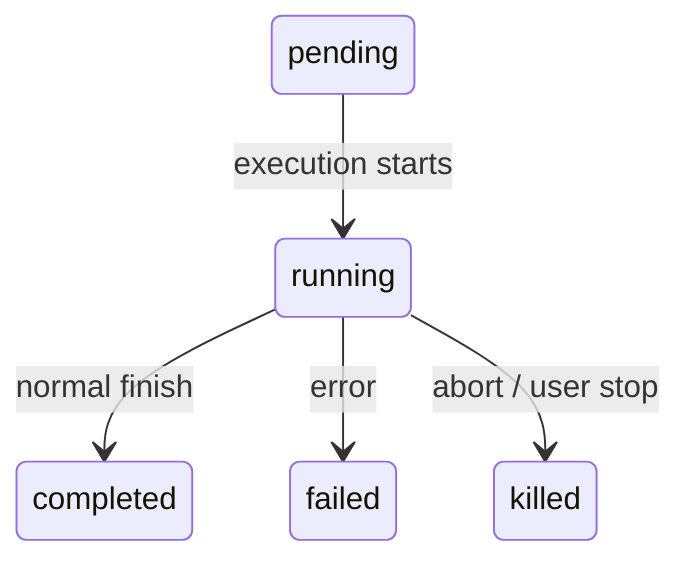
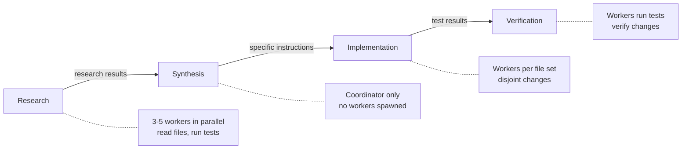
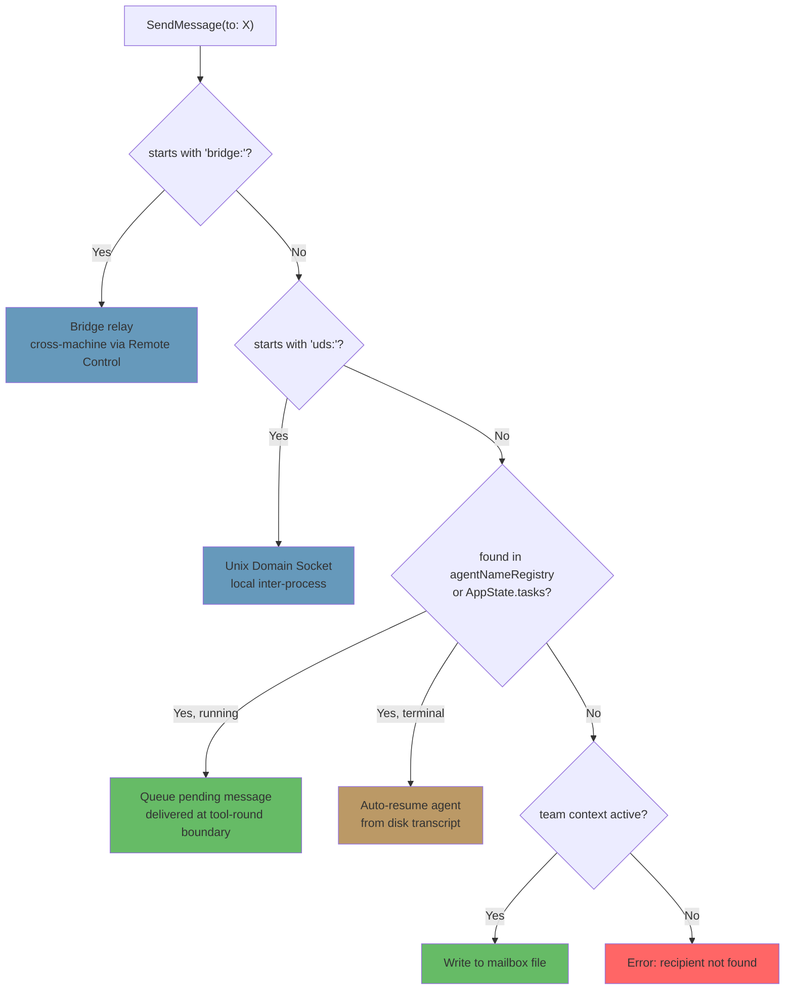

# Глава 10: Task, координация и стаи

## Ограничения одного потока

В главе 8 показано, как создать sub-agent — жизненный цикл из пятнадцати шагов, который создает изолированный контекст выполнения на основе определения agent. В главе 9 показано, как сделать параллельное создание экономичным за счет быстрого использования кэша. Но создание agents и управление agentsи — это разные проблемы. Эта глава посвящена второму.

Один agent loop — одна модель, один диалог, один tool за раз — может выполнить значительный объем работы. Он может читать файлы, редактировать код, запускать тесты, выполнять поиск в Интернете и решать сложные проблемы. Но это упирается в потолок.

Потолок – это не интеллект. Это параллелизм и масштаб. Разработчику, работающему над масштабным рефакторингом, необходимо обновить 40 файлов, запустить тесты после каждого batchа и убедиться, что ничего не сломалось. Миграция кодовой базы одновременно затрагивает уровни внешнего интерфейса, серверной части и базы данных. При тщательной проверке кода считываются десятки файлов во время выполнения набора тестов в фоновом режиме. Это не более сложные проблемы, а более широкие. Они требуют умения делать несколько дел одновременно, делегировать работу специалистам и согласовывать результаты.

Ответом Claude Code на эту проблему является не один механизм, а многоуровневый набор шаблонов оркестровки, каждый из которых подходит для разных форм работы. Фоновые Task для команд «выстрелил и забыл». Coordinator Mode для иерархий менеджер-работник. Swarm-команды для однорангового сотрудничества. И единый протокол связи, который связывает их всех вместе.

Уровень оркестрации охватывает примерно 40 файлов `tools/AgentTool/`, `tasks/`, `coordinator/`, `tools/SendMessageTool/` и `utils/swarm/`. Несмотря на такую ​​широту, проект опирается на единый конечный автомат, общий для всех шаблонов. Понимание этого конечного автомата — абстракции `Task` в `Task.ts` — является необходимым условием для понимания всего остального.

В этой главе рассматривается весь стек, от базового конечного автомата Task до самых сложных multi-agent топологий.

---

## Конечный автомат Task

Каждая фоновая операция в Claude Code — команда оболочки, sub-agent, удаленный сеанс, сценарий рабочего процесса — отслеживается как *Task*. Абстракция Task находится в `Task.ts` и предоставляет унифицированную модель State, на которой строится остальная часть уровня оркестровки.

### Семь типов

Система определяет семь типов Task, каждый из которых представляет свою модель выполнения:

Семь типов Task: `local_bash` (фоновые команды оболочки), `local_agent` (фоновые sub-agents), `remote_agent` (удаленные сеансы), `in_process_teammate` (соратники по группе), `local_workflow` (выполнение сценариев рабочего процесса), `monitor_mcp` (серверные мониторы MCP) и `dream` (спекулятивное фоновое мышление).

`local_bash` и `local_agent` — это рабочие лошадки — фоновые команды оболочки и фоновые sub-agents соответственно. `in_process_teammate` — примитивный рой. `remote_agent` обеспечивает мосты к удаленным средам выполнения Claude Code. `local_workflow` запускает многошаговые сценарии. `monitor_mcp` следит за State сервера MCP. `dream` — самая необычная — фоновая Task, которая позволяет agent размышлять, ожидая ввода пользователя.

Каждый тип получает односимвольный префикс идентификатора для мгновенной визуальной идентификации:

| Тип | Префикс | Пример идентификатора |
|------|--------|------------|
| `local_bash` | `b` | `b4k2m8x1` |
| `local_agent` | `a` | `a7j3n9p2` |
| `remote_agent` | `r` | `r1h5q6w4` |
| `in_process_teammate` | `t` | `t3f8s2v5` |
| `local_workflow` | `w` | `w6c9d4y7` |
| `monitor_mcp` | `m` | `m2g7k1z8` |
| `dream` | `d` | `d5b4n3r6` |

Идентификаторы Task используют односимвольный префикс (a для agents, b для bash, t для товарищей по команде и т. д.), за которым следуют 8 случайных буквенно-цифровых символов, взятых из регистронезависимого алфавита (цифры плюс строчные буквы). Это дает примерно 2,8 триллиона комбинаций — достаточно, чтобы противостоять атакам методом перебора символических ссылок на выходные файлы Task на диске.

Когда вы видите `a7j3n9p2` в строке журнала, вы сразу понимаете, что это фоновый agent. Когда вы увидите `b4k2m8x1`, команду оболочки. Префикс — это микрооптимизация для людей-читателей, но в системе, которая может выполнять десятки одновременных Task, это имеет значение.

### Пять статусов

Жизненный цикл представляет собой простой ориентированный граф без циклов:



`pending` — это кратковременное State между регистрацией и первым выполнением. `running` означает, что Task активно выполняет работу. Тремя терминальными состояниями являются `completed` (успех), `failed` (ошибка) и `killed` (явное остановлено пользователем, координатором или сигналом прерывания). Вспомогательная функция защищает от взаимодействия с мертвыми Task:

```typescript
export function isTerminalTaskStatus(status: TaskStatus): boolean {
  return status === 'completed' || status === 'failed' || status === 'killed'
}
```

Эта функция появляется повсюду — в средствах защиты от внедрения сообщений, логике вытеснения, очистке потерянных сообщений и маршрутизации SendMessage, которая решает, поставить ли сообщение в очередь или возобновить работу мертвого agent.

### Базовое State

Каждое State Task расширяет `TaskStateBase`, который содержит поля, общие для всех семи типов:

```typescript
export type TaskStateBase = {
  id: string              // Prefixed random ID
  type: TaskType          // Discriminator
  status: TaskStatus      // Current lifecycle position
  description: string     // Human-readable summary
  toolUseId?: string      // The tool_use block that spawned this task
  startTime: number       // Creation timestamp
  endTime?: number        // Terminal-state timestamp
  totalPausedMs?: number  // Accumulated pause time
  outputFile: string      // Disk path for streaming output
  outputOffset: number    // Read cursor for incremental output
  notified: boolean       // Whether completion was reported to parent
}
```

Два поля заслуживают внимания. `outputFile` — это мост между асинхронным выполнением и диалогом родителя — каждая Task записывает свои выходные данные в файл на диске, и родитель может читать их постепенно через `outputOffset`. `notified` предотвращает дублирование сообщений о завершении; как только родителю сообщают, что Task завершена, флаг меняется на `true`, и уведомление больше никогда не отправляется. Без этой защиты Task, которая завершается между двумя последовательными опросами очереди уведомлений, будет генерировать дублирующиеся уведомления, что сбивает модель с толку, заставляя ее думать, что две Task завершены, хотя завершилась только одна.

### State Task agent

`LocalAgentTaskState` — самый сложный вариант, содержащий все необходимое для управления полным жизненным циклом фонового sub-agent:

```typescript
export type LocalAgentTaskState = TaskStateBase & {
  type: 'local_agent'
  agentId: string
  prompt: string
  selectedAgent?: AgentDefinition
  agentType: string
  model?: string
  abortController?: AbortController
  pendingMessages: string[]       // Queued via SendMessage
  isBackgrounded: boolean         // Was this originally a foreground agent?
  retain: boolean                 // UI is holding this task
  diskLoaded: boolean             // Sidechain transcript loaded
  evictAfter?: number             // GC deadline
  progress?: AgentProgress
  lastReportedToolCount: number
  lastReportedTokenCount: number
  // ... additional lifecycle fields
}
```

Три поля раскрывают важные дизайнерские решения. `pendingMessages` — это почтовый ящик: когда `SendMessage` нацелен на работающий agent, сообщение ставится в очередь здесь, а не вводится немедленно. Сообщения удаляются на границах раундов tools, что сохраняет структуру хода agent. `isBackgrounded` отличает agents, которые были созданы асинхронными, от agents, которые начинались как agents синхронизации на переднем плане, а затем были переведены в фоновый режим при нажатии пользователем клавиши. `evictAfter` — это механизм сбора мусора: несохраняемые завершенные Task получают льготный период, прежде чем их State будет очищено из memory.

Все State Task хранятся в `AppState.tasks` как `Record<string, TaskState>`, с ключом по префиксному идентификатору. Это плоская карта, а не дерево — система не моделирует отношения родитель-потомок в хранилище State. Отношения родитель-потомок неявно присутствуют в потоке диалога: родительский элемент содержит `toolUseId`, который породил дочерний элемент.

### Реестр Task

Каждый тип Task поддерживается объектом `Task` с минимальным интерфейсом:

```typescript
export type Task = {
  name: string
  type: TaskType
  kill(taskId: string, setAppState: SetAppState): Promise<void>
}
```

В реестре собраны все реализации Task:

```typescript
export function getAllTasks(): Task[] {
  return [
    LocalShellTask,
    LocalAgentTask,
    RemoteAgentTask,
    DreamTask,
    ...(LocalWorkflowTask ? [LocalWorkflowTask] : []),
    ...(MonitorMcpTask ? [MonitorMcpTask] : []),
  ]
}
```

Обратите внимание на условное включение: `LocalWorkflowTask` и `MonitorMcpTask` являются функционально-зависимыми и могут не существовать во время выполнения. Интерфейс `Task` намеренно минимален. Более ранние итерации включали методы `spawn()` и `render()`, но они были удалены, когда стало ясно, что порождение и рендеринг никогда не вызывались полиморфно. Каждый тип Task имеет свою собственную логику появления, собственное управление State и собственный рендеринг. Единственная операция, которую действительно необходимо распределять по типу, — это `kill()`, и это все, что требуется интерфейсу.

Это пример эволюции интерфейса посредством вычитания. Первоначальный проект предполагал, что все типы tasks будут иметь общий интерфейс жизненного цикла. На практике типы разошлись настолько, что общий интерфейс стал фикцией: `spawn()` для команды оболочки и `spawn()` для команды, находящейся в процессе, не имеют почти ничего общего. Вместо того, чтобы поддерживать дырявую абстракцию, команда удалила все, кроме одного метода, который действительно выигрывает от полиморфизма.

---

## Шаблоны общения

Task, выполняемая в фоновом режиме, полезна только в том случае, если родитель может наблюдать за ее ходом и получать результаты. Claude Code поддерживает три канала связи, каждый из которых оптимизирован для разных шаблонов доступа.

### На переднем плане: цепь генераторов

Когда agent работает синхронно, parent agent напрямую выполняет итерацию своего асинхронного генератора `runAgent()`, возвращая каждое сообщение в стек вызовов. Интересным механизмом здесь является фоновый аварийный люк: цикл синхронизации переключается между «следующим сообщением от agent» и «фоновым сигналом»:

```typescript
const agentIterator = runAgent({ ...params })[Symbol.asyncIterator]()

while (true) {
  const nextMessagePromise = agentIterator.next()
  const raceResult = backgroundPromise
    ? await Promise.race([nextMessagePromise.then(...), backgroundPromise])
    : { type: 'message', result: await nextMessagePromise }

  if (raceResult.type === 'background') {
    // User triggered backgrounding -- transition to async
    await agentIterator.return(undefined)
    void runAgent({ ...params, isAsync: true })
    return { data: { status: 'async_launched' } }
  }

  agentMessages.push(message)
}
```

Если в середине выполнения пользователь решает, что agent синхронизации должен стать фоновой Task, итератор переднего плана возвращается без ошибок (запуская его блок `finally` для очистки ресурсов), а agent повторно создается как асинхронная Task с тем же идентификатором. Переход происходит плавно — никакая работа не теряется, и agent продолжает с того места, где остановился, с помощью контроллера асинхронного прерывания, который не связан с родительским ключом ESC.

Это действительно сложный переходный период, который нужно осуществить правильно. Agent переднего плана использует родительский контроллер прерывания (ESC убивает обоих). Фоновому agent нужен собственный контроллер (ESC не должен его убивать). Сообщения agent необходимо передать из потока генератора переднего плана в систему фоновых уведомлений. State Task должно измениться на `isBackgrounded`, чтобы UI знал, что его следует отображать на фоновой панели. И все это должно происходить атомарно — никакие сообщения не теряются при переходе, ни один итератор-зомби не остается работающим. `Promise.race` между следующим сообщением и фоновым сигналом — это механизм, который делает это возможным.

### Фон: три канала

Фоновые agents взаимодействуют через диск, уведомления и сообщения в очереди.

**Выходные файлы на диске.** Каждая Task записывается по пути `outputFile` — символической ссылке на стенограмму agent в формате JSONL. Родитель (или любой наблюдатель) может читать этот файл постепенно, используя `outputOffset`, который отслеживает, как далеко был использован файл. `TaskOutputTool` предоставляет это модели:

```typescript
inputSchema = z.strictObject({
  task_id: z.string(),
  block: z.boolean().default(true),
  timeout: z.number().default(30000),
})
```

Если `block: true`, tool выполняет опрос до тех пор, пока Task не достигнет конечного State или пока не истечет время ожидания. Это основной механизм координатора, который порождает работника и ждет его результата.

**Уведомления о Task.** Когда фоновый agent завершает работу, система генерирует уведомление XML и ставит его в очередь для доставки в беседу родителя:

```xml
<task-notification>
  <task-id>a7j3n9p2</task-id>
  <tool-use-id>toolu_abc123</tool-use-id>
  <output-file>/path/to/output</output-file>
  <status>completed</status>
  <summary>Agent "Investigate auth bug" completed</summary>
  <result>Found null pointer in src/auth/validate.ts:42...</result>
  <usage>
    <total_tokens>15000</total_tokens>
    <tool_uses>8</tool_uses>
    <duration_ms>12000</duration_ms>
  </usage>
</task-notification>
```

Уведомление вводится как сообщение роли пользователя в беседу родителя, что означает, что модель видит его в своем обычном потоке сообщений. Для проверки завершений не требуется специальный tool — они поступают в виде контекста. Флаг `notified` в State Task предотвращает дублирование доставки.

**Очередь команд.** Массив `pendingMessages` на `LocalAgentTaskState` является третьим каналом. Когда `SendMessage` нацелен на работающий agent, сообщение ставится в очередь:

```typescript
if (isLocalAgentTask(task) && task.status === 'running') {
  queuePendingMessage(agentId, input.message, setAppState)
  return { data: { success: true, message: 'Message queued...' } }
}
```

Эти сообщения обрабатываются на границах tool rounds с помощью `drainPendingMessages()` и вводятся как пользовательские сообщения в разговор agent. Это решающий выбор при проектировании — сообщения приходят между этапами разработки tool, а не в середине выполнения. Agent заканчивает свою текущую мысль, а затем получает новую информацию. Никаких расовых условий, никакого коррумпированного государства.

### Отслеживание прогресса

`ProgressTracker` обеспечивает видимость активности agent в режиме реального времени:

```typescript
export type ProgressTracker = {
  toolUseCount: number
  latestInputTokens: number        // Cumulative (latest value, not sum)
  cumulativeOutputTokens: number   // Summed across turns
  recentActivities: ToolActivity[] // Last 5 tool uses
}
```

Различие между отслеживанием входных и выходных токенов сделано намеренно и отражает тонкости модели выставления счетов API. Входные токены накапливаются для каждого вызова API, поскольку каждый раз пересылается полный диалог — 15-й ход включает в себя все 14 предыдущих ходов, поэтому количество входных токенов, сообщаемое API, уже отражает общую сумму. Сохранение последнего значения является правильным агрегированием. Выходные токены выдаются за ход — модель каждый раз генерирует новые токены, поэтому правильное агрегирование — это суммирование. Ошибка приведет либо к значительному завышению значения (суммирование совокупных входных токенов), либо к значительному занижению значения (оставление только последних выходных токенов).

Массив `recentActivities` (не более 5 записей) предоставляет удобочитаемый поток того, что делает agent: «Читать src/auth/validate.ts», «Bash: npm test», «Редактировать src/auth/validate.ts». Он отображается на панели sub-agent VS Code и индикаторе фоновой Task терминала, предоставляя пользователям возможность видеть работу agent, не требуя от них чтения полных стенограмм.

Для фоновых agents прогресс записывается в `AppState` через `updateAsyncAgentProgress()` и генерируется как события SDK через `emitTaskProgress()`. Панель sub-agent VS Code использует эти события для отображения в реальном времени индикаторов выполнения, количества tools и потоков активности. Отслеживание прогресса носит не просто косметический характер — это основной механизм обратной связи, который сообщает пользователям, продвигается ли фоновый agent или застрял в цикле.

---

## Coordinator Mode

Coordinator Mode превращает Claude Code из одного agent с фоновыми помощниками в настоящую архитектуру менеджер-работник. Это наиболее самоуверенная модель оркестровки в системе, и ее дизайн свидетельствует о глубоком размышлении о том, как LLM следует и не следует делегировать работу.

### Coordinator Mode решает проблемы

Стандартный agent loop имеет один диалог и одно контекстное окно. Когда он создает фоновый agent, фоновый agent запускается независимо и сообщает о результатах через уведомления о Task. Это хорошо работает для простого делегирования — «запускайте тесты, пока я продолжаю редактировать», — но не работает для сложных многоэтапных рабочих процессов.

Рассмотрим миграцию кодовой базы. Agent необходимо: (1) понять текущие закономерности в 200 файлах, (2) разработать стратегию миграции, (3) применить изменения к каждому файлу и (4) убедиться, что ничего не сломалось. Шаги 1 и 3 выигрывают от параллелизма. Шаг 2 требует синтеза результатов шага 1. Шаг 4 зависит от шага 3. Один agent, выполняющий это последовательно, потратит большую часть своего бюджета токенов на перечитывание файлов. Несколько фоновых agents, выполняющих это без координации, приведут к противоречивым изменениям.

Coordinator Mode решает эту проблему, отделяя «думающего» agent от «действующих». Координатор выполняет этапы 1 и 2 (направление научных работников, затем синтез). Воркеры выполняют шаги 3 и 4 (применение изменений, запуск тестов). Координатор видит полную картину; работники видят свою конкретную Task.

### Активация

Одна переменная среды переключает переключатель:

```typescript
export function isCoordinatorMode(): boolean {
  if (feature('COORDINATOR_MODE')) {
    return isEnvTruthy(process.env.CLAUDE_CODE_COORDINATOR_MODE)
  }
  return false
}
```

При возобновлении сеанса `matchSessionMode()` проверяет, соответствует ли сохраненный режим возобновленного сеанса текущей среде. Если они расходятся, переменная среды переворачивается для соответствия. Это предотвращает запутанный сценарий, когда сеанс координатора возобновляется в качестве обычного agent (теряя осведомленность о своих работниках) или обычный сеанс возобновляется в качестве координатора (теряя доступ к своим tools). Режим сеанса является источником истины; переменная среды является сигналом времени выполнения.

### Ограничения tools

Сила координатора заключается не в том, что у него больше tools, а в том, что у него меньше. В Coordinator Mode agent-координатор получает ровно три tool:

- **Agent** -- порождает рабочих
- **SendMessage** — общение с существующими работниками.
- **TaskStop** — завершить работу рабочих процессов

Вот и все. Нет чтения файлов. Никакого редактирования кода. Никаких команд оболочки. Координатор не может напрямую касаться базы кода. Это ограничение не является ограничением — это основной принцип проектирования. Работа координатора — думать, планировать, разлагать и синтезировать. Рабочие делают работу.

Рабочие, наоборот, получают полный набор tools за вычетом tools внутренней координации:

```typescript
const INTERNAL_WORKER_TOOLS = new Set([
  TEAM_CREATE_TOOL_NAME,
  TEAM_DELETE_TOOL_NAME,
  SEND_MESSAGE_TOOL_NAME,
  SYNTHETIC_OUTPUT_TOOL_NAME,
])
```

Работники не могут создавать свои собственные подгруппы или отправлять сообщения коллегам. Они сообщают о результатах через обычный механизм выполнения Task, а координатор обобщает их.

### Системная prompt из 370 строк

prompt системы координатора — это, строка за строкой, самый поучительный документ в базе кода о том, как использовать LLM для оркестровки. Он содержит около 370 строк и содержит полученные с таким трудом уроки о шаблонах делегирования. Ключевые учения:

** «Никогда не делегируйте понимание».** Это центральный тезис. Координатор должен синтезировать результаты исследования в конкретные запросы с указанием путей к файлам, номеров строк и точных изменений. prompt явно вызывает антишаблоны, такие как «на основе ваших выводов, исправьте ошибку» — prompt, которая делегирует *понимание* работнику, заставляя его повторно извлечь контекст, который уже есть у координатора. Правильный шаблон: «В `src/auth/validate.ts` в строке 42 параметр `userId` может иметь значение null при вызове из потока OAuth. Добавьте нулевую проверку, которая возвращает ответ 401».

**"Параллелизм — ваша суперсила".** prompt устанавливает четкую модель параллелизма. Task только для чтения выполняются свободно параллельно — исследование, исследование, чтение файлов. Task с большим объемом записи сериализуются для каждого набора файлов. Ожидается, что координатор определит, какие Task могут пересекаться, а какие должны быть упорядочены. Хороший координатор одновременно порождает пять исследователей, ждет их всех, синтезирует, а затем порождает трех специалистов по реализации, которые работают с непересекающимися наборами файлов. Плохой координатор порождает одного работника, ждет, порождает следующего, снова ждет — сериализуя работу, которая могла бы быть параллельной.

**Фазы рабочего процесса Task.** В prompt определены четыре этапа:



1. **Исследование** – сотрудники параллельно изучают кодовую базу, читают файлы, выполняют тесты, собирают информацию.
2. **Синтез** — координатор (не сотрудник) читает все результаты исследования и выстраивает единое понимание.
3. **Внедрение** — работники получают точные инструкции, полученные в результате синтеза.
4. **Проверка** — работники запускают тесты и проверяют изменения.

Координатор не должен пропускать этапы. Самый распространенный вариант неудачи — это переход от исследования непосредственно к реализации без синтеза. Когда это происходит, координатор делегирует понимание работникам реализации — каждый из них должен заново получить контекст с нуля, что приводит к противоречивым изменениям и бесполезной трате токенов.

**Решение о продолжении или создании.** Когда работник завершает работу и координатор выполняет дальнейшую работу, должен ли он отправить сообщение существующему работнику (через SendMessage) или создать новое (через agent)? Решение является функцией перекрытия контекста:

- **Высокое перекрытие, одни и те же файлы**: Продолжить. Рабочий процесс уже имеет содержимое файла в своем контексте, понимает шаблоны и может опираться на свою предыдущую работу. Создание новых файлов потребует повторного чтения одних и тех же файлов и повторного получения того же понимания.
- **Низкое перекрытие, другой домен**: Свежее появление. Работник, который только что исследовал систему аутентификации, имеет 20 000 токенов контекста, специфичного для аутентификации, что является мертвым грузом для Task рефакторинга CSS. Начать с чистого листа дешевле.
- **Высокое перекрытие, но рабочий не справился**: создайте новую версию с четкими указаниями о том, что пошло не так. Продолжение работы неудачника часто означает борьбу с запутанным контекстом. Начать заново с фразы «предыдущая попытка не удалась, потому что X, избегайте Y» более надежен.
- **Для отслеживания требуются выходные данные работника**: Продолжить, включив выходные данные в SendMessage. Работнику не нужно повторно получать свои собственные результаты.

**Написание prompts для работников и антишаблоны.** prompt учит координатора писать эффективные prompt для работников и явно отмечает неправильные шаблоны:

Антишаблон: * «На основе результатов вашего исследования внедрите исправление». * Это делегирует понимание. Исследование проводил не работник — координатор зачитывал результаты исследования.

Антишаблон: * «Исправьте ошибку в модуле аутентификации». * Никаких путей к файлам, номеров строк и описания ошибки. Работник должен выполнить поиск по всей базе кода с нуля.

Антишаблон: *"Внесите такие же изменения во все остальные файлы."* Какие файлы? Какие изменения? Координатор знает; он должен их перечислить.

Хороший шаблон: *"В `src/auth/validate.ts` в строке 42 параметр `userId` может иметь значение null при вызове из `src/oauth/callback.ts:89`. Добавьте нулевую проверку: если `userId` имеет значение null, верните `{ error: 'unauthorized', status: 401 }`. Затем обновите тест в `src/auth/__tests__/validate.test.ts`, чтобы охватить нулевой случай."*

Расходы на написание конкретной prompt берет на себя один раз координатор. Выгода — работник, который выполняет правильно с первой попытки — огромна. Расплывчатые prompt создают ложную экономию: координатор экономит 30 секунд на написании prompts, а работник тратит 5 минут на исследование.

### Рабочий контекст

Координатор вводит информацию о доступных tool в свой собственный контекст, поэтому модель знает, что могут делать работники:

```typescript
export function getCoordinatorUserContext(mcpClients, scratchpadDir?) {
  return {
    workerToolsContext: `Workers spawned via Agent have access to: ${workerTools}`
      + (mcpClients.length > 0
        ? `\nWorkers also have MCP tools from: ${serverNames}` : '')
      + (scratchpadDir ? `\nScratchpad: ${scratchpadDir}` : '')
  }
}
```

Каталог блокнота (защищенный функциональным флагом `tengu_scratch`) представляет собой общую папку файловой системы, где работники могут читать и писать без запросов на разрешение. Это обеспечивает надежный обмен знаниями между сотрудниками: исследовательские заметки одного сотрудника становятся входными данными для другого, передаваемыми через файловую систему, а не через окно токенов координатора.

Это важно, поскольку устраняет фундаментальное ограничение шаблона координатора. Без блокнота вся информация проходит через координатора: работник А выдает результаты, координатор считывает их через TaskOutput, синтезирует их в prompt работника Б. Контекстное окно координатора становится узким местом — оно должно хранить все промежуточные результаты достаточно долго, чтобы их синтезировать. С помощью блокнота работник А записывает результаты в `/tmp/scratchpad/auth-analysis.md`, а координатор говорит работнику Б: «Прочитайте анализ аутентификации в `/tmp/scratchpad/auth-analysis.md` и примените шаблон к модулю OAuth». Координатор перемещает информацию по ссылке, а не по значению.

### Взаимное исключение с помощью форка

Coordinator Mode и sub-agents на основе ответвлений являются взаимоисключающими.

```typescript
export function isForkSubagentEnabled(): boolean {
  if (feature('FORK_SUBAGENT')) {
    if (isCoordinatorMode()) return false
    // ...
  }
}
```

Конфликт является фундаментальным. Agents форка наследуют весь контекст разговора родителя — это дешевые клоны, которые используют общий Prompt Cache. Работники-координаторы — независимые agents со свежим контекстом и конкретными инструкциями. Это противоположные подходы к делегированию, и система обеспечивает выбор на уровне флага функции.

---

## Роевая система

Coordinator Mode иерархический: один менеджер, много работников, управление сверху вниз. Роевая система представляет собой одноранговую альтернативу: несколько экземпляров Claude Code работают в команде, при этом лидер координирует действия нескольких товарищей по команде посредством передачи сообщений.

### Контекст команды

Команды обозначаются `teamName` и отслеживаются по `AppState.teamContext`:

```typescript
teamContext?: {
  teamName: string
  teammates: {
    [id: string]: { name: string; color?: string; ... }
  }
}
```

Каждый товарищ по команде получает имя (для обращения) и цвет (для визуального различия в пользовательском интерфейсе). Файл группы сохраняется на диске, поэтому членство в команде сохраняется при перезапуске процесса.

### Реестр имен agents

Фоновым agents могут быть присвоены имена во время появления, что позволяет обращаться к ним с помощью удобочитаемых идентификаторов, а не случайных идентификаторов Task:

```typescript
if (name) {
  rootSetAppState(prev => {
    const next = new Map(prev.agentNameRegistry)
    next.set(name, asAgentId(asyncAgentId))
    return { ...prev, agentNameRegistry: next }
  })
}
```

`agentNameRegistry` — это `Map<string, AgentId>`. Когда `SendMessage` разрешает поле `to`, сначала проверяется реестр:

```typescript
const registered = appState.agentNameRegistry.get(input.to)
const agentId = registered ?? toAgentId(input.to)
```

Это означает, что вы можете отправить сообщение на `"researcher"` вместо `a7j3n9p2`. Косвенное обращение простое, но оно позволяет координатору мыслить с точки зрения ролей, а не идентификаторов, что является значительным улучшением способности модели рассуждать о multi-agent рабочих процессах.

### Коллеги в процессе

Члены команды в процессе работают в том же процессе Node.js, что и лидер, изолируются через `AsyncLocalStorage`. Их State расширяет базу полями, специфичными для команды:

```typescript
export type InProcessTeammateTaskState = TaskStateBase & {
  type: 'in_process_teammate'
  identity: TeammateIdentity
  prompt: string
  messages?: Message[]                  // Capped at 50
  pendingUserMessages: string[]
  isIdle: boolean
  shutdownRequested: boolean
  awaitingPlanApproval: boolean
  permissionMode: PermissionMode
  onIdleCallbacks?: Array<() => void>
  currentWorkAbortController?: AbortController
}
```

Ограничение `messages` в 50 записей заслуживает объяснения. В ходе разработки анализ показал, что каждый работающий agent накапливает примерно 20 МБ RSS за более чем 500 оборотов. Было замечено, что сеансы «китов» — опытных пользователей, выполняющих расширенные рабочие процессы — запускают 292 agent за 2 минуты, увеличивая размер RSS до 36,8 ГБ. Ограничение в 50 сообщений для представления UI — это предохранительный клапан memory. Фактический разговор agent продолжается с полной историей; усекается только снимок UI.

Флаг `isIdle` включает шаблон кражи работы. Бездействующий товарищ по команде не потребляет жетоны и не звонит API — он просто ждет следующего сообщения. Массив `onIdleCallbacks` позволяет системе подключиться к переходу из активного режима в режим ожидания, обеспечивая такие шаблоны оркестровки, как «дождитесь, пока все товарищи по команде закончат, а затем продолжайте».

`currentWorkAbortController` отличается от главного контроллера прерывания товарища по команде. Прерывание текущей работы контроллера отменяет текущий ход товарища по команде, но не убивает его. Это включает шаблон «перенаправления»: лидер отправляет сообщение с более высоким приоритетом, текущая работа товарища по команде прерывается, и товарищ по команде принимает новое сообщение. Главный контроллер прерывания при прерывании полностью убивает товарища по команде. Два уровня прерывания для двух уровней намерения.

Флаг `shutdownRequested` реализует совместное завершение. Когда лидер отправляет запрос на выключение, этот флаг устанавливается. Товарищ по команде может проверить его в естественных точках остановки и плавно завершить работу — завершить запись текущего файла, зафиксировать изменения или отправить окончательное обновление статуса. Это более щадящий метод, чем жесткое удаление, которое может привести к тому, что файлы останутся в несогласованном State.

### Почтовый ящик

Члены команды общаются через файловую систему почтовых ящиков. Когда `SendMessage` нацелен на товарища по команде, сообщение записывается в файл почтового ящика получателя на диске:

```typescript
await writeToMailbox(recipientName, {
  from: senderName,
  text: content,
  summary,
  timestamp: new Date().toISOString(),
  color: senderColor,
}, teamName)
```

Сообщения могут быть обычным текстом, сообщениями структурированного протокола (запросы на отключение, утверждения плана) или широковещательными сообщениями (`to: "*"` отправляются всем членам команды, за исключением отправителя). Перехватчик опроса обрабатывает входящие сообщения и направляет их в разговор товарища по команде.

Файловый подход намеренно прост. Здесь нет ни брокера сообщений, ни шины событий, ни канала общей memory. Файлы долговечны (выдерживают сбои процесса), доступны для проверки (вы можете `cat` почтовый ящик) и дешевы (нет зависимости от инфраструктуры). Для системы, где объемы сообщений измеряются десятками за сеанс, а не тысячами в секунду, это правильный компромисс. Очередь сообщений, поддерживаемая Redis, добавит операционную сложность, зависимость и режимы сбоя — и все это ради требований к пропускной способности, которые тривиально обрабатываются вызовом файловой системы.

Механизм вещания заслуживает внимания. Когда сообщение отправляется на `"*"`, отправитель перебирает всех членов команды из файла команды, пропускает себя (сравнение без учета регистра) и записывает в почтовый ящик каждого участника индивидуально:

```typescript
for (const member of teamFile.members) {
  if (member.name.toLowerCase() === senderName.toLowerCase()) continue
  recipients.push(member.name)
}
for (const recipientName of recipients) {
  await writeToMailbox(recipientName, { from: senderName, text: content, ... }, teamName)
}
```

Оптимизация разветвления отсутствует — каждый получатель получает отдельную запись в файл. Опять же, в масштабе команды agents (обычно 3-8 человек) этого вполне достаточно. Если бы в команде было 100 человек, это нужно было бы переосмыслить. Но ограничение memory на 50 сообщений, которое предотвращает сценарии RSS размером 36 ГБ, также неявно ограничивает эффективный размер команды.

### Пересылка разрешений

Работники Swarm работают с ограниченными разрешениями, но могут перейти к лидеру, когда им нужно одобрение для конфиденциальных операций:

```typescript
const request = createPermissionRequest({
  toolName, toolUseId, input, description, permissionSuggestions
})
registerPermissionCallback({ requestId, toolUseId, onAllow, onReject })
void sendPermissionRequestViaMailbox(request)
```

Схема такова: работник обращается к tool, требующему разрешения, классификатор bash пытается выполнить автоматическое одобрение, и если это не удается, запрос пересылается лидеру через систему почтовых ящиков. Лидер видит запрос в своем пользовательском интерфейсе и может одобрить или отклонить его. Обратный вызов срабатывает, и рабочий процесс продолжает работу. Это позволяет работникам работать автономно, обеспечивая безопасные операции, сохраняя при этом человеческий надзор за опасными.

---

## Inter-agent связь: SendMessage

`SendMessageTool` — универсальный коммуникационный примитив. Он поддерживает четыре различных режима маршрутизации через единый Tool interface, выбранный по форме поля `to`.

### Схема ввода

```typescript
inputSchema = z.object({
  to: z.string(),
  // "teammate-name", "*", "uds:<socket>", "bridge:<session-id>"
  summary: z.string().optional(),
  message: z.union([
    z.string(),
    z.discriminatedUnion('type', [
      z.object({ type: z.literal('shutdown_request'), reason: z.string().optional() }),
      z.object({ type: z.literal('shutdown_response'), request_id, approve, reason }),
      z.object({ type: z.literal('plan_approval_response'), request_id, approve, feedback }),
    ]),
  ]),
})
```

Поле `message` представляет собой объединение обычного текста и структурированных протокольных сообщений. Это означает, что SendMessage выполняет двойную функцию — это одновременно неофициальный канал чата («вот мои выводы») и формальный уровень протокола («Я одобряю ваш план» / «пожалуйста, выключите»).

### Отправка маршрутизации

Метод `call()` следует цепочке отправки в порядке приоритета:



**1. Сообщения моста** (`bridge:<session-id>`). Межмашинная связь через серверы удаленного управления Anthropic. Это самый широкий охват — два экземпляра Claude Code на разных машинах, потенциально на разных континентах, взаимодействующих через ретранслятор. Система требует явного согласия пользователя перед отправкой сообщений моста — проверка безопасности, которая не позволяет одному agent в одностороннем порядке установить связь с удаленным экземпляром. Без этого шлюза скомпрометированный или сбитый с толку agent может передать информацию в удаленный сеанс. Проверка согласия использует `postInterClaudeMessage()`, который управляет сериализацией и транспортировкой через реле удаленного управления.

**2. Сообщения UDS** (`uds:<socket-path>`). Локальное межпроцессное взаимодействие через сокеты домена Unix. Это касается экземпляров Claude Code, работающих на одном компьютере, но в разных процессах — например, расширение VS Code, на котором размещается один экземпляр, и терминал, на котором размещается другой. Связь UDS быстрая (без двустороннего обмена по сети), безопасная (права доступа к файловой системе контролируют доступ) и надежная (доставку осуществляет ядро). Функция `sendToUdsSocket()` сериализует сообщение и записывает его в путь к сокету, указанный в поле `to`. Пиры обнаруживают друг друга с помощью tool `ListPeers`, который сканирует активные конечные точки UDS.

**3. Внутрипроцессная маршрутизация sub-agent** (простое имя или идентификатор agent). Это самый распространенный путь. Логика маршрутизации:

- Найдите `input.to` в `agentNameRegistry`.
- Если найдено и запущено: `queuePendingMessage()` - сообщение ожидает следующей границы цикла tool.
- Если найден, но в терминальном State: `resumeAgentBackground()` - agent прозрачно перезапускается.
- Если не в `AppState`: попытайтесь возобновить работу с расшифровки диска.

**4. Почтовый ящик группы** (резервный вариант, когда контекст группы активен). Именованные получатели получают сообщения, записанные в файлы их почтовых ящиков. Подстановочный знак `"*"` запускает широковещательную рассылку всем членам команды.

### Структурированные протоколы

Помимо обычного текста, SendMessage поддерживает два формальных протокола.

**Протокол отключения.** Лидер отправляет `{ type: 'shutdown_request', reason: '...' }` товарищу по команде. Товарищ по команде отвечает `{ type: 'shutdown_response', request_id, approve: true/false, reason }`. В случае одобрения члены команды в процессе прерывают работу своего контроллера; Товарищи по команде на основе tmux получают вызов `gracefulShutdown()`. Протокол является кооперативным: товарищ по команде может отклонить запрос на отключение, если он находится в процессе критической работы, и лидер должен разобраться с этим случаем.

**Протокол утверждения плана.** Товарищи по команде, работающие в режиме плана, должны получить одобрение перед выполнением. Они представляют план, и лидер отвечает `{ type: 'plan_approval_response', request_id, approve, feedback }`. Только руководитель группы может выдавать утверждения. Это создает возможность проверки — руководитель может изучить предполагаемый подход работника до того, как будут затронуты какие-либо файлы, что позволяет заранее выявить недоразумения.

### Шаблон автоматического возобновления

Самая элегантная особенность системы маршрутизации — прозрачное возобновление работы agent. Когда `SendMessage` нацелен на завершенного или убитого agent, вместо возврата ошибки он воскрешает agent:

```typescript
if (task.status !== 'running') {
  const result = await resumeAgentBackground({
    agentId,
    prompt: input.message,
    toolUseContext: context,
    canUseTool,
  })
  return {
    data: {
      success: true,
      message: `Agent "${input.to}" was stopped; resumed with your message`
    }
  }
}
```

Функция `resumeAgentBackground()` восстанавливает agent по его дисковой расшифровке:

1. Считывает расшифровку JSONL боковой цепи.
2. Реконструирует историю сообщений, фильтруя бесхозные блоки мышления и неразрешенное использование tools.
3. Перестраивает State замены контента для стабильности Prompt Cache.
4. Разрешает исходное определение agent из сохраненных метаданных.
5. Перерегистрируется как фоновая Task с новым контроллером прерывания.
6. Вызывает `runAgent()` с восстановленной историей и новым сообщением в качестве prompt.

С точки зрения координатора, отправка сообщения мертвому agent и отправка сообщения живому agent — это одна и та же операция. Уровень маршрутизации справляется со всей сложностью. Это означает, что координаторам не нужно отслеживать, какие agents живы — они просто отправляют сообщения, а система это определяет.

Последствия значительны. Без автоматического возобновления координатору пришлось бы поддерживать мысленную модель работоспособности agent: «`researcher` все еще работает? Позвольте мне проверить. Он завершен. Мне нужно создать нового agent. Но подождите, я должен использовать то же имя? Будет ли у него тот же контекст?» При автоматическом возобновлении все это сводится к следующему: «Отправить `researcher` сообщение». Если оно живо, сообщение ставится в очередь. Если он мертв, он воскресает со своей полной историей. Сложность оперативного реагирования координатора резко снижается.

Конечно, есть цена. Возобновление записи с диска означает перечитывание потенциально тысяч сообщений, восстановление внутреннего State и выполнение нового вызова API с полным контекстным окном. Для долгоживущего agent это может быть дорого как с точки зрения задержки, так и с точки зрения токенов. Но альтернатива, требующая от координатора ручного управления жизненными циклами agents, еще хуже. Координатор — LLM. Хорошо рассуждает о проблемах и пишет инструкции. С бухгалтерией дела обстоят плохо. Автоматическое возобновление играет на сильных сторонах LLM, полностью устраняя категорию бухгалтерского учета.

---

## TaskStop: аварийный выключатель

`TaskStopTool` является дополнением к Agent и SendMessage и завершает запущенные Task:

```typescript
inputSchema = z.strictObject({
  task_id: z.string().optional(),
  shell_id: z.string().optional(),  // Deprecated backward compat
})
```

Реализация делегирует `stopTask()`, который выполняет диспетчеризацию в зависимости от типа Task:

1. Найдите Task в `AppState.tasks`.
2. Позвоните по номеру `getTaskByType(task.type).kill(taskId, setAppState)`.
3. Для agents: прервать работу контроллера, установить статус `'killed'`, запустить таймер выселения.
4. Для оболочек: убить группу процессов

Tool имеет устаревший псевдоним `"KillShell"` — напоминание о том, что система Task возникла из более простого источника, где единственной фоновой операцией была команда оболочки.

Механизм уничтожения зависит от типа Task, но схема одинакова. Для agents уничтожение означает прерывание контроллера прерывания (что приводит к завершению цикла `query()` в следующей точке выхода), установку статуса на `'killed'` и запуск таймера вытеснения, чтобы State Task очищалось после льготного периода. Для оболочек уничтожение означает отправку сигнала группе процессов — сначала `SIGTERM`, затем `SIGKILL`, если процесс не завершается в течение таймаута. Для членов команды, находящихся в процессе, убийство также вызывает уведомление о завершении работы команды, чтобы другие участники знали, что товарищ по команде ушел.

Стоит обратить внимание на таймер выселения. Когда agent убит, его State не очищается немедленно. Он задерживается в `AppState.tasks` на льготный период (контролируемый `evictAfter`), чтобы UI мог отображать статус завершения, можно было прочитать любой окончательный вывод, а автоматическое возобновление через SendMessage оставалось возможным. По истечении льготного периода State очищается от мусора. Это тот же шаблон, который используется для завершенных Task — система различает «завершенные» (результат доступен) и «забытые» (State очищено).

---

## Выбор между шаблонами

(Примечание по именованию: кодовая база также содержит tools `TaskCreate`/`TaskGet`/`TaskList`/`TaskUpdate`, которые управляют структурированным списком Task - совершенно отдельная система от описанного здесь конечного автомата фоновой Task. `TaskStop` работает на `AppState.tasks`; `TaskUpdate` работает с хранилищем данных отслеживания проектов. Перекрытие имен является историческим и является постоянным источником путаницы в моделях.)

Имея три доступных шаблона оркестровки — фоновое делегирование, Coordinator Mode и групповые команды — возникает естественный вопрос, когда использовать каждый из них.

**Простое делегирование** (tool «Agent» с `run_in_background: true`) подходит, когда у родительского объекта есть одна или две независимые tasks, которые нужно разгрузить. Запустите тесты в фоновом режиме, продолжая редактировать. Выполните поиск в базе кода во время ожидания сборки. Родитель сохраняет контроль, проверяет результаты, когда они готовы, и ему никогда не нужен сложный протокол связи. Накладные расходы минимальны — одна запись о State Task, один выходной файл на диске, одно уведомление о завершении.

**Coordinator Mode** подходит, когда проблема распадается на этап исследования, этап синтеза и этап реализации, а также когда координатору необходимо проанализировать результаты нескольких работников, прежде чем направлять следующий шаг. Координатор не может прикасаться к файлам, что требует четкого разделения Task: мышление происходит в одном контексте, действие — в другом. Системное prompt из 370 строк не является церемониальным — оно кодирует шаблоны, которые предотвращают наиболее распространенный вариант отказа при делегировании LLM, который заключается в делегировании понимания вместо делегирования действий.

**Группы** подходят для длительных сеансов совместной работы, когда agents требуется одноранговая связь, когда работа продолжается, а не batchно, и когда agents может потребоваться приостановить работу и возобновить работу на основе входящих сообщений. Система почтовых ящиков поддерживает асинхронные шаблоны, которых нет в Coordinator Mode (синхронный запуск-ожидание-синтез). Шлюзы утверждения плана добавляют уровень проверки. Пересылка разрешений обеспечивает безопасность, не требуя от каждого agent полных привилегий.

Таблица практических решений:

| Сценарий | Узор | Почему |
|----------|---------|-----|
| Запуск тестов во время редактирования | Простое делегирование | Одна фоновая Task, координация не требуется |
| Поиск по кодовой базе для всех вариантов использования | Простое делегирование | «Выстрелил и забыл», прочитай вывод по завершении |
| Рефакторинг 40 файлов в 3 модулях | Координатор | На этапе исследования выявляются закономерности, планы синтеза меняются, рабочие выполняют параллельно каждый модуль |
| Многодневная разработка функций с возможностью просмотра | Рой | Agents-долгожители, протокол утверждения плана, общение между коллегами |
| Исправить ошибку с известным местоположением | Ни один - единственный agent | Накладные расходы на оркестровку превышают выгоду от целенаправленной и последовательной работы |
| Перенести схему базы данных + обновить API + обновить интерфейс | Координатор | Три независимых рабочих потока после общего этапа исследования/планирования |
| Парное программирование с контролем пользователя | Рой в режиме планирования | Рабочий предлагает, лидер одобряет, рабочий выполняет |

Эти закономерности не являются взаимоисключающими в принципе, но на практике они существуют. Coordinator Mode отключает подagents ответвления. У команд Swarm есть собственный протокол связи, который не смешивается с уведомлениями о Task координатора. Выбор осуществляется при запуске сеанса с помощью переменных среды и флагов функций и формирует всю модель взаимодействия.

И последнее наблюдение: самый простой шаблон почти всегда является правильной отправной точкой. Для большинства Task не требуется Coordinator Mode или групповая команда. Подавляющую часть работы по разработке выполняет один agent, которому время от времени делегируются полномочия. Сложные модели существуют для 5% случаев, когда проблема действительно широка, действительно параллельна или действительно долгосрочна. Использование Coordinator Mode при исправлении ошибки в одном файле похоже на развертывание Kubernetes для статического веб-сайта — технически возможно, но архитектурно нецелесообразно.

---

## Стоимость оркестрации

Прежде чем исследовать, что именно раскрывает уровень оркестровки с философской точки зрения, стоит признать, чего это стоит на практике.

Каждый фоновый agent представляет собой отдельный диалог API. У него есть собственное контекстное окно, собственный бюджет токенов и собственный слот Prompt Cache. Координатор, который порождает 5 исследователей, выполняет 6 одновременных вызовов API, каждый со своей собственной системной prompt, определениями tools и внедрением CLAUDE.md. Затраты на использование токенов нетривиальны: одно только System Prompt может содержать тысячи токенов, и каждый рабочий процесс перечитывает файлы, которые, возможно, уже прочитали другие рабочие процессы.

Каналы связи добавляют задержку. Выходные файлы на диске требуют ввода-вывода файловой системы. Уведомления о Task доставляются на границах цикла работы tool, а не мгновенно. Очередь команд вводит полную двустороннюю задержку: координатор отправляет сообщение, сообщение ждет, пока исполнитель завершит текущее использование tool, работник обрабатывает сообщение, а результат записывается на диск для чтения координатором.

Управление State добавляет сложности. Семь типов Task, пять статусов и десятки полей для каждого State Task. Логика вытеснения, таймеры сбора мусора, ограничения memory — все это существует потому, что неограниченный рост State вызывает реальные производственные инциденты (36,8 ГБ RSS).

Ничто из этого не означает, что оркестровка неправильная. Это означает, что оркестрация — это tool, требующий затрат, и стоимость следует сопоставлять с выгодой. Запускать 5 параллельных воркеров для поиска в базе кода имеет смысл, если поиск займет 5 минут подряд. Запускать координатор для исправления опечатки в одном файле — это чистые накладные расходы.

---

## Что показывает уровень оркестрации

Самым интересным аспектом этой системы является не какой-либо отдельный механизм: State Task, почтовые ящики и уведомления XML — все это простые инженерные решения. Что интересно, так это *философия дизайна*, которая возникает из того, как они сочетаются друг с другом.

prompt координатора «никогда не делегируйте понимание» — это не просто хороший совет для оркестровки LLM. Это утверждение о фундаментальном ограничении рассуждений, основанных на контекстных окнах. Работник со свежим контекстным окном не может понять, что понял координатор после прочтения 50 файлов и синтеза трех исследовательских отчетов. Единственный способ восполнить этот пробел — для координатора превратить свое понимание в конкретную, действенную prompt. Расплывчатое делегирование не просто неэффективно — оно приводит к потерям информации с точки зрения теории.

Шаблон автоматического возобновления в SendMessage показывает предпочтение *кажущейся простоты фактической простоте*. Реализация сложна: чтение транскриптов диска, восстановление State замены контента, повторное разрешение определений agent. Но интерфейс тривиален: отправляешь сообщение, и оно работает независимо от того, жив получатель или мертв. Сложность поглощается инфраструктурой, поэтому модель (и пользователь) могут рассуждать проще.

А ограничение memory на 50 сообщений для участников команды является напоминанием о том, что системы оркестрации работают в условиях реальных физических ограничений. 292 agent за 2 минуты, достигающие 36,8 ГБ RSS, не являются теоретической проблемой — это произошло в производственных условиях. Абстракции элегантны, но они работают на оборудовании с ограниченным объемом memory, и система должна плавно ухудшаться, когда пользователи доводят ее до крайности.

Есть также урок в самой многоуровневой архитектуре. Конечный автомат task является агностическим — он не знает ни координаторов, ни роев. Каналы связи независимы: SendMessage не знает, вызывается ли он координатором, лидером группы или автономным agent. prompt координатора располагается сверху, добавляя методологию без изменения основного механизма. Каждый уровень можно понимать независимо, тестировать независимо и развивать независимо. Когда команда добавила роевую систему, им не пришлось модифицировать конечный автомат Task. Когда они добавили prompt координатора, им не нужно было изменять SendMessage.

Это отличительная черта хорошо продуманной оркестровки: примитивы являются общими, а шаблоны состоят из них. Координатор — это всего лишь agent с ограниченными tools и подробной системной prompt. Лидер роя — это просто agent с командным контекстом и доступом к почтовому ящику. Фоновый рабочий процесс — это просто agent с независимым контроллером прерывания и выходным файлом на диске. Семь типов Task, пять статусов и четыре режима маршрутизации в совокупности создают шаблоны оркестровки, которые превосходят сумму их частей.

На уровне оркестровки Claude Code перестает быть однопоточным исполнителем tool и становится чем-то ближе к команде разработчиков. Конечный автомат Task обеспечивает ведение бухгалтерского учета. Каналы связи обеспечивают поток информации. prompt координатора предоставляет методологию. А роевая система обеспечивает одноранговую топологию для tasks, которые не укладываются в строгую иерархию. Вместе они позволяют языковой модели делать то, что не может сделать ни один отдельный вызов модели: работать над широкими tasks параллельно и с координацией.

В следующей главе рассматривается Permission System — уровень безопасности, который определяет, кто из этих agents что может делать, и как опасные операции передаются от рабочих к людям. Оркестровка без контроля разрешений будет увеличивать вероятность ошибок. Permission System гарантирует, что больше agents означает больше возможностей, а не больше риска.
