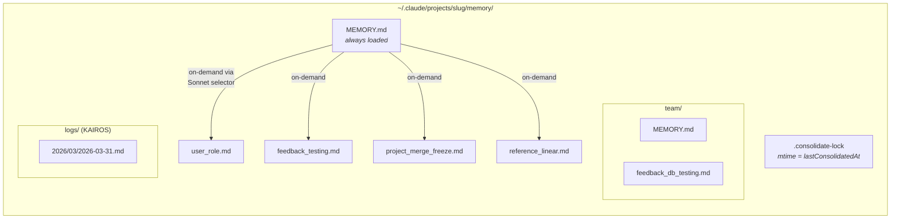
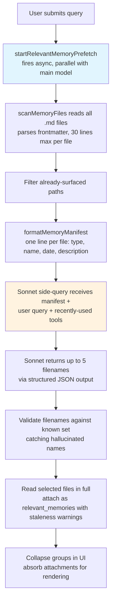
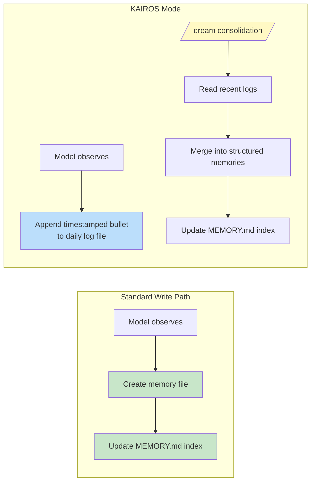

# Глава 11: Memory. Обучение через разговоры

## Проблема безгражданства

До сих пор в каждой главе описывался механизм, существующий в рамках одного сеанса. Цикл agent запускается, tools выполняются, sub-agents координируют свои действия, а когда процесс завершается, все это исчезает. Следующий разговор начинается с той же System Prompt, тех же определений tools, той же модели — и с нулевым знанием того, что произошло раньше.

Это фундаментальное ограничение архитектуры без сохранения State. В понедельник разработчик исправляет подход к тестированию модели, а во вторник модель допускает ту же ошибку. Пользователь объясняет свою роль, ограничения своего проекта, свои предпочтения в отношении стиля кода, и каждый новый сеанс требует от него объяснять это снова. Модель не забывчива — она никогда не знала. Каждый разговор — это независимая вселенная.

Проблема не теоретическая. Это проявляется конкретными способами, которые подрывают доверие. Пользователь говорит: «Помните, в тестах мы используем реальные экземпляры базы данных, а не макеты» — и на следующей неделе модель генерирует макеты тестов. Пользователь объясняет, что он старший инженер, которому не нужны объяснения для новичков, и следующий сеанс начинается с пошагового руководства на уровне учебного пособия. Без memory каждый сеанс начинается с нуля. Agent постоянно нанимается в первый же день.

Стандартным решением в отрасли является расширенная генерация с поиском (RAG): встраивание документов в векторы, сохранение их в базе данных векторов и извлечение соответствующих фрагментов во время запроса. Это хорошо работает для баз знаний — документации, часто задаваемых вопросов, справочных материалов. Но его архитектура не соответствует тому, что на самом деле нужно запоминать agent во время сеансов. Memory agent не является базой знаний. Это набор наблюдений: кто пользователь, что он исправил, каковы текущие ограничения проекта, где что найти. Эти наблюдения невелики, часто меняются и должны быть доступны для редактирования человеком. База данных векторов решает не ту проблему.

Система memory Claude Code — это совершенно другая ставка: файлы на диске, формат Markdown, вызов на основе LLM, отсутствие инфраструктуры. Ставка заключается в том, что простота хранения в сочетании с интеллектом при поиске создает лучшую систему, чем изощренность в обоих случаях.

Философия проектирования имеет последствия, которые формируют всю систему:

- **Удобно для чтения.** Пользователь, желающий увидеть, что помнит Claude Code, может открыть `~/.claude/projects/<slug>/memory/MEMORY.md` в любом текстовом редакторе. Никаких специальных tools, никакой расшифровки, никакой команды экспорта.
- **Доступно для редактирования человеком.** Устаревшую memory можно исправить с помощью vim. Неправильную memory можно удалить с помощью `rm`. Пользователь имеет полную свободу действий в отношении знаний agent.
- **Управление версиями.** Командные воспоминания можно сохранить в git. Изменения memory четко различаются, потому что это Markdown.
- **Нулевая инфраструктура.** Система memory работает в автономном режиме, работает без сервера, работает на любой ОС, имеющей файловую систему. Пути миграции нет, поскольку нет схемы.
- **Отладка.** Если memory ведет себя неожиданно, путь диагностики — `ls` и `cat`, а не журналы запросов и проверка базы данных.

Модель читает и записывает воспоминания, используя `FileWriteTool` и `FileEditTool` — те же tools, которые она использует для редактирования исходного кода (представленные в главе 6). Специальной memory API не существует. Системная prompt обучает модель двухэтапному протоколу записи (создание файла, обновление индекса), и модель выполняет его с существующими возможностями под новыми инструкциями. Это повторное использование tools как принцип архитектуры: система memory — это не подсистема, прикрепленная к agent, это возникающее поведение agent, использующее его существующие возможности.

Существует более глубокая причина, по которой здесь работает выбор на основе файлов. Memory для agent ИИ фундаментально отличается от memory в традиционном приложении. База данных традиционного приложения имеет авторитетное State — источник достоверности данных системы. Memory agent хранит *наблюдения* — вещи, которые были правдой в определенный момент времени и могут быть или не быть правдой. Файлы естественным образом передают этот эпистемологический статус. У них есть время модификации, которое показывает, когда было записано наблюдение. Их могут читать, редактировать и удалять люди, знающие, что наблюдение ошибочно. База данных предполагает постоянство и авторитет; файл Markdown предлагает заметку, которую кто-то записал и, возможно, потребуется обновить. Носитель данных передает характер данных — это рабочие заметки, а не Евангелие.

### Определение объема проекта

Memory ограничена корнем репозитория git, а не рабочим каталогом. Если пользователь открывает терминал в `src/components/`, а другой в `tests/`, оба сеанса используют один и тот же каталог memory. Логика разрешения сначала находит канонический корень git, возвращаясь к корню проекта:

Разрешение базового пути сначала находит канонический корень git, а затем возвращается к корню проекта. Это гарантирует, что все рабочие деревья git одного и того же репозитория используют один каталог memory.

Вызов `findCanonicalGitRoot` гарантирует, что все рабочие деревья git одного и того же репозитория используют один каталог memory. Корень git очищается (косая черта становится тире посредством `sanitizePath()`) для получения плоского имени каталога:

```
~/.claude/projects/-Users-alex-code-myapp/memory/
```

Полностью заполненный каталог memory раскрывает структуру системы:



Соглашение об именах является семантическим: `<type>_<topic>.md`. Префикс типа не указывается в коде, но является частью инструкций prompt, что позволяет легко визуально сканировать каталог и понимать структуру memory.

---

## Таксономия четырех типов

Не все стоит помнить. Система memory ограничивает все воспоминания ровно четырьмя типами:

Четыре типа: **пользователь**, **обратная связь**, **проект** и **ссылка**.

Таксономия построена на основе одного критерия: **можно ли получить эти знания из текущего State проекта?** Шаблоны кода, архитектура, файловая структура, история git — все это можно получить повторно, прочитав кодовую базу. Они исключены. Четыре типа отражают то, что не может быть получено повторно.

**Воспоминания пользователей** записывают информацию о человеке: его роль, цели, обязанности, уровень знаний. Старший инженер Go, впервые работающий с React, получает другие объяснения, чем начинающий программист.

**Воспоминания обратной связи** содержат рекомендации о том, как подходить к работе: как исправления, так и подтверждения. Система явно инструктирует модель записывать и то, и другое: «если вы сохраняете только поправки, вы отклоняетесь от подходов, которые пользователь уже проверил». Каждая memory обратной связи имеет определенную структуру: само правило, затем строка `**Why:**` с причиной (часто прошлый инцидент), затем строка `**How to apply:**` с условиями срабатывания.

**Воспоминания о проектах** фиксируют текущий контекст работы: кто, что делает, почему и когда. В prompt особое внимание уделяется преобразованию относительных дат в абсолютные: «Четверг» становится «2026-03-05», поэтому memory остается интерпретируемой несколько недель спустя.

**Справочные воспоминания** — это закладки, указывающие, где находится информация во внешних системах. URL-адрес проекта Linear, панель управления Grafana, канал Slack. Они сообщают модели, где искать, а не что найти.

### Таксономия как фильтр

Четыре типа — это не просто категории, это фильтр. Точно определяя, что считать memoryю, система неявно определяет, что нет. Без таксономии энергичная модель сохраняла бы все: шаблоны кода, архитектурные диаграммы, сообщения об ошибках. Все извлекается из кодовой базы. При его сохранении создается параллельная, потенциально устаревшая копия информации, которую лучше получить из ее источника.

Таксономия также предотвращает более тонкую ошибку: memory как опора. Если модель сохраняет архитектурные решения в memory, она перестает читать кодовую базу, чтобы понять архитектуру. Исключая извлекаемую информацию, система заставляет модель оставаться привязанной к текущему State кода.

Список исключений является явным: шаблоны кода, история git, решения для отладки, все, что содержится в CLAUDE.md, сведения об эфемерных Task. Эти исключения применяются, даже если пользователь явно просит сохранить. Если пользователь говорит: «Запомни этот PR-список», модели предлагается возразить: «Что в этом было *удивительного* или *неочевидного*?» Эту удивительную часть стоит сохранить. Необработанный список — нет. Эта инструкция была проверена посредством оценок, начиная с 0/2 до 3/3, когда была добавлена ​​инструкция переопределения исключения.

### Frontmatter как контракт

Каждый файл memory использует frontmatter YAML с тремя обязательными полями:

```markdown
---
name: {{memory name}}
description: {{one-line description -- used to decide relevance}}
type: {{user, feedback, project, reference}}
---
```

`description` является наиболее несущим полем. Это то, что селектор релевантности (побочный запрос Sonnet, обсуждаемый ниже) использует, чтобы решить, следует ли отображать эту memory. Расплывчатое описание, такое как «тестирование», либо будет соответствовать слишком широко, либо вообще не будет соответствовать. Конкретное описание, такое как «Интеграционные тесты должны касаться реальной БД, а не макетов — сожжено ложным расхождением Q4», соответствует именно тем разговорам, где это имеет значение. Описание — это индекс поиска в memory, используемый не поисковой системой, а языковой моделью, которая может понимать нюансы, контекст и намерения.

Вступительная часть также является единственной частью файла, которую считывает система сканирования во время вызова. `scanMemoryFiles()` считывает каждый файл только до первых 30 строк для извлечения заголовка. Тело является закрытым до тех пор, пока файл не будет явно выбран и загружен.

---

## Путь записи

Запись memory — это двухэтапный процесс, выполняемый стандартными файловыми tools.

**Шаг 1. Запишите файл memory.** Модель создает файл `.md` в каталоге memory с заголовком YAML:

```markdown
---
name: Testing Policy
description: Integration tests must hit real DB, not mocks
type: feedback
---

Don't mock the database in integration tests.

**Why:** We got burned last quarter when mocked tests passed but production
queries hit edge cases the mocks didn't cover.

**How to apply:** Any test file under `__tests__/` that touches database
operations should use the real PGlite instance from test-utils.
```

**Шаг 2. Обновите индекс.** Модель добавляет однострочный указатель на `MEMORY.md`:

```markdown
- [Testing Policy](feedback_testing.md) -- integration tests must hit real DB
```

Каждая запись должна содержать не более 150 символов. Индекс представляет собой оглавление, а не базу знаний.

Когда модель изучает новую информацию, которая изменяет существующую memory, она использует `FileEditTool` для обновления существующего файла, а не для создания дубликата. Система не создает версии memory внутри себя — файл находится в локальной файловой системе, и у пользователя есть `git`, если он хочет управлять версиями. Прежде чем будет построено prompt, `ensureMemoryDirExists()` создает каталог memory, и prompt сообщает модели, что каталог уже существует, избегая напрасных включений `ls` и `mkdir -p`.

---

## Путь возврата

Записывать воспоминания необходимо, но недостаточно. Более сложная проблема — поиск: учитывая запрос пользователя, какой из потенциально сотен файлов memory следует загрузить в контекст модели? Загрузка их всех исчерпает бюджет токена. Ничего не загружая, это противоречит цели. Загрузка неправильных значений приведет к потере токенов ненужной информации и потере знаний, которые могли бы изменить поведение модели.

Система отзыва работает на двух уровнях. Индекс `MEMORY.md` всегда загружается в контекст при запуске сеанса, обеспечивая ориентацию. Отдельные файлы memory отображаются по требованию с помощью релевантного запроса на основе LLM, который выбирает до пяти воспоминаний за ход.

### Конвейер полного отзыва



Асинхронная предварительная выборка на шаге 2 является ключевым решением по повышению производительности. К тому времени, когда основная модель достигает точки, когда вызванный контекст может оказаться полезным, побочный запрос обычно уже завершается. Пользователь не испытывает дополнительных задержек.

### Дополнительный запрос Sonnet

Манифест отправляется модели Sonnet в качестве побочного запроса. Системная prompt для этого селектора точна:

Системное prompt для селектора предписывает ему быть консервативным: включать только те воспоминания, которые будут полезны для текущего запроса, пропускать воспоминания, если они не уверены, и избегать выбора API/документации по использованию для tools, которые уже активно используются (поскольку в модели уже загружены эти tools), но все же отображать предупреждения, ошибки или известные проблемы, связанные с этими tools.

В ответе используется структурированный вывод — `{ selected_memories: string[] }`, а имена файлов проверяются на соответствие известному набору.

Этот подход меняет задержку на точность, и анализ компромиссов поучителен. **Сопоставление ключевых слов** будет быстрым, но не учитывает контекст: оно не может выражать фразу «не выбирать воспоминания для tools, которые уже активно используются». **Внедрение сходства** обрабатывает семантическое соответствие, но вводит инфраструктуру (модель внедрения, векторное хранилище, конвейер обновлений) и имеет проблемы с отрицанием — внедрение фразы «НЕ использовать макеты базы данных» очень близко к «использовать макеты базы данных». **Побочный запрос Sonnet** понимает семантическую релевантность, рассуждения о контексте, обрабатывает отрицание и не требует никакой инфраструктуры. Стоимость задержки ограничена (сотни миллисекунд) и скрыта за начальной обработкой основной модели.

Система телеметрии отслеживает скорость выбора, даже если ни одна memory не выбрана. Скорость выбора 0/150 означает нечто иное, чем 0/3: первое указывает на проблему точности, второе - на проблему покрытия.

---

## Устаревание

Система устаревания устраняет режим сбоя, возникший в результате реального использования. Пользователи сообщали, что старые воспоминания, содержащие ссылки на файл:строки кода, который с тех пор изменился, подтверждались моделью как факт. Благодаря этой цитате устаревшее утверждение звучало *более* авторитетно, а не менее.

Решение не в истечении срока действия. Старые воспоминания не удаляются — они могут содержать институциональные знания, действительные годами. Вместо этого система прикрепляет возрастные предупреждения:

Функция устаревания вычисляет возраст memory в днях. Воспоминания сегодняшнего или вчерашнего дня не получают предупреждения (функция возвращает пустую строку). Все более старое получает предупреждение вместе с содержимым memory: сообщение, указывающее возраст в днях и предупреждающее, что утверждения о поведении кода или ссылки на файлы: строки могут быть устаревшими, предлагая проверку на соответствие текущему коду.

Воспоминания о сегодняшнем или вчерашнем дне не вызывают никаких предупреждений. Все более старое получает предупреждение об устаревании вместе с содержимым memory. Удобочитаемый формат — «сегодня», «вчера», «47 дней назад» — существует потому, что модели плохо справляются с арифметикой дат. Необработанная временная метка ISO не вызывает устаревания, как это происходит «47 дней назад». Это эмпирическое наблюдение о поведении модели, подтвержденное посредством оценок: рамка-prompt к действию «Прежде чем рекомендовать по memory» получила оценку 3/3 по сравнению с 0/3 для более абстрактной «Доверять тому, что вы помните» с идентичным основным текстом.

Существует философское напряжение, о котором стоит упомянуть. Система устаревания рассматривает воспоминания как гипотезы, а не факты. Но естественная тенденция модели — уверенно представлять информацию. Предупреждение об устаревании борется с собственным голосом модели, используя ее способность следовать инструкциям, чтобы преодолеть тенденцию создания доверия.

---

## MEMORY.md как всегда загружаемый индекс

Каждый разговор начинается с `MEMORY.md` в контексте. Это не memory — это индекс, таблица содержания реальных файлов memory.

Индекс имеет два жестких ограничения:

Индекс имеет два жестких ограничения: 200 строк и 25 000 байт.

Ограничение в 200 строк ловит нормальный рост. Ограничение в 25 КБ фиксирует наблюдаемый режим сбоя: пользователи упаковывают длинные строки, длина которых не превышает 200 строк, но потребляют огромные бюджеты токенов. На 97-м процентиле MEMORY.md всего со 197 строками весил 197 КБ. Когда срабатывает любой из этих ограничений, пользователю подсказывает практическое руководство, что нужно исправить: «Сохраняйте записи указателя в одну строку длиной менее 200 символов; перемещайте детали в файлы тем».

Эта двухуровневая архитектура — легкий постоянный индекс и большой объем контента по запросу — позволяет масштабировать memory. Проект со 150 memoryю имеет 150-строчный индекс, потребляющий, возможно, 3000 токенов, а не 150 полных файлов, потребляющих 100 000.

---

Переход от индивидуальной memory к общим знаниям естественен. Политика тестирования, соглашение о развертывании, известные ошибки в системе сборки — все это должно быть доступно всей команде.

## Командная memory

Memory команды — это подкаталог каталога автоматической memory по адресу `<autoMemPath>/team/`, закрытый флагом функции и требующий включения автоматической memory. Архитектурная вложенность является преднамеренной: отключение автоматической memory транзитивно отключает групповую memory.

### Глубокая защита

Командная memory создает поверхность атаки, которой нет у индивидуальной memory. Файлы, синхронизированные командой, поступают от других пользователей, и злонамеренный товарищ по команде может попытаться обойти путь. Модель безопасности использует три уровня защиты.

**Уровень 1: очистка ввода.** Функция `sanitizePathKey()` проверяет наличие нулевых байтов, обходов в URL-коде (`%2e%2e%2f`), атак нормализации Юникода (символы полной ширины, которые нормализуются до `../`), обратной косой черты и абсолютных путей.

**Уровень 2: проверка пути на уровне строки.** После очистки `path.resolve()` нормализует оставшиеся сегменты `..`, а разрешенный путь сверяется с префиксом каталога группы (включая завершающий разделитель, чтобы предотвратить совпадение `team-evil/` с `team/`).

**Уровень 3: разрешение символических ссылок.** `realpathDeepestExisting()` разрешает символические ссылки на самом глубоком из существующих предков, перехватывая атаки, которые не может обнаружить проверка на уровне строки. Если `team/evil` является символической ссылкой, указывающей на `/etc/`, проверка строки видит действительный префикс, но `realpath` показывает истинную цель.

Все ошибки проверки приводят к ошибке `PathTraversalError`. Ни частичных успехов, ни отступлений. Фэйл закрылся.

### Руководство по области применения

prompt рассказывает модели о частной и общей memory. Пользовательские воспоминания всегда конфиденциальны. Справочные воспоминания обычно являются командными. Memory обратной связи по умолчанию является частной, если она не соответствует соглашениям всего проекта. Инструкция перекрестной проверки — «Прежде чем сохранять частную memory обратной связи, убедитесь, что она не противоречит memory обратной связи команды» — предотвращает непредсказуемое всплывание противоречивых указаний в зависимости от того, какая memory вызывается первой.

---

## KAIROS Режим: ежедневные журналы только для добавления

Стандартная memory предполагает дискретные сеансы. Режим KAIROS (режим помощника Claude Code) нарушает это предположение — сеансы долговечны и могут длиться несколько дней. Двухэтапный шаблон записи не масштабируется для непрерывной работы.

Решением является архитектурное разделение захвата и консолидации:



В режиме KAIROS модель добавляется в файлы журнала с именем по дате (`<autoMemPath>/logs/YYYY/MM/YYYY-MM-DD.md`). Каждая запись представляет собой короткую метку с меткой времени. Модель указана: «Не перезаписывайте и не реорганизовывайте журнал» — при реструктуризации во время захвата теряется хронологический сигнал, необходимый для консолидации.

Путь в prompt описывается как *шаблон*, а не как сегодняшняя буквальная дата. Это оптимизация кэширования: prompt memory кэшируется и не становится недействительным при изменении даты в полночь. Модель получает текущую дату из отдельного вложения `date_change`.

### Объединение /dream

Консолидация выполняется в четыре этапа: **Ориентирование** (список каталогов, чтение индекса, просмотр существующих файлов), **Сбор** (поиск в журналах, проверка на наличие смещенных воспоминаний), **Консолидация** (запись или обновление файлов, объединение, а не дублирование), **Сокращение** (обновление индекса длиной менее 200 строк, удаление устаревших указателей). Акцент на слиянии с существующими файлами, а не на создании новых важен — без него каталог memory будет расти линейно по мере использования.

### Блокировка консолидации

Файл блокировки `.consolidate-lock` служит двойной цели: его содержимым является PID владельца (взаимное исключение), а его mtime *is* `lastConsolidatedAt` (State планирования). Автоматический сон срабатывает, когда проходят три врата, оцениваемые в первую очередь с наименьшими затратами: количество часов с момента последней консолидации превышает 24, количество измененных с тех пор сеансов превышает 5, и никакой другой процесс не удерживает блокировку. Восстановление после сбоя обнаруживает неработающие PID через `process.kill(pid, 0)` с одночасовым тайм-аутом устаревания в качестве защиты от повторного использования PID.

---

## Извлечение фона

У главного agent есть полные инструкции по активному написанию воспоминаний. Но agents несовершенны, и это несовершенство предсказуемо. Когда пользователь говорит: «Не забывайте всегда использовать интеграционные тесты», а затем тут же спрашивает: «А теперь исправьте ошибку входа в систему», внимание модели полностью переключается на ошибку. Инструкция по экономии memory была обработана, но не может быть выполнена.

В конце каждого полного Query Loop fork agent, использующий родительский Prompt Cache, анализирует последние сообщения и записывает любые воспоминания, которые пропустил главный agent. Когда главный agent уже записал воспоминания в текущем диапазоне хода, agent извлечения пропускает этот диапазон. Agent извлечения имеет ограниченный бюджет tools: tools только для чтения плюс доступ на запись только к путям каталогов в memory. Его prompt указывает на двухходовую стратегию: первый этап читает параллельно, второй этап записывает параллельно.

Взаимодействие носит кооперативный, а не конкурентный характер. prompt главного agent всегда содержит полные инструкции по сохранению. Когда основной agent сохраняет данные, фоновый agent откладывает выполнение. Если этого не происходит, фоновый agent улавливает пробел. Этот шаблон — основной путь с фоновой сетью безопасности — делает захват memory более надежным, не обременяя основное взаимодействие. Ни того, ни другого было бы недостаточно.

---

## Разрешение пути и безопасность

Путь автозапоминания определяется через цепочку приоритетов:

1. **`CLAUDE_COWORK_MEMORY_PATH_OVERRIDE`** – переопределение полного пути для Cowork.
2. **`autoMemoryDirectory` в settings.json** -- Только проверенные источники настроек. Настройки проекта намеренно исключены.
3. **Вычисляемый путь по умолчанию** — `~/.claude/projects/<sanitized-git-root>/memory/`.

Исключение настроек проекта является решением безопасности. Вредоносный репозиторий может зафиксировать `.claude/settings.json` с помощью `autoMemoryDirectory: "~/.ssh"`, а исключение разрешений для файлов memory предоставит модели автоматический доступ для записи к ключам SSH. Ограничивая переопределение политиками, флагами, локальными и пользовательскими настройками (ни один из которых не может быть передан в репозиторий), этот вектор атаки закрывается.

Функция `isAutoMemPath()` нормализует пути перед проверкой префикса, чтобы предотвратить обход, а соглашение о конечном разделителе гарантирует, что для сопоставления префиксов требуется граница каталога.

### Цепочка включения/выключения

Активна ли автоматическая memory, определяется `isAutoMemoryEnabled()`, реализующим собственную цепочку приоритетов: переменная среды, простой режим, CCR без постоянного хранилища, настройки, включено по умолчанию. Если этот параметр отключен, раздел prompts удаляется (поэтому модель не получает инструкций по использованию memory), а фоновые процессы останавливаются (извлечение воспоминаний, автоматическое сновидение, групповая синхронизация). Оба шлюза должны совместиться — удаление одной prompt не остановит agent извлечения, у которого есть своя собственная prompt.

---

## Примените это: проектирование memory agent

Сложность системы memory находится на поведенческом уровне (prompt, вызов с помощью LLM, управление устаревшими данными, фоновое извлечение), а не в инфраструктуре хранения данных. Такое распределение сложности само по себе является принципом проектирования.

**Файлы превосходят базы данных по объему memory agent.** Файлы можно проверять, редактировать и контролировать версии. Прозрачность укрепляет доверие. Когда альтернативой является база данных, которую пользователи не могут легко прочитать, файлы выигрывают только за счет доверия.

**Ограничьте то, что будет сохранено, а не только то, как.** Тест на выводимость: можно ли повторно получить эти знания из текущего State проекта? - устраняет большую часть потенциальных воспоминаний, сохраняя при этом те, которые действительно имеют значение.

**Используйте LLM для вызова, а не ключевых слов или встраивания.** Побочный запрос LLM понимает контекст, рассуждения о том, что уже доступно в разговоре, обрабатывает отрицание и не требует обслуживания индекса. Стоимость задержки реальна, но ограничена и скрыта за обработкой основной модели.

**Предупреждайте об устаревании, срок действия не истекает.** Институциональные знания могут оставаться действительными в течение многих лет. Добавление предупреждений о возрасте позволяет модели рассматривать старые воспоминания как гипотезы, а не как факты. Удобочитаемый формат возраста вызывает правильные рассуждения, чего не делают необработанные временные метки.

**Создайте защитную сеть для поимки.** Главный agent будет скучать по воспоминаниям. Agent извлечения фона, который просматривает недавний разговор, делает систему более надежной, не нагружая основное взаимодействие. Когда основной agent сохраняет данные, фоновый agent откладывает выполнение.

---

Теперь agent может учиться в ходе сеансов, накапливая знания о своем пользователе, его предпочтениях, State проекта и внесенных ими исправлениях. Система memory берет на себя философское обязательство: отношения agent с пользователем должны со временем углубляться, а не сбрасываться при каждом взаимодействии. Реализация на основе файлов делает это обязательство осязаемым — видимым на диске, доступным для редактирования людьми, контролируемым версиями наряду с кодом. Memory agent — не черный ящик. Это коллекция заметок в папке, написанная на языке, понятном как модели, так и человеку.

В следующей главе рассматривается, как Claude Code расширяет свои возможности за пределы ядра: система skills, которая обучает модель новому поведению, и система hooks, которая позволяет внешнему коду ограничивать и изменять это поведение на более чем двух десятках точек жизненного цикла.
