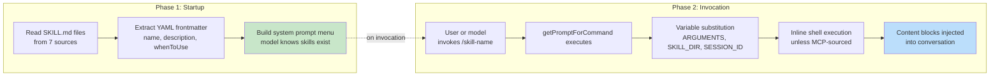
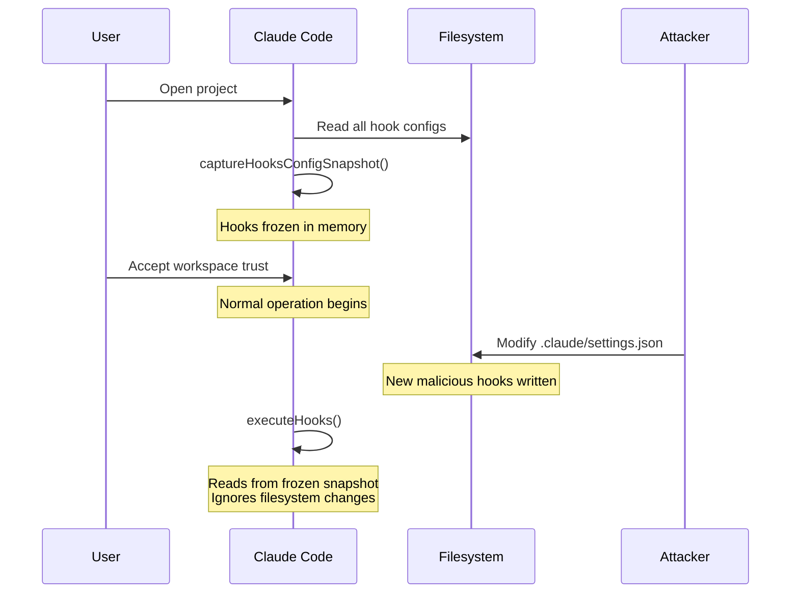
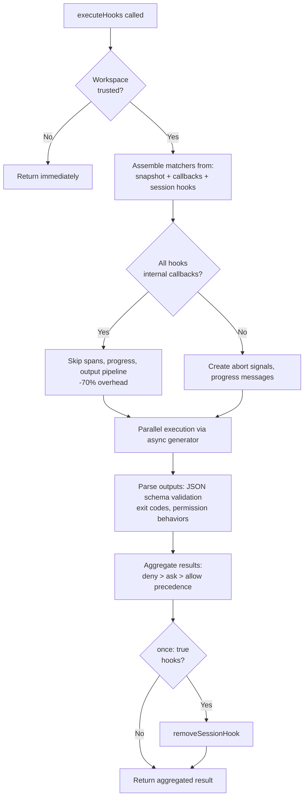

# Глава 12: Расширяемость – skills и приемы

## Два измерения расширения

Каждая система расширяемости отвечает на два вопроса: что может делать система и когда она это делает. Большинство фреймворков объединяют эти два понятия: плагин регистрирует как возможности, так и callbacks жизненного цикла в одном и том же объекте, а граница между «добавлением функции» и «hook функции» стирается до одной регистрации API.

Claude Code четко разделяет их. Skills расширяют возможности модели. Это Markdown files, которые становятся косыми командами, добавляя в диалог новые инструкции при вызове. Hooks расширяются, когда и как что-то происходит. Это hooks жизненного цикла, которые срабатывают в более чем двух дюжинах различных точек во время сеанса, выполняя произвольный код, который может блокировать действия, изменять входные данные, принудительно продолжать или молча наблюдать.

Разделение не случайно. Skills — это контент: они расширяют знания и возможности модели, добавляя текст prompt. Hooks — это поток управления: они изменяют путь выполнения, не меняя того, что известно модели. Skill может научить модель управлять процессом развертывания вашей команды. Перехват может гарантировать, что ни одна команда развертывания не будет выполнена без прохождения набора тестов. Skill добавляет возможности; hook добавляет ограничение.

В этой главе подробно рассматриваются обе системы, а затем рассматривается, где они пересекаются: hooks, объявленные skillsи, которые регистрируются как hooks жизненного цикла в области сеанса при вызове skillа.

---

## Skills: обучение модели новым трюкам

### Двухфазная загрузка

Основная оптимизация системы skills заключается в том, что фронтальная часть загружается при запуске, а полный контент загружается только при вызове.



**Фаза 1** считывает каждый файл `SKILL.md`, отделяет frontmatter YAML от тела Markdown и извлекает метаданные. Поля вступительной части становятся частью System Prompt, поэтому модель знает, что skill существует. Тело Markdown фиксируется в замыкании, но не обрабатывается. Проект с 50 skillsи оплачивает символическую стоимость 50 кратких описаний, а не 50 полных документов.

**Фаза 2** срабатывает, когда модель или пользователь вызывает skill. `getPromptForCommand` добавляет базовый каталог, заменяет переменные (`$ARGUMENTS`, `${CLAUDE_SKILL_DIR}`, `${CLAUDE_SESSION_ID}`) и выполняет встроенные команды оболочки (обратный апостроф с префиксом `!`). Результат возвращается в виде блоков контента, внедренных в разговор.

### Семь источников с приоритетом

Skills поступают из семи различных источников, загружаются параллельно и объединяются по приоритету:

| Приоритет | Источник | Расположение | Заметки |
|----------|--------|----------|-------|
| 1 | Управляемый (Политика) | `<MANAGED_PATH>/.claude/skills/` | Контролируется предприятием |
| 2 | Пользователь | `~/.claude/skills/` | Персональный, доступный везде |
| 3 | Проект | `.claude/skills/` (подошел к дому) | Проверено в системе контроля версий |
| 4 | Дополнительные каталоги | `<add-dir>/.claude/skills/` | Через флаг `--add-dir` |
| 5 | Устаревшие команды | `.claude/commands/` | Обратная совместимость |
| 6 | В комплекте | Скомпилировано в двоичный файл | Функция закрыта |
| 7 | MCP | MCP prompt сервера | Удаленный, ненадежный |

Дедупликация использует `realpath` для разрешения символических ссылок и перекрывающихся родительских каталогов. Побеждает тот, кто первым увидит источник. Функция `getFileIdentity` разрешает канонические пути через `realpath`, а не полагается на значения inode, которые ненадежны при монтировании контейнера/NFS и ExFAT.

### Контракт с фронтменом

Ключевые поля, которые контролируют поведение skills:

| YAML Поле | Цель |
|-----------|---------|
| `name` | Отображаемое имя, обращенное к пользователю |
| `description` | Отображается в автозаполнении и системной prompt |
| `when_to_use` | Подробные сценарии использования для обнаружения моделей |
| `allowed-tools` | Какие tools может использовать skill |
| `disable-model-invocation` | Блокировать использование автономной модели |
| `context` | `'fork'` будет работать в качестве sub-agent |
| `hooks` | Перехватчики жизненного цикла, зарегистрированные при вызове |
| `paths` | Шаблоны Glob для условной активации |

Опция `context: 'fork'` запускает skill в качестве sub-agent с собственным контекстным окном, что важно для skills, требующих значительной доработки, не загрязняя бюджет токенов основного диалога. Поля `disable-model-invocation` и `user-invocable` управляют двумя разными путями доступа — установка для обоих значений true делает skill невидимым, что полезно для skills, использующих только hooks.

### Граница безопасности MCP

После замены переменной выполняются встроенные команды оболочки. Граница безопасности абсолютна: **Skills MCP никогда не выполняют встроенные команды оболочки.** Серверы MCP являются внешними системами. prompt MCP, содержащее `` !`rm -rf /` ``, будет выполняться с полными разрешениями пользователя, если это разрешено. Система рассматривает skills MCP только как содержательные. Эта граница доверия связана с более широкой моделью безопасности MCP, обсуждаемой в главе 15.

### Динамическое обнаружение

Skills загружаются не только при запуске. Когда модель касается файлов, `discoverSkillDirsForPaths` подходит от каждого пути в поисках каталогов `.claude/skills/`. Skills с фронтальной надписью `paths` хранятся на карте `conditionalSkills` и активируются только тогда, когда пути касания соответствуют их шаблонам. Skill, объявляющий `paths: "packages/database/**"`, остается невидимым до тех пор, пока модель не прочитает или не отредактирует файл базы данных — контекстно-зависимое расширение возможностей.

---

## Hooks: контроль того, когда что-то происходит

Hooks — это механизм Claude Code для hook и изменения поведения в точках жизненного цикла. Основной исполнительный механизм превышает 4900 строк. Система обслуживает три аудитории: отдельных разработчиков (индивидуальная проверка, проверка), команд (общие контрольные точки качества, проверенные в проекте) и предприятий (правила соответствия, управляемые политиками).

### Реальный hook: предотвращение коммитов в Main

Прежде чем погрузиться в механизм, вот как выглядит hook на практике. Предположим, ваша команда хочет запретить фиксацию модели непосредственно в ветке `main`.

**Шаг 1. Конфигурация settings.json:**

```json
{
  "hooks": {
    "PreToolUse": [
      {
        "matcher": "Bash",
        "hooks": [
          {
            "type": "command",
            "command": "/path/to/check-not-main.sh",
            "if": "Bash(git commit*)"
          }
        ]
      }
    ]
  }
}
```

**Шаг 2. Сценарий оболочки:**

```bash
#!/bin/bash
BRANCH=$(git rev-parse --abbrev-ref HEAD 2>/dev/null)
if [ "$BRANCH" = "main" ]; then
  echo "Cannot commit directly to main. Create a feature branch first." >&2
  exit 2  # Exit 2 = blocking error
fi
exit 0
```

**Шаг 3. Что испытывает модель.** Когда модель пытается выполнить команду `git commit` на ветке `main`, hook срабатывает до выполнения команды. Сценарий проверяет ветку, записывает в stderr и завершает работу с кодом 2. Модель видит системное сообщение: «Невозможно выполнить фиксацию непосредственно в основной. Сначала создайте ветку функции». Коммит никогда не запускается. Модель создает ветку и вместо этого фиксирует ее.

Условие `if: "Bash(git commit*)"` означает, что сценарий запускается только для команд фиксации git, а не для каждого вызова Bash. Код выхода 2 блока; код выхода 0 проходит; любой другой код выхода выдает неблокирующее предупреждение. Это полный протокол.

### Четыре типа, настраиваемые пользователем

Claude Code определяет шесть типов hooks: четыре настраиваемых пользователем и два внутренних.

**Командные hooks** запускают процесс оболочки. Вход крюка JSON подключен к stdin; hook связывается обратно через код выхода и stdout/stderr. Это тип рабочей лошадки.

**Перехватчики запросов** выполняют один вызов LLM, возвращая `{"ok": true}` или `{"ok": false, "reason": "..."}`. Упрощенная проверка на базе искусственного интеллекта без полного agent loop.

**Agent hooks** запускают многошаговый agentic цикл (максимум 50 ходов, разрешения `dontAsk`, мышление отключено). Каждый получает свою собственную область сеанса. Это сложный механизм «проверки того, что набор тестов проходит и охватывает новую функцию».

**HTTP hooks** POST hook для ввода URL-адреса. Включает удаленные серверы политики и ведение журнала аудита без создания локальных процессов.

Двумя внутренними типами являются **hooks обратного вызова** (регистрируются программно, -70% накладных расходов по горячему пути через быстрый путь, который пропускает отслеживание интервалов) и **hooks функций** (callbacks TypeScript в области сеанса для принудительного применения структурированного вывода в hooks agent).

### Пять наиболее важных событий жизненного цикла

Система hooks срабатывает в более чем двух десятках точек жизненного цикла. Пять из них доминируют в реальном использовании:

**PreToolUse** – срабатывает перед каждым tool execution. Может блокировать, изменять ввод, автоматически утверждать или вводить контекст. Поведение разрешений имеет строгий приоритет: запретить > спросить > разрешить. Самая распространенная точка крепления качественных ворот.

**PostToolUse** – срабатывает после успешного выполнения. Может внедрить контекст или полностью заменить выходные данные tool MCP. Полезно для автоматической обратной связи о результатах работы tool.

**Стоп** — срабатывает до того, как Клод завершает ответ. Блокирующий крюк вызывает продолжение. Это механизм автоматического цикла проверки: «Вы действительно закончили?»

**SessionStart** — срабатывает в начале сеанса. Можно устанавливать переменные среды, переопределять первое сообщение пользователя или регистрировать пути наблюдения за файлами. Невозможно заблокировать (hook не может предотвратить запуск сеанса).

**UserPromptSubmit** – срабатывает, когда пользователь отправляет запрос. Может блокировать обработку, включая проверку ввода или фильтрацию контента до того, как модель его увидит.

**Справочная таблица – оставшиеся события:**

| Категория | События |
|----------|--------|
| Жизненный цикл tool | PostToolUseFailure, PermissionDenied, PermissionRequest |
| Сессия | SessionEnd (тайм-аут 1,5 с), Настройка |
| Sub-agent | Sub-agentСтарт, Sub-agentСтоп |
| Уплотнение | Прекомпакт, Посткомпакт |
| Уведомление | Уведомление, выявление, ElicitationResult |
| Конфигурация | ConfigChange, InstructionsLoaded, CwdChanged, FileChanged, TaskCreated, TaskCompleted, TeammateIdle |

Блокирующая асимметрия является преднамеренной. События, представляющие восстанавливаемые решения (tool calls, условия остановки), поддерживают блокировку. События, представляющие собой необратимые факты (сессия началась, провал API), нет.

### Семантика кода выхода

Для командных hooks коды выхода имеют особое значение:

| Код выхода | Значение | Блоки |
|-----------|---------|--------|
| 0 | Успех, stdout анализируется, если JSON | Нет |
| 2 | Ошибка блокировки, stderr отображается как системное сообщение | Да |
| Другое | Неблокирующее предупреждение, показываемое только пользователю | Нет |

Код выхода 2 был выбран сознательно. Код выхода 1 слишком распространен: любое необработанное исключение, сбой утверждения или синтаксическая ошибка приводит к выходу 1. Использование выхода 2 предотвращает случайное применение.

### Шесть источников hooks

| Источник | Уровень доверия | Заметки |
|--------|-------------|-------|
| `userSettings` | Пользователь | `~/.claude/settings.json`, высший приоритет |
| `projectSettings` | Проект | `.claude/settings.json`, с контролем версий |
| `localSettings` | Местный | `.claude/settings.local.json`, gitignored |
| `policySettings` | Предприятие | Невозможно переопределить |
| `pluginHook` | Плагин | Приоритет 999 (самый низкий) |
| `sessionHook` | Сессия | Только в memory, регистрируется по skills |

---

## Модель безопасности моментальных снимков

Hooks выполняют произвольный код. `.claude/settings.json` проекта может определять hooks, которые срабатывают перед каждым вызовом tool. Что произойдет, если вредоносный репозиторий изменит свои hooks после того, как пользователь примет диалог доверия рабочей области?

Ничего. Конфигурация hooks фиксируется при запуске.



`captureHooksConfigSnapshot()` вызывается один раз во время запуска. С этого момента `executeHooks()` считывает данные из снимка, никогда неявно перечитывая файлы настроек. Снимок обновляется только через явные каналы: команду `/hooks` или обнаружение средства отслеживания файлов, оба из которых перестраиваются через `updateHooksConfigSnapshot()`.

Каскад применения политики: `disableAllHooks` в настройках политики очищает все. `allowManagedHooksOnly` исключает hooks пользователей и проектов. Пользователь может отключить свои собственные hooks, установив `disableAllHooks`, но он не может отключить hooks, управляемые предприятием. Уровень политики всегда побеждает.

Сама проверка доверия (`shouldSkipHookDueToTrust()`) была введена после двух уязвимостей: hook SessionEnd, выполняемые, когда пользователь *отклонил* диалог доверия, и hook SubagentStop, срабатывающие до того, как доверие было предоставлено. У обоих была одна и та же основная причина — срабатывание hooks в State жизненного цикла, когда пользователь не давал согласия на выполнение кода рабочей области. Исправление — централизованные ворота наверху `executeHooks()`.

---

## Поток выполнения



Быстрый путь для внутренних callbacks является значительной оптимизацией. Когда все соответствующие hooks являются внутренними (аналитика доступа к файлам, атрибуция фиксации), система пропускает отслеживание интервалов, создание сигналов прерывания, сообщения о ходе выполнения и полный конвейер обработки вывода. Большинство вызовов PostToolUse затрагивают только внутренние callbacks.

Ввод hook JSON сериализуется один раз через ленивое замыкание `getJsonInput()` и повторно используется во всех параллельных hooks. Наборы внедрения среды `CLAUDE_PROJECT_DIR`, `CLAUDE_PLUGIN_ROOT` и для определенных событий `CLAUDE_ENV_FILE`, где hooks могут записывать экспорт среды.

---

## Интеграция: где skills встречаются с hooks

Когда skill вызывается, его hooks, объявленные в Frontmatter, регистрируются как hooks в области сеанса. `skillRoot` становится `CLAUDE_PLUGIN_ROOT` для команд оболочки hook:

```
my-skill/
  SKILL.md          # The skill content
  validate.sh       # Called by a PreToolUse hook declared in frontmatter
```

В описании skillа говорится:

```yaml
hooks:
  PreToolUse:
    - matcher: "Bash"
      hooks:
        - type: command
          command: "${CLAUDE_PLUGIN_ROOT}/validate.sh"
          once: true
```

Когда пользователь вызывает `/my-skill`, содержимое skillа загружается в диалог И регистрируется ловушка PreToolUse. Следующий tool call Bash запускает `validate.sh`. Поскольку установлен `once: true`, hook удаляется после первого успешного выполнения.

Для agents hooks `Stop`, объявленные во входной части, автоматически преобразуются в hooks `SubagentStop`, поскольку sub-agents запускают `SubagentStop`, а не `Stop`. Без преобразования hook остановки проверки agent никогда не сработает.

### Приоритет поведения разрешений

`executePreToolHooks()` может блокировать (через `blockingError`), автоматически утверждать (через `permissionBehavior: 'allow'`), принудительно запрашивать (через `'ask'`), отклонять (через `'deny'`), изменять ввод (через `updatedInput`) или добавлять контекст (через `additionalContext`). Когда несколько hooks возвращают разное поведение, всегда побеждает метод Deny. Это правильное значение по умолчанию для решений, связанных с безопасностью.

### Стоп-hooks: принудительное продолжение

Когда hook Stop возвращает код выхода 2, модели stderr отображается в качестве обратной связи, и диалог продолжается. Это превращает одноразовый оперативный ответ в целенаправленный цикл. Стоп-hook, пожалуй, самая мощная точка интеграции во всей системе.

---

## Примените это: проектирование системы расширяемости

**Отделение контента от потока управления.** Skills добавляют возможности; hooks ограничивают поведение. Объединив эти два понятия, становится невозможным рассуждать о том, что плагин делает, а что он предотвращает.

**Замораживание конфигурации на границах доверия.** Механизм моментальных снимков фиксирует hooks в момент согласия и никогда не выполняет повторное чтение неявно. Если ваша система выполняет код, предоставленный пользователем, это исключает атаки TOCTOU.

**Используйте необычные коды завершения для семантических сигналов.** Код выхода 1 — это шум: его создает каждая необработанная ошибка. Код выхода 2, поскольку сигнал блокировки предотвращает случайное срабатывание. Выбирайте сигналы, которые требуют осознанного намерения.

**Проверка выполняется на уровне сокета, а не на уровне приложения.** Защита SSRF запускается во время поиска DNS, а не в качестве предполетной проверки. Это устраняет окно перепривязки DNS. При проверке сетевых адресатов проверка должна быть атомарной по отношению к соединению.

**Оптимизация для общего случая.** Быстрый путь внутреннего обратного вызова (накладные расходы -70 %) учитывает, что большинство вызовов hooks затрагивают только внутренние callbacks. Двухфазная загрузка skills учитывает, что большинство skills никогда не активируются в данном сеансе. Каждая оптимизация нацелена на фактическое распределение использования.

Система расширяемости отражает зрелое понимание противоречия между мощностью и безопасностью. Skills дают модели новые возможности, ограниченные линией безопасности MCP (глава 15). Hooks обеспечивают влияние внешнего кода на действия модели, ограниченное механизмом моментальных снимков, семантикой кода завершения и каскадом политик. Ни одна из систем не доверяет другой, и именно взаимное недоверие делает эту комбинацию безопасной для масштабного развертывания.

Следующая глава посвящена визуальному уровню: как Claude Code отображает реактивный UI терминала со скоростью 60 кадров в секунду и обрабатывает ввод по пяти терминальным протоколам.
