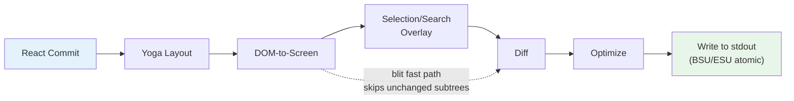
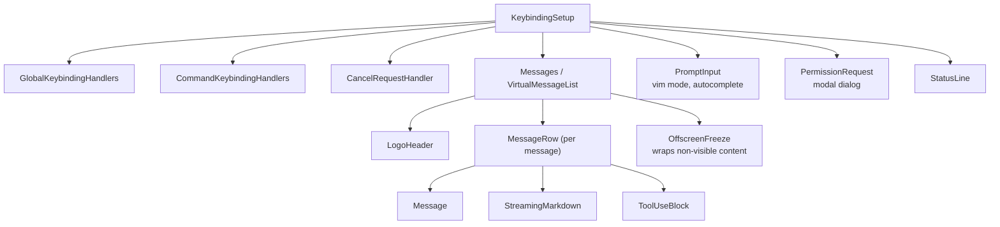

# Глава 13: Пользовательский интерфейс терминала

## Зачем создавать собственный рендерер?

Терминал не является браузером. Нет ни DOM, ни CSS-движка, ни композитора, ни графического конвейера с сохраненным режимом. Существует поток байтов, идущий к stdout, и поток байтов, исходящий от stdin. Все, что находится между этими двумя потоками — макет, стилизация, сравнение, проверка попадания, прокрутка, выбор — должно быть изобретено с нуля.

Claude Code нужен реактивный UI. Он имеет быстрый ввод, потоковый вывод Markdown, диалоговые окна разрешений, индикаторы выполнения, прокручиваемые списки сообщений, подсветку поиска и редактор в режиме vim. React — очевидный выбор для объявления такого типа дерева компонентов. Но React требуется хост-среда для рендеринга, а терминалы ее не предоставляют.

Стандартный ответ — Ink: средство рендеринга React для терминалов, созданное на основе Yoga для макетирования флексбоксов. Claude Code начал с Ink, а затем развил его до неузнаваемости. Стандартная версия выделяет один объект JavaScript на ячейку на кадр — на терминале 200x120, то есть 24 000 объектов создаются и удаляются со сборкой мусора каждые 16 мс. Он различается на уровне строки, сравнивая целые строки текста в кодировке ANSI. В нем нет ни концепции блит-оптимизации, ни двойной буферизации, ни отслеживания загрязнений на уровне ячеек. Для простой приборной панели CLI, обновляющейся раз в секунду, это нормально. Для agent LLM, передающего токены со скоростью 60 кадров в секунду, в то время как пользователь прокручивает разговор с сотнями сообщений, это не самое главное.

В Claude Code остается специальный движок рендеринга, который разделяет концептуальную ДНК Ink (примиритель React, макет Yoga, вывод ANSI), но переопределяет критический путь: упакованные типизированные массивы вместо пообъектной записи, интернирование строк на основе пула вместо построчной обработки, рендеринг с двойной буферизацией с различием на уровне ячеек и оптимизатор, объединяющий записи соседних терминалов в минимальные. escape-последовательности.

Результат выполняется со скоростью 60 кадров в секунду на терминале с 200 столбцами при потоковой передаче токенов от Клода. Чтобы понять, как это сделать, нам нужно изучить четыре уровня: пользовательский DOM, с которым согласовывается React, конвейер рендеринга, который преобразует этот DOM в выходные данные терминала, управление memoryю на основе пула, которое поддерживает работу системы в течение многочасовых сеансов, не утопая в сборке мусора, и архитектуру компонентов, которая связывает все это вместе.

---

## Пользовательский DOM

Примирителю React нужно что-то, с чем можно примириться. В браузере это DOM. В терминале Claude Code это настраиваемое дерево в memory с семью типами элементов и одним типом текстового узла.

Типы элементов напрямую соответствуют концепциям рендеринга терминала:

- **`ink-root`** – корень документа, по одному на каждый экземпляр Ink.
- **`ink-box`** – гибкий контейнер, терминальный эквивалент `<div>`.
- **`ink-text`** — текстовый узел с функцией измерения Yoga для переноса слов.
- **`ink-virtual-text`** — вложенный текст внутри другого текстового узла (автоматически повышается с `ink-text` внутри текстового контекста)
- **`ink-link`** — гиперссылка, отображаемая с помощью escape-последовательностей OSC 8.
- **`ink-progress`** -- индикатор прогресса.
- **`ink-raw-ansi`** — предварительно обработанное содержимое ANSI с известными размерами, используемое для блоков кода с подсветкой синтаксиса.

Каждый `DOMElement` содержит State, необходимое конвейеру рендеринга:

```typescript
// Illustrative — actual interface extends this significantly
interface DOMElement {
  yogaNode: YogaNode;           // Flexbox layout node
  style: Styles;                // CSS-like properties mapped to Yoga
  attributes: Map<string, DOMNodeAttribute>;
  childNodes: (DOMElement | TextNode)[];
  dirty: boolean;               // Needs re-rendering
  _eventHandlers: EventHandlerMap; // Separated from attributes
  scrollTop: number;            // Imperative scroll state
  pendingScrollDelta: number;
  stickyScroll: boolean;
  debugOwnerChain?: string;     // React component stack for debug
}
```

Отделение `_eventHandlers` от `attributes` сделано намеренно. В React идентификатор обработчика меняется при каждом рендеринге (если не запоминается вручную). Если бы обработчики хранились как атрибуты, каждый рендеринг помечал бы узел как «грязный» и вызывал бы полную перерисовку. Сохраняя их отдельно, `commitUpdate` средства согласования может обновлять обработчики, не загрязняя узел.

Функция `markDirty()` — это мост между мутациями DOM и конвейером рендеринга. Когда содержимое любого узла изменяется, `markDirty()` проходит через каждого предка, устанавливая `dirty = true` для каждого элемента и вызывая `yogaNode.markDirty()` для конечных текстовых узлов. Вот как изменение одного символа в глубоко вложенном текстовом узле приводит к повторной визуализации всего пути к корню, но только этого пути. Родственные поддеревья остаются чистыми и могут быть удалены из предыдущего кадра.

Отдельного упоминания заслуживает тип элемента `ink-raw-ansi`. Если блок кода уже выделен синтаксисом (создавая escape-последовательности ANSI), повторный анализ этих последовательностей для извлечения символов и стилей был бы расточительным. Вместо этого предварительно выделенный контент заключен в узел `ink-raw-ansi` с атрибутами `rawWidth` и `rawHeight`, которые сообщают Yoga точные размеры. Конвейер рендеринга записывает необработанное содержимое ANSI непосредственно в выходной буфер, не разбивая его на отдельные стилизованные символы. Это делает блоки кода с подсветкой синтаксиса практически нулевыми после первоначального прохода выделения — самый дорогой визуальный элемент в пользовательском интерфейсе также является самым дешевым для рендеринга.

Функцию измерения узла `ink-text` стоит понять, поскольку она выполняется внутри прохода компоновки Yoga, который является синхронным и блокирующим. Функция получает доступную ширину и должна вернуть размеры текста. Он выполняет перенос слов (с учетом реквизита стиля `wrap`: `wrap`, `truncate`, `truncate-start`, `truncate-middle`), учитывает границы кластера графем (поэтому он не разбивает эмодзи с несколькими кодами на строки), правильно измеряет символы двойной ширины CJK (каждый считается как 2 столбца), и удаляет escape-коды ANSI из расчета ширины (escape-последовательности имеют нулевую визуальную ширину). Все это должно выполняться за микросекунды на узел, поскольку общение с 50 видимыми текстовыми узлами означает 50 вызовов функций измерения за один проход макета.

---

## Контейнер React Fiber

Мост примирителя использует `react-reconciler` для создания пользовательской конфигурации хоста. Это тот же API, который используют React DOM и React Native. Ключевое отличие: Claude Code работает в режиме `ConcurrentRoot`.

```typescript
createContainer(rootNode, ConcurrentRoot, ...)
```

ConcurrentRoot включает параллельные функции React — приостановку для подсветки синтаксиса с отложенной загрузкой, переходы для неблокирующих обновлений State во время streaming. Альтернатива, `LegacyRoot`, будет принудительно выполнять синхронный рендеринг и блокировать цикл событий во время повторного анализа тяжелых уценок.

Методы конфигурации хоста сопоставляют операции React с пользовательскими DOM:

- **`createInstance(type, props)`** создает `DOMElement` через `createNode()`, применяет исходные стили и атрибуты, присоединяет обработчики событий и записывает цепочку владельцев компонентов React для атрибуции отладки. Цепочка владельцев хранится как `debugOwnerChain` и используется режимом `CLAUDE_CODE_DEBUG_REPAINTS` для присвоения полноэкранного сброса конкретным компонентам.
- **`createTextInstance(text)`** создает `TextNode` -- но только если мы находимся внутри текстового контекста. Согласователь требует, чтобы необработанные строки были заключены в `<Text>`. Попытка создать текстовый узел вне текстового контекста выдает ошибку, выявляя класс ошибок во время согласования, а не во время рендеринга.
- **`commitUpdate(node, type, oldProps, newProps)`** различает старые и новые реквизиты посредством поверхностного сравнения, а затем применяет только то, что изменилось. Каждый из стилей, атрибутов и обработчиков событий имеет собственный путь обновления. Функция diff возвращает `undefined`, если ничего не изменилось, полностью избегая ненужных мутаций DOM.
- **`removeChild(parent, child)`** удаляет узел из дерева, рекурсивно освобождает узлы Yoga (вызов `unsetMeasureFunc()` перед `free()`, чтобы избежать доступа к освобожденной memory WASM) и уведомляет диспетчера фокуса.
- **`hideInstance(node)` / `unhideInstance(node)`** переключает `isHidden` и переключает узел Yoga между `Display.None` и `Display.Flex`. Это механизм React для резервных переходов приостановки.
- **`resetAfterCommit(container)`** — критический hook: он вызывает `rootNode.onComputeLayout()` для запуска Yoga, затем `rootNode.onRender()` для планирования отрисовки терминала.

Средство согласования отслеживает два счетчика производительности за цикл фиксации: время макета Yoga (`lastYogaMs`) и общее время фиксации (`lastCommitMs`). Они передаются в `FrameEvent`, о котором сообщает класс Ink, что позволяет контролировать производительность в производстве.

Система событий отражает модель захвата/пузыря браузера. Класс `Dispatcher` реализует полное распространение событий в три этапа: захват (от корня к цели), попадание к цели и пузырь (от цели к корню). Типы событий соответствуют приоритетам планирования React: дискретные для клавиатуры и щелчка (наивысший приоритет, обрабатывается немедленно), непрерывные для прокрутки и изменения размера (можно отложить). Диспетчер завершает всю обработку событий в `reconciler.discreteUpdates()` для правильной batchной обработки React.

Когда вы нажимаете клавишу в терминале, результирующий `KeyboardEvent` передается через пользовательское дерево DOM, перемещаясь от элемента в фокусе до корня точно так же, как событие клавиатуры проходит через элементы браузера DOM. Любой обработчик по пути может вызвать `stopPropagation()` или `preventDefault()`, а семантика идентична спецификации браузера.

---

## Конвейер рендеринга

Каждый кадр проходит семь этапов, каждый из которых рассчитан индивидуально:



Каждый этап рассчитывается индивидуально и сообщается в формате `FrameEvent.phases`. Этот instrumentation на каждом этапе важен для диагностики проблем с производительностью: когда кадр занимает 30 мс, вам нужно знать, является ли узким местом повторное измерение текста Yoga (этап 2), рендеринг, проходящий по большому грязному поддереву (этап 3), или backpressure stdout от медленного терминала (этап 7). Ответ определяет исправление.

**Этап 1: фиксация React и макет Yoga.** Средство согласования обрабатывает обновления State и вызывает `resetAfterCommit`. Это задает ширину корневого узла `terminalColumns` и запускает `yogaNode.calculateLayout()`. Yoga вычисляет все дерево flexbox за один проход, следуя спецификации flexbox CSS: он разрешает flex-grow, flex-shrink, заполнения, поля, пробелы, выравнивание и перенос по всем узлам. Результаты — `getComputedWidth()`, `getComputedHeight()`, `getComputedLeft()`, `getComputedTop()` — кэшируются для каждого узла. Для узлов `ink-text` Yoga вызывает функцию пользовательской меры (`measureTextNode`) во время макета, которая вычисляет размеры текста посредством переноса слов и измерения графемы. Это самая дорогая операция для каждого узла: она должна обрабатывать кластеры графем Unicode, символы двойной ширины CJK, последовательности эмодзи и escape-коды ANSI, встроенные в текстовый контент.

**Этап 2: DOM-на экран.** Средство визуализации сначала обходит дерево DOM в глубину, записывая символы и стили в буфер `Screen`. Каждый персонаж становится упакованной клеткой. На выходе получается полный кадр: каждая ячейка на терминале имеет определенный символ, стиль и ширину.

**Этап 3. Наложение.** Выделение текста и выделение текста при поиске изменяют экранный буфер на месте, переворачивая идентификаторы стилей в совпадающих ячейках. При выборе применяется инверсное видео для создания знакомого вида «выделенного текста». При выделении поиска применяется более агрессивная визуальная обработка: инверсия + желтый передний план + жирный шрифт + подчеркивание для текущего совпадения, инверсия только для других совпадений. Это загрязняет буфер, отслеживаемый флагом `prevFrameContaminated`, поэтому следующий кадр знает, что следует пропустить быстрый путь передачи данных. Загрязнение является преднамеренным компромиссом: изменение буфера на месте позволяет избежать выделения отдельного буфера оверлея (экономия 48 КБ на терминале 200x120) за счет одного кадра с полным повреждением после очистки оверлея.

**Этап 4: Разница.** Новый экран по ячейке сравнивается с экраном передней рамки. Только измененные клетки производят выходные данные. Сравнение представляет собой два целочисленных сравнения на ячейку (два упакованных слова `Int32`), при этом разница проходит по прямоугольнику повреждений, а не по всему экрану. В устойчивом кадре (только тиканье счетчика) это может привести к появлению патчей для 3 ячеек из 24 000. Каждый патч представляет собой объект `{ type: 'stdout', content: string }`, содержащий последовательность перемещения курсора и содержимое ячейки в кодировке ANSI.

**Этап 5: Оптимизация.** Соседние патчи в одной строке объединяются в одну запись. Избыточные перемещения курсора исключены: если патч N заканчивается в столбце 10, а патч N+1 начинается в столбце 11, курсор уже находится в правильном положении и последовательность перемещений не требуется. Переходы стилей предварительно сериализуются через кэш `StylePool.transition()`, поэтому изменение с «жирного красного» на «тусклый зеленый» — это поиск одной кэшированной строки, а не операция сравнения и сериализации. Оптимизатор обычно уменьшает количество байтов на 30–50 % по сравнению с простым выводом по ячейкам.

**Этап 6: Запись.** Оптимизированные исправления сериализуются в escape-последовательности ANSI и записываются в stdout одним вызовом `write()`, завернутым в синхронные маркеры обновления (BSU/ESU) на терминалах, которые их поддерживают. BSU (Начать синхронизированное обновление, `ESC [ ? 2026 h`) приказывает терминалу буферизовать весь следующий вывод, а ESU (`ESC [ ? 2026 l`) приказывает ему сбросить данные. Это устраняет видимые разрывы на терминалах, поддерживающих этот протокол — весь кадр отображается атомарно.

Каждый кадр сообщает о своей временной разбивке через объект `FrameEvent`:

```typescript
interface FrameEvent {
  durationMs: number;
  phases: {
    renderer: number;    // DOM-to-screen
    diff: number;        // Screen comparison
    optimize: number;    // Patch merging
    write: number;       // stdout write
    yoga: number;        // Layout computation
  };
  yogaVisited: number;   // Nodes traversed
  yogaMeasured: number;  // Nodes that ran measure()
  yogaCacheHits: number; // Nodes with cached layout
  flickers: FlickerEvent[];  // Full-reset attributions
}
```

Когда `CLAUDE_CODE_DEBUG_REPAINTS` включен, полноэкранный сброс присваивается исходному компоненту React через `findOwnerChainAtRow()`. Это терминальный эквивалент «Основных обновлений» React DevTools — он показывает, какой компонент вызвал перерисовку всего экрана, что является самой дорогостоящей вещью, которая может произойти в конвейере рендеринга.

Отдельного внимания заслуживает оптимизация блита. Когда узел не загрязнен и его положение не изменилось с момента предыдущего кадра (проверено через кэш узла), средство рендеринга копирует ячейки непосредственно из `prevScreen` на текущий экран вместо повторного рендеринга поддерева. Это делает устойчивые кадры чрезвычайно дешевыми - в типичном кадре, где тикает только счетчик, блит покрывает 99% экрана, и только 3-4 ячейки счетчика перерисовываются с нуля.

Блит отключается при трёх условиях:

1. **`prevFrameContaminated` имеет значение true** — наложение выделения или выделение при поиске изменяют буфер экрана переднего кадра на месте, поэтому этим ячейкам нельзя доверять как «правильному» предыдущему State.
2. **Узел с абсолютным позиционированием был удален**. Абсолютное позиционирование означает, что узел мог закрасить неродственные ячейки, и эти ячейки необходимо повторно визуализировать из элементов, которым они фактически принадлежат.
3. **Макет смещен** — кэшированная позиция любого узла отличается от его текущей вычисленной позиции, что означает, что блит скопирует ячейки в неправильные координаты.

Прямоугольник повреждения (`screen.damage`) отслеживает ограничивающую рамку всех записанных ячеек во время рендеринга. Функция сравнения проверяет только строки внутри этого прямоугольника, пропуская полностью неизмененные области. На терминале со 120 строками, где потоковое сообщение занимает строки 80–100, функция сравнения проверяет 20 строк вместо 120 — сокращение работы сравнения в 6 раз.

---

## Рендеринг с двойным буфером и планирование кадров

Класс Ink поддерживает два буфера кадров:

```typescript
private frontFrame: Frame;  // Currently displayed on terminal
private backFrame: Frame;   // Being rendered into
```

Каждый `Frame` содержит:

- `screen: Screen` -- буфер ячеек (упакованный `Int32Array`)
- `viewport: Size` - размеры терминала во время рендеринга
- `cursor: { x, y, visible }` -- где припарковать курсор терминала
- `scrollHint` - prompt по оптимизации DECSTBM (область прокрутки) для режима альтернативного экрана.
- `scrollDrainPending` - есть ли у ScrollBox оставшаяся дельта прокрутки для обработки

После каждого рендеринга кадры меняются местами: `backFrame = frontFrame; frontFrame = newFrame`. Старый передний кадр становится следующим задним кадром, предоставляя `prevScreen` для оптимизации блит-анализа и базовую линию для сравнения на уровне ячеек.

Эта конструкция с двойным буфером исключает распределение. Вместо создания нового `Screen` в каждом кадре средство рендеринга повторно использует буфер заднего кадра. Обмен — это присвоение указателя. Шаблон заимствован из графического программирования, где двойная буферизация предотвращает разрыв, гарантируя, что дисплей считывает полный кадр, в то время как средство рендеринга записывает в другой. В контексте терминала разрыв не является проблемой (это решает протокол BSU/ESU); Беспокойство вызывает давление GC из-за выделения и удаления объектов `Screen`, содержащих более 48 КБ типизированных массивов, каждые 16 мс.

При планировании рендеринга используется lodash `throttle` со скоростью 16 мс (приблизительно 60 кадров в секунду) с включенными передним и задним фронтами:

```typescript
const deferredRender = () => queueMicrotask(this.onRender);
this.scheduleRender = throttle(deferredRender, FRAME_INTERVAL_MS, {
  leading: true,
  trailing: true,
});
```

Отсрочка микрозадачи не случайна. `resetAfterCommit` выполняется до фазы эффектов макета React. Если бы средство рендеринга работало здесь синхронно, оно пропустило бы объявления курсора, установленные в `useLayoutEffect`. Микрозадача выполняется после эффектов макета, но в пределах одного и того же тика цикла событий — терминал видит один последовательный кадр.

Для операций прокрутки отдельный `setTimeout` на 4 мс (FRAME_INTERVAL_MS >> 2) обеспечивает более быструю прокрутку кадров, не мешая дросселю. Мутации прокрутки полностью обходят React: `ScrollBox.scrollBy()` изменяет свойства узла DOM напрямую, вызывает `markDirty()` и планирует рендеринг с помощью микрозадачи. Никакого обновления State React, никаких затрат на сверку, никакого повторного рендеринга всего списка сообщений для одного события колеса.

**Обработка изменения размера** выполняется синхронно, без устранения дребезга. При изменении размера терминала `handleResize` немедленно обновляет размеры, чтобы сохранить единообразие макета. В режиме альтернативного экрана он сбрасывает буферы кадров и откладывает `ERASE_SCREEN` в следующий атомарный блок рисования BSU/ESU, а не записывает его немедленно. Синхронная запись стирания оставила бы экран пустым на ~80 мс, которые занимает рендеринг; откладывание его в атомный блок означает, что старый контент остается видимым до тех пор, пока новый кадр не будет полностью готов.

**Управление альтернативным экраном** добавляет еще один уровень. Компонент `AlternateScreen` входит в альтернативный экранный буфер DEC 1049 при монтировании, ограничивая высоту строк терминалов. Он использует `useInsertionEffect`, а не `useLayoutEffect`, чтобы гарантировать, что escape-последовательность `ENTER_ALT_SCREEN` достигнет терминала до первого кадра рендеринга. Использовать `useLayoutEffect` было бы слишком поздно: первый кадр будет отображаться в буфере основного экрана, вызывая видимую вспышку перед переключением. `useInsertionEffect` запускается до эффектов макета и до того, как браузер (или терминал) начнет рисовать, что делает переход плавным.

---

## Memory на основе пула: почему интернирование имеет значение

Терминал с 200 столбцами и 120 строками имеет 24 000 ячеек. Если бы каждая ячейка была объектом JavaScript со строкой `char`, строкой `style` и строкой `hyperlink`, то это 72 000 выделений строк на кадр - плюс 24 000 выделений объектов для самих ячеек. При 60 кадрах в секунду это 5,76 миллиона выделений в секунду. Bundler мусора V8 может справиться с этим, но не без пауз, которые проявляются в виде пропущенных кадров. Паузы GC обычно составляют 1–5 мс, но они непредсказуемы: они могут случаться во время обновления токена streaming, вызывая видимые заикания именно тогда, когда пользователь просматривает выходные данные.

Claude Code полностью устраняет эту проблему с помощью упакованных типизированных массивов и трех пулов интернирования. Результат: нулевое выделение объектов для каждого кадра в буфере ячеек. Единственные выделения находятся в самих пулах (амортизируются, поскольку большинство символов и стилей интернируются в первом кадре и впоследствии используются повторно) и в строках патчей, созданных в результате сравнения (неизбежно, поскольку stdout.write требует строковые или буферные аргументы).

**Макет ячеек** использует два слова `Int32` на ячейку, хранящиеся в смежной ячейке `Int32Array`:

```
word0: charId        (32 bits, index into CharPool)
word1: styleId[31:17] | hyperlinkId[16:2] | width[1:0]
```

Параллельное представление `BigInt64Array` одного и того же буфера позволяет выполнять массовые операции: очистка строки выполняется одним вызовом `fill()` для 64-битных слов вместо обнуления отдельных полей.

**CharPool** преобразует строки символов в целочисленные идентификаторы. У него есть быстрый путь для ASCII: `Int32Array` из 128 записей сопоставляет коды символов непосредственно с индексами пула, полностью избегая поиска `Map`. Многобайтовые символы (эмодзи, иероглифы CJK) преобразуются в `Map<string, number>`. Индекс 0 — это всегда пробел, индекс 1 — всегда пустая строка.

```typescript
export class CharPool {
  private strings: string[] = [' ', '']
  private ascii: Int32Array = initCharAscii()

  intern(char: string): number {
    if (char.length === 1) {
      const code = char.charCodeAt(0)
      if (code < 128) {
        const cached = this.ascii[code]!
        if (cached !== -1) return cached
        const index = this.strings.length
        this.strings.push(char)
        this.ascii[code] = index
        return index
      }
    }
    // Map fallback for multi-byte characters
    ...
  }
}
```

**StylePool** преобразует массивы кодов стилей ANSI в целочисленные идентификаторы. Самое интересное: бит 0 каждого идентификатора кодирует, оказывает ли стиль видимое влияние на пробельные символы (цвет фона, инверсия, подчеркивание). Стили, предназначенные только для переднего плана, получают четные идентификаторы; стили, видимые в пробелах, получают нечетные идентификаторы. Это позволяет средству визуализации пропускать невидимые пробелы с помощью одной проверки битовой маски — `if (!(styleId & 1) && charId === 0) continue` — без поиска определения стиля. Пул также кэширует предварительно сериализованные строки перехода ANSI между любыми двумя идентификаторами стилей, поэтому переход от «жирного красного» к «тусклому зеленому» представляет собой конкатенацию кэшированных строк, а не операцию сравнения и сериализации.

**HyperlinkPool** интерпретирует URI гиперссылок OSC 8. Индекс 0 означает отсутствие гиперссылки.

Все три бассейна являются общими для передней и задней рамы. Это критическое дизайнерское решение. Поскольку пулы являются общими, интернированные идентификаторы действительны во всех кадрах: оптимизация блит-анализа может копировать упакованные слова ячеек непосредственно из `prevScreen` на текущий экран без повторного интернирования. Функция diff может сравнивать идентификаторы как целые числа без поиска строк. Если бы каждый кадр имел свои собственные пулы, то блиту пришлось бы повторно интернировать каждую скопированную ячейку (ища строку по старому идентификатору, а затем интернируя ее в новый пул), что сводило бы на нет большую часть выигрыша в производительности блита.

Пулы периодически сбрасываются (каждые 5 минут), чтобы предотвратить неограниченный рост во время длительных сессий. Миграционный проход повторно помещает живые клетки передней рамки в свежие пулы.

**CellWidth** обрабатывает символы двойной ширины с 2-битной классификацией:

| Значение | Значение |
|-------|---------|
| 0 (Узкий) | Стандартный одноколоночный символ |
| 1 (широкий) | Головная ячейка CJK/emoji, занимает два столбца |
| 2 (спейсертейл) | Второй столбец широкого характера |
| 3 (Распорная головка) | Мягкий маркер продолжения |

Оно хранится в младших двух битах `word1`, что делает проверку ширины упакованных ячеек бесплатной — в обычном случае извлечение полей не требуется.

Дополнительные метаданные для каждой ячейки хранятся в параллельных массивах, а не в упакованных ячейках:

- **`noSelect: Uint8Array`** — флаг для каждой ячейки, исключающий содержимое из выделения текста. Используется для хрома UI (рамки, индикаторы), который не должен появляться в скопированном тексте.
- **`softWrap: Int32Array`** – маркер каждой строки, указывающий продолжение переноса по словам. Когда пользователь выделяет текст поперек строки с мягким переносом, логика выбора знает, что не следует вставлять новую строку в точку переноса.
- **`damage: Rectangle`** — ограничивающая рамка всех записанных ячеек в текущем кадре. Функция diff проверяет только строки внутри этого прямоугольника, пропуская полностью неизмененные области.

Эти параллельные массивы позволяют избежать расширения формата упакованных ячеек (что могло бы увеличить нагрузку на кэш во внутреннем цикле сравнения), обеспечивая при этом метаданные, необходимые для выбора, копирования и оптимизации.

`Screen` также предоставляет фабрику `createScreen()`, которая принимает размеры и ссылки на пул. Создание экрана обнуляет `Int32Array` через `fill(0n)` в представлении `BigInt64Array` — один встроенный вызов, который очищает весь буфер за микросекунды. Это используется во время изменения размера (когда необходимы новые буферы кадров) и во время миграции пула (когда ячейки старого экрана повторно интернируются в новые пулы).

---

## Компонент REPL

REPL (`REPL.tsx`) составляет примерно 5000 строк. Это самый крупный компонент в кодовой базе, и на это есть веская причина: он является организатором всего интерактивного взаимодействия. Все течет через него.

Компонент состоит примерно из девяти разделов:

1. **Импорт** (~100 строк) — извлекает State начальной загрузки, команды, историю, hooks, компоненты, привязки клавиш, отслеживание затрат, уведомления, поддержку роя/команды, голосовую интеграцию.
2. **Импорт с пометкой функции** – условная загрузка голосовой интеграции, упреждающего режима, краткого tool и agent координатора через защиту `feature()` с помощью `require()`.
3. **Управление State** — расширенные вызовы `useState`, охватывающие сообщения, режим ввода, ожидающие разрешения, диалоговые окна, пороговые значения стоимости, State сеанса, State tool и State agent.
4. **QueryGuard** — управляет жизненным циклом активного вызова API, предотвращая наложение одновременных запросов друг на друга.
5. **Обработка сообщений** — обрабатывает входящие сообщения из цикла запросов, нормализует порядок, управляет State streaming.
6. **Поток разрешений для tool** — координирует запросы разрешений между блоками использования tool и диалоговым окном PermissionRequest.
7. **Управление сеансом** — возобновление, переключение, экспорт разговоров.
8. **Настройка привязки клавиш** — подключает provider привязок клавиш: `KeybindingSetup`, `GlobalKeybindingHandlers`, `CommandKeybindingHandlers`.
9. **Дерево рендеринга** – составляет окончательный UI из всего вышеперечисленного.

Его дерево рендеринга составляет полный интерфейс в полноэкранном режиме:



`OffscreenFreeze` — это оптимизация производительности, специфичная для рендеринга терминала. Когда сообщение прокручивается над областью просмотра, его элемент React кэшируется, а его поддерево замораживается. Это не позволяет обновлениям на основе таймера (спиннеры, счетчики прошедшего времени) в закадровых сообщениях вызывать перезагрузку терминала. Без этого вращающийся индикатор в сообщении 3 вызвал бы полную перерисовку, даже если пользователь просматривает сообщение 47.

Компонент полностью компилируется компилятором React. Вместо ручных `useMemo` и `useCallback` компилятор вставляет запоминание для каждого выражения, используя массивы слотов:

```typescript
const $ = _c(14);  // 14 memoization slots
let t0;
if ($[0] !== dep1 || $[1] !== dep2) {
  t0 = expensiveComputation(dep1, dep2);
  $[0] = dep1; $[1] = dep2; $[2] = t0;
} else {
  t0 = $[2];
}
```

Этот шаблон появляется в каждом компоненте кодовой базы. Он обеспечивает более тонкую детализацию, чем `useMemo` (который запоминает на уровне hook) — отдельные выражения внутри функции рендеринга получают собственное отслеживание и кэширование зависимостей. Для компонента из 5000 строк, такого как REPL, это устраняет сотни потенциально ненужных повторных вычислений за один рендер.

---

## Выбор и выделение при поиске

Выбор текста и подсветка поиска действуют как наложения экранного буфера, применяемые после основного рендеринга, но до сравнения.

**Выделение текста** доступно только на альтернативном экране. Экземпляр Ink содержит привязку отслеживания `SelectionState` и точки фокусировки, режим перетаскивания (символ/слово/строка) и захваченные строки, прокрутившиеся за пределы экрана. Когда пользователь щелкает мышью и перетаскивает, обработчик выбора обновляет эти координаты. Во время `onRender` `applySelectionOverlay` просматривает затронутые строки и изменяет идентификаторы стилей ячеек на месте с помощью `StylePool.withSelectionBg()`, который возвращает новый идентификатор стиля с добавленным инверсным видео. Эта прямая мутация экранного буфера является причиной существования флага `prevFrameContaminated` — буфер переднего кадра был изменен наложением, поэтому следующий кадр не может доверять ему для оптимизации блиц и должен выполнять разницу с полным повреждением.

Для отслеживания мыши используется режим SGR 1003, который сообщает о щелчках, перетаскиваниях и движении с координатами столбца/строки. Компонент `App` реализует обнаружение множественных щелчков: двойной щелчок выделяет слово, тройной щелчок выделяет строку. При обнаружении используется тайм-аут 500 мс и допуск положения в 1 ячейку (мышь может перемещать одну ячейку между щелчками без сброса счетчика нескольких щелчков). Щелчки по гиперссылке намеренно откладываются на этот тайм-аут — двойной щелчок по ссылке выбирает слово вместо открытия браузера, что соответствует поведению, которое пользователи ожидают от текстовых редакторов.

Механизм восстановления потерянного выпуска обрабатывает случай, когда пользователь начинает перетаскивание внутри терминала, перемещает мышь за пределы окна и отпускает. Терминал сообщает о нажатии и перетаскивании, но не об отпускании (которое произошло за его окном). Без восстановления выделение навсегда застрянет в режиме перетаскивания. Восстановление работает путем обнаружения событий движения мыши без нажатых кнопок — если мы находимся в State перетаскивания и получаем событие отсутствия движения кнопки, мы делаем вывод, что кнопка была отпущена за пределами окна, и завершаем выбор.

**Подсветка поиска** имеет два механизма, работающих параллельно. Путь на основе сканирования (`applySearchHighlight`) проходит по видимым ячейкам в поисках строки запроса и применяет инверсный стиль SGR. Путь на основе позиции использует предварительно вычисленные `MatchPosition[]` из `scanElementSubtree()`, сохраненные относительно сообщения, и применяет их к известным смещениям с желтой подсветкой «текущего соответствия» с использованием составных кодов ANSI (инверсный + желтый передний план + жирный шрифт + подчеркивание). Желтый передний план в сочетании с инверсным становится желтым фоном — терминал меняет местами fg/bg, когда инверсия активна. Подчеркивание — это запасной маркер видимости для тем, в которых желтый цвет конфликтует с существующими цветами фона.

**Объявление курсора** решает тонкую проблему. Эмуляторы терминала отображают предварительно отредактированный текст IME (редактор метода ввода) в физической позиции курсора. Пользователям CJK, составляющим символы, необходимо, чтобы курсор находился в позиции курсора ввода текста, а не в нижней части экрана, где терминал естественным образом парковал бы его. Hook `useDeclaredCursor` позволяет компоненту объявлять, где должен находиться курсор после каждого кадра. Класс Ink считывает позицию объявленного узла из `nodeCache`, преобразует ее в экранные координаты и генерирует последовательности перемещения курсора после сравнения. Программы чтения с экрана и лупы также отслеживают физический курсор, поэтому этот механизм обеспечивает удобство доступа так же, как и ввод CJK.

В режиме главного экрана объявленная позиция курсора отслеживается отдельно от `frame.cursor` (который должен оставаться внизу содержимого для инвариантов относительного перемещения обновления журнала). В режиме альтернативного экрана проблема проще: каждый кадр начинается с `CSI H` (домой курсора), поэтому объявленный курсор — это просто абсолютная позиция, создаваемая в конце кадра.

---

## Потоковая разметка

Рендеринг вывода LLM — самая требовательная Task, с которой сталкивается UI терминала. Токены поступают по одному, 10–50 в секунду, и каждый меняет содержимое сообщения, которое может содержать блоки кода, списки, жирный текст и встроенный код. Наивный подход — повторный анализ всего сообщения для каждого токена — будет иметь катастрофические масштабы.

Claude Code использует три оптимизации:

**Кэширование токенов.** Кэш LRU на уровне модуля (500 записей) хранит результаты `marked.lexer()`, связанные с хэшем контента. Кэш выдерживает циклы размонтирования/перемонтирования React во время виртуальной прокрутки. Когда пользователь прокручивает назад к ранее отображаемому сообщению, токены Markdown обслуживаются из кеша, а не анализируются повторно.

**Обнаружение быстрого пути.** `hasMarkdownSyntax()` проверяет первые 500 символов на наличие маркеров Markdown с помощью одного регулярного выражения. Если синтаксис не найден, он создает токен из одного абзаца напрямую, минуя полный анализатор GFM. Это экономит примерно 3 мс на рендеринг текстовых сообщений, что важно при рендеринге со скоростью 60 кадров в секунду.

**Отложенная подсветка синтаксиса.** Подсветка блоков кода загружается через React `Suspense`. Компонент `MarkdownBody` немедленно визуализируется с использованием `highlight={null}` в качестве запасного варианта, а затем разрешается асинхронно с экземпляром cli-highlight. Пользователь видит код сразу (без стиля), а через пару кадров он становится цветным.

Случай с потоковой передачей добавляет морщин. Когда токены поступают из модели, содержимое Markdown постепенно увеличивается. Повторный анализ всего содержимого каждого токена будет занимать O(n^2) в течение всего сообщения. Обнаружение быстрого пути помогает — большая часть потокового контента представляет собой простые текстовые абзацы, которые полностью обходят анализатор, — но для сообщений с блоками кода и списками реальную оптимизацию обеспечивает кэш LRU. Ключом кэша является хеш контента, поэтому, когда прибудет 10 токенов и изменится только последний абзац, cached результат анализа для неизмененного префикса будет повторно использован. Средство рендеринга Markdown повторно анализирует только измененный хвост.

Компонент `StreamingMarkdown` отличается от статического компонента `Markdown`. Он обрабатывает случай, когда контент все еще генерируется: неполные границы кода (` ``` ` без закрывающей границы), частичные жирные маркеры и усеченные элементы списка. Потоковый вариант более щадящий при синтаксическом анализе — он не допускает ошибок в незамкнутом синтаксисе, поскольку закрывающий синтаксис еще не прибыл. Когда сообщение завершает потоковую передачу, компонент переходит к статическому средству визуализации `Markdown`, которое применяет полный анализ GFM со строгой проверкой синтаксиса.

Подсветка синтаксиса для блоков кода — самая затратная операция для каждого элемента в конвейере рендеринга. Для выделения блока кода из 100 строк с помощью cli-highlight может потребоваться 50–100 мс. Загрузка самой библиотеки подсветки занимает 200-300мс (она объединяет определения грамматики для десятков языков). Обе затраты скрыты за React `Suspense`: блок кода немедленно визуализируется как обычный текст, библиотека подсветки загружается асинхронно, и когда она разрешается, блок кода повторно визуализируется с использованием цветов. Пользователь мгновенно видит код и мгновенно раскрашивает его — гораздо лучше, чем пустой кадр длительностью 300 мс во время загрузки библиотеки.

---

## Примените это: эффективный рендеринг потокового вывода

Конвейер рендеринга терминала — это пример устранения работы. В основе дизайна лежат три принципа:

**Интернируйте все.** Если у вас есть значение, которое появляется в тысячах ячеек (стиль, символ, URL-адрес), сохраните его один раз и ссылайтесь на него по целочисленному идентификатору. Целочисленное сравнение — это одна инструкция процессора. Сравнение строк представляет собой цикл. Когда ваш внутренний цикл выполняется 24 000 раз за кадр со скоростью 60 кадров в секунду, разница между `===` для целых чисел и `===` для строк — это разница между плавной прокруткой и видимой задержкой.

**Различие на правильном уровне.** Различие на уровне ячеек звучит дорого — 24 000 сравнений на кадр. Но это два целочисленных сравнения на ячейку (упакованные слова), и в устойчивом кадре diff выходит из большинства строк после проверки первой ячейки. Альтернатива — повторная визуализация всего экрана и запись его в stdout — создаст более 100 КБ escape-последовательностей ANSI на кадр. Разница обычно составляет менее 1 КБ.

**Отделите «горячий» путь от React.** События прокрутки поступают с частотой ввода данных мышью (потенциально сотни в секунду). Маршрутизация каждого из них через устройство согласования React — обновление State, согласование, фиксация, макет, рендеринг — добавляет задержку на 5–10 мс на каждое событие. Путем непосредственного изменения узлов DOM и планирования рендеринга с помощью микрозадачи путь прокрутки остается менее 1 мс. React участвует только в финальной отрисовке, где он и так будет работать.

Эти принципы применимы к любой системе потокового вывода, а не только к терминалам. Если вы создаете веб-приложение, которое отображает данные в реальном времени — средство просмотра журналов, клиент чата, панель мониторинга — применяются те же компромиссы. Стажер повторяющиеся значения. Отличие от предыдущего кадра. Держите горячий путь подальше от своей реактивной структуры.

Четвертый принцип, характерный для длительных сессий: **периодическая очистка.** Пулы Claude Code монотонно растут по мере интернирования новых персонажей и стилей. За многочасовой сеанс пулы могут накопить тысячи записей, на которые больше не ссылается ни одна живая ячейка. Этот рост ограничивается 5-минутным циклом сброса: каждые 5 минут создаются новые пулы, ячейки переднего фрейма мигрируют (переинтернируются в новые пулы), а старые пулы становятся мусором. Это стратегия сбора данных поколений, применяемая на уровне приложения, поскольку garbage collector JavaScript не имеет представления о семантической жизнеспособности записей пула.

Решение использовать `Int32Array` вместо простых объектов имеет более тонкое преимущество, помимо давления GC: локальность memory. Когда функция diff сравнивает 24 000 ячеек, она проходит по непрерывному типизированному массиву. Современные процессоры предварительно выбирают последовательные обращения к memory, поэтому сравнение всего экрана выполняется в кэше L1/L2. Макет «объект на ячейку» будет разбрасывать ячейки по куче, превращая каждое сравнение в промах в кэше. Разница в производительности измерима: на экране 200x120 разница типизированного массива завершается менее чем за 0,5 мс, тогда как эквивалентная разница на основе объектов занимает 3–5 мс — этого достаточно, чтобы сократить бюджет кадра в 16 мс в сочетании с другими этапами конвейера.

Пятый принцип применим к любой системе, которая отображает сетку фиксированного размера: **отслеживайте границы повреждений.** Прямоугольник `damage` на каждом экране записывает ограничивающую рамку ячеек, которые были записаны во время рендеринга. Функция diff обращается к этому прямоугольнику и полностью пропускает строки за его пределами. Когда потоковое сообщение занимает нижние 20 строк 120-строчного терминала, функция diff проверяет 20 строк, а не 120. В сочетании с оптимизацией blit (которая заполняет прямоугольник повреждения только для перерисованных, а не для перерисованных областей), это означает, что общий случай - одно сообщение в streaming, в то время как остальная часть разговора статична - затрагивает часть экранного буфера.

Более общий урок: производительность системы рендеринга заключается не в том, чтобы сделать какую-то отдельную операцию быстрой. Речь идет о полном отказе от операций. Блит исключает повторный рендеринг. Прямоугольник повреждений устраняет различия. Совместное использование пула исключает повторное стажирование. Упакованные клетки исключают выделение. Каждая оптимизация удаляет целую категорию работы, и они складываются мультипликативно.

Для сравнения: кадр в худшем случае (все грязное, без пятен, полноэкранные повреждения) на терминале 200x120 занимает примерно 12 мс. В лучшем случае кадр (один грязный узел, все остальное разрушено, трехрядный прямоугольник повреждений) занимает менее 1 мс. В лучшем случае система проводит большую часть своего времени. Прибытие токена streaming запускает один грязный текстовый узел, который загрязняет своих предков до контейнера сообщений, который обычно занимает 10–30 строк экрана. Блит обрабатывает остальные 90-110 строк. Прямоугольник повреждения ограничивает разницу грязной областью. Поиск в пуле представляет собой целочисленную операцию. В стабильной стоимости streaming одного токена преобладает макет Yoga (который повторно измеряет грязный текстовый узел и его предки) и повторный анализ Markdown, а не сам конвейер рендеринга.


---


