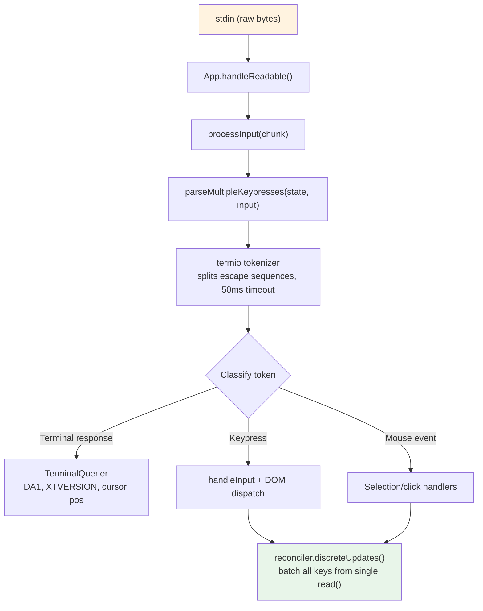
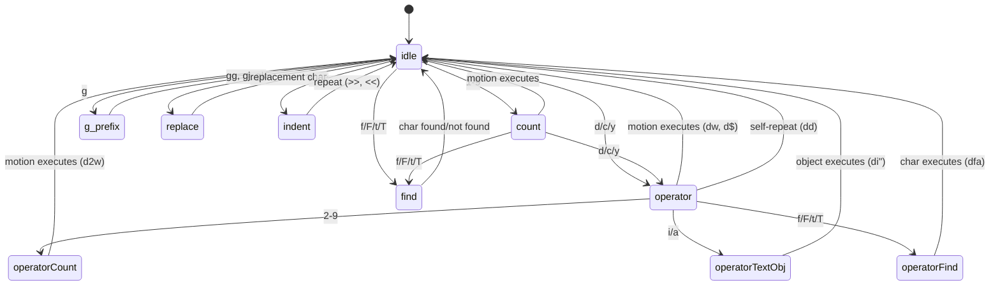

# Глава 14: Ввод и взаимодействие

## Необработанные байты, значимые действия

Когда вы нажимаете Ctrl+X, а затем Ctrl+K в Claude Code, терминал отправляет две последовательности байтов, разделенные примерно 200 миллисекундами. Первый — `0x18` (ASCII CAN). Второй — `0x0B` (ASCII VT). Ни один из этих байтов не несет никакого внутреннего значения, кроме «символа управления». Система ввода должна распознавать, что эти два байта, поступающие последовательно в течение тайм-аута, составляют хорду `ctrl+x ctrl+k`, которая соответствует действию `chat:killAgents`, которое завершает работу всех работающих sub-agents.

Между необработанными байтами и уничтоженными agentsи активируются шесть систем: токенизатор разделяет escape-последовательности, синтаксический анализатор классифицирует их по пяти терминальным протоколам, преобразователь привязки клавиш сопоставляет последовательность с контекстно-зависимыми привязками, конечный автомат аккордов управляет последовательностью нескольких клавиш, обработчик выполняет действие, а React группирует результирующие обновления State в один рендеринг.

Трудность не заключается ни в одной из этих систем. Это комбинаторный взрыв терминального разнообразия. iTerm2 отправляет последовательности протокола клавиатуры Kitty. Терминал macOS отправляет устаревшие последовательности VT220. Ghostty через SSH отправляет xterm ModifyOtherKeys. tmux может поглощать, преобразовывать или передавать через любой из них в зависимости от его конфигурации. У Windows Terminal есть свои особенности работы с режимом VT. Система ввода должна создавать правильные объекты `ParsedKey` из всех них, поскольку пользователю не нужно знать, какой протокол клавиатуры использует его терминал.

В этой главе прослеживается путь от необработанных байтов к значимым действиям в этом ландшафте.

Философия дизайна — постепенное улучшение с плавным ухудшением. На современном терминале с поддержкой протокола клавиатуры Kitty Claude Code обеспечивает полное обнаружение модификаторов (Ctrl+Shift+A отличается от Ctrl+A), отчет о суперклавишах (сочетания клавиш Cmd) и однозначную идентификацию клавиш. На устаревшем терминале через SSH он возвращается к лучшему доступному протоколу, теряя некоторые различия модификаторов, но сохраняя основные функциональные возможности. Пользователь никогда не увидит сообщения об ошибке о том, что его терминал не поддерживается. Возможно, они не смогут использовать `ctrl+shift+f` для глобального поиска, но `ctrl+r` для поиска по истории работает везде.

---

## Конвейер анализа ключей

Ввод поступает в виде блоков байтов на stdin. Конвейер обрабатывает их поэтапно:



Токенайзер — это основа. Ввод терминала представляет собой поток байтов, в котором смешаны печатные символы, управляющие коды и многобайтовые escape-последовательности без явного кадрирования. Одиночный `read()` из stdin может возвращать `\x1b[1;5A` (Ctrl+стрелка вверх) или может возвращать `\x1b` при одном чтении и `[1;5A` при следующем, в зависимости от того, насколько быстро байты поступают из PTY. Токенизатор поддерживает конечный автомат, который буферизует частичные escape-последовательности и выдает полные токены.

Проблема неполной последовательности является фундаментальной. Когда токенизатор видит одиночный `\x1b`, он не может знать, является ли это клавишей Escape или началом последовательности CSI. Он буферизует байт и запускает таймер на 50 мс. Если продолжение не поступает, буфер очищается, и `\x1b` становится нажатием клавиши Escape. Но перед сбросом токенизатор проверяет `stdin.readableLength` — если байты ожидают в буфере ядра, таймер перезагружается, а не сбрасывается. Это обрабатывает случай, когда цикл событий был заблокирован по истечении 50 мс, а байты продолжения уже буферизованы, но еще не прочитаны.

Для операций вставки время ожидания увеличивается до 500 мс. Вставленный текст может быть большим и состоять из нескольких фрагментов.

Все проанализированные ключи из одного `read()` обрабатываются за один вызов `reconciler.discreteUpdates()`. При этом batchно обновляется State React, так что вставка 100 символов приводит к одному повторному рендерингу, а не к 100. Пакетирование имеет важное значение: без него каждый символ в вставке запускает полный цикл согласования - обновление State, согласование, фиксация, макет Yoga, рендеринг, сравнение, запись. При 5 мс за цикл обработка 100-символьной вставки займет 500 мс. При batchной обработке та же паста занимает один цикл длительностью 5 мс.

### stdin Управление

Компонент `App` управляет необработанным режимом посредством подсчета ссылок. Когда любому компоненту требуется необработанный ввод (prompt, диалоговое окно, режим vim), он вызывает `setRawMode(true)`, увеличивая счетчик. Когда ему больше не нужны необработанные данные, он вызывает `setRawMode(false)`, уменьшая его. Режим Raw отключается только тогда, когда счетчик достигает нуля. Это предотвращает распространенную ошибку в терминальных приложениях: компонент A включает необработанный режим, компонент B включает необработанный режим, компонент A отключает необработанный режим, и внезапно вход компонента B прерывается, поскольку необработанный режим был глобально отключен.

При первом включении режима Raw приложение:

1. Останавливает ранний захват ввода (механизм фазы начальной загрузки, который собирает нажатия клавиш до монтирования React)
2. Переводит stdin в необработанный режим (без буферизации строк, без эха, без обработки сигнала)
3. Подключает прослушиватель `readable` для асинхронной обработки ввода.
4. Включает вставку в квадратных скобках (чтобы вставленный текст можно было идентифицировать).
5. Включает отчеты о фокусе (чтобы приложение знало, когда окно терминала получает или теряет фокус)
6. Включает расширенную отчетность по клавишам (протокол клавиатуры Kitty + xterm ModifyOtherKeys).

При отключении все происходит в обратном порядке. Тщательное секвенирование предотвращает утечки escape-последовательностей — отключение расширенной отчетности по ключам перед отключением необработанного режима гарантирует, что терминал не продолжит отправлять последовательности в кодировке Kitty после того, как приложение прекратило их анализ.

Обработчик сигнала `onExit` (через batch `signal-exit`) обеспечивает очистку даже при неожиданном завершении. Если процесс получает SIGTERM или SIGINT, обработчик отключает необработанный режим, восстанавливает State терминала, выходит из альтернативного экрана, если он активен, и повторно показывает курсор перед завершением процесса. Без этой очистки сбой сеанса Claude Code оставил бы терминал в необработанном режиме без курсора и эха — пользователю нужно было бы вслепую набрать `reset`, чтобы восстановить свой терминал.

---

## Поддержка нескольких протоколов

Терминалы не договорились о том, как кодировать ввод с клавиатуры. Современный эмулятор терминала, такой как Kitty, отправляет структурированные последовательности с полной информацией о модификаторах. Устаревший терминал через SSH отправляет неоднозначные последовательности байтов, для интерпретации которых требуется контекст. Синтаксический анализатор Claude Code одновременно обрабатывает пять различных протоколов, поскольку терминал пользователя может быть любым из них.

**CSI u (протокол клавиатуры Kitty)** — современный стандарт. Формат: `ESC [ codepoint [; modifier] u`. Пример: `ESC[13;2u` — это Shift+Enter, `ESC[27u` — Escape без модификаторов. Кодовая точка однозначно идентифицирует ключ — между Escape-the-key и Escape-as-sequence-prefix нет никакой двусмысленности. Слово-модификатор кодирует сдвиг, alt, ctrl и super (Cmd) как отдельные биты. Claude Code включает этот протокол на терминалах, которые его поддерживают, через escape-последовательность `ENABLE_KITTY_KEYBOARD` при запуске и отключает его при выходе через `DISABLE_KITTY_KEYBOARD`. Протокол обнаруживается посредством подтверждения запроса/ответа: приложение отправляет `CSI ? u`, а терминал отвечает `CSI ? flags u`, где `flags` указывает поддерживаемый уровень протокола.

**xterm ModifyOtherKeys** — это запасной вариант для таких терминалов, как Ghostty, через SSH, где протокол Kitty не согласован. Формат: `ESC [ 27 ; modifier ; keycode ~`. Обратите внимание, что порядок параметров обратный: модификатор CSI u идет перед кодом клавиши, а затем перед кодом клавиши. Это распространенный источник ошибок парсера. Протокол включается через `CSI > 4 ; 2 m` и генерируется Ghostty, tmux и xterm, когда идентификация TERM терминала не обнаружена (обычно для SSH, где `TERM_PROGRAM` не пересылается).

**Устаревшие последовательности терминалов** охватывают все остальное: функциональные клавиши через последовательности `ESC O` и `ESC [`, клавиши со стрелками, цифровую клавиатуру, Home/End/Insert/Delete, а также полный зоопарк вариаций VT100/VT220/xterm, накопленных за 40 лет эволюции терминала. Для их сопоставления анализатор использует два регулярных выражения: `FN_KEY_RE` для шаблона префикса `ESC O/N/[/[[` (соответствие функциональных клавиш, клавиш со стрелками и их модифицированных вариантов) и `META_KEY_CODE_RE` для кодов мета-ключей (`ESC`, за которым следует одна буквенно-цифровая комбинация, традиционная кодировка клавиш Alt+).

Проблема с устаревшими последовательностями — двусмысленность. `ESC [ 1 ; 2 R` может быть Shift+F3 или отчетом о положении курсора, в зависимости от контекста. Анализатор решает эту проблему с помощью проверки частного маркера: в отчетах о положении курсора используется `CSI ? row ; col R` (с частным маркером `?`), а для модифицированных функциональных клавиш используется `CSI params R` (без него). Именно из-за этой неоднозначности Claude Code запрашивает DECXCPR (расширенные отчеты о положении курсора), а не стандартный CPR — расширенная форма однозначна.

Идентификация терминала добавляет еще один уровень сложности. При запуске Claude Code отправляет запрос `XTVERSION` (`CSI > 0 q`), чтобы узнать имя и версию терминала. Ответ (`DCS > | name ST`) сохраняется при подключении по SSH — в отличие от `TERM_PROGRAM`, который представляет собой переменную среды, которая не распространяется через SSH. Знание идентификатора терминала позволяет синтаксическому анализатору обрабатывать особенности терминала. Например, xterm.js (используемый встроенным терминалом VS Code) имеет поведение escape-последовательности, отличное от собственного xterm, а строка идентификации (`xterm.js(X.Y.Z)`) позволяет синтаксическому анализатору учитывать эти различия.

**События мыши SGR** используют формат `ESC [ < button ; col ; row M/m`, где `M` — нажатие, а `m` — отпускание. Коды кнопок кодируют действие: 0/1/2 для щелчка левой/средней/правой кнопкой мыши, 64/65 для перемещения колесика вверх/вниз (0x40 ИЛИ с битом колеса), 32+ для перетаскивания (0x20 ИЛИ с битом движения). События колеса преобразуются в объекты `ParsedKey` и проходят через систему привязки клавиш; События щелчка и перетаскивания становятся объектами `ParsedMouse`, направляемыми в обработчик выбора.

**Вставка в квадратных скобках** помещает вставленное содержимое между маркерами `ESC [200~` и `ESC [201~`. Все, что находится между маркерами, становится одним `ParsedKey` с `isPasted: true`, независимо от того, какие escape-последовательности может содержать вставленный текст. Это предотвращает интерпретацию вставленного кода как команды — важная функция безопасности, когда пользователь вставляет фрагмент кода, содержащий `\x03` (который представляет собой сочетание клавиш Ctrl+C в виде необработанного байта).

Типы выходных данных парсера образуют чистое дискриминируемое объединение:

```typescript
type ParsedKey = {
  kind: 'key';
  name: string;        // 'return', 'escape', 'a', 'f1', etc.
  ctrl: boolean; meta: boolean; shift: boolean;
  option: boolean; super: boolean;
  sequence: string;    // Raw escape sequence for debugging
  isPasted: boolean;   // Inside bracketed paste
}

type ParsedMouse = {
  kind: 'mouse';
  button: number;      // SGR button code
  action: 'press' | 'release';
  col: number; row: number;  // 1-indexed terminal coordinates
}

type ParsedResponse = {
  kind: 'response';
  response: TerminalResponse;  // Routed to TerminalQuerier
}
```

Дискриминант `kind` гарантирует, что нижестоящий код явно обрабатывает каждый тип входных данных. Клавиша не может быть случайно обработана как событие мыши; ответ терминала не может быть случайно интерпретирован как нажатие клавиши. Тип `ParsedKey` также содержит необработанную строку `sequence` для отладки — когда пользователь сообщает, что «нажатие Ctrl+Shift+A ничего не дает», журнал отладки может точно показать, какую последовательность байтов отправил терминал, что позволяет диагностировать, связана ли проблема с кодировкой терминала, распознаванием синтаксического анализатора или конфигурацией привязки клавиш.

Флаг `isPasted` на `ParsedKey` имеет решающее значение для безопасности. Когда включена вставка в квадратных скобках, терминал переносит вставленный контент в последовательности маркеров. Анализатор устанавливает `isPasted: true` для результирующего события ключа, а преобразователь привязок клавиш пропускает сопоставление привязок клавиш для вставленных ключей. Без этого вставка текста, содержащего `\x03` (Ctrl+C как необработанный байт) или escape-последовательности, приведет к запуску команд приложения. При этом вставленный контент рассматривается как буквальный ввод текста независимо от его байтового содержимого.

Анализатор также распознает ответы терминала — последовательности, отправленные самим терминалом в ответ на запросы. К ним относятся атрибуты устройства (DA1, DA2), отчеты о положении курсора, ответы на флаги клавиатуры Kitty, XTVERSION (идентификация терминала) и DECRPM (State режима). Они направляются в `TerminalQuerier`, а не в обработчик ввода:

```typescript
type TerminalResponse =
  | { type: 'decrpm'; mode: number; status: number }
  | { type: 'da1'; params: number[] }
  | { type: 'da2'; params: number[] }
  | { type: 'kittyKeyboard'; flags: number }
  | { type: 'cursorPosition'; row: number; col: number }
  | { type: 'osc'; code: number; data: string }
  | { type: 'xtversion'; version: string }
```

**Декодирование модификатора** соответствует соглашению XTerm: слово-модификатор — `1 + (shift ? 1 : 0) + (alt ? 2 : 0) + (ctrl ? 4 : 0) + (super ? 8 : 0)`. Поле `meta` в `ParsedKey` соответствует Alt/Option (бит 2). Поле `super` является отдельным (бит 8, Cmd в macOS). Это различие имеет значение, поскольку ярлыки Cmd зарезервированы ОС и не могут быть перехвачены терминальными приложениями — если только терминал не использует протокол Kitty, который сообщает о супермодифицированных ключах, которые другие протоколы молча проглатывают.

Детектор разрыва stdin запускает повторное подтверждение режима терминала, когда ввод не поступает в течение 5 секунд после перерыва. Это обрабатывает сценарии повторного подключения tmux и пробуждения ноутбука, когда режим клавиатуры терминала мог быть сброшен мультиплексором или операционной системой. При повторном подтверждении он повторно отправляет последовательности отчетов `ENABLE_KITTY_KEYBOARD`, `ENABLE_MODIFY_OTHER_KEYS`, вставку в квадратных скобках и фокус. Без этого отключение от сеанса tmux и повторное подключение автоматически понизили бы протокол клавиатуры до устаревшего режима, нарушив обнаружение модификаторов для остальной части сеанса.

### Уровень терминального ввода-вывода

Под анализатором находится структурированная подсистема терминального ввода-вывода в `ink/termio/`:

- **csi.ts** -- Последовательности CSI (Control Sequence Introducer): перемещение курсора, стирание, области прокрутки, вставка в квадратных скобках, включение/выключение события фокусировки, включение/выключение протокола клавиатуры Kitty
- **dec.ts** -- Последовательности приватного режима DEC: альтернативный экранный буфер (1049), режимы отслеживания мыши (1000/1002/1003), видимость курсора, вставка в квадратных скобках (2004), события фокусировки (1004)
- **osc.ts** - Команды операционной системы: доступ к буферу обмена (OSC 52), State вкладок, индикаторы выполнения iTerm2, перенос мультиплексора tmux/экрана (проход DCS для последовательностей, которым необходимо пересечь границу мультиплексора)
- **sgr.ts** -- Выбор графического представления: система кодирования стиля ANSI (цвета, жирный шрифт, курсив, подчеркивание, инверсия)
- **tokenize.ts** -- токенизатор с отслеживанием State для обнаружения границ escape-последовательности.

Обертка мультиплексора заслуживает внимания. Когда Claude Code запускается внутри tmux, определенные escape-последовательности (например, согласование протокола клавиатуры Kitty) должны передаваться на внешний терминал. tmux использует транзит DCS (`ESC P ... ST`) для пересылки последовательностей, которые он не понимает. Функция `wrapForMultiplexer` в `osc.ts` определяет среду мультиплексора и соответствующим образом переносит последовательности. Без этого режим клавиатуры Kitty автоматически отключался бы внутри tmux, и пользователь никогда бы не узнал, почему его привязки Ctrl+Shift перестали работать.

### Система событий

Каталог `ink/events/` реализует совместимую с браузером систему событий с семью типами событий: `KeyboardEvent`, `ClickEvent`, `FocusEvent`, `InputEvent`, `TerminalFocusEvent` и базовый `TerminalEvent`. Каждый из них содержит `target`, `currentTarget`, `eventPhase` и поддерживает `stopPropagation()`, `stopImmediatePropagation()` и `preventDefault()`.

Обертка `InputEvent` `ParsedKey` существует для обратной совместимости с устаревшим путем `EventEmitter`, который все еще могут использовать старые компоненты. В новых компонентах используется диспетчеризация событий клавиатуры в стиле DOM с фазами захвата/пузыря. Оба пути запускаются из одного и того же проанализированного ключа, поэтому они всегда согласованы - ключ, который поступает на stdin, создает ровно один `ParsedKey`, который порождает как `InputEvent` (для устаревших прослушивателей), так и `KeyboardEvent` (для отправки в стиле DOM). Такая двухпутевая конструкция позволяет осуществлять поэтапный переход от шаблона EventEmitter к шаблону событий DOM без нарушения существующих компонентов.

---

## Система привязки клавиш

Система привязки клавиш разделяет три проблемы, которые часто переплетаются: какая клавиша какое действие запускает (привязки), что происходит, когда действие срабатывает (обработчики), и какие привязки активны прямо сейчас (контексты).

### Привязки: декларативная конфигурация

Привязки по умолчанию определены в `defaultBindings.ts` как массив объектов `KeybindingBlock`, каждый из которых ограничен контекстом:

```typescript
export const DEFAULT_BINDINGS: KeybindingBlock[] = [
  {
    context: 'Global',
    bindings: {
      'ctrl+c': 'app:interrupt',
      'ctrl+d': 'app:exit',
      'ctrl+l': 'app:redraw',
      'ctrl+r': 'history:search',
    },
  },
  {
    context: 'Chat',
    bindings: {
      'escape': 'chat:cancel',
      'ctrl+x ctrl+k': 'chat:killAgents',
      'enter': 'chat:submit',
      'up': 'history:previous',
      'ctrl+x ctrl+e': 'chat:externalEditor',
    },
  },
  // ... 14 more contexts
]
```

Привязки, специфичные для платформы, обрабатываются во время определения. Вставка изображения — `ctrl+v` в macOS/Linux, но `alt+v` в Windows (где `ctrl+v` — системная вставка). Смена режима — это `shift+tab` на терминалах с поддержкой режима VT, но `meta+m` на терминале Windows без нее. Условно включены функциональные привязки (быстрый поиск, голосовой режим, панель терминала).

Пользователи могут отменить любую привязку с помощью `~/.claude/keybindings.json`. Парсер принимает псевдонимы модификаторов (`ctrl`/`control`, `alt`/`opt`/`option`, `cmd`/`command`/`super`/`win`), псевдонимы клавиш (`esc` -> `escape`, `return` -> `enter`), обозначения аккордов (разделенные пробелами шаги, например `ctrl+k ctrl+s`) и нулевые действия по отмене привязки ключей по умолчанию. Нулевое действие — это не то же самое, что отсутствие определения привязки — оно явно блокирует срабатывание привязки по умолчанию, что важно для пользователей, которые хотят вернуть ключ для использования своим терминалом.

### Контексты: 16 сфер деятельности

Каждый контекст представляет собой режим взаимодействия, в котором применяется определенный набор привязок:

| Контекст | Когда активен |
|---------|------------|
| Глобальный | Всегда |
| Чат | Быстрый ввод сосредоточен |
| Автозаполнение | Видно меню завершения |
| Подтверждение | Отображается диалоговое окно разрешения |
| Прокрутка | Альтернативный экран с прокручиваемым содержимым |
| Стенограмма | Просмотр транскриптов только для чтения |
| ИсторияПоиск | Обратный поиск по истории (ctrl+r) |
| Task | Выполняется фоновая Task |
| Помощь | Отображается наложение справки |
| Селектор сообщений | Диалог перемотки назад |
| Действия сообщения | Навигация курсором сообщений |
| Дифдиалог | Просмотрщик различий |
| Выбрать | Общий список выбора |
| Настройки | Панель конфигурации |
| Вкладки | Вкладка навигации |
| Нижний колонтитул | Индикаторы нижнего колонтитула |

Когда приходит ключ, преобразователь создает список контекстов из текущих активных контекстов (определяемых State компонента React), дедуплицирует его, сохраняя порядок приоритетов, и ищет соответствующую привязку. Побеждает последняя совпавшая привязка — именно поэтому пользовательские переопределения имеют приоритет над значениями по умолчанию. Список контекстов перестраивается при каждом нажатии клавиши (это дешево: объединение массивов и дедупликация не более 16 строк), поэтому изменения контекста вступают в силу немедленно без какой-либо подписки или механизма прослушивания.

Контекстный дизайн обрабатывает сложную схему взаимодействия: вложенные модальные окна. Когда во время выполнения Task появляется диалоговое окно разрешений, оба контекста `Confirmation` и `Task` могут быть активными. Контекст `Confirmation` имеет приоритет (он регистрируется позже в дереве компонентов), поэтому `y` запускает «утверждение», а не любую привязку уровня Task. Когда диалоговое окно закрывается, контекст `Confirmation` деактивируется и привязки `Task` возобновляются. Такое поведение наложения естественным образом возникает из-за упорядочения приоритетов контекстного списка — никакого специального кода для модальной обработки не требуется.

### Зарезервированные ярлыки

Не все можно восстановить. Система обеспечивает три уровня резервирования:

**Неперепривязываемый** (жестко запрограммированное поведение): `ctrl+c` (прерывание/выход), `ctrl+d` (выход), `ctrl+m` (идентично Enter во всех терминалах - перепривязка приведет к поломке Enter).

**Терминал зарезервирован** (предупреждения): `ctrl+z` (SIGTSTP), `ctrl+\` (SIGQUIT). Технически они могут быть привязаны, но в большинстве конфигураций терминал перехватывает их до того, как приложение увидит их.

**зарезервировано для macOS** (ошибки): `cmd+c`, `cmd+v`, `cmd+x`, `cmd+q`, `cmd+w`, `cmd+tab`, `cmd+space`. ОС перехватывает их до того, как они достигнут терминала. Их привязка создаст ярлык, который никогда не сработает.

### Порядок разрешения

Когда ключ прибывает, путь разрешения:

1. Создайте список контекстов: зарегистрированные активные контексты компонента плюс глобальные, дедуплицированные с сохранением приоритета.
2. Вызовите `resolveKeyWithChordState(input, key, contexts)` для таблицы объединенной привязки.
3. На `match`: очистите все ожидающие аккорды, вызовите обработчик `stopImmediatePropagation()` по событию.
4. На `chord_started`: сохраните ожидающие нажатия клавиш, остановите распространение, запустите таймаут аккорда.
5. На `chord_cancelled`: очистить ожидающий аккорд, позволить событию провалиться
6. На `unbound`: очистите аккорд — это явная отвязка (пользователь установил действие на `null`), поэтому распространение останавливается, но обработчик не запускается.
7. На `none`: перейти к другим обработчикам.

Стратегия разрешения «последних побед» означает, что если и привязки по умолчанию, и привязки пользователя определяют `ctrl+k` в контексте `Chat`, привязка пользователя имеет приоритет. Это оценивается во время сопоставления путем итерации привязок в порядке определения и сохранения последнего совпадения, а не построения карты переопределения во время загрузки. Преимущество: контекстно-зависимые переопределения компонуются естественным образом. Пользователь может переопределить `enter` в `Chat`, не затрагивая `enter` в `Confirmation`.

---

## Поддержка аккордов

Обвязка `ctrl+x ctrl+k` представляет собой аккорд: два нажатия клавиш, которые вместе образуют одно действие. Резолвер управляет этим с помощью конечного автомата.

Когда приходит ключ:

1. Резолвер добавляет его к любому ожидающему префиксу аккорда.
2. Проверяется, начинается ли какой-либо аккорд привязки с этого префикса. Если да, он возвращает `chord_started` и сохраняет ожидающие нажатия клавиш.
3. Если полный аккорд точно соответствует привязке, он возвращает `match` и очищает State ожидания.
4. Если префикс аккорда ничему не соответствует, возвращается `chord_cancelled`.

Компонент `ChordInterceptor` перехватывает все входные данные в State ожидания аккорда. Тайм-аут составляет 1000 мс: если второе нажатие клавиши не происходит в течение секунды, аккорд отменяется, а первое нажатие клавиши отменяется. `KeybindingContext` предоставляет `pendingChordRef` для синхронного доступа к State ожидания, избегая задержек обновления State React, которые могут привести к тому, что второе нажатие клавиши будет обработано до завершения обновления State первого.

Дизайн аккордов позволяет избежать затенения клавиш редактирования строки чтения. Без аккордов сочетание клавиш для «agents уничтожения» могло бы быть `ctrl+k` — но это «уничтожение до конца строки» readline, которое пользователи ожидают при вводе текста в терминале. Используя `ctrl+x` в качестве префикса (соответствующего собственному соглашению о префиксах аккордов readline), система получает пространство имен привязок, которые не конфликтуют с сочетаниями клавиш редактирования с одной клавишей.

Реализация обрабатывает крайний случай, который пропускает большинство систем аккордов: что происходит, когда пользователь нажимает `ctrl+x`, но затем вводит символ, который не является частью какого-либо аккорда? Без осторожного обращения этот символ был бы проглочен — hook аккорда поглотил входные данные, аккорд был отменен, и символ исчез. В этом случае Claude Code `ChordInterceptor` возвращает `chord_cancelled`, что приводит к отбрасыванию ожидающего ввода, но позволяет несовпадающему символу перейти к нормальной обработке ввода. Персонаж не потерян; отбрасывается только префикс аккорда. Это соответствует поведению, которое пользователи ожидают от префиксов аккордов в стиле Emacs.

---

## Vim Режим

### Государственная машина

Реализация vim представляет собой чистый конечный автомат с исчерпывающей проверкой типов. Типы - это документация:

```typescript
export type VimState =
  | { mode: 'INSERT'; insertedText: string }
  | { mode: 'NORMAL'; command: CommandState }

export type CommandState =
  | { type: 'idle' }
  | { type: 'count'; digits: string }
  | { type: 'operator'; op: Operator; count: number }
  | { type: 'operatorCount'; op: Operator; count: number; digits: string }
  | { type: 'operatorFind'; op: Operator; count: number; find: FindType }
  | { type: 'operatorTextObj'; op: Operator; count: number; scope: TextObjScope }
  | { type: 'find'; find: FindType; count: number }
  | { type: 'g'; count: number }
  | { type: 'operatorG'; op: Operator; count: number }
  | { type: 'replace'; count: number }
  | { type: 'indent'; dir: '>' | '<'; count: number }
```

Это дискриминируемый союз с 12 вариантами. Исчерпывающая проверка TypeScript гарантирует, что каждый оператор `switch` в `CommandState.type` обрабатывает все 12 случаев. Добавление нового State в объединение приводит к тому, что каждое незавершенное переключение приводит к ошибке компиляции. У конечного автомата не может быть мертвых State или отсутствующих переходов — это запрещено системой типов.

Обратите внимание, что каждое State несет именно те данные, которые необходимы для следующего перехода. State `operator` знает, какой оператор (`op`) и предыдущий счетчик. State `operatorCount` добавляет цифровой аккумулятор (`digits`). State `operatorTextObj` добавляет область действия (`inner` или `around`). Ни одно state не несет данных, которые ему не нужны. Это не просто хороший вкус — это предотвращает целый класс ошибок, когда обработчик считывает устаревшие данные из предыдущей команды. Если вы находитесь в State `find`, у вас есть `FindType` и `count`. У вас нет оператора, поскольку ни один оператор не ожидает ответа. Тип делает невозможное State непредставимым.

Диаграмма State рассказывает следующую историю:



Из `idle` нажатие `d` переходит в State `operator`. Из `operator` нажатие `w` выполняет `delete` с движением `w`. Повторное нажатие `d` (`dd`) запускает удаление строки. Нажатие `2` приводит к вводу `operatorCount`, поэтому `d2w` становится «удалить следующие 2 слова». Нажатие `i` приводит к вводу `operatorTextObj`, поэтому `di"` становится «удалить внутри кавычек». Каждое промежуточное State несет в себе именно тот контекст, который необходим для следующего перехода — ни больше, ни меньше.

### Переходы как чистые функции

Функция `transition()` отправляет текущий тип State в одну из 10 функций-обработчиков. Каждый возвращает `TransitionResult`:

```typescript
type TransitionResult = {
  next?: CommandState;    // New state (omitted = stay in current)
  execute?: () => void;   // Side effect (omitted = no action yet)
}
```

Побочные эффекты возвращаются, а не выполняются. Функция перехода чистая: учитывая State и ключ, она возвращает следующее State и, возможно, замыкание, выполняющее действие. Вызывающий решает, когда запускать эффект. Это делает конечный автомат легко тестируемым: подавайте в него State и ключи, утверждайте возвращаемые State, игнорируйте замыкания. Это также означает, что функция перехода не зависит от State редактора, положения курсора или содержимого буфера. Эти детали фиксируются замыканием во время создания, а не потребляются конечным автоматом во время перехода.

Обработчик `fromIdle` является точкой входа и охватывает весь словарь vim:

- **Префикс счета**: `1-9` переходит в State `count`, накапливая цифры. `0` является особенным - это движение «начала строки», а не цифра счета, если цифры еще не были накоплены.
- **Операторы**: `d`, `c`, `y` входят в State `operator`, ожидая движения или текстового объекта для определения диапазона.
- **Найти**: `f`, `F`, `t`, `T` войти в State `find`, ожидая символа для поиска.
- **G-префикс**: `g` переходит в State `g` для составных команд (`gg`, `gj`, `gk`)
- **Заменить**: `r` переходит в State `replace`, ожидая символа замены.
- **Отступ**: `>`, `<` переводят в State `indent` (для `>>` и `<<`)
- **Простые движения**: `h/j/k/l/w/b/e/W/B/E/0/^/$` выполняются немедленно, перемещая курсор.
- **Непосредственные команды**: `x` (удалить символ), `~` (переключить регистр), `J` (объединить строки), `p/P` (вставить), `D/C/Y` (ярлыки оператора), `G` (перейти в конец), `.` (точечный повтор), `;/,` (найти повтор), `u` (отменить), `i/I/a/A/o/O` (ввести режим вставки)

### Движения, операторы и текстовые объекты

**Движения** — это чистые функции, сопоставляющие клавишу с позицией курсора. `resolveMotion(key, cursor, count)` применяет движение `count` раз, закорачивая, если курсор перестает двигаться (вы не можете перемещаться влево за столбец 0). Это короткое замыкание важно для `3w` в конце строки — оно останавливается на последнем слове, а не переносится или выдает ошибку.

Движения классифицируются по способу взаимодействия с операторами:

- **Эксклюзивный** (по умолчанию) — символ в месте назначения НЕ включен в диапазон. `dw` удаляет до первого символа следующего слова, но не включая его.
- **Включая** (`e`, `E`, `$`) — символ в пункте назначения включен. `de` удаляет последний символ текущего слова.
- **Линейно** (`j`, `k`, `G`, `gg`, `gj`, `gk`) — при использовании с операторами диапазон расширяется и охватывает полные строки. `dj` удаляет текущую строку и строку ниже, а не только символы между двумя позициями курсора.

**Операторы** применяются к диапазону. `delete` удаляет текст и сохраняет его в реестр. `change` удаляет текст и переходит в режим вставки. `yank` копирует в реестр без изменений. Особый случай `cw`/`cW` соответствует соглашению vim: слово изменения переходит в конец текущего слова, а не в начало следующего слова (в отличие от `dw`).

Один интересный крайний случай: обрыв стружки `[Image #N]`. Когда движение слова попадает внутрь эталонного чипа изображения (представленного в терминале как единая визуальная единица), диапазон расширяется и охватывает весь чип. Это предотвращает частичное удаление того, что пользователь воспринимает как атомарный элемент — вы не можете удалить половину `[Image #3]`, потому что система движения рассматривает весь чип как одно слово.

Дополнительные команды охватывают полный ожидаемый словарь vim: `x` (удалить символ), `r` (заменить символ), `~` (переключить регистр), `J` (объединить строки), `p`/`P` (вставить с построчным/посимвольным учетом), `>>` / `<<` (отступ/отступ с двумя пробелами), `o`/`O` (открыть строку ниже/выше и войти в режим вставки).

**Текстовые объекты** обнаруживают границы вокруг курсора. Они отвечают на вопрос: «Что за «вещь», внутри которой находится курсор?»

Объекты Word (`iw`, `aw`, `iW`, `aW`) сегментируют текст на графемы, классифицируют каждую из них как символ слова, пробел или знак препинания и расширяют выделение до границы слова. Вариант `i` (внутренний) выбирает только слово. Вариант `a` (вокруг) включает окружающие пробелы - предпочтительны конечные пробелы, возвращающиеся к началу, если они находятся в конце строки. Варианты в верхнем регистре (`W`, `aW`) рассматривают любую последовательность без пробелов как слово, игнорируя границы пунктуации.

Объекты кавычек (`i"`, `a"`, `i'`, `a'`, `` i` ``, `` a` ``) find paired quotes on the current line. Pairs are matched in order (first and second quote form a pair, third and fourth form the next pair, etc.). If the cursor is between the first and second quote, that is the match. The `a` variant includes the quote characters; the `i` вариант исключает их.

Объекты в скобках (`ib`/`i(`, `ab`/`a(`, `i[`/`a[`, `iB`/`i{`/`aB`/`a{`, `i<`/`a<`) выполняют поиск совпадающих разделителей с отслеживанием глубины. Они выполняют поиск за пределами курсора, поддерживая счетчик вложений, пока не найдут совпадающую пару на нулевой глубине. Это правильно обрабатывает вложенные скобки: `d i (` внутри `foo((bar))` удаляет `bar`, а не `(bar)`.

### Постоянное State и повторение точки

Режим vim поддерживает `PersistentState`, который сохраняется при выполнении команд — «memory», благодаря которой vim ощущается как vim:

```typescript
interface PersistentState {
  lastChange: RecordedChange;   // For dot-repeat
  lastFind: { type: FindType; char: string };  // For ; and ,
  register: string;             // Yank buffer
  registerIsLinewise: boolean;  // Paste behavior flag
}
```

Каждая изменяющая команда записывает себя как `RecordedChange` — распознаваемое объединение, охватывающее вставку, оператор+движение, оператор+текстовый объект, оператор+поиск, замену, удаление символов, переключение регистра, отступ, открытие строки и соединение. Команда `.` воспроизводит `lastChange` из постоянного State, используя записанный счетчик, оператор и движение для воспроизведения точно такого же редактирования в текущей позиции курсора.

Поиск-повтор (`;` и `,`) использует `lastFind`. Команда `;` повторяет последнюю находку в том же направлении. Команда `,` меняет направление: `f` становится `F`, `t` становится `T`, и наоборот. Это означает, что после `fa` (найти следующую букву «а») `;` находит следующую букву «а» вперед, а `,` находит следующую букву «а» назад, причем пользователю не нужно запоминать, в каком направлении он искал.

Регистр отслеживает выдернутый и удаленный текст. Когда содержимое регистра заканчивается на `\n`, оно помечается как построчное, что меняет поведение вставки: `p` вставляется ниже текущей строки (не после курсора), а `P` вставляется выше. Это различие незаметно для пользователя, но имеет решающее значение для рабочего процесса «удалить строку, вставить ее куда-нибудь еще», на который постоянно полагаются пользователи vim.

---

## Виртуальная прокрутка

Длинные сеансы Claude Code приводят к длинным разговорам. В ходе интенсивного сеанса отладки может быть создано более 200 сообщений, каждое из которых содержит уценку, блоки кода, результаты использования tools и записи разрешений. Без виртуализации React поддерживал бы в memory более 200 поддеревьев компонентов, каждое из которых имело бы собственное State, эффекты и кэши мемоизации. Дерево DOM будет содержать тысячи узлов. Раскладка йоги будет посещать их всех в каждом кадре. Терминал будет непригоден для использования.

Компонент `VirtualMessageList` решает эту проблему, отображая только сообщения, видимые в области просмотра, плюс небольшой буфер сверху и снизу. В разговоре с сотнями сообщений это разница между установкой 500 поддеревьев React (каждое с анализом Markdown, подсветкой синтаксиса и блоками использования tools) и установкой 15.

Компонент поддерживает:

- **Кэш высоты** для каждого сообщения, аннулируется при изменении количества столбцов терминала.
- **Рычаг перехода** для навигации по поиску стенограммы (переход к индексу, следующее/предыдущее совпадение)
- **Извлечение текста при поиске** с поддержкой теплого кэша (все сообщения переводятся в нижний регистр, когда пользователь вводит `/`)
- **Прикрепленное отслеживание prompts** – когда пользователь прокручивает страницу ввода, текст последней prompt отображается вверху в качестве контекста.
- **Навигация по действиям с сообщениями** – выбор сообщения с помощью курсора для функции перемотки назад.

Hook `useVirtualScroll` вычисляет, какие сообщения монтировать, на основе `scrollTop`, `viewportHeight` и совокупной высоты сообщений. Он поддерживает ограничения прокрутки на `ScrollBox`, чтобы предотвратить появление пустых экранов при batchных вызовах `scrollTo`, проходящих мимо асинхронного повторного рендеринга React — классическая проблема с виртуализированными списками, когда позиция прокрутки может опережать обновление DOM.

Стоит отметить взаимодействие между виртуальной прокруткой и кешем токенов Markdown. Когда сообщение прокручивается за пределы области просмотра, его поддерево React размонтируется. Когда пользователь прокручивает назад, поддерево перемонтируется. Без кэширования это означало бы повторный анализ Markdown для каждого сообщения, которое пользователь прокручивает. Кэш LRU на уровне модуля (500 записей, связанных хешем содержимого) гарантирует, что дорогостоящий вызов `marked.lexer()` произойдет не более одного раза для каждого уникального содержимого сообщения, независимо от того, сколько раз компонент монтируется и размонтируется.

Сам компонент `ScrollBox` предоставляет императивный запрос API через `useImperativeHandle`:

- `scrollTo(y)` - абсолютная прокрутка, отключение режима липкой прокрутки
- `scrollBy(dy)` - накапливается в `pendingScrollDelta`, истощается рендерером с ограниченной скоростью.
- `scrollToElement(el, offset)` - откладывает чтение позиции до времени рендеринга через `scrollAnchor`.
- `scrollToBottom()` - повторно включает режим липкой прокрутки.
- `setClampBounds(min, max)` - ограничивает окно виртуальной прокрутки.

Все мутации прокрутки передаются непосредственно в свойства узла DOM и планируют рендеринг через микрозадачу, минуя примиритель React. Вызов `markScrollActivity()` сигнализирует фоновым интервалам (спиннерам, таймерам) пропустить следующий такт, уменьшая конфликты в цикле событий во время активной прокрутки. Это шаблон совместного планирования: путь прокрутки сообщает фоновой работе: «Я выполняю операцию, чувствительную к задержке, пожалуйста, уступите». Фоновые интервалы проверяют этот флаг перед планированием следующего тика и задерживают на один кадр, если прокрутка активна. Результатом является стабильно плавная прокрутка, даже когда в фоновом режиме работает несколько счетчиков и таймеров.

---

## Примените это: создание контекстно-зависимой системы привязки клавиш

Архитектура привязки клавиш Claude Code предлагает шаблон для любого приложения с модальным вводом — редакторов, IDE, tools рисования, терминальных мультиплексоров. Ключевые идеи:

**Отдельные привязки от обработчиков.** Привязки — это данные (какой ключ соответствует какому имени действия). Обработчики — это код (что происходит, когда действие срабатывает). Сохранение их отдельно означает, что привязки можно сериализовать в JSON для настройки пользователя, в то время как обработчики остаются в компонентах, владеющих соответствующим State. Пользователь может перепривязать `ctrl+k` к `chat:submit`, не трогая какой-либо код компонента.

**Контекст как первоклассная концепция.** Вместо одной простой раскладки клавиш определите контексты, которые активируются и деактивируются в зависимости от State приложения. Когда открывается диалоговое окно, активируется контекст `Confirmation`, и его привязки имеют приоритет над привязками `Chat`. Когда диалоговое окно закроется, привязки `Chat` возобновятся. Это устраняет условный суп из `if (dialogOpen && key === 'y')`, разбросанный по обработчикам событий.

**State аккорда как явный автомат.** Многоклавишные последовательности (аккорды) не являются особым случаем одноклавишных привязок — это другой тип привязки, для которого требуется конечный автомат с семантикой тайм-аута и отмены. Если сделать это явным образом (с помощью специального компонента `ChordInterceptor` и `pendingChordRef`), это предотвратит тонкие ошибки, при которых второе нажатие клавиши аккорда используется другим обработчиком, поскольку обновление State React еще не распространилось.

**Зарезервируйте заранее, четко предупредите.** Определите ключи, которые нельзя повторно использовать (системные ярлыки, символы управления терминалом) во время определения, а не во время разрешения. Когда пользователь пытается привязать `ctrl+c`, покажите ошибку во время загрузки конфигурации, а не молча принимайте привязку, которая никогда не сработает. В этом разница между работающей системой назначения клавиш и системой, которая выдает загадочные отчеты об ошибках.

**Разработано с учетом разнообразия терминалов.** Система привязки клавиш Claude Code определяет альтернативы для конкретной платформы на уровне привязки, а не на уровне обработчика. Вставка изображения — `ctrl+v` или `alt+v` в зависимости от ОС. Смена режима — `shift+tab` или `meta+m` в зависимости от поддержки режима VT. Обработчик каждого действия один и тот же, независимо от того, какая клавиша его запускает. Это означает, что тестирование охватывает один путь кода для каждого действия, а не для каждой комбинации клавиш платформы. А когда появляется новая особенность терминала (например, в Windows Terminal отсутствует режим VT до Node 24.2.0), исправлением является одно условие в определении привязки, а не разрозненный набор проверок `if (platform === 'windows')` в коде обработчика.

**Предусмотрите аварийные люки.** Механизм разблокировки нулевого действия небольшой, но важный. Пользователь, запускающий Claude Code внутри терминального мультиплексора, может обнаружить, что `ctrl+t` (переключение Task) конфликтует с ярлыком переключения вкладок его мультиплексора. Добавляя `{ "ctrl+t": null }` к своему keybindings.json, они полностью отключают привязку. Нажатие клавиши передается на мультиплексор. Без нулевой отмены привязки единственным вариантом для пользователя было бы повторно привязать `ctrl+t` к какому-либо другому действию, которое ему не нужно, или перенастроить свой мультиплексор — ни то, ни другое не является хорошим опытом.

Реализация режима vim добавляет еще один урок: **заставьте систему типов обеспечивать соблюдение вашего конечного автомата**. Объединение `CommandState` с 12 вариантами делает невозможным забыть State в операторе переключения. Тип `TransitionResult` отделяет изменения State от побочных эффектов, что позволяет тестировать машину как чистую функцию. Если ваше приложение имеет модальный ввод, выразите режимы как распознаваемое объединение и позвольте компилятору проверить полноту. Время, потраченное на определение типов, окупается за счет устранения ошибок во время выполнения.

Рассмотрим альтернативу: реализацию vim с использованием изменяемого State и императивных условий. Обработчик `fromOperator` будет представлять собой совокупность проверок `if (mode === 'operator' && pendingCount !== null && isDigit(key))`, каждая из которых будет изменять общие переменные. Добавление нового State (скажем, режима записи макросов) потребует аудита каждой ветки, чтобы гарантировать обработку нового State. При использовании дискриминированного объединения компилятор проводит аудит — PR, добавляющий новый вариант, не будет построен, пока его не обработает каждый оператор переключения.

Это более глубокий урок системы ввода Claude Code: на каждом уровне — токенизаторе, синтаксическом анализаторе, преобразователе привязки клавиш, конечном автомате vim — архитектура преобразует неструктурированный ввод в типизированные, исчерпывающе обрабатываемые структуры как можно раньше. Необработанные байты на границе анализатора становятся `ParsedKey`. `ParsedKey` становится именем действия на границе привязки клавиш. Имя действия становится типизированным обработчиком на границе компонента. Каждое преобразование сужает пространство возможных State, и каждое сужение обеспечивается системой типов TypeScript. К тому времени, когда нажатие клавиши достигает логики приложения, двусмысленность исчезает. Нет вопроса «что, если ключ не определен?» Нет вопроса «что, если комбинация модификаторов невозможна?» Типы уже запретили этим государствам существовать.

Две главы вместе рассказывают одну историю. В главе 13 показано, как система рендеринга устраняет ненужную работу — удаление неизмененных областей, интернирование повторяющихся значений, различие на уровне ячеек, отслеживание границ повреждения. В главе 14 показано, как система ввода устраняет двусмысленность — анализ пяти протоколов в один тип, разрешение ключей на основе контекстных привязок, выражение модального State в виде исчерпывающих объединений. Система рендеринга отвечает: «Как закрашивать 24 000 ячеек 60 раз в секунду?» Система ввода отвечает: «Как превратить поток байтов в значимые действия во фрагментированной экосистеме?» Оба ответа следуют одному и тому же принципу: довести сложность до пределов, где ее можно будет обработать один раз и правильно, чтобы все последующие операции работали на чистых, типизированных и хорошо связанных данных. Терминал — это хаос. Приложение заказное. Граничный код выполняет тяжелую работу по преобразованию одного в другое.

---

## Резюме: две системы, одна философия дизайна

В главах 13 и 14 рассматривались две половины интерфейса терминала: вывод и ввод. Несмотря на разные проблемы, обе системы следуют одним и тем же архитектурным принципам.

**Интернирование и косвенность.** Система рендеринга помещает символы, стили и гиперссылки в пулы, заменяя сравнение строк целочисленными сравнениями по всему горячему пути. Система ввода интерпретирует escape-последовательности в структурированные объекты `ParsedKey` на границе анализатора, заменяя сопоставление шаблонов на уровне байтов доступом к типизированным полям на протяжении всего пути обработчика.

**Послойное устранение работы.** Система рендеринга объединяет пять оптимизаций (грязные флаги, блитирование, прямоугольники повреждений, различия на уровне ячеек, оптимизация патчей), каждая из которых устраняет определенную категорию ненужных вычислений. В системе ввода есть три стека (токенизатор, анализатор протоколов, преобразователь привязок клавиш), каждый из которых устраняет определенную категорию двусмысленности.

**Чистые функции и типизированные конечные автоматы.** Режим vim — это чистый конечный автомат с типизированными переходами. Распознаватель привязки клавиш — это чистая функция от (клавиши, контекста, State аккорда) до результата разрешения. Конвейер рендеринга — это чистая функция от (дерево DOM, предыдущий экран) до (новый экран, патчи). Побочные эффекты происходят на границах — запись в stdout, отправка в React — а не в основной логике.

**Мягкая деградация в разных средах.** Система рендеринга адаптируется к размеру терминала, поддержке альтернативного экрана и доступности протокола синхронизированного обновления. Система ввода адаптируется к протоколу клавиатуры Kitty, xterm ModifyOtherKeys, устаревшим последовательностям VT и требованиям сквозной передачи мультиплексора. Ни одна из систем не требует для работы определенного терминала; оба становятся лучше на более функциональных терминалах.

Эти принципы не являются специфичными для терминальных приложений. Они применимы к любой системе, которая должна обрабатывать высокочастотный входной сигнал и выдавать выходные данные с малой задержкой в ​​различных средах выполнения. Терминал просто представляет собой среду, где ограничения достаточно жесткие, и нарушение этих принципов приводит к немедленному заметному ухудшению качества — пропущенный кадр, проглоченное нажатие клавиши, мерцание. Эта острота делает его отличным учителем.

Следующая глава переходит от уровня UI к уровню протокола: как Claude Code реализует MCP — универсальный протокол tool, который позволяет любому внешнему сервису стать первоклассным tool. Пользовательский интерфейс терминала обрабатывает последнюю милю пользовательского опыта — преобразует структуры данных в пиксели на экране и нажатия клавиш в действия приложения. MCP обеспечивает первую милю расширяемости — обнаружение, подключение и выполнение tools, находящихся за пределами собственной кодовой базы agent. Между ними система memory (глава 11) и система skills/зацепок (глава 12) определяют уровни интеллекта и контроля. Потолок качества всей системы зависит от всех четырех: никакие интеллектуальные возможности модели не компенсируют медленный UI, и никакая производительность рендеринга не компенсирует модель, которая не может достичь необходимых ей tools.
