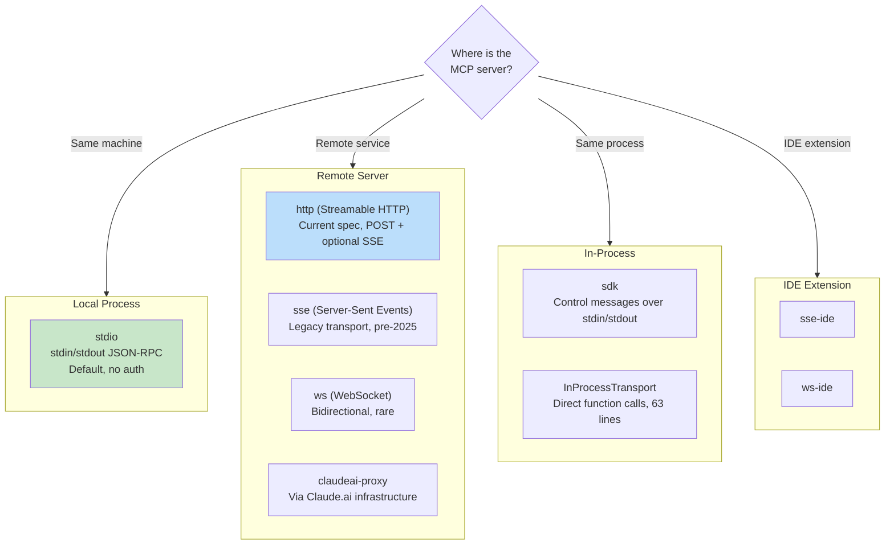
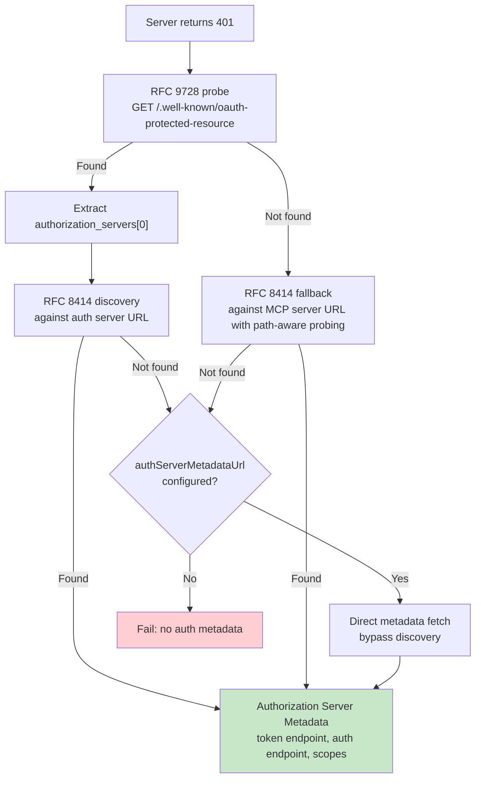

# Глава 15: MCP — Универсальный протокол tools

## Почему MCP важнее Claude Code

Каждая вторая глава в этой книге посвящена внутреннему устройству Claude Code. Этот другой. Протокол контекста модели — это открытая спецификация, которую может реализовать любой agent, а подсистема MCP MCP — один из наиболее полных существующих производственных клиентов. Если вы создаете agent, которому необходимо вызывать внешние tools — любой agent, на любом языке, в любой модели — шаблоны, описанные в этой главе, передаются напрямую.

Основное предложение простое: MCP определяет протокол JSON-RPC 2.0 для обнаружения и tool call между клиентом (agent) и сервером (provider tool). Клиент отправляет `tools/list`, чтобы узнать, что предлагает сервер, а затем `tools/call` для выполнения. Сервер описывает каждый tool с именем, описанием и JSON Schema для его входных данных. Вот и весь контракт. Все остальное — выбор транспорта, аутентификация, загрузка конфигурации, нормализация имен tools — это работа по реализации, которая превращает чистую спецификацию во что-то, что выдерживает контакт с реальным миром.

Реализация MCP Claude Code охватывает четыре основных файла: `types.ts`, `client.ts`, `auth.ts` и `InProcessTransport.ts`. Вместе они поддерживают восемь типов транспорта, семь областей конфигурации, обнаружение OAuth в двух RFC и уровень упаковки tools, который делает tools MCP неотличимыми от встроенных — тот же интерфейс `Tool`, описанный в главе 6. В этой главе рассматривается каждый уровень.

---

## Восемь видов транспорта

Первое дизайнерское решение в любой интеграции MCP — это то, как клиент общается с сервером. Claude Code поддерживает восемь транспортных конфигураций:



Стоит отметить три варианта дизайна. Во-первых, `stdio` используется по умолчанию — если `type` опущен, система предполагает локальный подпроцесс. Это обратно совместимо с самыми ранними конфигурациями MCP. Во-вторых, стек оберток выборки: упаковка тайм-аута вне обнаружения повышения, вне базовой выборки. Каждая оболочка решает одну Task. В-третьих, ветка `ws-ide` имеет разделение времени выполнения Bun/Node: `WebSocket` Bun изначально принимает параметры прокси и TLS, в то время как Node требуется batch `ws`.

**Когда и что использовать.** Для локальных tools (файловая система, база данных, пользовательские сценарии) `stdio` — без сети, без аутентификации, только каналы. Для удаленных служб текущей рекомендацией по спецификации является `http` (Streamable HTTP). `sse` — устаревший, но широко распространенный вариант. Типы `sdk`, IDE и `claudeai-proxy` являются внутренними для соответствующих экосистем.

---

## Загрузка конфигурации и определение области действия

Конфигурации сервера MCP загружаются из семи областей, объединенных и дедуплицированных:

| Область применения | Источник | Доверие |
|-------|--------|-------|
| `local` | `.mcp.json` в рабочем каталоге | Требуется одобрение пользователя |
| `user` | `~/.claude.json` поле mcpServers | Управляемый пользователем |
| `project` | Конфигурация уровня проекта | Общие настройки проекта |
| `enterprise` | Управляемая конфигурация предприятия | Предварительно одобрено организацией |
| `managed` | Серверы с плагинами | Автоматически обнаружено |
| `claudeai` | Claude.ai веб-интерфейс | Предварительная авторизация через Интернет |
| `dynamic` | Внедрение во время выполнения (SDK) | Программно добавлено |

**Дедупликация осуществляется на основе содержимого, а не имени.** Два сервера с разными именами, но с одинаковой командой или URL-адресом распознаются как один и тот же сервер. Функция `getMcpServerSignature()` вычисляет канонический ключ: `stdio:["command","arg1"]` для локальных серверов, `url:https://example.com/mcp` для удаленных. Серверы с подключаемыми модулями, подпись которых соответствует конфигурации, указанной вручную, подавляются.

---

## Упаковка tools: от MCP до Claude Code

При успешном соединении клиент вызывает `tools/list`. Каждое определение tool преобразуется во внутренний интерфейс `Tool` Claude Code — тот же интерфейс, который используется встроенными tools. После упаковки модель не может отличить встроенный tool от tool MCP.

Процесс упаковки состоит из четырех этапов:

**1. Нормализация имени.** `normalizeNameForMCP()` заменяет недопустимые символы символами подчеркивания. Полное имя следует за `mcp__{serverName}__{toolName}`.

**2. Усечение описания.** Не более 2048 символов. Было замечено, что серверы, сгенерированные OpenAPI, сбрасывают 15–60 КБ в `tool.description` — примерно 15 000 токенов за ход для одного tool.

**3. Сквозная передача схемы.** `inputSchema` tool передается непосредственно в API. Никакого преобразования, никакой проверки во время упаковки. Ошибки схемы возникают во время вызова, а не во время регистрации.

**4. Отображение аннотаций.** Аннотации MCP сопоставляются с флагами поведения: `readOnlyHint` отмечает tools, безопасные для одновременного выполнения (как обсуждалось в потоковом исполнителе главы 7), `destructiveHint` запускает дополнительную проверку разрешений. Эти аннотации исходят от сервера MCP — вредоносный сервер может пометить деструктивный tool как доступный только для чтения. Это общепринятая граница доверия, но ее стоит понимать: пользователь выбрал сервер, а вредоносный сервер, помечающий деструктивные tools как доступные только для чтения, является реальным вектором атаки. Система принимает этот компромисс, потому что альтернатива — полное игнорирование аннотаций — помешает законным серверам улучшить взаимодействие с пользователем.

---

## OAuth для серверов MCP

Удаленные серверы MCP часто требуют аутентификации. Claude Code реализует полный поток OAuth 2.0 + PKCE с обнаружением на основе RFC, межприложенным доступом и нормализацией тела ошибки.

### Цепочка открытий



Аварийный выход `authServerMetadataUrl` существует, поскольку некоторые серверы OAuth не реализуют ни один RFC.

### Доступ между приложениями (XAA)

Если в конфигурации сервера MCP имеется `oauth.xaa: true`, система выполняет федеративный обмен токенами через provider удостоверений — один вход в систему IdP разблокирует несколько серверов MCP.

### Нормализация тела ошибки

Функция `normalizeOAuthErrorBody()` обрабатывает серверы OAuth, нарушающие спецификацию. Slack возвращает HTTP 200 для ответов об ошибках, причем ошибка скрыта в теле JSON. Функция просматривает 2xx тела ответа POST, и когда тело соответствует `OAuthErrorResponseSchema`, но не `OAuthTokensSchema`, перезаписывает ответ на HTTP 400. Она также нормализует коды ошибок, специфичные для Slack (`invalid_refresh_token`, `expired_refresh_token`, `token_expired`) к стандарту `invalid_grant`.

---

## Внутрипроизводственный транспорт

Не каждый сервер MCP должен быть отдельным процессом. Класс `InProcessTransport` позволяет запускать сервер и клиент MCP в одном процессе:

```typescript
class InProcessTransport implements Transport {
  async send(message: JSONRPCMessage): Promise<void> {
    if (this.closed) throw new Error('Transport is closed')
    queueMicrotask(() => { this.peer?.onmessage?.(message) })
  }
  async close(): Promise<void> {
    if (this.closed) return
    this.closed = true
    this.onclose?.()
    if (this.peer && !this.peer.closed) {
      this.peer.closed = true
      this.peer.onclose?.()
    }
  }
}
```

Весь файл состоит из 63 строк. Заслуживают внимания два дизайнерских решения. Во-первых, `send()` доставляет данные через `queueMicrotask()`, чтобы предотвратить проблемы с глубиной стека в синхронных циклах запроса/ответа. Во-вторых, `close()` каскадируется к узлу, предотвращая полуоткрытые State. Сервер Chrome MCP и сервер Computer Use MCP используют этот шаблон.

---

## Управление соединениями

### State соединения

Каждое соединение с сервером MCP существует в одном из пяти State: `connected`, `failed`, `needs-auth` (с 15-минутным TTL-кешем, чтобы предотвратить независимое обнаружение 30 серверами одного и того же токена с истекшим сроком действия), `pending` или `disabled`.

### Обнаружение окончания сеанса

Транспорт Streamable HTTP MCP использует идентификаторы сеансов. При перезапуске сервера запросы возвращают HTTP 404 с кодом ошибки JSON-RPC -32001. Функция `isMcpSessionExpiredError()` проверяет оба сигнала — обратите внимание, что она использует включение строки в сообщение об ошибке для обнаружения кода ошибки, что прагматично, но хрупко:

```typescript
export function isMcpSessionExpiredError(error: Error): boolean {
  const httpStatus = 'code' in error ? (error as any).code : undefined
  if (httpStatus !== 404) return false
  return error.message.includes('"code":-32001') ||
    error.message.includes('"code": -32001')
}
```

При обнаружении кэш соединения очищается, и вызов повторяется один раз.

### Пакетные соединения

Локальные серверы подключаются группами по 3 (процессы создания могут исчерпать файловые дескрипторы), удаленные серверы - группами по 20. Provider контекста React `MCPConnectionManager.tsx` управляет жизненным циклом, сравнивая текущие соединения с новыми конфигурациями.

---

## Claude.ai Прокси-транспорт

Транспорт `claudeai-proxy` иллюстрирует общий шаблон интеграции agents: подключение через посредника. Подписчики Claude.ai настраивают «соединители» MCP через веб-интерфейс, а CLI маршрутизируется через инфраструктуру Claude.ai, которая обрабатывает OAuth на стороне provider.

Функция `createClaudeAiProxyFetch()` захватывает `sentToken` во время запроса, а не перечитывает его после ошибки 401. При одновременных сообщениях 401 от нескольких соединителей повторная попытка другого соединителя могла уже обновить токен. Функция также проверяет наличие одновременных обновлений, даже если обработчик обновления возвращает false — случай «ELOCKED-конкуренции», когда другой соединитель выиграл гонку файлов блокировки.

---

## Архитектура тайм-аута

Тайм-ауты MCP являются многоуровневыми, каждый из которых защищает от разных режимов сбоя:

| Слой | Продолжительность | Защищает от |
|-------|----------|------------------|
| Подключение | 30-е годы | Недоступные или медленно запускающиеся серверы |
| По запросу | 60-е (свежие по запросу) | Ошибка сигнала устаревшего тайм-аута |
| Вызов tool | ~27,8 часов | Законно длительные операции |
| Авторизация | 30 секунд на запрос OAuth | Недоступные серверы OAuth |

Тайм-аут каждого запроса заслуживает особого внимания. Ранние реализации создавали один `AbortSignal.timeout(60000)` во время соединения. После 60 секунд простоя следующий запрос немедленно прерывается — срок действия сигнала уже истек. Исправление: `wrapFetchWithTimeout()` создает новый сигнал тайм-аута для каждого запроса. Он также нормализует frontmatter `Accept` в качестве последнего шага защиты от сред выполнения и прокси, которые его удаляют.

---

## Примените это: интеграция MCP в ваш собственный agent

**Начните со stdio, усложните позже.** `StdioClientTransport` обрабатывает все: создание, конвейер, уничтожение. Одна строка конфига, один транспортный класс и у вас есть tools MCP.

**Нормализовать имена и сократить описания.** Имена должны соответствовать `^[a-zA-Z0-9_-]{1,64}$`. Префикс `mcp__{serverName}__`, чтобы избежать коллизий. Ограничьте описания длиной 2048 символов. В противном случае серверы, созданные OpenAPI, будут тратить токены контекста.

**Лениво обрабатывайте аутентификацию.** Не пытайтесь выполнить OAuth, пока сервер не вернет код 401. Большинству серверов stdio аутентификация не требуется.

**Используйте внутрипроцессный транспорт для встроенных серверов.** `createLinkedTransportPair()` устраняет накладные расходы на подпроцессы для серверов, которыми вы управляете.

**Соблюдайте аннотации tools и очищайте выходные данные.** `readOnlyHint` обеспечивает параллельное выполнение. Очистите ответы от вредоносного Unicode (двунаправленные переопределения, соединения нулевой ширины), которые могут ввести модель в заблуждение.

Протокол MCP намеренно минимален — два метода JSON-RPC. Все, что находится между этими методами и производственным развертыванием, является инженерным: восемь транспортов, семь областей конфигурации, два RFC OAuth и распределение тайм-аутов. Реализация Claude Code показывает, как эта инженерия выглядит в масштабе.

В следующей главе рассматривается, что происходит, когда agent выходит за пределы локального хоста: протоколы удаленного выполнения, которые позволяют Claude Code работать в облачных контейнерах, принимать инструкции от веб-браузеров и туннелировать трафик API через прокси-серверы, вводящие учетные данные.
