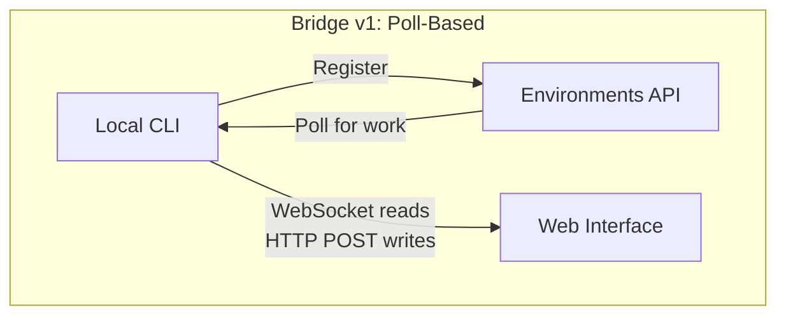
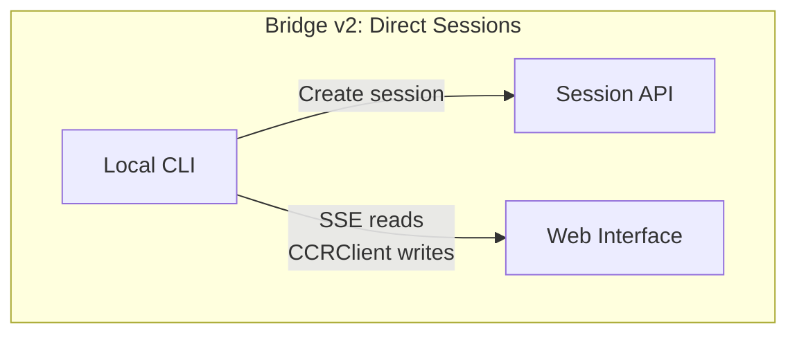
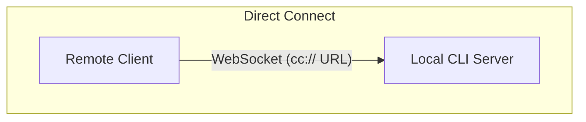
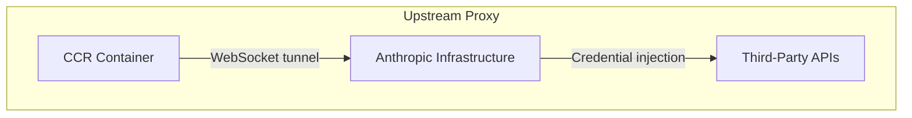

# Глава 16: Удаленное управление и выполнение в облаке

## Agent выходит за пределы локального хоста

До сих пор в каждой главе предполагалось, что Claude Code работает на той же машине, где находится код. Терминал местный. Файловая система локальная. Ответы модели возвращаются в процесс, которому принадлежит и клавиатура, и рабочий каталог.

Это предположение нарушается в тот момент, когда вы хотите управлять Claude Code из браузера, запускать его внутри облачного контейнера или предоставлять его как службу в своей локальной сети. Agent нужен способ получать инструкции из веб-браузера, мобильного приложения или автоматизированного конвейера — пересылать запросы на разрешение тому, кто не сидит за терминалом, и туннелировать свой трафик API через инфраструктуру, которая может вводить учетные данные или завершать TLS от имени agent.

Claude Code решает эту проблему с помощью четырех систем, каждая из которых имеет свою топологию:

<div class="diagram-grid">









</div>

Эти системы имеют общую философию проектирования: операции чтения и записи асимметричны, повторное подключение происходит автоматически, а сбои корректно устраняются.

---

## Bridge v1: Опрос, Рассылка, Спавн

Мост v1 — это система дистанционного управления на основе среды. Когда разработчик запускает `claude remote-control`, CLI регистрируется в среде API, опрашивает работу и порождает дочерний процесс для каждого сеанса.

Перед регистрацией выполняется ряд предполетных проверок: шлюз функций во время выполнения, проверка токена OAuth, проверка политики организации, обнаружение неработающих токенов (межпроцессная отмена после трех последовательных сбоев с одним и тем же токеном с истекшим сроком действия) и упреждающее обновление токена, которое исключает примерно 9% регистраций, которые в противном случае завершились бы неудачно с первой попытки.

После регистрации мост входит в цикл длительного опроса. Рабочие элементы поступают в виде сеансов (с полем `secret`, содержащим токены сеанса, базовым URL-адресом API, конфигурациями MCP и переменными среды) или проверками работоспособности. Мост ограничивает количество сообщений журнала «нет работы» для каждых 100 пустых опросов.

Каждый сеанс порождает дочерний процесс Claude Code, взаимодействующий через NDJSON на stdin/stdout. Запросы на разрешения передаются через мостовой транспорт к веб-интерфейсу, где пользователь одобряет или отклоняет их. Обращение туда и обратно должно завершиться примерно за 10–14 секунд.

---

## Bridge v2: прямые сеансы и SSE

Мост v2 исключает весь уровень Environments API — без регистрации, без опроса, без подтверждения, без контрольного сигнала, без отмены регистрации. Мотивация: версия 1 требовала, чтобы сервер знал возможности машины перед отправкой работы. V2 сводит жизненный цикл к трем этапам:

1. **Создать сеанс**: `POST /v1/code/sessions` с учетными данными OAuth.
2. **Соединительный мост**: `POST /v1/code/sessions/{id}/bridge`. Возвращает `worker_jwt`, `api_base_url` и `worker_epoch`. Каждый вызов `/bridge` сдвигает эпоху — это и есть регистрация.
3. **Открытый транспорт**: SSE для чтения, `CCRClient` для записи.

Транспортная абстракция (`ReplBridgeTransport`) объединяет версии 1 и 2 в рамках общего интерфейса, поэтому для обработки сообщений не требуется знать, с каким поколением они общаются.

Когда соединение SSE разрывается из-за ошибки 401, транспорт восстанавливается с использованием новых учетных данных из нового вызова `/bridge`, сохраняя при этом курсор порядкового номера — никакие сообщения не теряются. В пути записи используются замыкания `getAuthToken` для каждого экземпляра вместо переменных среды всего процесса, что предотвращает утечку JWT между параллельными сеансами.

### FlushGate

Тонкая проблема с упорядочением: мосту необходимо отправлять историю разговоров, одновременно принимая живые записи из веб-интерфейса. Если во время очистки истории поступает оперативная запись, сообщения могут доставляться не по порядку. `FlushGate` ставит в очередь живую запись во время очистки POST и удаляет их по порядку после завершения.

### Обновление токенов и управление эпохами

Мост v2 заранее обновляет рабочие JWT до истечения срока их действия. Новая эпоха сообщает серверу, что это тот же работник с новыми учетными данными. Несовпадения эпох (409 ответов) обрабатываются агрессивно: оба соединения закрываются, а исключение освобождает вызывающую сторону, предотвращая сценарии разделения мозга.

---

## Маршрутизация сообщений и дедупликация эха

Оба поколения мостов используют `handleIngressMessage()` в качестве центрального маршрутизатора:

1. Разобрать JSON, нормализовать ключи управляющих сообщений.
2. Направьте `control_response` к обработчику разрешений, а `control_request` — к обработчику запроса.
3. Проверьте UUID на соответствие `recentPostedUUIDs` (дедупликация эхо) и `recentInboundUUIDs` (дедуляция повторной доставки).
4. Пересылать проверенные сообщения пользователей.

### BoundedUUIDSet: O(1) Поиск, O(ёмкость) memory

У моста есть проблема с эхом: сообщения могут отражаться в потоке чтения или доставляться дважды во время переключения транспорта. `BoundedUUIDSet` — это набор, ограниченный FIFO, поддерживаемый кольцевым буфером:

```typescript
class BoundedUUIDSet {
  private buffer: string[]
  private set: Set<string>
  private head = 0

  add(uuid: string): void {
    if (this.set.size >= this.capacity) {
      this.set.delete(this.buffer[this.head])
    }
    this.buffer[this.head] = uuid
    this.set.add(uuid)
    this.head = (this.head + 1) % this.capacity
  }

  has(uuid: string): boolean { return this.set.has(uuid) }
}
```

Два экземпляра работают параллельно, каждый с емкостью 2000. O(1) поиск через Set, O(capacity) memory через вытеснение циклического буфера, без таймеров и TTL. Неизвестные подтипы запросов управления получают ответ об ошибке, а не молчание, что не позволяет серверу ждать ответа, который так и не приходит.

---

## Асимметричный дизайн: постоянное чтение, HTTP POST запись

Протокол CCR использует асимметричный транспорт: чтение осуществляется через постоянное соединение (WebSocket или SSE), запись осуществляется через HTTP POST. Это отражает фундаментальную асимметрию в модели общения.

Чтения выполняются с высокой частотой, с низкой задержкой и инициируются сервером — сотни небольших сообщений в секунду во время streaming токенов. Постоянное соединение — единственный разумный выбор. Записи выполняются с низкой частотой, инициируются клиентом и требуют подтверждения — сообщений в минуту, а не в секунду. HTTP POST обеспечивает надежную доставку, идемпотентность через UUID и естественную интеграцию с балансировщиками нагрузки.

Попытка объединить их в одном WebSocket создает связь: если WebSocket падает во время записи, вам нужна логика повтора и вы должны отличать «не отправлено» от «отправлено, но подтверждение потеряно». Отдельные каналы позволяют оптимизировать каждый из них независимо.

---

## Управление удаленным сеансом

`SessionsWebSocket` управляет клиентской частью соединения CCR WebSocket. Его стратегия повторного подключения различает типы сбоев:

| Неудача | Стратегия |
|---------|----------|
| 4003 (несанкционированный) | Остановиться немедленно, без повторных попыток |
| 4001 (сеанс не найден) | Макс. 3 повтора, линейная задержка (переходный процесс во время уплотнения) |
| Другие переходные | Экспоненциальная отсрочка, максимум 5 попыток |

Защита типа `isSessionsMessage()` принимает любой объект со строковым полем `type` — намеренно разрешающим. Жестко запрограммированный список разрешений будет автоматически удалять новые типы сообщений до обновления клиента.

---

## Прямое подключение: локальный сервер

Direct Connect — это самая простая топология: Claude Code работает как сервер, а клиенты подключаются через WebSocket. Никакого облачного посредника, никаких токенов OAuth.

Сессии имеют пять State: `starting`, `running`, `detached`, `stopping`, `stopped`. Метаданные сохраняются в `~/.claude/server-sessions.json` для возобновления работы после перезапуска сервера. Схема URL-адресов `cc://` обеспечивает чистую адресацию для локальных подключений.

---

## Восходящий прокси: внедрение учетных данных в контейнеры

Восходящий прокси-сервер работает внутри контейнеров CCR и решает конкретную проблему: внедрение учетных данных организации в исходящий HTTPS-трафик из контейнера, где agent может выполнять ненадежные команды.

Последовательность установки тщательно упорядочена:

1. Считайте токен сеанса из `/run/ccr/session_token`.
2. Установите `prctl(PR_SET_DUMPABLE, 0)` через Bun FFI - блокируя ptrace с тем же UID в куче процесса. Без этого внедренный `gdb -p $PPID` мог бы очистить токен из memory.
3. Загрузите сертификат ЦС восходящего прокси-сервера и объедините его с batchом системного ЦС.
4. Запустите локальное реле CONNECT-to-WebSocket на временном порту.
5. Отключите файл токена — теперь токен существует только в куче.
6. Экспортируйте переменные среды для всех подпроцессов.

Каждый шаг не открывается: ошибки отключают прокси, а не завершают сеанс. Правильный компромисс: неисправный прокси-сервер означает, что некоторые интеграции не будут работать, но основные функции останутся доступными.

### Protobuf Ручное кодирование

Байты, проходящие через туннель, заключаются в сообщения protobuf `UpstreamProxyChunk`. Схема тривиальна — `message UpstreamProxyChunk { bytes data = 1; }` — и Claude Code кодирует ее вручную в десять строк, а не использует среду выполнения protobuf:

```typescript
export function encodeChunk(data: Uint8Array): Uint8Array {
  const varint: number[] = []
  let n = data.length
  while (n > 0x7f) { varint.push((n & 0x7f) | 0x80); n >>>= 7 }
  varint.push(n)
  const out = new Uint8Array(1 + varint.length + data.length)
  out[0] = 0x0a  // field 1, wire type 2
  out.set(varint, 1)
  out.set(data, 1 + varint.length)
  return out
}
```

Десять строк заменяют полную среду выполнения protobuf. Сообщение с одним полем не оправдывает зависимости: затраты на обслуживание манипуляций с битами намного ниже, чем риск в цепочке поставок.

---

## Примените это: проектирование удаленного выполнения agent

**Отдельные каналы чтения и записи.** Если чтение представляет собой высокочастотные потоки, а запись — низкочастотные RPC, их объединение создает ненужную связь. Пусть каждый канал выходит из строя и восстанавливается независимо.

**Привязка memory для дедупликации.** Шаблон BoundedUUIDSet обеспечивает дедупликацию с фиксированным объемом memory. Любая система доставки хотя бы один раз нуждается в ограниченном буфере дедупликации, а не в неограниченном наборе.

**Стратегия повторного подключения должна быть пропорциональна сигналу об ошибке.** При постоянных сбоях повторные попытки недопустимы. При временных сбоях следует повторить попытку с отсрочкой. При неоднозначных неудачах следует повторить попытку с низким пределом.

**В враждебных средах храните секреты только в куче.** Чтение токена из файла, отключение ptrace и отсоединение файла устраняет векторы атак как на файловую систему, так и на проверку memory.

**Не удалось открыть для вспомогательных систем.** Восходящий прокси-сервер не открывается, поскольку он обеспечивает расширенную функциональность (введение учетных данных), а не базовую функциональность (вывод модели).

В системах удаленного выполнения заложен более глубокий принцип: основной agent loop (глава 5) не должен знать, откуда приходят инструкции и куда идут результаты. Мост, Direct Connect и восходящий прокси-сервер являются транспортными уровнями. Обработка сообщений, выполнение tools и потоки разрешений над ними идентичны независимо от того, сидит ли пользователь за терминалом или на другой стороне WebSocket.

В следующей главе рассматривается другая операционная проблема: производительность — как Claude Code учитывает каждую миллисекунду и токены при запуске, рендеринге, поиске и расходах API.
