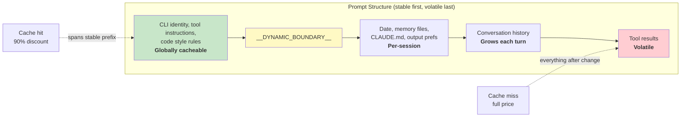

# Глава 17: Производительность. Каждая миллисекунда и токены на счету

## Пособие старшего инженера

Оптимизация производительности в agentic system — это не одна проблема. Это пять:

1. **Задержка при запуске** — время от нажатия клавиши до первого полезного вывода. Пользователи отказываются от tools, которые медленно запускаются.
2. **Эффективность токена** – доля контекстного окна, занимаемая полезным контентом, по сравнению с накладными расходами. Контекстное окно — наиболее ограниченный ресурс.
3. **API стоимость** — сумма в долларах за ход. Оперативное кэширование может уменьшить это на 90%, но только если система сохраняет стабильность кэша между ходами.
4. **Пропускная способность рендеринга** – количество кадров в секунду во время потокового вывода. Глава 13 посвящена архитектуре рендеринга; в этой главе рассматриваются измерения производительности и оптимизации, обеспечивающие ее быстродействие.
5. **Скорость поиска** — время поиска файла в кодовой базе с 270 000 путей при каждом нажатии клавиши.

Claude Code атакует все пять методов, начиная от очевидных (мемоизация) и заканчивая тонкими (26-битные растровые изображения для предварительной фильтрации нечеткого поиска). Примечание по методологии: это не теоретическая оптимизация. Claude Code поставляется с более чем 50 контрольными точками профилирования запуска, выбранными для 100 % внутренних пользователей и 0,5 % внешних пользователей. Каждая приведенная ниже оптимизация была мотивирована данными этого tool, а не интуицией.

---

## Экономия миллисекунд при запуске

### Параллелизм ввода-вывода на уровне модуля

Точка входа `main.tsx` намеренно нарушает «отсутствие побочных эффектов в области модуля»:

```typescript
profileCheckpoint('main_tsx_entry');
startMdmRawRead();       // fires plutil/reg-query subprocesses
startKeychainPrefetch();  // fires both macOS keychain reads in parallel
```

В противном случае две записи связки ключей macOS стоили бы ~65 мс последовательного синхронного появления. Запуская оба типа обещаний «выстрелил и забыл» на уровне модуля, они выполняются параллельно с загрузкой модуля ~ 135 мс, в течение которой в противном случае ЦП простаивал бы.

### API Предварительное соединение

`apiPreconnect.ts` отправляет запрос `HEAD` на Anthropic API во время инициализации, перекрывая рукопожатие TCP+TLS (100–200 мс) с работой по настройке. В интерактивном режиме перекрытие не ограничено — соединение нагревается, пока пользователь печатает. Запрос срабатывает после `applyExtraCACertsFromConfig()` и `configureGlobalAgents()`, поэтому «горячее» соединение использует правильную транспортную конфигурацию.

### Быстрая отправка и отложенный импорт

Точка входа CLI содержит пути раннего возврата для специализированных подкоманд: `claude mcp` никогда не загружает React, REPL, `claude daemon` никогда не загружает Tool System. Тяжелые модули загружаются через динамический `import()` только при необходимости: OpenTelemetry (~400 КБ + ~700 КБ gRPC), регистрация событий, диалоговые окна ошибок, восходящий прокси. `LazySchema` откладывает построение схемы Zod до первой проверки, что увеличивает затраты после запуска.

---

## Сохранение токенов в контекстном окне

### Резервирование слотов: 8 КБ по умолчанию, эскалация 64 КБ

Самая эффективная одиночная оптимизация:

Резервирование выходного слота по умолчанию составляет 8 000 токенов, а при усечении оно увеличивается до 64 000. API резервирует `max_output_tokens` мощности для ответа модели. Значение SDK по умолчанию составляет 32–64 КБ, но производственные данные показывают, что выходная длина p99 составляет 4911 токенов. По умолчанию резервы превышают 8–16 раз, тратя 24 000–59 000 жетонов за ход. Claude Code ограничивается 8 КБ и повторяет попытки 64 КБ при редком усечении (<1% запросов). Для окна в 200 тысяч это улучшение полезного контекста на 12–28 % — причем бесплатно.

### Tool «Бюджетирование результатов»

| Лимит | Значение | Цель |
|-------|-------|---------|
| Символы для каждого tool | 50 000 | Результаты сохраняются на диске при превышении |
| Токены для каждого tool | 100 000 | ~400 КБ верхняя граница текста |
| Совокупность сообщений | 200 000 символов | Не позволяет N параллельным tools раздуть бюджет за один ход |

Совокупность сообщений является ключевым моментом. Без него команда «прочитать все файлы в src/» могла бы произвести 10 параллельных операций чтения, каждое из которых вернуло бы 40 000 символов.

### Размер контекстного окна

Окно на 200 000 токенов по умолчанию можно расширить до 1 М с помощью суффикса `[1m]` в названиях моделей или при обработке эксперимента. Когда использование приближается к пределу, 4-слойная система сжатия постепенно суммирует старый контент. Подсчет токенов привязан к фактическому полю `usage` API, а не к оценке на стороне клиента — с учетом быстрого кэширования кредитов, токенов мышления и преобразований на стороне сервера.

---

## Экономия на звонках API

### Архитектура кэша запросов



Кэш prompts Anthropic работает на основе точного сопоставления префиксов. Если один токен меняет средний префикс, все, что происходит после него, является промахом в кэше. Claude Code структурирует все prompt так, что стабильные части идут первыми, а нестабильные — последними.

Когда `shouldUseGlobalCacheScope()` возвращает true, записи системных prompts перед динамической границей получают `scope: 'global'` — два пользователя, использующие одну и ту же версию Claude Code, совместно используют кэш префикса. Глобальная область отключена при наличии tools MCP, поскольку схемы MCP предназначены для каждого пользователя.

### Липкие поля защелки

Пять логических полей используют шаблон «прилипания» — если они верны, они остаются верными на протяжении всего сеанса:

| Защелка Поле | Что это предотвращает |
|-------------|-----------------|
| `promptCache1hEligible` | Изменение TTL кэша в середине сеанса |
| `afkModeHeaderLatched` | Shift+Tab переключает очистку кэша |
| `fastModeHeaderLatched` | Перезарядка вход/выход из тайника двойного уничтожения |
| `cacheEditingHeaderLatched` | Конфигурация середины сеанса переключает очистку кеша |
| `thinkingClearLatched` | Переключение режима мышления после подтвержденного промаха в кэше |

Каждый соответствует заголовку или параметру, изменение которого в середине сеанса приведет к уничтожению примерно 50 000–70 000 токенов кэшированного prompt. Защелки жертвуют переключением в середине сеанса ради сохранения кэша.

### Запоминание даты сеанса

```typescript
const getSessionStartDate = memoize(getLocalISODate)
```

Без этого дата изменилась бы в полночь, что привело бы к разрушению всего кэшированного префикса. Просроченная дата носит косметический характер; очистка кэша повторно обрабатывает весь разговор.

### Мемоизация раздела

В разделах системных prompts используется двухуровневый кеш. Большая часть контента использует `systemPromptSection(name, compute)`, cached до `/clear` или `/compact`. Ядерный вариант `DANGEROUS_uncachedSystemPromptSection(name, compute, reason)` пересчитывает каждый ход — соглашение об именах заставляет разработчиков документировать, ПОЧЕМУ необходим взлом кэша.

---

## Экономия процессора при рендеринге

В главе 13 подробно рассмотрена архитектура рендеринга — упакованные типизированные массивы, интернирование на основе пула, двойная буферизация и сравнение на уровне ячеек. Здесь мы сосредоточимся на измерениях производительности и адаптивном поведении, которые обеспечивают ее быстроту.

Терминальный рендерер регулирует скорость 60 кадров в секунду через `throttle(deferredRender, FRAME_INTERVAL_MS)`. Когда терминал размыт, интервал увеличивается вдвое до 30 кадров в секунду. Сливные рамы прокрутки работают с интервалом в четверть для достижения максимальной скорости прокрутки. Такое адаптивное регулирование гарантирует, что рендеринг никогда не будет потреблять больше ресурсов ЦП, чем необходимо.

Компилятор React (`react/compiler-runtime`) автоматически запоминает рендеринг компонентов по всей базе кода. Руководства `useMemo` и `useCallback` подвержены ошибкам; компилятор делает это правильно по конструкции. Предварительно выделенные замороженные объекты (`Object.freeze()`) устраняют выделение для общих значений пути рендеринга — одно выделение, сохраняемое для каждого кадра в режиме альтернативного экрана, объединяет тысячи кадров.

Полную информацию о конвейере рендеринга — системе интернирования `CharPool`/`StylePool`/`HyperlinkPool`, оптимизации блит-анализа, отслеживании прямоугольников повреждений, компоненте OffscreenFreeze — см. в главе 13.

---

## Экономия memory и времени при поиске

Нечеткий поиск файлов выполняется при каждом нажатии клавиши, просматривая более 270 000 путей. Три уровня оптимизации позволяют сократить время до нескольких миллисекунд.

### Предварительный фильтр растрового изображения

Каждый индексированный путь получает 26-битное растровое изображение, в котором содержатся строчные буквы:

```typescript
// Pseudocode — illustrates the 26-bit bitmap concept
function buildCharBitmap(filepath: string): number {
  let mask = 0
  for (const ch of filepath.toLowerCase()) {
    const code = ch.charCodeAt(0)
    if (code >= 97 && code <= 122) mask |= 1 << (code - 97)
  }
  return mask  // Each bit represents presence of a-z
}
```

Во время поиска: `if ((charBits[i] & needleBitmap) !== needleBitmap) continue`. Любой путь, в котором отсутствует буква запроса, мгновенно завершается неудачей — одно целочисленное сравнение, никаких строковых операций. Процент отказов: ~10% для широких запросов типа «тест», более 90% для запросов с редкими буквами. Стоимость: 4 байта на путь, ~1 МБ на 270 000 путей.

### Отклонение с привязкой к баллам и объединенное сканирование indexOf

Пути, пережившие растровое изображение, подвергаются проверке максимального количества баллов перед дорогостоящей оценкой границ/camelCase. Если оценка в лучшем случае не может превзойти текущий порог top-K, путь пропускается.

Фактическое сопоставление объединяет поиск позиции с вычислением разрыва/последовательного бонуса с использованием `String.indexOf()`, который ускоряется с помощью SIMD как в АО (Bun), так и в V8 (Node). Оптимизированный поиск движка выполняется значительно быстрее, чем циклический поиск символов вручную.

### Асинхронное индексирование с частичной возможностью запроса

Для больших баз кода `loadFromFileListAsync()` запускает цикл событий каждые ~4 мс работы (на основе времени, а не на основе подсчета - адаптируясь к скорости машины). Он возвращает два промиса: `queryable` (разрешает первый фрагмент, обеспечивая немедленные частичные результаты) и `done` (полный индекс завершен). Пользователь может начать поиск в течение 5-10 мс после того, как список файлов станет доступен.

Проверка доходности использует `(i & 0xff) === 0xff` — безветвевой модуль 256 для амортизации стоимости `performance.now()`.

---

## Дополнительный запрос релевантности memory

Одна оптимизация находится на пересечении эффективности токена и стоимости API. Как описано в главе 11, система memory использует упрощенный вызов модели Sonnet, а не основную модель Opus, чтобы выбрать, какие файлы memory включать. Стоимость (максимальное количество выходных токенов 256 на быстрой модели) незначительна по сравнению с токенами, сэкономленными за счет исключения ненужных файлов memory. Одна ненужная memory на 2000 токенов стоит больше в ненужном контексте, чем затраты на дополнительный запрос в вызовах API.

---

## Спекулятивное исполнение tool

`StreamingToolExecutor` начинает выполнять tools по мере их поступления, прежде чем завершится полный ответ. Tools только для чтения (Glob, Grep, Read) могут выполняться параллельно; tools записи требуют эксклюзивного доступа. Функция `partitionToolCalls()` группирует последовательные безопасные tools в bundlees: [Чтение, Чтение, Grep, Редактирование, Чтение, Чтение] превращается в три batchа — [Чтение, Чтение, Grep] одновременно, [Редактирование] последовательно, [Чтение, Чтение] одновременно.

Результаты всегда выдаются в исходном порядке tools для рассуждений детерминированной модели. Родственный контроллер аварийного завершения завершает параллельные подпроцессы в случае ошибки tool Bash, предотвращая бесполезную трату ресурсов.

---

## Стриминг и Raw API

Claude Code использует необработанную потоковую передачу API вместо вспомогательного средства `BetaMessageStream` SDK. Помощник вызывает `partialParse()` для каждого `input_json_delta` -- O(n^2) входной длины tool. Claude Code накапливает необработанные строки и анализирует их один раз, когда блок завершен.

Сторожевой таймер streaming (`CLAUDE_STREAM_IDLE_TIMEOUT_MS`, по умолчанию 90 секунд) прерывает передачу и повторяет попытку, если не поступает фрагментов, с возвратом к непотоковой передаче `messages.create()` в случае сбоя прокси-сервера.

---

## Примените это: производительность agentic systems

**Проверьте бюджет Context Window.** Разрыв между резервированием `max_output_tokens` и фактической длиной выходного сигнала p99 — это напрасная трата контекста. Установите жесткое значение по умолчанию и эскалируйте проблему при усечении.

**Разработано с учетом стабильности кэша.** Каждое поле в prompt может быть стабильным или изменчивым. Ставьте стабильное на первое место, а нестабильное на последнее. Любое изменение префикса «стабильный» в середине разговора рассматривайте как ошибку, за которую придется платить.

**Распараллелить ввод-вывод при запуске.** Загрузка модуля зависит от ЦП. Чтение связки ключей и сетевые подтверждения связаны с вводом-выводом. Запустите ввод-вывод перед импортом.

**Используйте предварительные фильтры растровых изображений для поиска.** Дешевый предварительный фильтр, отклоняющий 10–90 % кандидатов без дорогостоящей оценки, является значительным преимуществом при 4 байтах на запись.

**Измеряйте там, где это важно.** Claude Code имеет более 50 контрольных точек запуска, выборка составляет 100 % для внутренней системы и 0,5 % для внешней. Работа по производительности без измерения – это догадки.

---

И последнее наблюдение: большинство этих оптимизаций не являются алгоритмически сложными. Предварительные фильтры растровых изображений, циклические буферы, мемоизация, интернирование — это основы CS. Сложность заключается в том, чтобы знать, где их применить. Профилировщик запуска сообщает вам, где находятся миллисекунды. Поле использования API сообщает вам, где находятся токены. Коэффициент попадания в кеш подскажет вам, где находятся деньги. Всегда сначала измерение, потом оптимизация.
